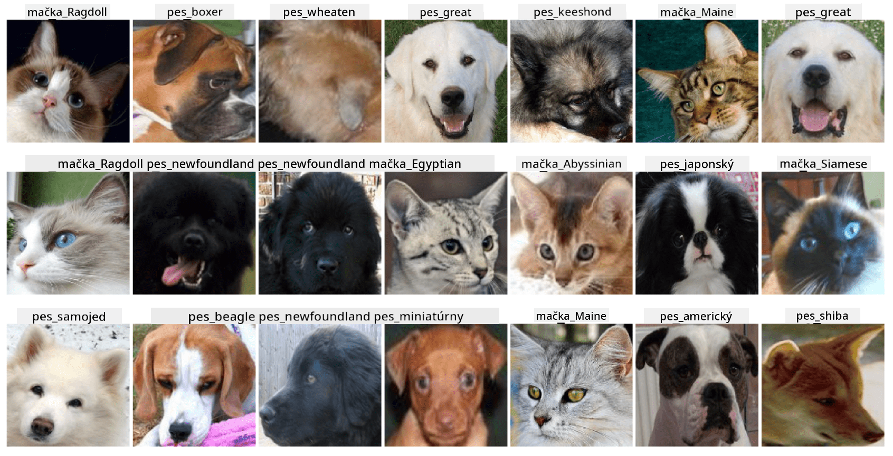

<!--
CO_OP_TRANSLATOR_METADATA:
{
  "original_hash": "f3d2cee9cb3c52160419e560c57a690e",
  "translation_date": "2025-08-25T22:58:09+00:00",
  "source_file": "lessons/4-ComputerVision/07-ConvNets/lab/README.md",
  "language_code": "sk"
}
-->
# Klasifikácia tvárí domácich miláčikov

Laboratórna úloha z [AI for Beginners Curriculum](https://github.com/microsoft/ai-for-beginners).

## Úloha

Predstavte si, že potrebujete vyvinúť aplikáciu pre škôlku domácich miláčikov na katalogizáciu všetkých zvierat. Jednou z vynikajúcich funkcií takejto aplikácie by bolo automatické rozpoznávanie plemena z fotografie. Toto je možné úspešne dosiahnuť pomocou neurónových sietí.

Vašou úlohou je natrénovať konvolučnú neurónovú sieť na klasifikáciu rôznych plemien mačiek a psov pomocou datasetu **Pet Faces**.

## Dataset

Použijeme dataset **Pet Faces**, ktorý je odvodený z datasetu domácich miláčikov [Oxford-IIIT](https://www.robots.ox.ac.uk/~vgg/data/pets/). Obsahuje 35 rôznych plemien psov a mačiek.



Na stiahnutie datasetu použite tento úryvok kódu:

```python
!wget https://mslearntensorflowlp.blob.core.windows.net/data/petfaces.tar.gz
!tar xfz petfaces.tar.gz
!rm petfaces.tar.gz
```

## Začiatok práce s notebookom

Začnite laboratórnu úlohu otvorením [PetFaces.ipynb](../../../../../../lessons/4-ComputerVision/07-ConvNets/lab/PetFaces.ipynb)

## Záver

Vyriešili ste pomerne zložitý problém klasifikácie obrázkov od základov! Bolo tu veľa tried, a napriek tomu ste dokázali dosiahnuť rozumnú presnosť! Má tiež zmysel merať top-k presnosť, pretože je ľahké zameniť niektoré triedy, ktoré nie sú jasne odlišné ani pre ľudské oko.

**Upozornenie**:  
Tento dokument bol preložený pomocou služby AI prekladu [Co-op Translator](https://github.com/Azure/co-op-translator). Aj keď sa snažíme o presnosť, prosím, berte na vedomie, že automatizované preklady môžu obsahovať chyby alebo nepresnosti. Pôvodný dokument v jeho rodnom jazyku by mal byť považovaný za autoritatívny zdroj. Pre kritické informácie sa odporúča profesionálny ľudský preklad. Nie sme zodpovední za akékoľvek nedorozumenia alebo nesprávne interpretácie vyplývajúce z použitia tohto prekladu.