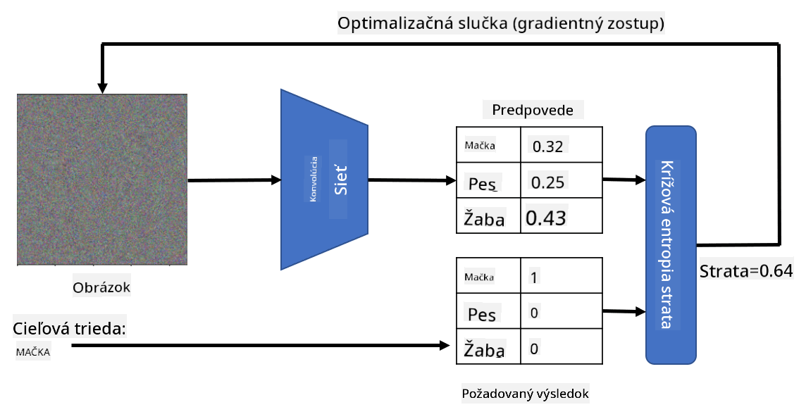

<!--
CO_OP_TRANSLATOR_METADATA:
{
  "original_hash": "717775c4050ccbffbe0c961ad8bf7bf7",
  "translation_date": "2025-08-25T23:07:14+00:00",
  "source_file": "lessons/4-ComputerVision/08-TransferLearning/README.md",
  "language_code": "sk"
}
-->
# Predtrénované siete a transferové učenie

Trénovanie CNN môže zabrať veľa času a vyžaduje veľké množstvo dát. Avšak veľká časť času sa venuje učeniu najlepších nízkoúrovňových filtrov, ktoré sieť môže použiť na extrahovanie vzorov z obrázkov. Prirodzene sa vynára otázka - môžeme použiť neurónovú sieť natrénovanú na jednom datasete a prispôsobiť ju na klasifikáciu iných obrázkov bez potreby kompletného procesu trénovania?

## [Pre-lecture quiz](https://ff-quizzes.netlify.app/en/ai/quiz/15)

Tento prístup sa nazýva **transferové učenie**, pretože prenášame určitú znalosť z jedného modelu neurónovej siete na druhý. Pri transferovom učení zvyčajne začíname s predtrénovaným modelom, ktorý bol natrénovaný na veľkom datasete obrázkov, ako je napríklad **ImageNet**. Tieto modely už dokážu dobre extrahovať rôzne vlastnosti z generických obrázkov, a v mnohých prípadoch stačí postaviť klasifikátor na vrchole týchto extrahovaných vlastností, aby sme dosiahli dobrý výsledok.

> ✅ Transferové učenie je termín, ktorý nájdete aj v iných akademických oblastiach, ako je vzdelávanie. Označuje proces prenášania znalostí z jednej oblasti do druhej.

## Predtrénované modely ako extraktory vlastností

Konvolučné siete, o ktorých sme hovorili v predchádzajúcej sekcii, obsahovali množstvo vrstiev, z ktorých každá má za úlohu extrahovať určité vlastnosti z obrázku, od nízkoúrovňových kombinácií pixelov (ako horizontálne/vertikálne čiary alebo ťahy), až po vyššie úrovne kombinácií vlastností, ktoré zodpovedajú veciam ako oko alebo plameň. Ak trénujeme CNN na dostatočne veľkom datasete generických a rôznorodých obrázkov, sieť by sa mala naučiť extrahovať tieto spoločné vlastnosti.

Keras aj PyTorch obsahujú funkcie na jednoduché načítanie predtrénovaných váh neurónových sietí pre niektoré bežné architektúry, z ktorých väčšina bola trénovaná na obrázkoch z ImageNet. Najčastejšie používané sú popísané na stránke [CNN Architektúry](../07-ConvNets/CNN_Architectures.md) z predchádzajúcej lekcie. Konkrétne môžete zvážiť použitie jednej z nasledujúcich:

* **VGG-16/VGG-19**, ktoré sú relatívne jednoduché modely, ale stále poskytujú dobrú presnosť. Použitie VGG ako prvý pokus je často dobrá voľba na zistenie, ako transferové učenie funguje.
* **ResNet** je rodina modelov navrhnutých Microsoft Research v roku 2015. Majú viac vrstiev, a preto vyžadujú viac zdrojov.
* **MobileNet** je rodina modelov s redukovanou veľkosťou, vhodná pre mobilné zariadenia. Použite ich, ak máte obmedzené zdroje a môžete obetovať trochu presnosti.

Tu sú ukážkové vlastnosti extrahované z obrázku mačky pomocou siete VGG-16:

## Dataset Mačky vs. Psy

V tomto príklade použijeme dataset [Mačky a Psy](https://www.microsoft.com/download/details.aspx?id=54765&WT.mc_id=academic-77998-cacaste), ktorý je veľmi blízky reálnemu scenáru klasifikácie obrázkov.

## ✍️ Cvičenie: Transferové učenie

Pozrime sa na transferové učenie v praxi v príslušných notebookoch:

* [Transferové učenie - PyTorch](../../../../../lessons/4-ComputerVision/08-TransferLearning/TransferLearningPyTorch.ipynb)
* [Transferové učenie - TensorFlow](../../../../../lessons/4-ComputerVision/08-TransferLearning/TransferLearningTF.ipynb)

## Vizualizácia Adversariálnej Mačky

Predtrénovaná neurónová sieť obsahuje rôzne vzory vo svojej *pamäti*, vrátane predstáv o **ideálnej mačke** (ako aj ideálnom psovi, ideálnej zebre, atď.). Bolo by zaujímavé nejako **vizualizovať tento obrázok**. Avšak nie je to jednoduché, pretože vzory sú rozptýlené po celej váhe siete a tiež organizované v hierarchickej štruktúre.

Jedným prístupom, ktorý môžeme použiť, je začať s náhodným obrázkom a potom sa pokúsiť použiť techniku **gradientného zostupu** na úpravu tohto obrázku tak, aby si sieť začala myslieť, že je to mačka.

Ak to však urobíme, dostaneme niečo veľmi podobné náhodnému šumu. Je to preto, že *existuje mnoho spôsobov, ako presvedčiť sieť, že vstupný obrázok je mačka*, vrátane niektorých, ktoré vizuálne nedávajú zmysel. Zatiaľ čo tieto obrázky obsahujú veľa vzorov typických pre mačku, nič ich neobmedzuje, aby boli vizuálne rozpoznateľné.

Na zlepšenie výsledku môžeme pridať ďalší člen do stratovej funkcie, ktorý sa nazýva **variácia strata**. Je to metrika, ktorá ukazuje, ako podobné sú susedné pixely obrázku. Minimalizácia variácie straty robí obrázok hladším a zbavuje sa šumu - čím odhaľuje vizuálne príťažlivejšie vzory. Tu je príklad takýchto "ideálnych" obrázkov, ktoré sú klasifikované ako mačka a zebra s vysokou pravdepodobnosťou:

 | 
-----|-----
 *Ideálna Mačka* | *Ideálna Zebra*

Podobný prístup môže byť použitý na vykonanie tzv. **adversariálnych útokov** na neurónovú sieť. Predpokladajme, že chceme oklamať neurónovú sieť a urobiť z psa mačku. Ak vezmeme obrázok psa, ktorý je sieťou rozpoznaný ako pes, môžeme ho trochu upraviť pomocou gradientného zostupu, až kým ho sieť nezačne klasifikovať ako mačku:

 | 
-----|-----
*Pôvodný obrázok psa* | *Obrázok psa klasifikovaný ako mačka*

Pozrite si kód na reprodukciu vyššie uvedených výsledkov v nasledujúcom notebooku:

* [Ideálna a Adversariálna Mačka - TensorFlow](../../../../../lessons/4-ComputerVision/08-TransferLearning/AdversarialCat_TF.ipynb)

## Záver

Pomocou transferového učenia môžete rýchlo zostaviť klasifikátor pre úlohu klasifikácie vlastných objektov a dosiahnuť vysokú presnosť. Vidíte, že zložitejšie úlohy, ktoré teraz riešime, vyžadujú vyšší výpočtový výkon a nemôžu byť ľahko vyriešené na CPU. V ďalšej jednotke sa pokúsime použiť ľahšiu implementáciu na trénovanie rovnakého modelu s nižšími výpočtovými zdrojmi, čo vedie len k mierne nižšej presnosti.

## 🚀 Výzva

V sprievodných notebookoch sú poznámky na spodku o tom, ako transferové znalosti najlepšie fungujú s trochu podobnými trénovacími dátami (napríklad nový typ zvieraťa). Urobte experimenty s úplne novými typmi obrázkov, aby ste zistili, ako dobre alebo zle vaše modely transferových znalostí fungujú.

## [Post-lecture quiz](https://ff-quizzes.netlify.app/en/ai/quiz/16)

## Prehľad & Samoštúdium

Prečítajte si [TrainingTricks.md](TrainingTricks.md), aby ste si prehĺbili znalosti o ďalších spôsoboch trénovania vašich modelov.

## [Úloha](lab/README.md)

V tomto laboratóriu použijeme reálny dataset [Oxford-IIIT](https://www.robots.ox.ac.uk/~vgg/data/pets/) domácich miláčikov s 35 plemenami mačiek a psov a vytvoríme klasifikátor pomocou transferového učenia.

**Upozornenie**:  
Tento dokument bol preložený pomocou služby AI prekladu [Co-op Translator](https://github.com/Azure/co-op-translator). Aj keď sa snažíme o presnosť, prosím, berte na vedomie, že automatizované preklady môžu obsahovať chyby alebo nepresnosti. Pôvodný dokument v jeho rodnom jazyku by mal byť považovaný za autoritatívny zdroj. Pre kritické informácie sa odporúča profesionálny ľudský preklad. Nie sme zodpovední za akékoľvek nedorozumenia alebo nesprávne interpretácie vyplývajúce z použitia tohto prekladu.