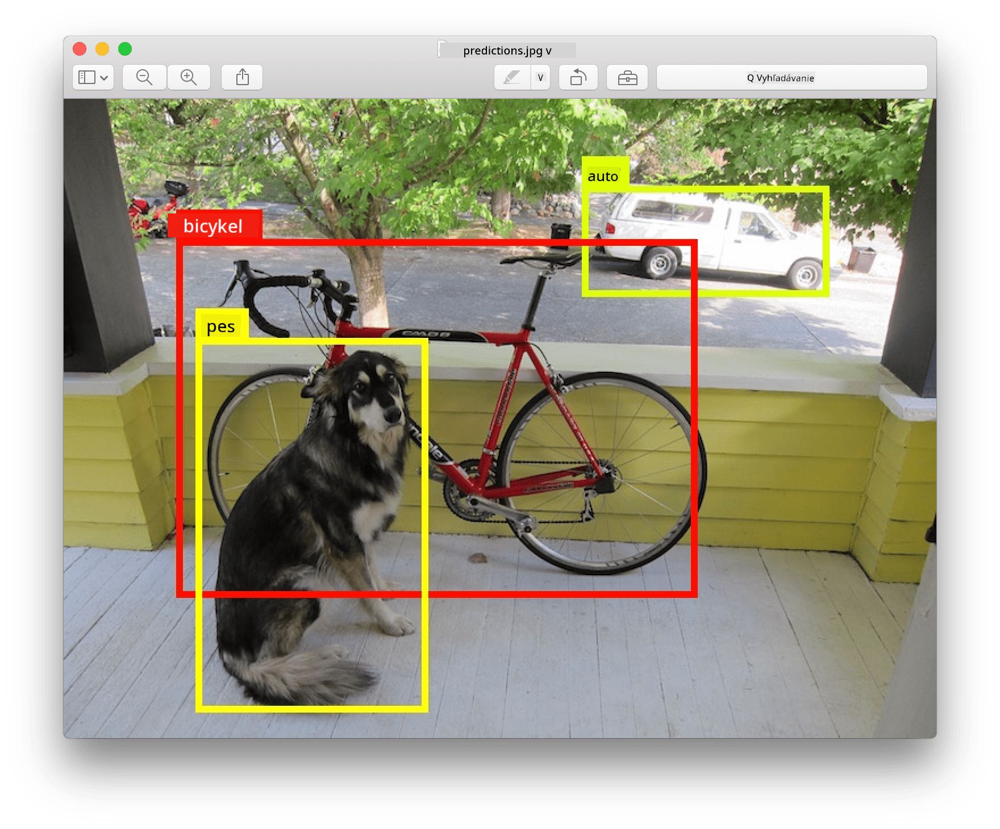
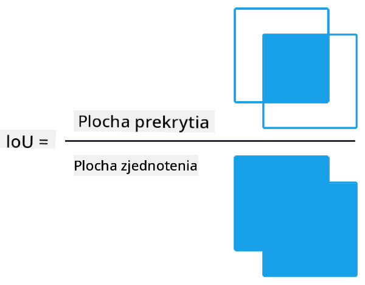
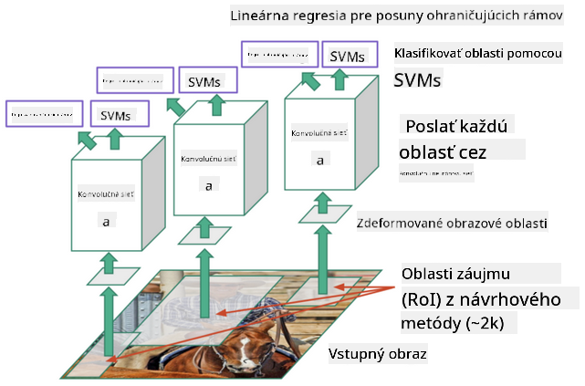
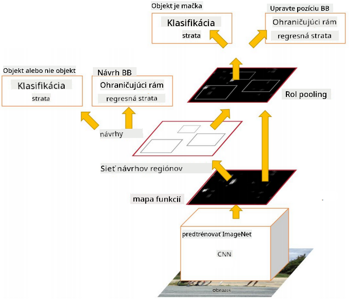
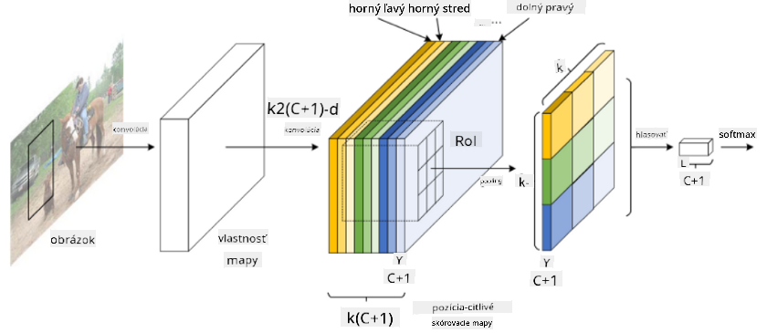
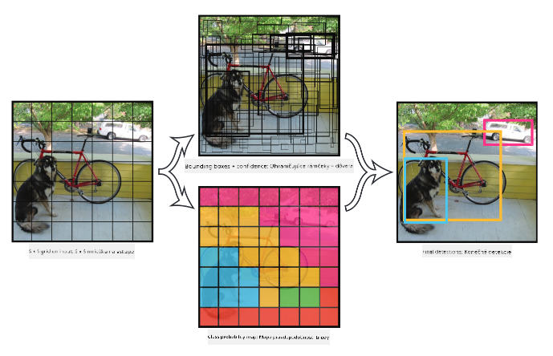

<!--
CO_OP_TRANSLATOR_METADATA:
{
  "original_hash": "d76a7eda28de5210c8b1ba50a6216c69",
  "translation_date": "2025-09-23T14:04:22+00:00",
  "source_file": "lessons/4-ComputerVision/11-ObjectDetection/README.md",
  "language_code": "sk"
}
-->
# Detekcia objektov

Modely klasifikácie obrázkov, s ktorými sme sa doteraz zaoberali, brali obrázok a produkovali kategóriu, napríklad triedu 'číslo' v probléme MNIST. Avšak v mnohých prípadoch nechceme len vedieť, že obrázok zobrazuje objekty - chceme určiť ich presnú polohu. Toto je presne cieľom **detekcie objektov**.

## [Kvíz pred prednáškou](https://ff-quizzes.netlify.app/en/ai/quiz/21)

> Obrázok zo stránky [YOLO v2](https://pjreddie.com/darknet/yolov2/)

## Naivný prístup k detekcii objektov

Predpokladajme, že chceme nájsť mačku na obrázku. Veľmi naivný prístup k detekcii objektov by bol nasledovný:

1. Rozdeliť obrázok na množstvo dlaždíc.
2. Spustiť klasifikáciu obrázkov na každej dlaždici.
3. Dlaždice, ktoré majú dostatočne vysokú aktiváciu, môžeme považovať za obsahujúce hľadaný objekt.

> *Obrázok z [cvičebného notebooku](ObjectDetection-TF.ipynb)*

Tento prístup však nie je ideálny, pretože umožňuje algoritmu lokalizovať ohraničujúci rám objektu len veľmi nepresne. Pre presnejšiu lokalizáciu potrebujeme spustiť určitý typ **regresie**, aby sme predpovedali súradnice ohraničujúcich rámov - a na to potrebujeme špecifické datasety.

## Regresia pre detekciu objektov

[Tento blogový príspevok](https://towardsdatascience.com/object-detection-with-neural-networks-a4e2c46b4491) ponúka skvelý úvod do detekcie tvarov.

## Datasety pre detekciu objektov

Pri tejto úlohe sa môžete stretnúť s nasledujúcimi datasetmi:

* [PASCAL VOC](http://host.robots.ox.ac.uk/pascal/VOC/) - 20 tried
* [COCO](http://cocodataset.org/#home) - Common Objects in Context. 80 tried, ohraničujúce rámy a segmentačné masky

## Metriky detekcie objektov

### Prienik cez zjednotenie (Intersection over Union)

Zatiaľ čo pri klasifikácii obrázkov je jednoduché merať, ako dobre algoritmus funguje, pri detekcii objektov musíme merať správnosť triedy, ako aj presnosť polohy predpokladaného ohraničujúceho rámu. Na tento účel používame tzv. **Prienik cez zjednotenie** (IoU), ktorý meria, ako dobre sa dva rámy (alebo dve ľubovoľné oblasti) prekrývajú.

> *Obrázok 2 z [tohto výborného blogového príspevku o IoU](https://pyimagesearch.com/2016/11/07/intersection-over-union-iou-for-object-detection/)*

Myšlienka je jednoduchá - vydelíme plochu prieniku medzi dvoma útvarmi plochou ich zjednotenia. Pre dva identické útvary bude IoU rovné 1, zatiaľ čo pre úplne oddelené oblasti bude rovné 0. Inak sa bude pohybovať od 0 do 1. Zvyčajne berieme do úvahy len tie ohraničujúce rámy, pre ktoré je IoU nad určitú hodnotu.

### Priemerná presnosť (Average Precision)

Predpokladajme, že chceme merať, ako dobre je rozpoznaná daná trieda objektov $C$. Na meranie používame metriku **Priemerná presnosť**, ktorá sa vypočíta nasledovne:

1. Zvážime krivku presnosť-recall, ktorá ukazuje presnosť v závislosti od hodnoty prahu detekcie (od 0 do 1).
2. V závislosti od prahu získame viac alebo menej detekovaných objektov na obrázku a rôzne hodnoty presnosti a recall.
3. Krivka bude vyzerať takto:

> *Obrázok z [NeuroWorkshop](http://github.com/shwars/NeuroWorkshop)*

Priemerná presnosť pre danú triedu $C$ je plocha pod touto krivkou. Presnejšie, os recall je zvyčajne rozdelená na 10 častí a presnosť sa spriemeruje cez všetky tieto body:

$$
AP = {1\over11}\sum_{i=0}^{10}\mbox{Precision}(\mbox{Recall}={i\over10})
$$

### AP a IoU

Zvážime len tie detekcie, pre ktoré je IoU nad určitú hodnotu. Napríklad v datasete PASCAL VOC sa zvyčajne predpokladá $\mbox{IoU Threshold} = 0.5$, zatiaľ čo v COCO sa AP meria pre rôzne hodnoty $\mbox{IoU Threshold}$.

> *Obrázok z [NeuroWorkshop](http://github.com/shwars/NeuroWorkshop)*

### Priemerná priemerná presnosť - mAP

Hlavnou metrikou pre detekciu objektov je tzv. **Priemerná priemerná presnosť**, alebo **mAP**. Je to hodnota priemernej presnosti, spriemerovaná cez všetky triedy objektov, a niekedy aj cez $\mbox{IoU Threshold}$. Podrobnejší popis procesu výpočtu **mAP** nájdete
[v tomto blogovom príspevku](https://medium.com/@timothycarlen/understanding-the-map-evaluation-metric-for-object-detection-a07fe6962cf3)), a tiež [tu s ukážkami kódu](https://gist.github.com/tarlen5/008809c3decf19313de216b9208f3734).

## Rôzne prístupy k detekcii objektov

Existujú dve hlavné triedy algoritmov detekcie objektov:

* **Siete na návrh regiónov** (R-CNN, Fast R-CNN, Faster R-CNN). Hlavnou myšlienkou je generovať **regióny záujmu** (ROI) a spustiť CNN nad nimi, hľadajúc maximálnu aktiváciu. Je to trochu podobné naivnému prístupu, s výnimkou toho, že ROI sú generované inteligentnejším spôsobom. Jednou z hlavných nevýhod takýchto metód je, že sú pomalé, pretože potrebujeme veľa prechodov CNN klasifikátora nad obrázkom.
* **Jednoprůchodové** (YOLO, SSD, RetinaNet) metódy. V týchto architektúrach navrhujeme sieť tak, aby predpovedala triedy aj ROI v jednom prechode.

### R-CNN: CNN založené na regiónoch

[R-CNN](http://islab.ulsan.ac.kr/files/announcement/513/rcnn_pami.pdf) používa [Selektívne vyhľadávanie](http://www.huppelen.nl/publications/selectiveSearchDraft.pdf) na generovanie hierarchickej štruktúry regiónov ROI, ktoré sú potom prechádzané extraktormi funkcií CNN a SVM klasifikátormi na určenie triedy objektu, a lineárnou regresiou na určenie súradníc *ohraničujúceho rámu*. [Oficiálny článok](https://arxiv.org/pdf/1506.01497v1.pdf)

> *Obrázok od van de Sande et al. ICCV’11*

> *Obrázky z [tohto blogu](https://towardsdatascience.com/r-cnn-fast-r-cnn-faster-r-cnn-yolo-object-detection-algorithms-36d53571365e)*

### F-RCNN - Fast R-CNN

Tento prístup je podobný R-CNN, ale regióny sú definované po aplikovaní konvolučných vrstiev.

> Obrázok z [oficiálneho článku](https://www.cv-foundation.org/openaccess/content_iccv_2015/papers/Girshick_Fast_R-CNN_ICCV_2015_paper.pdf), [arXiv](https://arxiv.org/pdf/1504.08083.pdf), 2015

### Faster R-CNN

Hlavnou myšlienkou tohto prístupu je použitie neurónovej siete na predpovedanie ROI - tzv. *Sieť na návrh regiónov*. [Článok](https://arxiv.org/pdf/1506.01497.pdf), 2016

> Obrázok z [oficiálneho článku](https://arxiv.org/pdf/1506.01497.pdf)

### R-FCN: Fully Convolutional Network založená na regiónoch

Tento algoritmus je ešte rýchlejší ako Faster R-CNN. Hlavná myšlienka je nasledovná:

1. Extrahujeme funkcie pomocou ResNet-101.
2. Funkcie sú spracované pomocou **Position-Sensitive Score Map**. Každý objekt z $C$ tried je rozdelený na $k\times k$ regióny, a trénujeme na predpovedanie častí objektov.
3. Pre každú časť z $k\times k$ regiónov všetky siete hlasujú za triedy objektov, a trieda objektu s maximálnym počtom hlasov je vybraná.

> Obrázok z [oficiálneho článku](https://arxiv.org/abs/1605.06409)

### YOLO - You Only Look Once

YOLO je algoritmus na detekciu objektov v reálnom čase s jedným prechodom. Hlavná myšlienka je nasledovná:

 * Obrázok je rozdelený na $S\times S$ regióny.
 * Pre každý región **CNN** predpovedá $n$ možných objektov, *súradnice ohraničujúceho rámu* a *dôveru*=*pravdepodobnosť* * IoU.

 

> Obrázok z [oficiálneho článku](https://arxiv.org/abs/1506.02640)

### Ďalšie algoritmy

* RetinaNet: [oficiálny článok](https://arxiv.org/abs/1708.02002)
   - [Implementácia v PyTorch](https://pytorch.org/vision/stable/_modules/torchvision/models/detection/retinanet.html)
   - [Implementácia v Keras](https://github.com/fizyr/keras-retinanet)
   - [Detekcia objektov pomocou RetinaNet](https://keras.io/examples/vision/retinanet/) v ukážkach Keras
* SSD (Single Shot Detector): [oficiálny článok](https://arxiv.org/abs/1512.02325)

## ✍️ Cvičenia: Detekcia objektov

Pokračujte vo svojom učení v nasledujúcom notebooku:

[ObjectDetection.ipynb](ObjectDetection.ipynb)

## Záver

V tejto lekcii ste si urobili rýchly prehľad o rôznych spôsoboch, ako je možné dosiahnuť detekciu objektov!

## 🚀 Výzva

Prečítajte si tieto články a notebooky o YOLO a vyskúšajte ich sami:

* [Dobrý blogový príspevok](https://www.analyticsvidhya.com/blog/2018/12/practical-guide-object-detection-yolo-framewor-python/) popisujúci YOLO
 * [Oficiálna stránka](https://pjreddie.com/darknet/yolo/)
 * Yolo: [Implementácia v Keras](https://github.com/experiencor/keras-yolo2), [notebook krok za krokom](https://github.com/experiencor/basic-yolo-keras/blob/master/Yolo%20Step-by-Step.ipynb)
 * Yolo v2: [Implementácia v Keras](https://github.com/experiencor/keras-yolo2), [notebook krok za krokom](https://github.com/experiencor/keras-yolo2/blob/master/Yolo%20Step-by-Step.ipynb)

## [Kvíz po prednáške](https://ff-quizzes.netlify.app/en/ai/quiz/22)

## Prehľad a samostatné štúdium

* [Detekcia objektov](https://tjmachinelearning.com/lectures/1718/obj/) od Nikhila Sardanu
* [Dobrý porovnávací článok o algoritmoch detekcie objektov](https://lilianweng.github.io/lil-log/2018/12/27/object-detection-part-4.html)
* [Prehľad algoritmov hlbokého učenia pre detekciu objektov](https://medium.com/comet-app/review-of-deep-learning-algorithms-for-object-detection-c1f3d437b852)
* [Úvod do základných algoritmov detekcie objektov krok za krokom](https://www.analyticsvidhya.com/blog/2018/10/a-step-by-step-introduction-to-the-basic-object-detection-algorithms-part-1/)
* [Implementácia Faster R-CNN v Pythone pre detekciu objektov](https://www.analyticsvidhya.com/blog/2018/11/implementation-faster-r-cnn-python-object-detection/)

## [Úloha: Detekcia objektov](lab/README.md)

---

