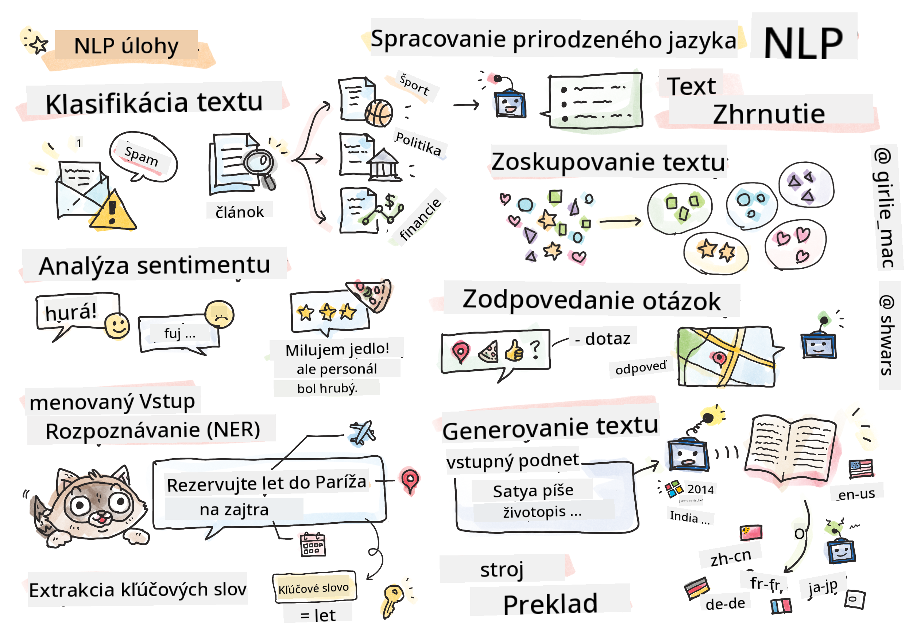

<!--
CO_OP_TRANSLATOR_METADATA:
{
  "original_hash": "8ef02a9318257ea140ed3ed74442096d",
  "translation_date": "2025-08-25T21:28:05+00:00",
  "source_file": "lessons/5-NLP/README.md",
  "language_code": "sk"
}
-->
# Spracovanie prirodzeného jazyka



V tejto sekcii sa zameriame na používanie neurónových sietí na riešenie úloh súvisiacich so **spracovaním prirodzeného jazyka (NLP)**. Existuje mnoho problémov v oblasti NLP, ktoré by sme chceli, aby počítače dokázali vyriešiť:

* **Klasifikácia textu** je typický klasifikačný problém týkajúci sa textových sekvencií. Príklady zahŕňajú klasifikáciu e-mailových správ ako spam vs. ne-spam alebo kategorizáciu článkov ako šport, biznis, politika atď. Pri vývoji chatbotov často potrebujeme pochopiť, čo chcel používateľ povedať – v tomto prípade ide o **klasifikáciu zámeru**. Často sa pri klasifikácii zámeru musíme vysporiadať s mnohými kategóriami.
* **Analýza sentimentu** je typický regresný problém, kde musíme priradiť číslo (sentiment), ktoré zodpovedá tomu, ako pozitívny/negatívny je význam vety. Pokročilejšou verziou analýzy sentimentu je **analýza sentimentu na základe aspektov** (ABSA), kde priraďujeme sentiment nie celej vete, ale jej rôznym častiam (aspektom), napr. *V tejto reštaurácii sa mi páčila kuchyňa, ale atmosféra bola hrozná*.
* **Rozpoznávanie pomenovaných entít** (NER) sa týka problému extrakcie určitých entít z textu. Napríklad, môžeme potrebovať pochopiť, že vo fráze *Potrebujem letieť do Paríža zajtra* slovo *zajtra* odkazuje na DÁTUM a *Paríž* je LOKÁCIA.  
* **Extrakcia kľúčových slov** je podobná NER, ale musíme automaticky extrahovať slová dôležité pre význam vety bez predchádzajúceho trénovania na konkrétne typy entít.
* **Zoskupovanie textu** môže byť užitočné, keď chceme zoskupiť podobné vety, napríklad podobné požiadavky v konverzáciách technickej podpory.
* **Odpovedanie na otázky** sa týka schopnosti modelu odpovedať na konkrétnu otázku. Model dostane textový úryvok a otázku ako vstupy a musí poskytnúť miesto v texte, kde sa nachádza odpoveď na otázku (alebo niekedy vygenerovať text odpovede).
* **Generovanie textu** je schopnosť modelu generovať nový text. Môže byť považované za klasifikačnú úlohu, ktorá predpovedá ďalšie písmeno/slovo na základe určitého *textového podnetu*. Pokročilé modely generovania textu, ako GPT-3, dokážu riešiť aj iné úlohy NLP, ako je klasifikácia, pomocou techniky nazývanej [programovanie podnetov](https://towardsdatascience.com/software-3-0-how-prompting-will-change-the-rules-of-the-game-a982fbfe1e0) alebo [inžinierstvo podnetov](https://medium.com/swlh/openai-gpt-3-and-prompt-engineering-dcdc2c5fcd29).
* **Sumarizácia textu** je technika, keď chceme, aby počítač "prečítal" dlhý text a zhrnul ho do niekoľkých viet.
* **Strojový preklad** môže byť vnímaný ako kombinácia porozumenia textu v jednom jazyku a generovania textu v inom.

Spočiatku sa väčšina úloh NLP riešila pomocou tradičných metód, ako sú gramatiky. Napríklad pri strojovom preklade sa používali analyzátory na transformáciu pôvodnej vety na syntaktický strom, potom sa extrahovali vyššie úrovne sémantických štruktúr na reprezentáciu významu vety a na základe tohto významu a gramatiky cieľového jazyka sa generoval výsledok. Dnes sa mnohé úlohy NLP efektívnejšie riešia pomocou neurónových sietí.

> Mnohé klasické metódy NLP sú implementované v Python knižnici [Natural Language Processing Toolkit (NLTK)](https://www.nltk.org). Online je dostupná skvelá [NLTK kniha](https://www.nltk.org/book/), ktorá pokrýva, ako môžu byť rôzne úlohy NLP riešené pomocou NLTK.

V našom kurze sa budeme prevažne zameriavať na používanie neurónových sietí pre NLP a NLTK použijeme tam, kde to bude potrebné.

Už sme sa naučili používať neurónové siete na prácu s tabuľkovými dátami a obrázkami. Hlavný rozdiel medzi týmito typmi dát a textom je, že text je sekvencia s variabilnou dĺžkou, zatiaľ čo veľkosť vstupu v prípade obrázkov je známa vopred. Zatiaľ čo konvolučné siete dokážu extrahovať vzory z vstupných dát, vzory v texte sú zložitejšie. Napríklad, negácia môže byť oddelená od subjektu ľubovoľným počtom slov (napr. *Nemám rád pomaranče* vs. *Nemám rád tie veľké farebné chutné pomaranče*), a to by stále malo byť interpretované ako jeden vzor. Preto na spracovanie jazyka potrebujeme zaviesť nové typy neurónových sietí, ako sú *rekurentné siete* a *transformery*.

## Inštalácia knižníc

Ak používate lokálnu inštaláciu Pythonu na spustenie tohto kurzu, možno budete musieť nainštalovať všetky potrebné knižnice pre NLP pomocou nasledujúcich príkazov:

**Pre PyTorch**
```bash
pip install -r requirements-torch.txt
```
**Pre TensorFlow**
```bash
pip install -r requirements-tf.txt
```

> NLP s TensorFlow si môžete vyskúšať na [Microsoft Learn](https://docs.microsoft.com/learn/modules/intro-natural-language-processing-tensorflow/?WT.mc_id=academic-77998-cacaste)

## Upozornenie na GPU

V tejto sekcii budeme v niektorých príkladoch trénovať pomerne veľké modely.
* **Používajte počítač s podporou GPU**: Odporúča sa spúšťať vaše notebooky na počítači s podporou GPU, aby sa skrátili čakacie doby pri práci s veľkými modelmi.
* **Obmedzenia pamäte GPU**: Používanie GPU môže viesť k situáciám, keď vám dôjde pamäť GPU, najmä pri trénovaní veľkých modelov.
* **Spotreba pamäte GPU**: Množstvo pamäte GPU spotrebovanej počas trénovania závisí od rôznych faktorov, vrátane veľkosti minibatchu.
* **Minimalizujte veľkosť minibatchu**: Ak narazíte na problémy s pamäťou GPU, zvážte zníženie veľkosti minibatchu vo vašom kóde ako možné riešenie.
* **Uvoľnenie pamäte GPU v TensorFlow**: Staršie verzie TensorFlow nemusia správne uvoľniť pamäť GPU pri trénovaní viacerých modelov v jednom Python kerneli. Na efektívne riadenie využitia pamäte GPU môžete nakonfigurovať TensorFlow tak, aby alokoval pamäť GPU iba podľa potreby.
* **Zahrnutie kódu**: Ak chcete nastaviť TensorFlow na dynamické alokovanie pamäte GPU, zahrňte nasledujúci kód do vašich notebookov:

```python
physical_devices = tf.config.list_physical_devices('GPU') 
if len(physical_devices)>0:
    tf.config.experimental.set_memory_growth(physical_devices[0], True) 
```

Ak máte záujem o učenie sa NLP z pohľadu klasického ML, navštívte [tento súbor lekcií](https://github.com/microsoft/ML-For-Beginners/tree/main/6-NLP)

## V tejto sekcii
V tejto sekcii sa naučíme:

* [Reprezentácia textu ako tenzorov](13-TextRep/README.md)
* [Vstupné vektory slov](14-Emdeddings/README.md)
* [Modelovanie jazyka](15-LanguageModeling/README.md)
* [Rekurentné neurónové siete](16-RNN/README.md)
* [Generatívne siete](17-GenerativeNetworks/README.md)
* [Transformery](18-Transformers/README.md)

**Upozornenie**:  
Tento dokument bol preložený pomocou služby AI prekladu [Co-op Translator](https://github.com/Azure/co-op-translator). Aj keď sa snažíme o presnosť, prosím, berte na vedomie, že automatizované preklady môžu obsahovať chyby alebo nepresnosti. Pôvodný dokument v jeho rodnom jazyku by mal byť považovaný za autoritatívny zdroj. Pre kritické informácie sa odporúča profesionálny ľudský preklad. Nie sme zodpovední za akékoľvek nedorozumenia alebo nesprávne interpretácie vyplývajúce z použitia tohto prekladu.