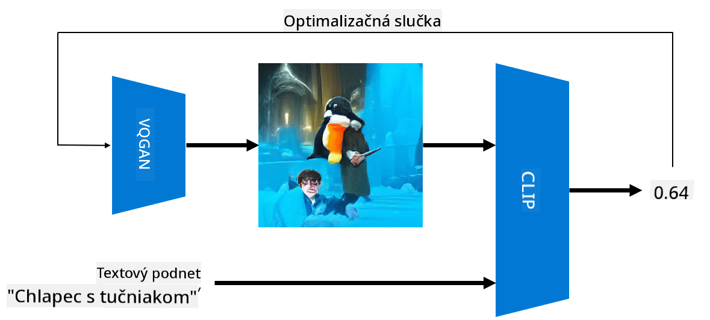

<!--
CO_OP_TRANSLATOR_METADATA:
{
  "original_hash": "9c592c26aca16ca085d268c732284187",
  "translation_date": "2025-08-25T23:37:27+00:00",
  "source_file": "lessons/X-Extras/X1-MultiModal/README.md",
  "language_code": "sk"
}
-->
# Multi-modálne siete

Po úspechu transformerových modelov pri riešení úloh spracovania prirodzeného jazyka (NLP) sa rovnaké alebo podobné architektúry začali aplikovať aj na úlohy počítačového videnia. Rastie záujem o vytváranie modelov, ktoré by *kombinovali* schopnosti videnia a spracovania prirodzeného jazyka. Jedným z takýchto pokusov je model od OpenAI nazývaný CLIP a DALL.E.

## Kontrastívne predtrénovanie obrazov (CLIP)

Hlavnou myšlienkou CLIP je schopnosť porovnávať textové podnety s obrázkom a určiť, ako dobre obrázok zodpovedá danému podnetu.

> *Obrázok z [tohto blogového príspevku](https://openai.com/blog/clip/)*

Model je trénovaný na obrázkoch získaných z internetu a ich popisoch. Pre každú dávku vezmeme N párov (obrázok, text) a prevedieme ich na vektorové reprezentácie I, ..., T. Tieto reprezentácie sa potom navzájom porovnávajú. Strata je definovaná tak, aby maximalizovala kosínovú podobnosť medzi vektormi zodpovedajúcimi jednému páru (napr. I a T) a minimalizovala kosínovú podobnosť medzi všetkými ostatnými pármi. Preto sa tento prístup nazýva **kontrastívny**.

Model/knižnica CLIP je dostupná na [GitHube OpenAI](https://github.com/openai/CLIP). Tento prístup je popísaný v [tomto blogovom príspevku](https://openai.com/blog/clip/) a podrobnejšie v [tomto článku](https://arxiv.org/pdf/2103.00020.pdf).

Po predtrénovaní modelu mu môžeme poskytnúť dávku obrázkov a dávku textových podnetov, pričom výsledkom bude tenzor s pravdepodobnosťami. CLIP sa dá použiť na niekoľko úloh:

**Klasifikácia obrázkov**

Predpokladajme, že potrebujeme klasifikovať obrázky, napríklad medzi mačkami, psami a ľuďmi. V tomto prípade môžeme modelu poskytnúť obrázok a sériu textových podnetov: "*obrázok mačky*", "*obrázok psa*", "*obrázok človeka*". Vo výslednom vektore s 3 pravdepodobnosťami stačí vybrať index s najvyššou hodnotou.

> *Obrázok z [tohto blogového príspevku](https://openai.com/blog/clip/)*

**Vyhľadávanie obrázkov na základe textu**

Môžeme postupovať aj opačne. Ak máme kolekciu obrázkov, môžeme túto kolekciu poskytnúť modelu spolu s textovým podnetom – výsledkom bude obrázok, ktorý je najviac podobný danému podnetu.

## ✍️ Príklad: [Použitie CLIP na klasifikáciu obrázkov a vyhľadávanie obrázkov](../../../../../lessons/X-Extras/X1-MultiModal/Clip.ipynb)

Otvorte [Clip.ipynb](../../../../../lessons/X-Extras/X1-MultiModal/Clip.ipynb) notebook, aby ste videli CLIP v akcii.

## Generovanie obrázkov s VQGAN+CLIP

CLIP sa dá použiť aj na **generovanie obrázkov** z textového podnetu. Na to potrebujeme **generátorový model**, ktorý dokáže generovať obrázky na základe nejakého vektorového vstupu. Jedným z takýchto modelov je [VQGAN](https://compvis.github.io/taming-transformers/) (Vector-Quantized GAN).

Hlavné myšlienky VQGAN, ktoré ho odlišujú od bežného [GAN](../../4-ComputerVision/10-GANs/README.md), sú nasledovné:
* Použitie autoregresívnej transformerovej architektúry na generovanie sekvencie kontextovo bohatých vizuálnych častí, ktoré tvoria obrázok. Tieto vizuálne časti sa učia pomocou [CNN](../../4-ComputerVision/07-ConvNets/README.md).
* Použitie diskriminátora sub-obrázkov, ktorý zisťuje, či časti obrázka sú "skutočné" alebo "falošné" (na rozdiel od prístupu "všetko alebo nič" v tradičných GAN).

Viac o VQGAN sa dozviete na webovej stránke [Taming Transformers](https://compvis.github.io/taming-transformers/).

Jedným z dôležitých rozdielov medzi VQGAN a tradičným GAN je, že tradičný GAN dokáže vytvoriť slušný obrázok z akéhokoľvek vstupného vektora, zatiaľ čo VQGAN pravdepodobne vytvorí obrázok, ktorý nebude koherentný. Preto je potrebné ďalej usmerňovať proces tvorby obrázka, čo sa dá dosiahnuť pomocou CLIP.

Na generovanie obrázka zodpovedajúceho textovému podnetu začíname s náhodným kódovacím vektorom, ktorý prechádza cez VQGAN a vytvára obrázok. Potom sa použije CLIP na vytvorenie stratovej funkcie, ktorá ukazuje, ako dobre obrázok zodpovedá textovému podnetu. Cieľom je minimalizovať túto stratu pomocou spätného šírenia na úpravu parametrov vstupného vektora.

Skvelá knižnica, ktorá implementuje VQGAN+CLIP, je [Pixray](http://github.com/pixray/pixray).

 |   | 
----|----|----
Obrázok vytvorený z podnetu *detailný akvarelový portrét mladého učiteľa literatúry s knihou* | Obrázok vytvorený z podnetu *detailný olejový portrét mladej učiteľky informatiky s počítačom* | Obrázok vytvorený z podnetu *detailný olejový portrét starého učiteľa matematiky pred tabuľou*

> Obrázky z kolekcie **Umelí učitelia** od [Dmitry Soshnikov](http://soshnikov.com)

## DALL-E
### [DALL-E 1](https://openai.com/research/dall-e)
DALL-E je verzia GPT-3 trénovaná na generovanie obrázkov z podnetov. Bol trénovaný s 12 miliardami parametrov.

Na rozdiel od CLIP prijíma DALL-E text aj obrázok ako jeden tok tokenov pre obrázky aj text. Preto je možné z viacerých podnetov generovať obrázky na základe textu.

### [DALL-E 2](https://openai.com/dall-e-2)
Hlavný rozdiel medzi DALL-E 1 a 2 je v tom, že DALL-E 2 generuje realistickejšie obrázky a umenie.

Príklady generovania obrázkov s DALL-E:
 |   | 
----|----|----
Obrázok vytvorený z podnetu *detailný akvarelový portrét mladého učiteľa literatúry s knihou* | Obrázok vytvorený z podnetu *detailný olejový portrét mladej učiteľky informatiky s počítačom* | Obrázok vytvorený z podnetu *detailný olejový portrét starého učiteľa matematiky pred tabuľou*

## Referencie

* Článok o VQGAN: [Taming Transformers for High-Resolution Image Synthesis](https://compvis.github.io/taming-transformers/paper/paper.pdf)
* Článok o CLIP: [Learning Transferable Visual Models From Natural Language Supervision](https://arxiv.org/pdf/2103.00020.pdf)

**Zrieknutie sa zodpovednosti**:  
Tento dokument bol preložený pomocou služby AI prekladu [Co-op Translator](https://github.com/Azure/co-op-translator). Aj keď sa snažíme o presnosť, prosím, berte na vedomie, že automatizované preklady môžu obsahovať chyby alebo nepresnosti. Pôvodný dokument v jeho rodnom jazyku by mal byť považovaný za autoritatívny zdroj. Pre kritické informácie sa odporúča profesionálny ľudský preklad. Nenesieme zodpovednosť za akékoľvek nedorozumenia alebo nesprávne interpretácie vyplývajúce z použitia tohto prekladu.