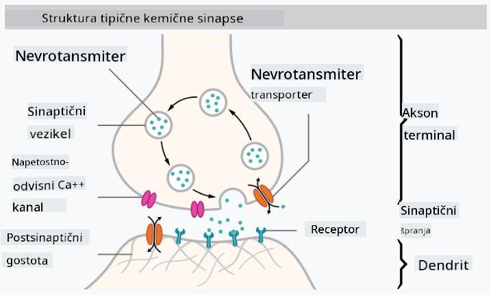

<!--
CO_OP_TRANSLATOR_METADATA:
{
  "original_hash": "1c6b8c7c1778a35fc1139b7f2aecb7b3",
  "translation_date": "2025-08-25T23:43:28+00:00",
  "source_file": "lessons/3-NeuralNetworks/README.md",
  "language_code": "sl"
}
-->
# Uvod v nevronske mreže

Kot smo razpravljali v uvodu, je eden od načinov za dosego inteligence treniranje **računalniškega modela** ali **umetnih možganov**. Od sredine 20. stoletja so raziskovalci preizkušali različne matematične modele, dokler se v zadnjih letih ta smer ni izkazala za izjemno uspešno. Takšni matematični modeli možganov se imenujejo **nevronske mreže**.

> Včasih se nevronske mreže imenujejo *Umetne nevronske mreže* (Artificial Neural Networks, ANNs), da bi poudarili, da govorimo o modelih, ne o resničnih mrežah nevronov.

## Strojno učenje

Nevronske mreže so del širše discipline, imenovane **Strojno učenje**, katere cilj je uporaba podatkov za treniranje računalniških modelov, ki so sposobni reševati probleme. Strojno učenje predstavlja velik del umetne inteligence, vendar v tem učnem načrtu ne pokrivamo klasičnega strojnega učenja.

> Obiščite naš ločen učni načrt **[Strojno učenje za začetnike](http://github.com/microsoft/ml-for-beginners)**, da se naučite več o klasičnem strojnem učenju.

Pri strojnem učenju predpostavljamo, da imamo nek nabor podatkov primerov **X** in ustrezne izhodne vrednosti **Y**. Primeri so pogosto N-dimenzionalni vektorji, ki vsebujejo **značilnosti**, medtem ko se izhodi imenujejo **oznake**.

Obravnavali bomo dve najpogostejši težavi strojnega učenja:

* **Klasifikacija**, kjer moramo razvrstiti vhodni objekt v dva ali več razredov.
* **Regresija**, kjer moramo za vsak vhodni vzorec napovedati številčno vrednost.

> Pri predstavljanju vhodov in izhodov kot tenzorjev je vhodni nabor podatkov matrika velikosti M×N, kjer je M število vzorcev, N pa število značilnosti. Izhodne oznake Y so vektor velikosti M.

V tem učnem načrtu se bomo osredotočili le na modele nevronskih mrež.

## Model nevrona

Iz biologije vemo, da naši možgani sestojijo iz nevralnih celic, od katerih ima vsaka več "vhodov" (aksonov) in en izhod (dendrit). Aksoni in dendriti lahko prenašajo električne signale, povezave med aksoni in dendriti pa lahko kažejo različne stopnje prevodnosti (nadzorovane z nevromediatorji).

 | 
----|----
Resnični nevron *([Slika](https://en.wikipedia.org/wiki/Synapse#/media/File:SynapseSchematic_lines.svg) iz Wikipedije)* | Umetni nevron *(Slika avtorja)*

Tako najpreprostejši matematični model nevrona vsebuje več vhodov X1, ..., XN in en izhod Y ter vrsto uteži W1, ..., WN. Izhod se izračuna kot:

kjer je f neka nelinearna **aktivacijska funkcija**.

> Zgodnji modeli nevrona so bili opisani v klasičnem članku [A logical calculus of the ideas immanent in nervous activity](https://www.cs.cmu.edu/~./epxing/Class/10715/reading/McCulloch.and.Pitts.pdf) avtorjev Warren McCullock in Walter Pitts leta 1943. Donald Hebb je v svoji knjigi "[The Organization of Behavior: A Neuropsychological Theory](https://books.google.com/books?id=VNetYrB8EBoC)" predlagal način, kako je mogoče te mreže trenirati.

## V tem poglavju

V tem poglavju se bomo naučili o:
* [Perceptronu](03-Perceptron/README.md), enem najzgodnejših modelov nevronskih mrež za klasifikacijo z dvema razredoma
* [Večplastnih mrežah](04-OwnFramework/README.md) z ustreznim zvezkom [kako zgraditi svoj okvir](../../../../lessons/3-NeuralNetworks/04-OwnFramework/OwnFramework.ipynb)
* [Okvirih nevronskih mrež](05-Frameworks/README.md), z naslednjimi zvezki: [PyTorch](../../../../lessons/3-NeuralNetworks/05-Frameworks/IntroPyTorch.ipynb) in [Keras/Tensorflow](../../../../lessons/3-NeuralNetworks/05-Frameworks/IntroKerasTF.ipynb)
* [Prenaučenju](../../../../lessons/3-NeuralNetworks/05-Frameworks)

**Omejitev odgovornosti**:  
Ta dokument je bil preveden z uporabo storitve AI za prevajanje [Co-op Translator](https://github.com/Azure/co-op-translator). Čeprav si prizadevamo za natančnost, vas prosimo, da upoštevate, da lahko avtomatizirani prevodi vsebujejo napake ali netočnosti. Izvirni dokument v njegovem maternem jeziku naj se šteje za avtoritativni vir. Za ključne informacije priporočamo profesionalni človeški prevod. Ne odgovarjamo za morebitna nesporazume ali napačne razlage, ki izhajajo iz uporabe tega prevoda.