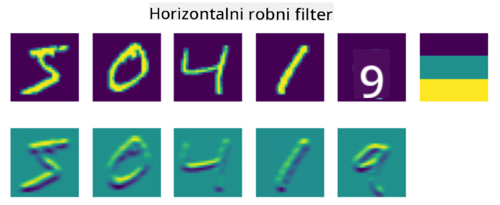

<!--
CO_OP_TRANSLATOR_METADATA:
{
  "original_hash": "088837b42b7d99198bf62db8a42411e0",
  "translation_date": "2025-08-25T22:53:38+00:00",
  "source_file": "lessons/4-ComputerVision/07-ConvNets/README.md",
  "language_code": "sl"
}
-->
# Konvolucijske nevronske mreže

Prej smo videli, da so nevronske mreže precej dobre pri obdelavi slik, celo enoslojni perceptron lahko z razumno natančnostjo prepozna ročno napisane številke iz podatkovne zbirke MNIST. Vendar je podatkovna zbirka MNIST zelo posebna, saj so vse številke centrirane znotraj slike, kar nalogo poenostavi.

## [Predhodni kviz](https://ff-quizzes.netlify.app/en/ai/quiz/13)

V resničnem življenju želimo prepoznati predmete na sliki ne glede na njihovo natančno lokacijo na sliki. Računalniški vid se razlikuje od splošne klasifikacije, saj pri iskanju določenega predmeta na sliki pregledujemo sliko in iščemo specifične **vzorce** ter njihove kombinacije. Na primer, pri iskanju mačke najprej iščemo horizontalne črte, ki lahko tvorijo brke, nato pa določena kombinacija brkov lahko nakazuje, da gre za sliko mačke. Relativna pozicija in prisotnost določenih vzorcev sta pomembni, ne pa njihova natančna lokacija na sliki.

Za ekstrakcijo vzorcev bomo uporabili koncept **konvolucijskih filtrov**. Kot veste, je slika predstavljena z 2D-matriko ali 3D-tenzorjem z barvno globino. Uporaba filtra pomeni, da vzamemo relativno majhno matriko **jedra filtra** in za vsak piksel v izvirni sliki izračunamo uteženo povprečje s sosednjimi točkami. To si lahko predstavljamo kot majhno okno, ki drsi po celotni sliki in povpreči vse piksle glede na uteži v matriki jedra filtra.

 | 
----|----

> Slika avtorja Dmitry Soshnikov

Na primer, če na številke MNIST uporabimo filtre za vertikalne in horizontalne robove velikosti 3x3, lahko dobimo poudarke (npr. visoke vrednosti) tam, kjer so vertikalni in horizontalni robovi v naši izvirni sliki. Tako lahko ta dva filtra uporabimo za "iskanje" robov. Podobno lahko oblikujemo različne filtre za iskanje drugih nizkoročnih vzorcev:

> Slika [Leung-Malikovega nabora filtrov](https://www.robots.ox.ac.uk/~vgg/research/texclass/filters.html)

Vendar pa, medtem ko lahko filtre oblikujemo ročno za ekstrakcijo nekaterih vzorcev, lahko mrežo oblikujemo tudi tako, da se vzorce nauči samodejno. To je ena glavnih idej za CNN.

## Glavne ideje za CNN

Delovanje CNN temelji na naslednjih pomembnih idejah:

* Konvolucijski filtri lahko izločijo vzorce
* Mrežo lahko oblikujemo tako, da se filtri trenirajo samodejno
* Enak pristop lahko uporabimo za iskanje vzorcev v visokoročnih značilnostih, ne le v izvirni sliki. Tako CNN za ekstrakcijo značilnosti deluje na hierarhiji značilnosti, od nizkoročnih kombinacij pikslov do visokoročnih kombinacij delov slike.

> Slika iz [članka Hislop-Lynch](https://www.semanticscholar.org/paper/Computer-vision-based-pedestrian-trajectory-Hislop-Lynch/26e6f74853fc9bbb7487b06dc2cf095d36c9021d), na podlagi [njihove raziskave](https://dl.acm.org/doi/abs/10.1145/1553374.1553453)

## ✍️ Vaje: Konvolucijske nevronske mreže

Nadaljujmo z raziskovanjem, kako delujejo konvolucijske nevronske mreže in kako lahko dosežemo trenirane filtre, tako da preučimo ustrezne zvezke:

* [Konvolucijske nevronske mreže - PyTorch](../../../../../lessons/4-ComputerVision/07-ConvNets/ConvNetsPyTorch.ipynb)
* [Konvolucijske nevronske mreže - TensorFlow](../../../../../lessons/4-ComputerVision/07-ConvNets/ConvNetsTF.ipynb)

## Piramidna arhitektura

Večina CNN-jev, ki se uporabljajo za obdelavo slik, sledi tako imenovani piramidni arhitekturi. Prva konvolucijska plast, ki se uporabi na izvirnih slikah, običajno vsebuje relativno majhno število filtrov (8-16), ki ustrezajo različnim kombinacijam pikslov, kot so horizontalne/vertikalne črte ali poteze. Na naslednji ravni zmanjšamo prostorsko dimenzijo mreže in povečamo število filtrov, kar ustreza več možnim kombinacijam preprostih značilnosti. Z vsako plastjo, ko se premikamo proti končnemu klasifikatorju, se prostorske dimenzije slike zmanjšujejo, število filtrov pa narašča.

Kot primer si poglejmo arhitekturo VGG-16, mreže, ki je leta 2014 dosegla 92,7 % natančnost pri klasifikaciji top-5 na ImageNetu:

> Slika iz [Researchgate](https://www.researchgate.net/figure/Vgg16-model-structure-To-get-the-VGG-NIN-model-we-replace-the-2-nd-4-th-6-th-7-th_fig2_335194493)

## Najbolj znane arhitekture CNN

[Študij najbolj znanih arhitektur CNN nadaljujte tukaj](CNN_Architectures.md)

**Omejitev odgovornosti**:  
Ta dokument je bil preveden z uporabo storitve AI za prevajanje [Co-op Translator](https://github.com/Azure/co-op-translator). Čeprav si prizadevamo za natančnost, vas prosimo, da upoštevate, da lahko avtomatizirani prevodi vsebujejo napake ali netočnosti. Izvirni dokument v njegovem maternem jeziku je treba obravnavati kot avtoritativni vir. Za ključne informacije priporočamo profesionalni človeški prevod. Ne prevzemamo odgovornosti za morebitna nesporazumevanja ali napačne razlage, ki izhajajo iz uporabe tega prevoda.