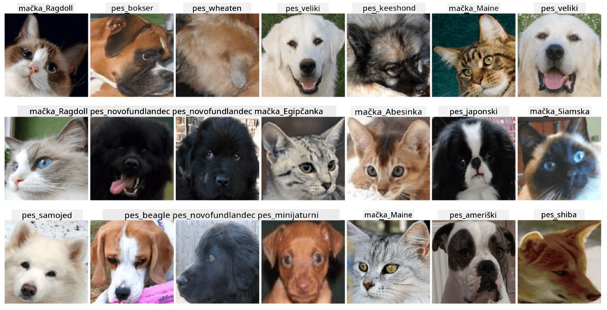

<!--
CO_OP_TRANSLATOR_METADATA:
{
  "original_hash": "f3d2cee9cb3c52160419e560c57a690e",
  "translation_date": "2025-08-25T22:58:55+00:00",
  "source_file": "lessons/4-ComputerVision/07-ConvNets/lab/README.md",
  "language_code": "sl"
}
-->
# Razvrščanje obrazov hišnih ljubljenčkov

Laboratorijska naloga iz [Učnega načrta za začetnike v umetni inteligenci](https://github.com/microsoft/ai-for-beginners).

## Naloga

Predstavljajte si, da morate razviti aplikacijo za vrtec hišnih ljubljenčkov, ki bo katalogizirala vse živali. Ena izmed odličnih funkcij takšne aplikacije bi bila samodejno prepoznavanje pasme s fotografije. To je mogoče uspešno doseči z uporabo nevronskih mrež.

Vaša naloga je, da usposobite konvolucijsko nevronsko mrežo za razvrščanje različnih pasem mačk in psov z uporabo podatkovne zbirke **Pet Faces**.

## Podatkovna zbirka

Uporabili bomo podatkovno zbirko **Pet Faces**, ki je izpeljana iz podatkovne zbirke hišnih ljubljenčkov [Oxford-IIIT](https://www.robots.ox.ac.uk/~vgg/data/pets/). Vsebuje 35 različnih pasem psov in mačk.



Za prenos podatkovne zbirke uporabite naslednji del kode:

```python
!wget https://thor.robots.ox.ac.uk/~vgg/data/pets/images.tar.gz
!tar xfz images.tar.gz
!rm images.tar.gz
```

## Začetek zvezka

Začnite laboratorijsko nalogo z odpiranjem [PetFaces.ipynb](../../../../../../lessons/4-ComputerVision/07-ConvNets/lab/PetFaces.ipynb)

## Ključne ugotovitve

Rešili ste razmeroma zapleten problem razvrščanja slik od začetka! Kljub velikemu številu razredov ste uspeli doseči razumno natančnost! Smiselno je tudi meriti top-k natančnost, saj je enostavno zamenjati nekatere razrede, ki tudi ljudem niso jasno različni.

**Omejitev odgovornosti**:  
Ta dokument je bil preveden z uporabo storitve AI za prevajanje [Co-op Translator](https://github.com/Azure/co-op-translator). Čeprav si prizadevamo za natančnost, vas prosimo, da upoštevate, da lahko avtomatizirani prevodi vsebujejo napake ali netočnosti. Izvirni dokument v njegovem izvirnem jeziku je treba obravnavati kot avtoritativni vir. Za ključne informacije priporočamo profesionalni človeški prevod. Ne prevzemamo odgovornosti za morebitna nesporazumevanja ali napačne razlage, ki bi nastale zaradi uporabe tega prevoda.