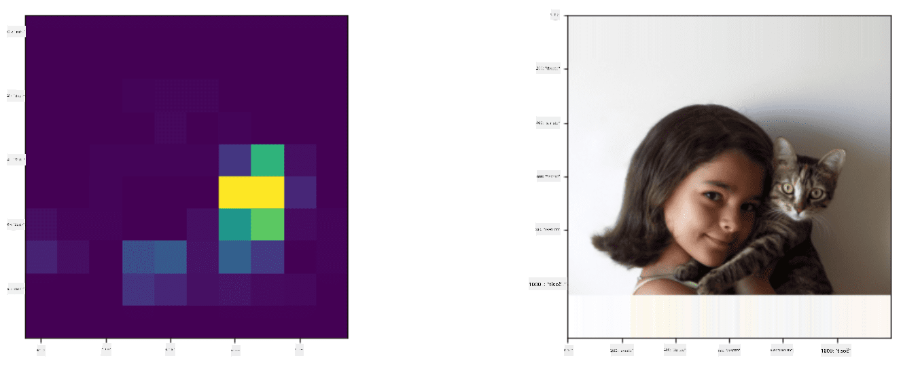
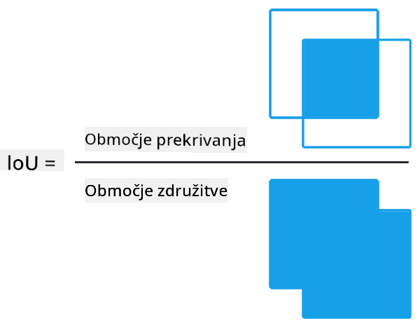
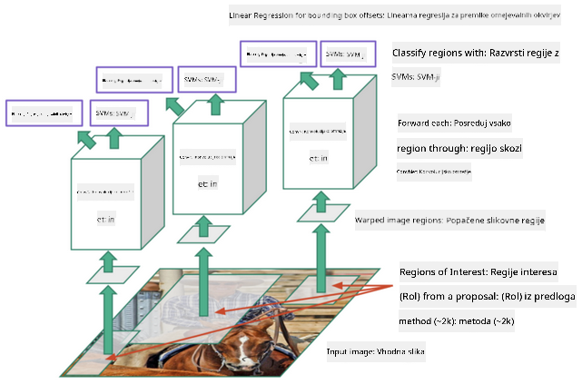
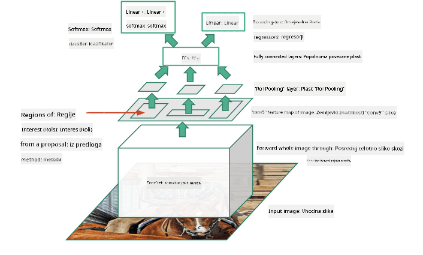
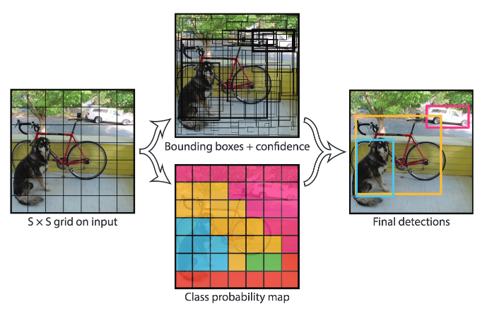

<!--
CO_OP_TRANSLATOR_METADATA:
{
  "original_hash": "d85c8b08f6d1b48fd7f35b99f93c1138",
  "translation_date": "2025-08-25T22:47:12+00:00",
  "source_file": "lessons/4-ComputerVision/11-ObjectDetection/README.md",
  "language_code": "sl"
}
-->
# Prepoznavanje objektov

Modeli za klasifikacijo slik, s katerimi smo se doslej ukvarjali, so obdelali sliko in podali kategorialni rezultat, kot je razred 'številka' v problemu MNIST. Vendar pa v mnogih primerih ne želimo le vedeti, da slika prikazuje objekte – želimo določiti njihovo natančno lokacijo. To je pravzaprav bistvo **prepoznavanja objektov**.

## [Pre-lecture quiz](https://ff-quizzes.netlify.app/en/ai/quiz/21)

> Slika s [spletne strani YOLO v2](https://pjreddie.com/darknet/yolov2/)

## Naiven pristop k prepoznavanju objektov

Recimo, da želimo na sliki najti mačko. Zelo naiven pristop k prepoznavanju objektov bi bil naslednji:

1. Razdelimo sliko na več ploščic.
2. Na vsaki ploščici izvedemo klasifikacijo slike.
3. Tiste ploščice, ki dajo dovolj visoko aktivacijo, lahko štejemo za ploščice, ki vsebujejo iskani objekt.

> *Slika iz [zvezka z vajami](../../../../../lessons/4-ComputerVision/11-ObjectDetection/ObjectDetection-TF.ipynb)*

Vendar pa ta pristop ni idealen, saj omogoča algoritmu, da zelo nenatančno določi okvir objekta. Za bolj natančno lokacijo moramo izvesti nekakšno **regresijo**, da napovemo koordinate okvirjev – za to pa potrebujemo specifične podatkovne nabore.

## Regresija za prepoznavanje objektov

[Ta blog objava](https://towardsdatascience.com/object-detection-with-neural-networks-a4e2c46b4491) ponuja odličen uvod v prepoznavanje oblik.

## Podatkovni nabori za prepoznavanje objektov

Pri tej nalogi lahko naletite na naslednje podatkovne nabore:

* [PASCAL VOC](http://host.robots.ox.ac.uk/pascal/VOC/) – 20 razredov
* [COCO](http://cocodataset.org/#home) – Pogosti objekti v kontekstu. 80 razredov, okvirji in maske za segmentacijo

## Metode za ocenjevanje prepoznavanja objektov

### Presek nad unijo (Intersection over Union)

Medtem ko je pri klasifikaciji slik enostavno izmeriti, kako dobro deluje algoritem, moramo pri prepoznavanju objektov izmeriti tako pravilnost razreda kot tudi natančnost določene lokacije okvirja. Za slednje uporabljamo tako imenovani **Presek nad unijo** (IoU), ki meri, kako dobro se dve škatli (ali dve poljubni območji) prekrivata.

> *Slika 2 iz [te odlične blog objave o IoU](https://pyimagesearch.com/2016/11/07/intersection-over-union-iou-for-object-detection/)*

Ideja je preprosta – površino preseka med dvema figurama delimo s površino njune unije. Za dve identični območji bi bil IoU enak 1, medtem ko bi bil za popolnoma ločeni območji enak 0. Sicer pa bo vrednost variirala med 0 in 1. Običajno upoštevamo le tiste okvirje, za katere je IoU nad določeno vrednostjo.

### Povprečna natančnost (Average Precision)

Recimo, da želimo izmeriti, kako dobro je prepoznan določen razred objektov $C$. Za merjenje tega uporabljamo metriko **Povprečna natančnost**, ki se izračuna na naslednji način:

1. Upoštevamo krivuljo natančnost-pokritost, ki prikazuje natančnost glede na vrednost praga zaznavanja (od 0 do 1).
2. Glede na prag bomo na sliki zaznali več ali manj objektov ter dobili različne vrednosti natančnosti in pokritosti.
3. Krivulja bo videti takole:

> *Slika iz [NeuroWorkshop](http://github.com/shwars/NeuroWorkshop)*

Povprečna natančnost za določen razred $C$ je površina pod to krivuljo. Natančneje, os pokritosti je običajno razdeljena na 10 delov, natančnost pa se povpreči čez vse te točke:

$$
AP = {1\over11}\sum_{i=0}^{10}\mbox{Precision}(\mbox{Recall}={i\over10})
$$

### AP in IoU

Upoštevali bomo le tiste zaznave, za katere je IoU nad določeno vrednostjo. Na primer, v podatkovnem naboru PASCAL VOC je običajno $\mbox{IoU Threshold} = 0.5$, medtem ko se v COCO AP meri za različne vrednosti $\mbox{IoU Threshold}$.

> *Slika iz [NeuroWorkshop](http://github.com/shwars/NeuroWorkshop)*

### Povprečna povprečna natančnost – mAP

Glavna metrika za prepoznavanje objektov se imenuje **Povprečna povprečna natančnost** ali **mAP**. To je vrednost povprečne natančnosti, povprečena čez vse razrede objektov, včasih pa tudi čez $\mbox{IoU Threshold}$. Podrobnejši opis postopka izračuna **mAP** najdete
[v tej blog objavi](https://medium.com/@timothycarlen/understanding-the-map-evaluation-metric-for-object-detection-a07fe6962cf3)), pa tudi [tukaj s primeri kode](https://gist.github.com/tarlen5/008809c3decf19313de216b9208f3734).

## Različni pristopi k prepoznavanju objektov

Obstajata dve glavni skupini algoritmov za prepoznavanje objektov:

* **Mreže za predlaganje regij** (R-CNN, Fast R-CNN, Faster R-CNN). Glavna ideja je generiranje **regij interesa** (ROI) in izvajanje CNN nad njimi, da poiščemo največjo aktivacijo. To je nekoliko podobno naivnemu pristopu, z izjemo, da se ROI generirajo na bolj pameten način. Ena glavnih pomanjkljivosti teh metod je, da so počasne, saj potrebujemo veliko prehodov CNN klasifikatorja čez sliko.
* **Enoprehodne** (YOLO, SSD, RetinaNet) metode. Pri teh arhitekturah zasnujemo mrežo tako, da napoveduje tako razrede kot ROI v enem prehodu.

### R-CNN: CNN, ki temelji na regijah

[R-CNN](http://islab.ulsan.ac.kr/files/announcement/513/rcnn_pami.pdf) uporablja [Selektivno iskanje](http://www.huppelen.nl/publications/selectiveSearchDraft.pdf) za generiranje hierarhične strukture regij ROI, ki se nato prenesejo skozi CNN ekstraktorje značilnosti in SVM-klasifikatorje za določanje razreda objekta ter linearno regresijo za določanje koordinat *okvirja*. [Uradni članek](https://arxiv.org/pdf/1506.01497v1.pdf)

> *Slika iz van de Sande et al. ICCV’11*

> *Slike iz [tega bloga](https://towardsdatascience.com/r-cnn-fast-r-cnn-faster-r-cnn-yolo-object-detection-algorithms-36d53571365e)

### F-RCNN – Hitri R-CNN

Ta pristop je podoben R-CNN, vendar se regije določijo po tem, ko so bile uporabljene konvolucijske plasti.

> Slika iz [uradnega članka](https://www.cv-foundation.org/openaccess/content_iccv_2015/papers/Girshick_Fast_R-CNN_ICCV_2015_paper.pdf), [arXiv](https://arxiv.org/pdf/1504.08083.pdf), 2015

### Faster R-CNN

Glavna ideja tega pristopa je uporaba nevronske mreže za napovedovanje ROI – tako imenovane *Mreže za predlaganje regij*. [Članek](https://arxiv.org/pdf/1506.01497.pdf), 2016

> Slika iz [uradnega članka](https://arxiv.org/pdf/1506.01497.pdf)

### R-FCN: Popolnoma konvolucijska mreža, ki temelji na regijah

Ta algoritem je še hitrejši od Faster R-CNN. Glavna ideja je naslednja:

1. Značilnosti pridobimo z uporabo ResNet-101.
2. Značilnosti obdelamo z **Zemljevidom občutljivih na položaj**. Vsak objekt iz $C$ razredov je razdeljen na $k\times k$ regij, mrežo pa treniramo za napovedovanje delov objektov.
3. Za vsak del iz $k\times k$ regij vse mreže glasujejo za razrede objektov, razred objekta z največ glasovi pa je izbran.

> Slika iz [uradnega članka](https://arxiv.org/abs/1605.06409)

### YOLO – You Only Look Once

YOLO je algoritem za prepoznavanje objektov v realnem času z enim prehodom. Glavna ideja je naslednja:

 * Slika je razdeljena na $S\times S$ regij.
 * Za vsako regijo **CNN** napove $n$ možnih objektov, koordinate *okvirja* in *zaupanje*=*verjetnost* * IoU.

 

> Slika iz [uradnega članka](https://arxiv.org/abs/1506.02640)

### Drugi algoritmi

* RetinaNet: [uradni članek](https://arxiv.org/abs/1708.02002)
   - [PyTorch implementacija v Torchvision](https://pytorch.org/vision/stable/_modules/torchvision/models/detection/retinanet.html)
   - [Keras implementacija](https://github.com/fizyr/keras-retinanet)
   - [Prepoznavanje objektov z RetinaNet](https://keras.io/examples/vision/retinanet/) v Keras vzorcih
* SSD (Single Shot Detector): [uradni članek](https://arxiv.org/abs/1512.02325)

## ✍️ Vaje: Prepoznavanje objektov

Nadaljujte z učenjem v naslednjem zvezku:

[ObjectDetection.ipynb](../../../../../lessons/4-ComputerVision/11-ObjectDetection/ObjectDetection.ipynb)

## Zaključek

V tej lekciji ste si ogledali različne načine, kako lahko dosežemo prepoznavanje objektov!

## 🚀 Izziv

Preberite te članke in zvezke o YOLO ter jih preizkusite sami:

* [Dober blog](https://www.analyticsvidhya.com/blog/2018/12/practical-guide-object-detection-yolo-framewor-python/) o YOLO
 * [Uradna stran](https://pjreddie.com/darknet/yolo/)
 * Yolo: [Keras implementacija](https://github.com/experiencor/keras-yolo2), [zvezek korak za korakom](https://github.com/experiencor/basic-yolo-keras/blob/master/Yolo%20Step-by-Step.ipynb)
 * Yolo v2: [Keras implementacija](https://github.com/experiencor/keras-yolo2), [zvezek korak za korakom](https://github.com/experiencor/keras-yolo2/blob/master/Yolo%20Step-by-Step.ipynb)

## [Post-lecture quiz](https://ff-quizzes.netlify.app/en/ai/quiz/22)

## Pregled in samostojno učenje

* [Prepoznavanje objektov](https://tjmachinelearning.com/lectures/1718/obj/) avtorja Nikhila Sardane
* [Dobra primerjava algoritmov za prepoznavanje objektov](https://lilianweng.github.io/lil-log/2018/12/27/object-detection-part-4.html)
* [Pregled algoritmov globokega učenja za prepoznavanje objektov](https://medium.com/comet-app/review-of-deep-learning-algorithms-for-object-detection-c1f3d437b852)
* [Uvod v osnovne algoritme za prepoznavanje objektov korak za korakom](https://www.analyticsvidhya.com/blog/2018/10/a-step-by-step-introduction-to-the-basic-object-detection-algorithms-part-1/)
* [Implementacija Faster R-CNN v Pythonu za prepoznavanje objektov](https://www.analyticsvidhya.com/blog/2018/11/implementation-faster-r-cnn-python-object-detection/)

## [Naloga: Prepoznavanje objektov](lab/README.md)

**Omejitev odgovornosti**:  
Ta dokument je bil preveden z uporabo storitve AI za prevajanje [Co-op Translator](https://github.com/Azure/co-op-translator). Čeprav si prizadevamo za natančnost, vas prosimo, da upoštevate, da lahko avtomatizirani prevodi vsebujejo napake ali netočnosti. Izvirni dokument v njegovem maternem jeziku je treba obravnavati kot avtoritativni vir. Za ključne informacije priporočamo profesionalni človeški prevod. Ne prevzemamo odgovornosti za morebitna nesporazumevanja ali napačne razlage, ki izhajajo iz uporabe tega prevoda.