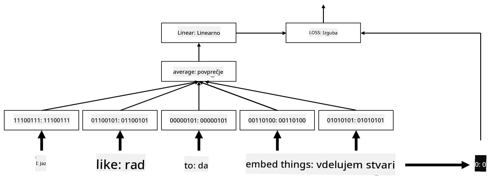
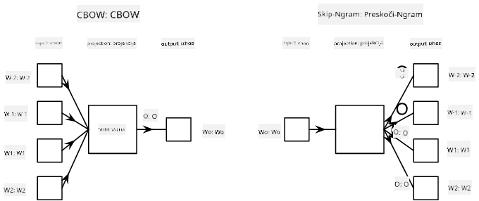

<!--
CO_OP_TRANSLATOR_METADATA:
{
  "original_hash": "e40b47ac3fd48f71304ede1474e66293",
  "translation_date": "2025-08-25T21:40:51+00:00",
  "source_file": "lessons/5-NLP/14-Embeddings/README.md",
  "language_code": "sl"
}
-->
# Vdelave

## [Predavanje kviz](https://red-field-0a6ddfd03.1.azurestaticapps.net/quiz/114)

Pri treniranju klasifikatorjev, ki temeljijo na BoW ali TF/IDF, smo delali z visoko-dimenzionalnimi vektorji vreče besed dolžine `vocab_size`, pri čemer smo izrecno pretvarjali nizko-dimenzionalne vektorje pozicijske reprezentacije v redke eno-vroče (one-hot) reprezentacije. Ta eno-vroča reprezentacija pa ni učinkovita glede porabe pomnilnika. Poleg tega se vsaka beseda obravnava neodvisno od drugih, tj. eno-vroče kodirani vektorji ne izražajo nobene semantične podobnosti med besedami.

Ideja **vdelave** (embedding) je predstaviti besede z nizko-dimenzionalnimi gostimi vektorji, ki na nek način odražajo semantični pomen besede. Kasneje bomo razpravljali o tem, kako zgraditi smiselne vdelave besed, za zdaj pa si vdelave predstavljajmo kot način za zmanjšanje dimenzionalnosti vektorja besede.

Tako bi plast za vdelavo kot vhod vzela besedo in ustvarila izhodni vektor določene velikosti `embedding_size`. Na nek način je to zelo podobno plasti `Linear`, vendar namesto da bi vzela eno-vroče kodiran vektor, lahko kot vhod vzame številko besede, kar nam omogoča, da se izognemo ustvarjanju velikih eno-vroče kodiranih vektorjev.

Z uporabo plasti za vdelavo kot prve plasti v našem omrežju klasifikatorja lahko preklopimo iz modela vreče besed na model **vreče vdelav** (embedding bag), kjer najprej vsako besedo v našem besedilu pretvorimo v ustrezno vdelavo, nato pa izračunamo neko agregatno funkcijo nad vsemi temi vdelavami, kot so `sum`, `average` ali `max`.

> Slika avtorja

## ✍️ Vaje: Vdelave

Nadaljujte z učenjem v naslednjih beležnicah:
* [Vdelave s PyTorch](../../../../../lessons/5-NLP/14-Embeddings/EmbeddingsPyTorch.ipynb)
* [Vdelave TensorFlow](../../../../../lessons/5-NLP/14-Embeddings/EmbeddingsTF.ipynb)

## Semantične vdelave: Word2Vec

Medtem ko se je plast za vdelavo naučila preslikati besede v vektorsko predstavitev, ta predstavitev ni nujno imela veliko semantičnega pomena. Bilo bi koristno naučiti se vektorske predstavitve, kjer so podobne besede ali sopomenke predstavljene z vektorji, ki so si blizu glede na neko vektorsko razdaljo (npr. Evklidska razdalja).

Za to moramo naš model za vdelavo predhodno trenirati na veliki zbirki besedil na specifičen način. Eden od načinov za treniranje semantičnih vdelav se imenuje [Word2Vec](https://en.wikipedia.org/wiki/Word2vec). Temelji na dveh glavnih arhitekturah, ki se uporabljata za ustvarjanje porazdeljene predstavitve besed:

 - **Neprekinjena vreča besed** (CBoW) — v tej arhitekturi treniramo model, da napove besedo iz okoliškega konteksta. Glede na n-gram $(W_{-2},W_{-1},W_0,W_1,W_2)$ je cilj modela napovedati $W_0$ iz $(W_{-2},W_{-1},W_1,W_2)$.
 - **Neprekinjeni preskok-gram** (skip-gram) je nasproten CBoW. Model uporablja okoliško okno kontekstnih besed za napoved trenutne besede.

CBoW je hitrejši, medtem ko je skip-gram počasnejši, vendar bolje predstavlja redke besede.

> Slika iz [tega članka](https://arxiv.org/pdf/1301.3781.pdf)

Predhodno trenirane vdelave Word2Vec (kot tudi drugi podobni modeli, kot je GloVe) se lahko uporabijo namesto plasti za vdelavo v nevronskih omrežjih. Vendar pa se moramo ukvarjati z besedišči, saj se besedišče, uporabljeno za predhodno treniranje Word2Vec/GloVe, verjetno razlikuje od besedišča v našem besedilnem korpusu. Oglejte si zgornje beležnice, da vidite, kako rešiti ta problem.

## Kontekstualne vdelave

Ena ključna omejitev tradicionalnih predhodno treniranih predstavitev vdelav, kot je Word2Vec, je problem razločevanja pomenov besed. Medtem ko predhodno trenirane vdelave lahko zajamejo nekaj pomena besed v kontekstu, je vsak možen pomen besede kodiran v isto vdelavo. To lahko povzroči težave v nadaljnjih modelih, saj imajo številne besede, kot je beseda 'play', različne pomene glede na kontekst, v katerem so uporabljene.

Na primer, beseda 'play' v teh dveh različnih stavkih ima precej drugačen pomen:

- Šel sem na **igro** v gledališče.
- Janez se želi **igrati** s prijatelji.

Predhodno trenirane vdelave zgoraj predstavljajo oba pomena besede 'play' v isti vdelavi. Da bi premagali to omejitev, moramo zgraditi vdelave na podlagi **jezikovnega modela**, ki je treniran na velikem korpusu besedil in *ve*, kako se besede lahko sestavijo v različnih kontekstih. Razprava o kontekstualnih vdelavah presega obseg tega tečaja, vendar se bomo k njim vrnili, ko bomo kasneje govorili o jezikovnih modelih.

## Zaključek

V tej lekciji ste odkrili, kako zgraditi in uporabljati plasti za vdelavo v TensorFlow in PyTorch, da bolje odražajo semantične pomene besed.

## 🚀 Izziv

Word2Vec je bil uporabljen za nekatere zanimive aplikacije, vključno z ustvarjanjem pesmi in poezije. Oglejte si [ta članek](https://www.politetype.com/blog/word2vec-color-poems), ki opisuje, kako je avtor uporabil Word2Vec za ustvarjanje poezije. Oglejte si tudi [ta video Dana Shiffmanna](https://www.youtube.com/watch?v=LSS_bos_TPI&ab_channel=TheCodingTrain), da odkrijete drugačno razlago te tehnike. Nato poskusite te tehnike uporabiti na svojem besedilnem korpusu, morda pridobljenem s Kaggle.

## [Kviz po predavanju](https://red-field-0a6ddfd03.1.azurestaticapps.net/quiz/214)

## Pregled in samostojno učenje

Preberite ta članek o Word2Vec: [Efficient Estimation of Word Representations in Vector Space](https://arxiv.org/pdf/1301.3781.pdf)

## [Naloga: Beležnice](assignment.md)

**Omejitev odgovornosti**:  
Ta dokument je bil preveden z uporabo storitve za strojno prevajanje [Co-op Translator](https://github.com/Azure/co-op-translator). Čeprav si prizadevamo za natančnost, vas prosimo, da upoštevate, da lahko avtomatizirani prevodi vsebujejo napake ali netočnosti. Izvirni dokument v njegovem izvirnem jeziku je treba obravnavati kot avtoritativni vir. Za ključne informacije priporočamo profesionalni človeški prevod. Ne prevzemamo odgovornosti za morebitne nesporazume ali napačne razlage, ki izhajajo iz uporabe tega prevoda.