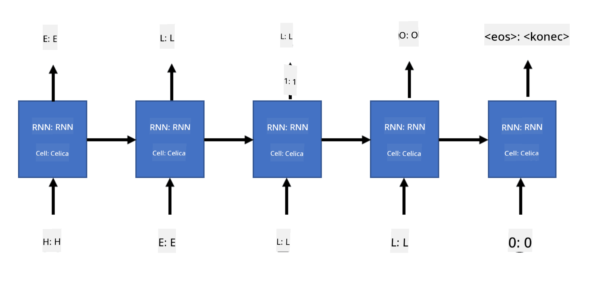

<!--
CO_OP_TRANSLATOR_METADATA:
{
  "original_hash": "d9de7847385eeeda67cfdcce1640ab72",
  "translation_date": "2025-08-25T21:46:40+00:00",
  "source_file": "lessons/5-NLP/17-GenerativeNetworks/README.md",
  "language_code": "sl"
}
-->
# Generativne mreže

## [Predhodni kviz](https://ff-quizzes.netlify.app/en/ai/quiz/33)

Rekurentne nevronske mreže (RNN) in njihove različice z zapornimi celicami, kot so dolgotrajne kratkoročne spominske celice (LSTM) in zaporne rekurentne enote (GRU), omogočajo modeliranje jezika, saj se lahko naučijo zaporedja besed in napovedujejo naslednjo besedo v zaporedju. To nam omogoča uporabo RNN za **generativne naloge**, kot so običajno generiranje besedila, strojno prevajanje in celo opisovanje slik.

> ✅ Pomislite na vse primere, ko ste imeli koristi od generativnih nalog, kot je dopolnjevanje besedila med tipkanjem. Raziščite svoje najljubše aplikacije in preverite, ali uporabljajo RNN.

V arhitekturi RNN, ki smo jo obravnavali v prejšnji enoti, je vsaka enota RNN proizvedla naslednje skrito stanje kot izhod. Vendar pa lahko vsaki rekurentni enoti dodamo še en izhod, ki nam omogoča generiranje **zaporedja** (ki je enako dolžini izvirnega zaporedja). Poleg tega lahko uporabimo RNN enote, ki ne sprejemajo vhodnih podatkov na vsakem koraku, temveč le začetni vektorski stanji, nato pa generirajo zaporedje izhodov.

To omogoča različne nevronske arhitekture, prikazane na spodnji sliki:


> Slika iz blog objave [Unreasonable Effectiveness of Recurrent Neural Networks](http://karpathy.github.io/2015/05/21/rnn-effectiveness/) avtorja [Andrej Karpaty](http://karpathy.github.io/)

* **Ena-na-ena** je tradicionalna nevronska mreža z enim vhodom in enim izhodom
* **Ena-na-več** je generativna arhitektura, ki sprejme eno vhodno vrednost in generira zaporedje izhodnih vrednosti. Na primer, če želimo trenirati mrežo za **opisovanje slik**, ki bi ustvarila besedilni opis slike, lahko sliko podamo kot vhod, jo prenesemo skozi CNN za pridobitev skritega stanja, nato pa rekurentna veriga generira opis besedo za besedo
* **Več-na-ena** ustreza arhitekturam RNN, ki smo jih opisali v prejšnji enoti, kot je klasifikacija besedila
* **Več-na-več**, ali **zaporedje-na-zaporedje**, ustreza nalogam, kot je **strojno prevajanje**, kjer prva RNN zbere vse informacije iz vhodnega zaporedja v skrito stanje, druga veriga RNN pa to stanje razširi v izhodno zaporedje.

V tej enoti se bomo osredotočili na preproste generativne modele, ki nam pomagajo generirati besedilo. Zaradi enostavnosti bomo uporabili tokenizacijo na ravni znakov.

To RNN bomo trenirali za generiranje besedila korak za korakom. Na vsakem koraku bomo vzeli zaporedje znakov dolžine `nchars` in mreži naročili, naj generira naslednji izhodni znak za vsak vhodni znak:



Med generiranjem besedila (med inferenco) začnemo z nekim **pozivom**, ki ga prenesemo skozi RNN celice za generiranje vmesnega stanja, nato pa se začne generiranje. Generiramo en znak naenkrat, stanje in generirani znak pa prenesemo v drugo RNN celico za generiranje naslednjega, dokler ne generiramo dovolj znakov.


> Slika avtorja

## ✍️ Vaje: Generativne mreže

Nadaljujte z učenjem v naslednjih zvezkih:

* [Generativne mreže s PyTorch](../../../../../lessons/5-NLP/17-GenerativeNetworks/GenerativePyTorch.ipynb)
* [Generativne mreže s TensorFlow](../../../../../lessons/5-NLP/17-GenerativeNetworks/GenerativeTF.ipynb)

## Mehko generiranje besedila in temperatura

Izhod vsake RNN celice je porazdelitev verjetnosti znakov. Če vedno izberemo znak z najvišjo verjetnostjo kot naslednji znak v generiranem besedilu, se besedilo pogosto lahko "zacikli" med istimi zaporedji znakov, kot v tem primeru:

```
today of the second the company and a second the company ...
```

Če pa pogledamo porazdelitev verjetnosti za naslednji znak, je lahko razlika med nekaj najvišjimi verjetnostmi majhna, npr. en znak ima verjetnost 0.2, drugi pa 0.19 itd. Na primer, pri iskanju naslednjega znaka v zaporedju '*play*' je lahko naslednji znak enako verjetno presledek ali **e** (kot v besedi *player*).

To nas pripelje do zaključka, da ni vedno "pošteno" izbrati znaka z višjo verjetnostjo, saj lahko izbira drugega najvišjega še vedno vodi do smiselnega besedila. Bolj smiselno je **vzorec** znakov iz porazdelitve verjetnosti, ki jo poda izhod mreže. Uporabimo lahko tudi parameter **temperatura**, ki bo porazdelitev verjetnosti zgladil, če želimo dodati več naključnosti, ali jo naredil bolj strmo, če želimo bolj slediti znakom z najvišjo verjetnostjo.

Raziskujte, kako je to mehko generiranje besedila implementirano v zgoraj povezanih zvezkih.

## Zaključek

Medtem ko je generiranje besedila lahko koristno samo po sebi, so glavne prednosti v sposobnosti generiranja besedila z uporabo RNN iz nekega začetnega vektorskega stanja. Na primer, generiranje besedila se uporablja kot del strojnega prevajanja (zaporedje-na-zaporedje, v tem primeru se stanje iz *kodirnika* uporabi za generiranje ali *dekodiranje* prevedenega sporočila) ali generiranje besedilnega opisa slike (v tem primeru vektorsko stanje prihaja iz CNN ekstraktorja).

## 🚀 Izziv

Opravite nekaj lekcij na Microsoft Learn na to temo

* Generiranje besedila s [PyTorch](https://docs.microsoft.com/learn/modules/intro-natural-language-processing-pytorch/6-generative-networks/?WT.mc_id=academic-77998-cacaste)/[TensorFlow](https://docs.microsoft.com/learn/modules/intro-natural-language-processing-tensorflow/5-generative-networks/?WT.mc_id=academic-77998-cacaste)

## [Naknadni kviz](https://ff-quizzes.netlify.app/en/ai/quiz/34)

## Pregled in samostojno učenje

Tukaj je nekaj člankov za širjenje vašega znanja

* Različni pristopi k generiranju besedila z Markov verigo, LSTM in GPT-2: [blog objava](https://towardsdatascience.com/text-generation-gpt-2-lstm-markov-chain-9ea371820e1e)
* Primer generiranja besedila v [Keras dokumentaciji](https://keras.io/examples/generative/lstm_character_level_text_generation/)

## [Naloga](lab/README.md)

Videli smo, kako generirati besedilo znak za znakom. V laboratoriju boste raziskovali generiranje besedila na ravni besed.

**Omejitev odgovornosti**:  
Ta dokument je bil preveden z uporabo storitve AI za prevajanje [Co-op Translator](https://github.com/Azure/co-op-translator). Čeprav si prizadevamo za natančnost, vas prosimo, da upoštevate, da lahko avtomatizirani prevodi vsebujejo napake ali netočnosti. Izvirni dokument v njegovem maternem jeziku je treba obravnavati kot avtoritativni vir. Za ključne informacije priporočamo profesionalni človeški prevod. Ne prevzemamo odgovornosti za morebitne nesporazume ali napačne razlage, ki bi nastale zaradi uporabe tega prevoda.