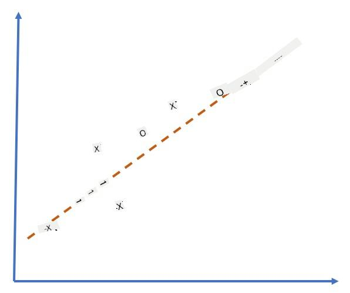
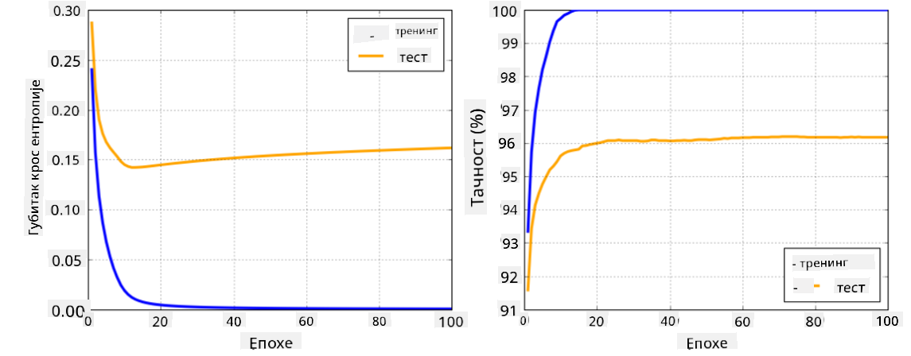

<!--
CO_OP_TRANSLATOR_METADATA:
{
  "original_hash": "2b544f20b796402507fb05a0df893323",
  "translation_date": "2025-08-25T23:52:19+00:00",
  "source_file": "lessons/3-NeuralNetworks/05-Frameworks/README.md",
  "language_code": "sr"
}
-->
# Оквири за неуронске мреже

Као што смо већ научили, да бисмо ефикасно тренирали неуронске мреже, потребно је да урадимо две ствари:

* Рад са тензорима, нпр. множење, сабирање и израчунавање функција као што су сигмоид или софтмакс
* Израчунавање градијената свих израза, како бисмо извршили оптимизацију методом градијентног спуштања

## [Квиз пре предавања](https://red-field-0a6ddfd03.1.azurestaticapps.net/quiz/105)

Иако библиотека `numpy` може да обави први део, потребан нам је механизам за израчунавање градијената. У [нашем оквиру](../../../../../lessons/3-NeuralNetworks/04-OwnFramework/OwnFramework.ipynb) који смо развили у претходном делу, морали смо ручно да програмирамо све изводе функција унутар методе `backward`, која врши назадно ширење (backpropagation). Идеално, оквир би требало да нам омогући израчунавање градијената *било ког израза* који можемо дефинисати.

Још једна важна ствар је могућност извршавања прорачуна на GPU-у или другим специјализованим јединицама за рачунање, као што је [TPU](https://en.wikipedia.org/wiki/Tensor_Processing_Unit). Тренинг дубоких неуронских мрежа захтева *много* прорачуна, и могућност паралелизације тих прорачуна на GPU-у је веома важна.

> ✅ Термин 'паралелизација' значи расподелу прорачуна на више уређаја.

Тренутно су два најпопуларнија оквира за неуронске мреже: [TensorFlow](http://TensorFlow.org) и [PyTorch](https://pytorch.org/). Оба пружају ниско-ниво API за рад са тензорима на CPU-у и GPU-у. Поред ниско-ниво API-ја, постоји и високо-ниво API, назван [Keras](https://keras.io/) и [PyTorch Lightning](https://pytorchlightning.ai/) респективно.

Ниско-ниво API | [TensorFlow](http://TensorFlow.org) | [PyTorch](https://pytorch.org/)
---------------|-------------------------------------|--------------------------------
Високо-ниво API| [Keras](https://keras.io/) | [PyTorch Lightning](https://pytorchlightning.ai/)

**Ниско-ниво API-ји** у оба оквира омогућавају креирање такозваних **рачунских графова**. Овај граф дефинише како израчунати излаз (обично функцију губитка) са датим улазним параметрима и може се послати на извршавање на GPU-у, ако је доступан. Постоје функције за диференцирање овог графа и израчунавање градијената, који се затим могу користити за оптимизацију параметара модела.

**Високо-ниво API-ји** третирају неуронске мреже као **секвенцу слојева**, што чини креирање већине неуронских мрежа много једноставнијим. Тренинг модела обично захтева припрему података и затим позивање функције `fit` да обави посао.

Високо-ниво API омогућава брзо конструисање типичних неуронских мрежа без бриге о многим детаљима. Истовремено, ниско-ниво API пружа много већу контролу над процесом тренинга, па се често користи у истраживањима, када се ради са новим архитектурама неуронских мрежа.

Такође је важно разумети да можете користити оба API-ја заједно, нпр. можете развити сопствену архитектуру слоја мреже користећи ниско-ниво API, а затим је користити у већој мрежи конструисаној и тренираној помоћу високо-ниво API-ја. Или можете дефинисати мрежу користећи високо-ниво API као секвенцу слојева, а затим користити сопствени ниско-ниво тренинг циклус за оптимизацију. Оба API-ја користе исте основне концепте и дизајнирани су да добро функционишу заједно.

## Учење

У овом курсу, већина садржаја је доступна и за PyTorch и за TensorFlow. Можете изабрати свој омиљени оквир и проћи само кроз одговарајуће бележнице. Ако нисте сигурни који оквир да изаберете, прочитајте неке дискусије на интернету о теми **PyTorch vs. TensorFlow**. Такође можете погледати оба оквира да бисте стекли боље разумевање.

Где год је могуће, користићемо високо-ниво API-је ради једноставности. Међутим, верујемо да је важно разумети како неуронске мреже функционишу од самог почетка, па ћемо на почетку радити са ниско-ниво API-јем и тензорима. Међутим, ако желите брзо да почнете и не желите да трошите много времена на учење ових детаља, можете прескочити те делове и одмах прећи на бележнице са високо-ниво API-јем.

## ✍️ Вежбе: Оквири

Наставите своје учење у следећим бележницама:

Ниско-ниво API | [TensorFlow+Keras Бележница](../../../../../lessons/3-NeuralNetworks/05-Frameworks/IntroKerasTF.ipynb) | [PyTorch](../../../../../lessons/3-NeuralNetworks/05-Frameworks/IntroPyTorch.ipynb)
---------------|-------------------------------------|--------------------------------
Високо-ниво API| [Keras](../../../../../lessons/3-NeuralNetworks/05-Frameworks/IntroKeras.ipynb) | *PyTorch Lightning*

Након савладавања оквира, хајде да поновимо концепт претренираности.

# Претренираност

Претренираност је изузетно важан концепт у машинском учењу, и веома је важно разумети га исправно!

Размотримо следећи проблем апроксимације 5 тачака (представљених са `x` на графицима испод):

 | 
-------------------------|--------------------------
**Линеарни модел, 2 параметра** | **Нелинеарни модел, 7 параметара**
Грешка тренинга = 5.3 | Грешка тренинга = 0
Грешка валидације = 5.1 | Грешка валидације = 20

* Лево видимо добру апроксимацију правом линијом. Пошто је број параметара адекватан, модел правилно разуме расподелу тачака.
* Десно, модел је превише моћан. Пошто имамо само 5 тачака, а модел има 7 параметара, он може да се прилагоди тако да пролази кроз све тачке, чинећи грешку тренинга 0. Међутим, ово спречава модел да разуме прави образац у подацима, па је грешка валидације веома висока.

Веома је важно пронаћи праву равнотежу између сложености модела (броја параметара) и броја узорака за тренинг.

## Зашто долази до претренираности

  * Недовољно података за тренинг
  * Превише моћан модел
  * Превише шума у улазним подацима

## Како открити претренираност

Као што можете видети на графику изнад, претренираност се може открити веома ниском грешком тренинга и високом грешком валидације. Обично током тренинга видимо да и грешка тренинга и грешка валидације почињу да опадају, а затим у неком тренутку грешка валидације престаје да опада и почиње да расте. Ово је знак претренираности и индикатор да бисмо вероватно требали престати са тренингом у том тренутку (или барем направити снимак модела).

## Како спречити претренираност

Ако приметите да долази до претренираности, можете урадити једно од следећег:

 * Повећати количину података за тренинг
 * Смањити сложеност модела
 * Користити неку [технику регуларизације](../../4-ComputerVision/08-TransferLearning/TrainingTricks.md), као што је [Dropout](../../4-ComputerVision/08-TransferLearning/TrainingTricks.md#Dropout), коју ћемо касније размотрити.

## Претренираност и компромис пристрасности и варијансе

Претренираност је заправо случај општијег проблема у статистици названог [компромис пристрасности и варијансе](https://en.wikipedia.org/wiki/Bias%E2%80%93variance_tradeoff). Ако размотримо могуће изворе грешке у нашем моделу, можемо видети две врсте грешака:

* **Грешке пристрасности** настају када наш алгоритам не може правилно да ухвати однос у подацима за тренинг. Ово може бити резултат чињенице да наш модел није довољно моћан (**недовољно тренирање**).
* **Грешке варијансе**, које настају када модел апроксимира шум у улазним подацима уместо значајног односа (**претренираност**).

Током тренинга, грешка пристрасности опада (како наш модел учи да апроксимира податке), а грешка варијансе расте. Важно је зауставити тренинг - било ручно (када откријемо претренираност) или аутоматски (увођењем регуларизације) - како бисмо спречили претренираност.

## Закључак

У овој лекцији, научили сте о разликама између различитих API-ја за два најпопуларнија AI оквира, TensorFlow и PyTorch. Поред тога, научили сте о веома важној теми, претренираности.

## 🚀 Изазов

У пратећим бележницама, наћи ћете 'задатке' на крају; прођите кроз бележнице и завршите задатке.

## [Квиз после предавања](https://red-field-0a6ddfd03.1.azurestaticapps.net/quiz/205)

## Преглед и самостално учење

Истражите следеће теме:

- TensorFlow
- PyTorch
- Претренираност

Поставите себи следећа питања:

- Која је разлика између TensorFlow-а и PyTorch-а?
- Која је разлика између претренираности и недовољне тренираности?

## [Задатак](lab/README.md)

У овом лабораторијском раду, од вас се тражи да решите два проблема класификације користећи једнослојне и вишеслојне потпуно повезане мреже користећи PyTorch или TensorFlow.

* [Упутства](lab/README.md)
* [Бележница](../../../../../lessons/3-NeuralNetworks/05-Frameworks/lab/LabFrameworks.ipynb)

**Одрицање од одговорности**:  
Овај документ је преведен помоћу услуге за превођење уз помоћ вештачке интелигенције [Co-op Translator](https://github.com/Azure/co-op-translator). Иако се трудимо да обезбедимо тачност, молимо вас да имате у виду да аутоматски преводи могу садржати грешке или нетачности. Оригинални документ на његовом изворном језику треба сматрати меродавним извором. За критичне информације препоручује се професионални превод од стране људи. Не преузимамо одговорност за било каква погрешна тумачења или неспоразуме који могу настати услед коришћења овог превода.