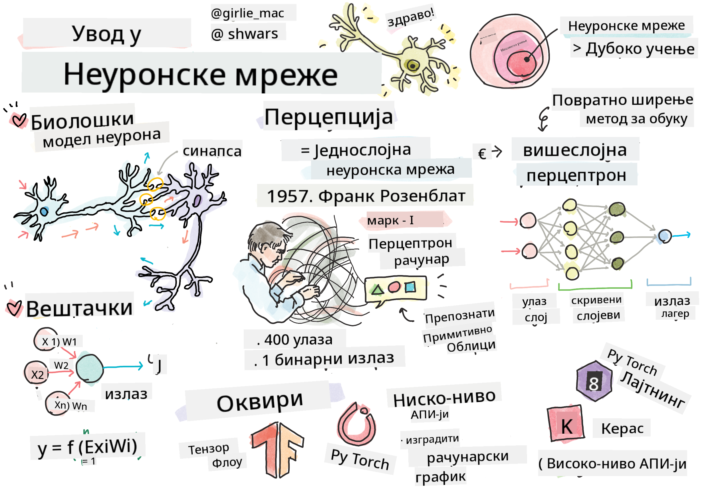
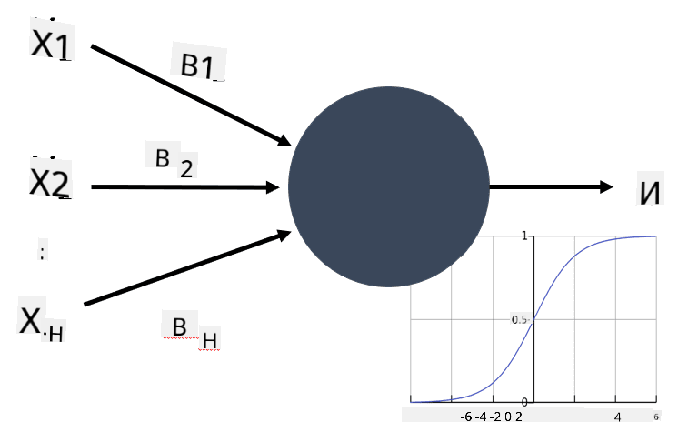

<!--
CO_OP_TRANSLATOR_METADATA:
{
  "original_hash": "5abc5f7978919be90cd313f0c20e8228",
  "translation_date": "2025-09-07T14:36:50+00:00",
  "source_file": "lessons/3-NeuralNetworks/README.md",
  "language_code": "sr"
}
-->
# Увод у неуронске мреже

Као што смо поменули у уводу, један од начина да се постигне интелигенција је тренирање **рачунарског модела** или **вештачког мозга**. Од средине 20. века, истраживачи су испробавали различите математичке моделе, све док се у последњим годинама овај правац није показао изузетно успешним. Такви математички модели мозга називају се **неуронске мреже**.

> Понекад се неуронске мреже називају *вештачке неуронске мреже* (Artificial Neural Networks, ANNs), како би се нагласило да говоримо о моделима, а не о стварним мрежама неурона.

## Машинско учење

Неуронске мреже су део шире дисциплине која се зове **машинско учење**, чији је циљ коришћење података за тренирање рачунарских модела који могу да решавају проблеме. Машинско учење чини велики део вештачке интелигенције, али у овом курикулуму не покривамо класично машинско учење.

> Погледајте наш посебан курикулум **[Машинско учење за почетнике](http://github.com/microsoft/ml-for-beginners)** како бисте сазнали више о класичном машинском учењу.

У машинском учењу претпостављамо да имамо неки скуп података са примерима **X** и одговарајућим излазним вредностима **Y**. Примери су често N-димензионални вектори који се састоје од **карактеристика**, а излази се називају **ознаке**.

Разматраћемо два најчешћа проблема машинског учења:

* **Класификација**, где је потребно класификовати улазни објекат у две или више класа.
* **Регресија**, где је потребно предвидети нумеричку вредност за сваки од улазних узорака.

> Када представљамо улазе и излазе као тензоре, улазни скуп података је матрица величине M×N, где је M број узорака, а N број карактеристика. Излазне ознаке Y су вектор величине M.

У овом курикулуму фокусираћемо се искључиво на моделе неуронских мрежа.

## Модел неурона

Из биологије знамо да наш мозак састоји од неуронских ћелија, од којих свака има више "улаза" (аксона) и један излаз (дендрит). Аксони и дендрити могу проводити електричне сигнале, а везе између аксона и дендрита могу имати различите степене проводљивости (који су контролисани неуромедијаторима).

 | 
----|----
Прави неурон *([Слика](https://en.wikipedia.org/wiki/Synapse#/media/File:SynapseSchematic_lines.svg) са Википедије)* | Вештачки неурон *(Слика аутора)*

Дакле, најједноставнији математички модел неурона садржи неколико улаза X1, ..., XN и један излаз Y, као и низ тежина W1, ..., WN. Излаз се рачуна као:

где је f нека нелинеарна **активациона функција**.

> Рани модели неурона описани су у класичном раду [Логички рачун идеја иманентних нервној активности](https://www.cs.cmu.edu/~./epxing/Class/10715/reading/McCulloch.and.Pitts.pdf) аутора Ворена Макалока и Волтера Питса из 1943. године. Доналд Хеб је у својој књизи "[Организација понашања: Неуропсихолошка теорија](https://books.google.com/books?id=VNetYrB8EBoC)" предложио начин на који се те мреже могу тренирати.

## У овом одељку

У овом одељку ћемо научити о:
* [Перцептрону](03-Perceptron/README.md), једном од најранијих модела неуронских мрежа за класификацију са две класе
* [Мрежама са више слојева](04-OwnFramework/README.md) са пратећим нотебуком [како изградити сопствени оквир](04-OwnFramework/OwnFramework.ipynb)
* [Оквирима за неуронске мреже](05-Frameworks/README.md), са овим нотебуцима: [PyTorch](05-Frameworks/IntroPyTorch.ipynb) и [Keras/Tensorflow](05-Frameworks/IntroKerasTF.ipynb)
* [Претераном прилагођавању](../../../../lessons/3-NeuralNetworks/05-Frameworks)

---

**Одрицање од одговорности**:  
Овај документ је преведен коришћењем услуге за превођење помоћу вештачке интелигенције [Co-op Translator](https://github.com/Azure/co-op-translator). Иако се трудимо да превод буде тачан, молимо вас да имате у виду да аутоматизовани преводи могу садржати грешке или нетачности. Оригинални документ на његовом изворном језику треба сматрати меродавним извором. За критичне информације препоручује се професионални превод од стране људи. Не преузимамо одговорност за било каква погрешна тумачења или неспоразуме који могу настати услед коришћења овог превода.