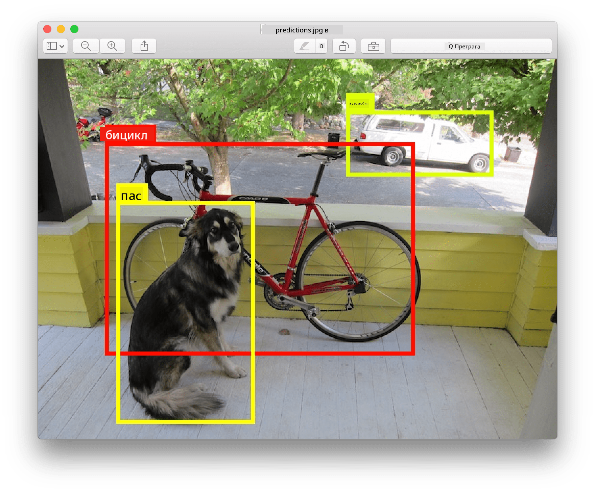
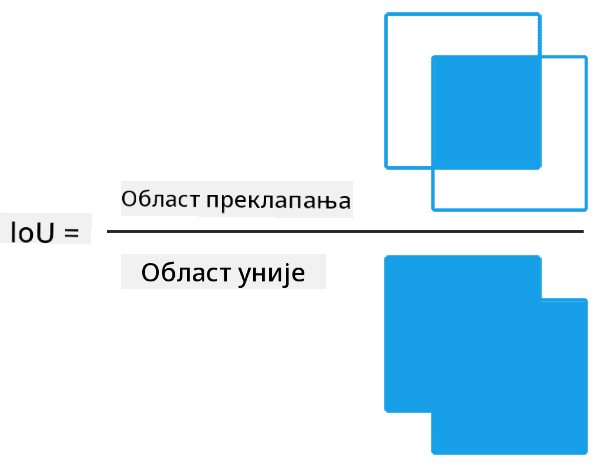
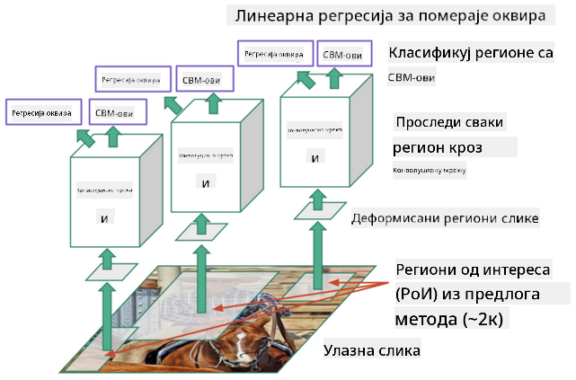
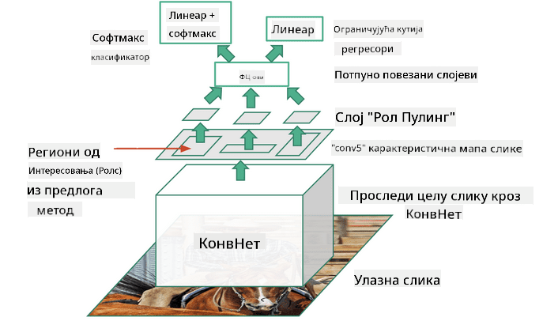
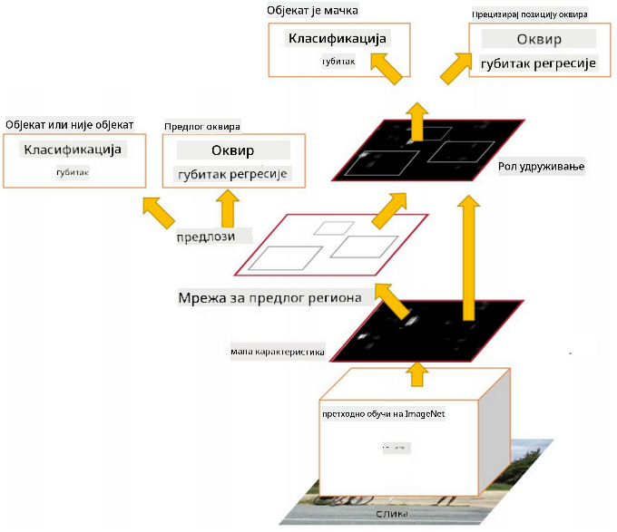
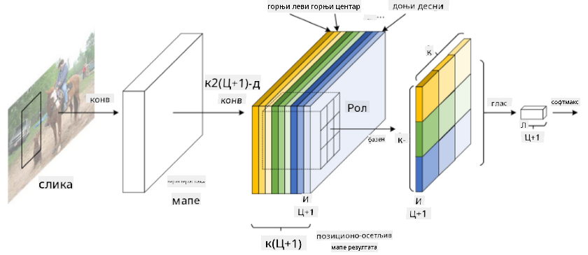
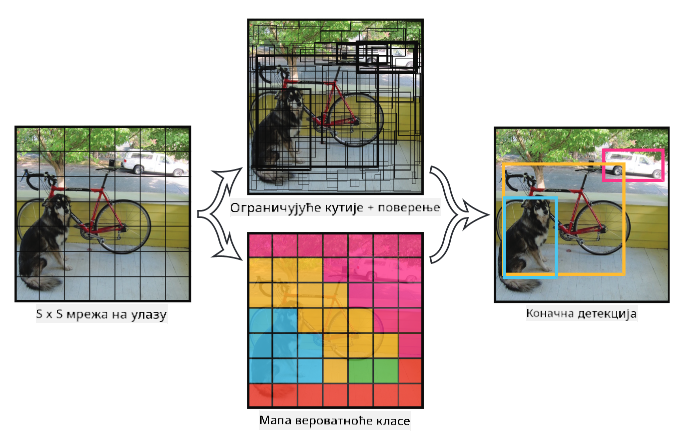

<!--
CO_OP_TRANSLATOR_METADATA:
{
  "original_hash": "d85c8b08f6d1b48fd7f35b99f93c1138",
  "translation_date": "2025-08-25T22:46:00+00:00",
  "source_file": "lessons/4-ComputerVision/11-ObjectDetection/README.md",
  "language_code": "sr"
}
-->
# Детекција објеката

Модели за класификацију слика које смо до сада обрађивали узимају слику и производе категоријски резултат, као што је класа 'број' у проблему MNIST. Међутим, у многим случајевима не желимо само да знамо да слика приказује објекте - желимо да можемо да одредимо њихову прецизну локацију. Управо то је суштина **детекције објеката**.

## [Квиз пре предавања](https://red-field-0a6ddfd03.1.azurestaticapps.net/quiz/111)

> Слика са [YOLO v2 веб сајта](https://pjreddie.com/darknet/yolov2/)

## Наивни приступ детекцији објеката

Претпоставимо да желимо да пронађемо мачку на слици. Веома наиван приступ детекцији објеката био би следећи:

1. Разбијте слику на више плочица.
2. Покрените класификацију слике на свакој плочици.
3. Плочице које резултирају довољно високом активацијом могу се сматрати да садрже тражени објекат.

> *Слика из [радне свеске за вежбе](../../../../../lessons/4-ComputerVision/11-ObjectDetection/ObjectDetection-TF.ipynb)*

Међутим, овај приступ је далеко од идеалног, јер омогућава алгоритму да веома непрецизно одреди оквир објекта. За прецизнију локацију, потребно је да покренемо неку врсту **регресије** како бисмо предвидели координате оквира - а за то су нам потребни специфични скупови података.

## Регресија за детекцију објеката

[Овај блог пост](https://towardsdatascience.com/object-detection-with-neural-networks-a4e2c46b4491) пружа одличан увод у детекцију облика.

## Скупови података за детекцију објеката

Можете наићи на следеће скупове података за овај задатак:

* [PASCAL VOC](http://host.robots.ox.ac.uk/pascal/VOC/) - 20 класа
* [COCO](http://cocodataset.org/#home) - Уобичајени објекти у контексту. 80 класа, оквири и маске за сегментацију

## Метрике за детекцију објеката

### Преклапање преко уније (Intersection over Union)

Док је за класификацију слика лако измерити колико добро алгоритам ради, за детекцију објеката морамо измерити и исправност класе, као и прецизност локације предвиђеног оквира. За ово друго користимо такозвано **преклапање преко уније** (IoU), које мери колико добро се два оквира (или две произвољне области) преклапају.

> *Фигура 2 из [овог одличног блога о IoU](https://pyimagesearch.com/2016/11/07/intersection-over-union-iou-for-object-detection/)*

Идеја је једноставна - делимо област преклапања између две фигуре са облашћу њихове уније. За две идентичне области, IoU би био 1, док би за потпуно одвојене области био 0. У другим случајевима ће варирати од 0 до 1. Обично узимамо у обзир само оне оквире за које је IoU изнад одређене вредности.

### Просечна прецизност (Average Precision)

Претпоставимо да желимо да измеримо колико добро је препозната дата класа објеката $C$. За мерење користимо метрику **просечне прецизности**, која се израчунава на следећи начин:

1. Размотрите криву прецизност-позив која показује тачност у зависности од вредности прага детекције (од 0 до 1).
2. У зависности од прага, добићемо више или мање објеката детектованих на слици, и различите вредности прецизности и позива.
3. Крива ће изгледати овако:

> *Слика из [NeuroWorkshop](http://github.com/shwars/NeuroWorkshop)*

Просечна прецизност за дату класу $C$ је област испод ове криве. Прецизније, оса позива се обично дели на 10 делова, а прецизност се просечава преко свих тих тачака:

$$
AP = {1\over11}\sum_{i=0}^{10}\mbox{Precision}(\mbox{Recall}={i\over10})
$$

### AP и IoU

Узимамо у обзир само оне детекције за које је IoU изнад одређене вредности. На пример, у PASCAL VOC скупу података обично се претпоставља $\mbox{IoU Threshold} = 0.5$, док се у COCO AP мери за различите вредности $\mbox{IoU Threshold}$.

> *Слика из [NeuroWorkshop](http://github.com/shwars/NeuroWorkshop)*

### Средња просечна прецизност - mAP

Главна метрика за детекцију објеката назива се **средња просечна прецизност**, или **mAP**. То је вредност просечне прецизности, просечена преко свих класа објеката, а понекад и преко $\mbox{IoU Threshold}$. Детаљнији процес израчунавања **mAP** описан је
[у овом блог посту](https://medium.com/@timothycarlen/understanding-the-map-evaluation-metric-for-object-detection-a07fe6962cf3)), као и [овде са примерима кода](https://gist.github.com/tarlen5/008809c3decf19313de216b9208f3734).

## Различити приступи детекцији објеката

Постоје две широке класе алгоритама за детекцију објеката:

* **Мреже за предлог региона** (R-CNN, Fast R-CNN, Faster R-CNN). Главна идеја је генерисање **регионa од интереса** (ROI) и покретање CNN-а преко њих, тражећи максималну активацију. Ово је донекле слично наивном приступу, са изузетком да се ROI генеришу на паметнији начин. Један од главних недостатака ових метода је то што су споре, јер је потребно много пролаза CNN класификатора преко слике.
* **Један пролаз** (YOLO, SSD, RetinaNet) методе. У овим архитектурама дизајнирамо мрежу да предвиђа и класе и ROI у једном пролазу.

### R-CNN: CNN заснован на регионима

[R-CNN](http://islab.ulsan.ac.kr/files/announcement/513/rcnn_pami.pdf) користи [Selective Search](http://www.huppelen.nl/publications/selectiveSearchDraft.pdf) за генерисање хијерархијске структуре ROI региона, који се затим прослеђују кроз CNN екстракторе карактеристика и SVM класификаторе за одређивање класе објекта, и линеарну регресију за одређивање координата *оквира*. [Званични рад](https://arxiv.org/pdf/1506.01497v1.pdf)

> *Слика из ван де Санде и др. ICCV’11*

> *Слике из [овог блога](https://towardsdatascience.com/r-cnn-fast-r-cnn-faster-r-cnn-yolo-object-detection-algorithms-36d53571365e)

### F-RCNN - Брзи R-CNN

Овај приступ је сличан R-CNN-у, али региони се дефинишу након што су примењени слојеви конволуције.

> Слика из [званичног рада](https://www.cv-foundation.org/openaccess/content_iccv_2015/papers/Girshick_Fast_R-CNN_ICCV_2015_paper.pdf), [arXiv](https://arxiv.org/pdf/1504.08083.pdf), 2015

### Бржи R-CNN

Главна идеја овог приступа је коришћење неуронске мреже за предвиђање ROI - такозване *мреже за предлог региона*. [Рад](https://arxiv.org/pdf/1506.01497.pdf), 2016

> Слика из [званичног рада](https://arxiv.org/pdf/1506.01497.pdf)

### R-FCN: Потпуно конволуциона мрежа заснована на регионима

Овај алгоритам је још бржи од Faster R-CNN. Главна идеја је следећа:

1. Екстрахујемо карактеристике користећи ResNet-101.
2. Карактеристике се обрађују помоћу **мапе оцена осетљивих на позицију**. Сваки објекат из $C$ класа се дели на $k\times k$ региона, и тренирамо за предвиђање делова објеката.
3. За сваки део из $k\times k$ региона све мреже гласају за класе објеката, и класа објекта са максималним бројем гласова се бира.

> Слика из [званичног рада](https://arxiv.org/abs/1605.06409)

### YOLO - You Only Look Once

YOLO је алгоритам за реално време са једним пролазом. Главна идеја је следећа:

 * Слика се дели на $S\times S$ региона.
 * За сваки регион, **CNN** предвиђа $n$ могућих објеката, координате *оквира* и *поузданост*=*вероватноћа* * IoU.

 

> Слика из [званичног рада](https://arxiv.org/abs/1506.02640)

### Остали алгоритми

* RetinaNet: [званични рад](https://arxiv.org/abs/1708.02002)
   - [PyTorch имплементација у Torchvision](https://pytorch.org/vision/stable/_modules/torchvision/models/detection/retinanet.html)
   - [Keras имплементација](https://github.com/fizyr/keras-retinanet)
   - [Детекција објеката са RetinaNet](https://keras.io/examples/vision/retinanet/) у Keras примерима
* SSD (Single Shot Detector): [званични рад](https://arxiv.org/abs/1512.02325)

## ✍️ Вежбе: Детекција објеката

Наставите учење у следећој радној свесци:

[ObjectDetection.ipynb](../../../../../lessons/4-ComputerVision/11-ObjectDetection/ObjectDetection.ipynb)

## Закључак

У овој лекцији сте направили брзи преглед различитих начина на које се детекција објеката може остварити!

## 🚀 Изазов

Прочитајте ове чланке и радне свеске о YOLO и испробајте их сами:

* [Добар блог пост](https://www.analyticsvidhya.com/blog/2018/12/practical-guide-object-detection-yolo-framewor-python/) који описује YOLO
 * [Званични сајт](https://pjreddie.com/darknet/yolo/)
 * Yolo: [Keras имплементација](https://github.com/experiencor/keras-yolo2), [радна свеска корак по корак](https://github.com/experiencor/basic-yolo-keras/blob/master/Yolo%20Step-by-Step.ipynb)
 * Yolo v2: [Keras имплементација](https://github.com/experiencor/keras-yolo2), [радна свеска корак по корак](https://github.com/experiencor/keras-yolo2/blob/master/Yolo%20Step-by-Step.ipynb)

## [Квиз после предавања](https://red-field-0a6ddfd03.1.azurestaticapps.net/quiz/211)

## Преглед и самостално учење

* [Детекција објеката](https://tjmachinelearning.com/lectures/1718/obj/) од Никхила Сардане
* [Добро поређење алгоритама за детекцију објеката](https://lilianweng.github.io/lil-log/2018/12/27/object-detection-part-4.html)
* [Преглед алгоритама дубоког учења за детекцију објеката](https://medium.com/comet-app/review-of-deep-learning-algorithms-for-object-detection-c1f3d437b852)
* [Увод у основне алгоритме за детекцију објеката корак по корак](https://www.analyticsvidhya.com/blog/2018/10/a-step-by-step-introduction-to-the-basic-object-detection-algorithms-part-1/)
* [Имплементација Faster R-CNN у Python-у за детекцију објеката](https://www.analyticsvidhya.com/blog/2018/11/implementation-faster-r-cnn-python-object-detection/)

## [Задатак: Детекција објеката](lab/README.md)

**Одрицање од одговорности**:  
Овај документ је преведен коришћењем услуге за превођење помоћу вештачке интелигенције [Co-op Translator](https://github.com/Azure/co-op-translator). Иако се трудимо да обезбедимо тачност, молимо вас да имате у виду да аутоматски преводи могу садржати грешке или нетачности. Оригинални документ на његовом изворном језику треба сматрати меродавним извором. За критичне информације препоручује се професионални превод од стране људи. Не преузимамо одговорност за било каква погрешна тумачења или неспоразуме који могу настати услед коришћења овог превода.