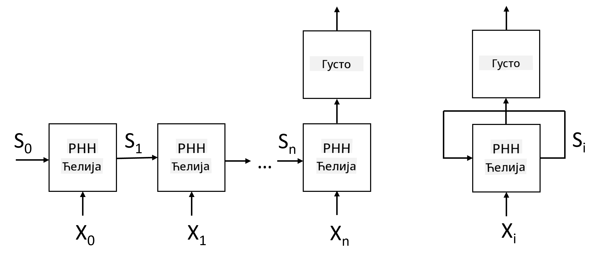
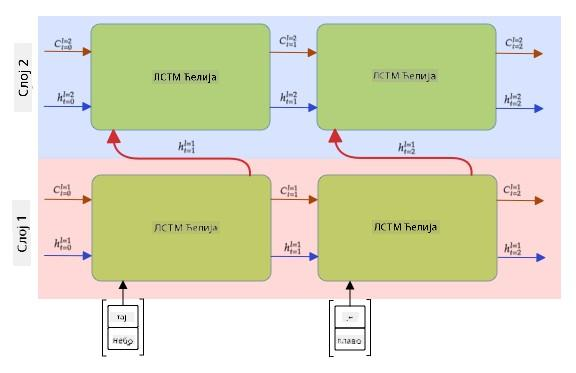

<!--
CO_OP_TRANSLATOR_METADATA:
{
  "original_hash": "58bf4adb210aab53e8f78c8082040e7c",
  "translation_date": "2025-08-25T21:34:11+00:00",
  "source_file": "lessons/5-NLP/16-RNN/README.md",
  "language_code": "sr"
}
-->
# Рекурентне неуронске мреже

## [Квиз пре предавања](https://red-field-0a6ddfd03.1.azurestaticapps.net/quiz/116)

У претходним одељцима користили смо богате семантичке репрезентације текста и једноставни линеарни класификатор на врху уграђивања. Ова архитектура хвата агрегирано значење речи у реченици, али не узима у обзир **редослед** речи, јер операција агрегирања на врху уграђивања уклања ову информацију из оригиналног текста. Пошто ови модели не могу да моделирају редослед речи, они не могу решавати сложеније или двосмислене задатке као што су генерисање текста или одговарање на питања.

Да бисмо ухватили значење секвенце текста, потребно је да користимо другу архитектуру неуронске мреже, која се назива **рекурентна неуронска мрежа**, или RNN. У RNN-у, реченицу пролазимо кроз мрежу један симбол по један, а мрежа производи неко **стање**, које затим поново прослеђујемо мрежи са следећим симболом.

> Слика аутора

С обзиром на улазну секвенцу токена X0,...,Xn, RNN креира секвенцу блокова неуронске мреже и тренира ову секвенцу од почетка до краја користећи бацкпропагацију. Сваки блок мреже узима пар (Xi,Si) као улаз и производи Si+1 као резултат. Коначно стање Sn или (излаз Yn) улази у линеарни класификатор да би произвело резултат. Сви блокови мреже деле исте тежине и тренирају се од почетка до краја користећи један бацкпропагацијски пролаз.

Пошто се вектор стања S0,...,Sn прослеђује кроз мрежу, она је у стању да научи секвенцијалне зависности између речи. На пример, када се реч *не* појави негде у секвенци, мрежа може научити да негира одређене елементе унутар вектора стања, што резултира негацијом.

> ✅ Пошто су тежине свих RNN блокова на слици изнад заједничке, иста слика може бити представљена као један блок (десно) са рекурентном повратном петљом, која враћа излазно стање мреже назад на улаз.

## Анатомија RNN ћелије

Хајде да видимо како је организована једноставна RNN ћелија. Она прихвата претходно стање Si-1 и тренутни симбол Xi као улазе, и мора да произведе излазно стање Si (а понекад нас занима и неки други излаз Yi, као у случају генеративних мрежа).

Једноставна RNN ћелија има две матрице тежина унутра: једна трансформише улазни симбол (назовимо је W), а друга трансформише улазно стање (H). У овом случају излаз мреже се рачуна као σ(W×Xi+H×Si-1+b), где је σ функција активације, а b је додатна пристрасност.

> Слика аутора

У многим случајевима, улазни токени пролазе кроз слој уграђивања пре него што уђу у RNN како би се смањила димензионалност. У овом случају, ако је димензија улазних вектора *emb_size*, а вектор стања *hid_size* - величина W је *emb_size*×*hid_size*, а величина H је *hid_size*×*hid_size*.

## Дугорочна краткорочна меморија (LSTM)

Један од главних проблема класичних RNN-ова је такозвани проблем **нестајућих градијената**. Пошто се RNN-ови тренирају од почетка до краја у једном бацкпропагацијском пролазу, тешко је пренети грешку до првих слојева мреже, и тако мрежа не може научити односе између удаљених токена. Један од начина да се избегне овај проблем је увођење **експлицитног управљања стањем** коришћењем такозваних **врата**. Постоје две добро познате архитектуре овог типа: **Дугорочна краткорочна меморија** (LSTM) и **Јединица са контролисаним преносом** (GRU).

> Извор слике TBD

LSTM мрежа је организована на начин сличан RNN-у, али постоје два стања која се преносе из слоја у слој: стварно стање C и скривени вектор H. У свакој јединици, скривени вектор Hi се конкатенише са улазом Xi, и они контролишу шта се дешава са стањем C преко **врата**. Свака врата су неуронска мрежа са сигмоид активацијом (излаз у опсегу [0,1]), која се може сматрати битовском маском када се помножи са вектором стања. Постоје следећа врата (слева надесно на слици изнад):

* **Врата заборава** узимају скривени вектор и одређују које компоненте вектора C треба заборавити, а које пропустити.
* **Улазна врата** узимају неке информације из улазног и скривеног вектора и убацују их у стање.
* **Излазна врата** трансформишу стање преко линеарног слоја са *tanh* активацијом, а затим бирају неке од његових компоненти користећи скривени вектор Hi да би произвели ново стање Ci+1.

Компоненте стања C могу се сматрати неким заставицама које се могу укључити и искључити. На пример, када у секвенци наиђемо на име *Алиса*, можемо претпоставити да се односи на женски лик и подићи заставицу у стању да имамо женску именицу у реченици. Када даље наиђемо на фразу *и Том*, подићи ћемо заставицу да имамо множину именица. Тако манипулисањем стањем можемо наводно пратити граматичке особине делова реченице.

> ✅ Одличан ресурс за разумевање унутрашњости LSTM-а је овај сјајан чланак [Understanding LSTM Networks](https://colah.github.io/posts/2015-08-Understanding-LSTMs/) аутора Кристофера Олаха.

## Двосмерни и вишеслојни RNN-ови

Разматрали смо рекурентне мреже које раде у једном правцу, од почетка секвенце до краја. То изгледа природно, јер подсећа на начин на који читамо и слушамо говор. Међутим, пошто у многим практичним случајевима имамо случајни приступ улазној секвенци, можда има смисла покренути рекурентни прорачун у оба правца. Такве мреже се називају **двосмерне** RNN-ове. Када радимо са двосмерном мрежом, биће нам потребна два скривена вектора стања, по један за сваки правац.

Рекурентна мрежа, било једносмерна или двосмерна, хвата одређене обрасце унутар секвенце и може их складиштити у вектор стања или проследити у излаз. Као и код конволуционих мрежа, можемо изградити још један рекурентни слој на врху првог да бисмо ухватили обрасце вишег нивоа и изградили од образаца нижег нивоа које је извукао први слој. Ово нас доводи до концепта **вишеслојног RNN-а** који се састоји од два или више рекурентних мрежа, где се излаз претходног слоја прослеђује следећем слоју као улаз.

*Слика из [овог дивног поста](https://towardsdatascience.com/from-a-lstm-cell-to-a-multilayer-lstm-network-with-pytorch-2899eb5696f3) аутора Фернанда Лопеза*

## ✍️ Вежбе: Уграђивања

Наставите учење у следећим нотебуковима:

* [RNN-ови са PyTorch-ом](../../../../../lessons/5-NLP/16-RNN/RNNPyTorch.ipynb)
* [RNN-ови са TensorFlow-ом](../../../../../lessons/5-NLP/16-RNN/RNNTF.ipynb)

## Закључак

У овој јединици видели смо да се RNN-ови могу користити за класификацију секвенци, али у ствари, они могу обрађивати много више задатака, као што су генерисање текста, машински превод и још много тога. Те задатке ћемо разматрати у следећој јединици.

## 🚀 Изазов

Прочитајте неку литературу о LSTM-овима и размислите о њиховим применама:

- [Grid Long Short-Term Memory](https://arxiv.org/pdf/1507.01526v1.pdf)
- [Show, Attend and Tell: Neural Image Caption
Generation with Visual Attention](https://arxiv.org/pdf/1502.03044v2.pdf)

## [Квиз после предавања](https://red-field-0a6ddfd03.1.azurestaticapps.net/quiz/216)

## Преглед и самостално учење

- [Understanding LSTM Networks](https://colah.github.io/posts/2015-08-Understanding-LSTMs/) аутора Кристофера Олаха.

## [Задатак: Нотебукови](assignment.md)

**Одрицање од одговорности**:  
Овај документ је преведен коришћењем услуге за превођење помоћу вештачке интелигенције [Co-op Translator](https://github.com/Azure/co-op-translator). Иако се трудимо да обезбедимо тачност, молимо вас да имате у виду да аутоматски преводи могу садржати грешке или нетачности. Оригинални документ на његовом изворном језику треба сматрати меродавним извором. За критичне информације препоручује се професионални превод од стране људи. Не преузимамо одговорност за било каква погрешна тумачења или неспоразуме који могу настати услед коришћења овог превода.