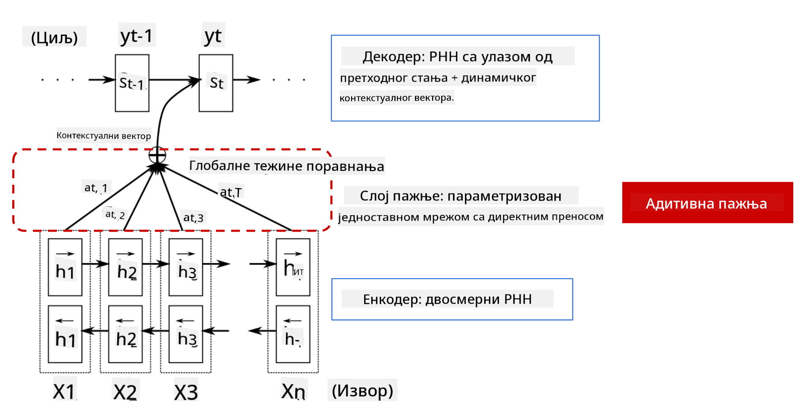
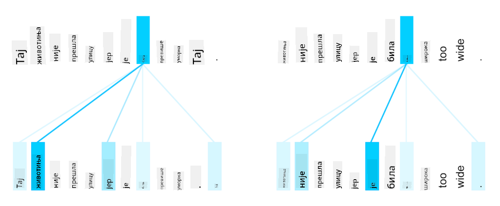
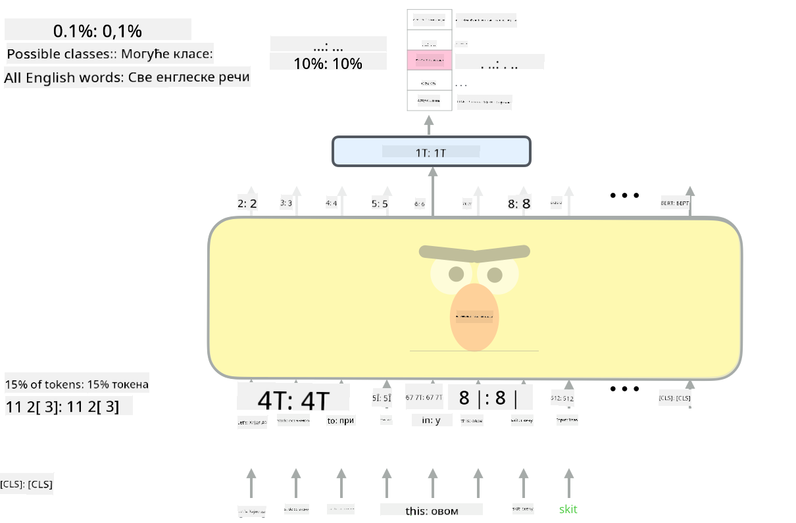

<!--
CO_OP_TRANSLATOR_METADATA:
{
  "original_hash": "7e617f0b8de85a43957a853aba09bfeb",
  "translation_date": "2025-08-25T22:02:19+00:00",
  "source_file": "lessons/5-NLP/18-Transformers/README.md",
  "language_code": "sr"
}
-->
# Механизми пажње и Трансформери

## [Квиз пре предавања](https://red-field-0a6ddfd03.1.azurestaticapps.net/quiz/118)

Један од најважнијих проблема у области обраде природног језика (NLP) је **машински превод**, суштински задатак који је основа алата као што је Google Translate. У овом делу ћемо се фокусирати на машински превод, или, генералније, на било који задатак *секвенца-у-секвенцу* (који се такође назива **трансдукција реченица**).

Са RNN-овима, секвенца-у-секвенцу се имплементира помоћу две рекурентне мреже, где једна мрежа, **енкодер**, сабија улазну секвенцу у скривено стање, док друга мрежа, **декодер**, развија ово скривено стање у преведени резултат. Постоји неколико проблема са овим приступом:

* Крајње стање енкодер мреже тешко памти почетак реченице, што доводи до лошег квалитета модела за дуге реченице.
* Све речи у секвенци имају исти утицај на резултат. У стварности, међутим, одређене речи у улазној секвенци често имају већи утицај на излазну секвенцу од других.

**Механизми пажње** пружају начин да се тежински одреди контекстуални утицај сваког улазног вектора на сваку излазну предикцију RNN-а. Ово се имплементира стварањем пречица између интермедијарних стања улазног RNN-а и излазног RNN-а. На овај начин, када генеришемо излазни симбол yt, узимамо у обзир сва улазна скривена стања hi, са различитим тежинским коефицијентима αt,i.

> Енкодер-декодер модел са адитивним механизмом пажње у [Bahdanau et al., 2015](https://arxiv.org/pdf/1409.0473.pdf), цитиран из [овог блога](https://lilianweng.github.io/lil-log/2018/06/24/attention-attention.html)

Матрица пажње {αi,j} представља степен у којем одређене улазне речи утичу на генерисање одређене речи у излазној секвенци. Испод је пример такве матрице:

> Слика из [Bahdanau et al., 2015](https://arxiv.org/pdf/1409.0473.pdf) (Сл.3)

Механизми пажње су одговорни за велики део тренутног или скоро тренутног стања уметности у NLP-у. Међутим, додавање пажње значајно повећава број параметара модела, што је довело до проблема са скалирањем RNN-ова. Кључно ограничење скалирања RNN-ова је то што рекурентна природа модела отежава груписање и паралелизацију тренинга. У RNN-у сваки елемент секвенце мора бити обрађен редоследно, што значи да се не може лако паралелизовати.

> Слика из [Google-овог блога](https://research.googleblog.com/2016/09/a-neural-network-for-machine.html)

Усвајање механизама пажње у комбинацији са овим ограничењем довело је до стварања садашњих трансформер модела, као што су BERT и Open-GPT3, који представљају стање уметности.

## Трансформер модели

Једна од главних идеја иза трансформера је избегавање секвенцијалне природе RNN-ова и стварање модела који је паралелизован током тренинга. Ово се постиже имплементацијом две идеје:

* позиционо кодирање
* коришћење механизма самопажње за хватање образаца уместо RNN-ова (или CNN-ова) (због чега се рад који уводи трансформере зове *[Attention is all you need](https://arxiv.org/abs/1706.03762)*)

### Позиционо кодирање/уграђивање

Идеја позиционог кодирања је следећа.  
1. Код RNN-ова, релативна позиција токена је представљена бројем корака, и стога не мора бити експлицитно представљена.  
2. Међутим, када пређемо на пажњу, морамо знати релативне позиције токена унутар секвенце.  
3. Да бисмо добили позиционо кодирање, проширујемо нашу секвенцу токена са секвенцом позиција токена у секвенци (тј. секвенцом бројева 0,1, ...).  
4. Затим мешамо позицију токена са вектором уграђивања токена. Да бисмо трансформисали позицију (цео број) у вектор, можемо користити различите приступе:

* Тренабилно уграђивање, слично уграђивању токена. Ово је приступ који овде разматрамо. Примењујемо слојеве уграђивања на токене и њихове позиције, добијајући векторе уграђивања истих димензија, које затим сабирамо.
* Фиксна функција позиционог кодирања, како је предложено у оригиналном раду.

> Слика аутора

Резултат који добијамо са позиционим уграђивањем укључује и оригинални токен и његову позицију унутар секвенце.

### Вишеглава самопажња

Затим, потребно је да ухватимо неке обрасце унутар наше секвенце. Да бисмо то урадили, трансформери користе механизам **самопажње**, који је у суштини пажња примењена на исту секвенцу као улаз и излаз. Примена самопажње омогућава нам да узмемо у обзир **контекст** унутар реченице и видимо који су термини међусобно повезани. На пример, омогућава нам да видимо на шта се односе кореференце, као што је *оно*, и такође узмемо у обзир контекст:

> Слика из [Google-овог блога](https://research.googleblog.com/2017/08/transformer-novel-neural-network.html)

У трансформерима користимо **вишеглаву пажњу** како бисмо мрежи дали могућност да ухвати различите типове зависности, нпр. дугорочне наспрам краткорочних односа између речи, кореференце наспрам нечег другог итд.

[TensorFlow Notebook](../../../../../lessons/5-NLP/18-Transformers/TransformersTF.ipynb) садржи више детаља о имплементацији слојева трансформера.

### Пажња енкодера-декодера

У трансформерима, пажња се користи на два места:

* За хватање образаца унутар улазног текста помоћу самопажње
* За извођење превода секвенци - то је слој пажње између енкодера и декодера.

Пажња енкодера-декодера је веома слична механизму пажње који се користи у RNN-овима, како је описано на почетку овог дела. Овај анимирани дијаграм објашњава улогу пажње енкодера-декодера.

Пошто се свака улазна позиција независно мапира на сваку излазну позицију, трансформери могу боље паралелизовати од RNN-ова, што омогућава много веће и изражајније језичке моделе. Свака глава пажње може се користити за учење различитих односа између речи, што побољшава задатке обраде природног језика.

## BERT

**BERT** (Bidirectional Encoder Representations from Transformers) је веома велика трансформер мрежа са више слојева, са 12 слојева за *BERT-base*, и 24 за *BERT-large*. Модел се прво претходно тренира на великом корпусу текстуалних података (WikiPedia + књиге) користећи несупервизирано учење (предвиђање маскираних речи у реченици). Током претходног тренинга, модел апсорбује значајан ниво разумевања језика, који се затим може искористити са другим скуповима података кроз фино подешавање. Овај процес се назива **трансфер учење**.

> Слика [извор](http://jalammar.github.io/illustrated-bert/)

## ✍️ Вежбе: Трансформери

Наставите своје учење у следећим нотебуковима:

* [Трансформери у PyTorch-у](../../../../../lessons/5-NLP/18-Transformers/TransformersPyTorch.ipynb)
* [Трансформери у TensorFlow-у](../../../../../lessons/5-NLP/18-Transformers/TransformersTF.ipynb)

## Закључак

У овој лекцији сте научили о трансформерима и механизмима пажње, свим суштинским алатима у NLP алатници. Постоји много варијација трансформер архитектура, укључујући BERT, DistilBERT, BigBird, OpenGPT3 и друге, које се могу фино подесити. Пакет [HuggingFace](https://github.com/huggingface/) пружа репозиторијум за тренирање многих од ових архитектура са PyTorch-ом и TensorFlow-ом.

## 🚀 Изазов

## [Квиз након предавања](https://red-field-0a6ddfd03.1.azurestaticapps.net/quiz/218)

## Преглед и самостално учење

* [Блог пост](https://mchromiak.github.io/articles/2017/Sep/12/Transformer-Attention-is-all-you-need/), који објашњава класични рад [Attention is all you need](https://arxiv.org/abs/1706.03762) о трансформерима.
* [Серија блог постова](https://towardsdatascience.com/transformers-explained-visually-part-1-overview-of-functionality-95a6dd460452) о трансформерима, која детаљно објашњава архитектуру.

## [Задатак](assignment.md)

**Одрицање од одговорности**:  
Овај документ је преведен коришћењем услуге за превођење помоћу вештачке интелигенције [Co-op Translator](https://github.com/Azure/co-op-translator). Иако се трудимо да обезбедимо тачност, молимо вас да имате у виду да аутоматски преводи могу садржати грешке или нетачности. Оригинални документ на његовом изворном језику треба сматрати ауторитативним извором. За критичне информације препоручује се професионални превод од стране људи. Не преузимамо одговорност за било каква погрешна тумачења или неспоразуме који могу настати услед коришћења овог превода.