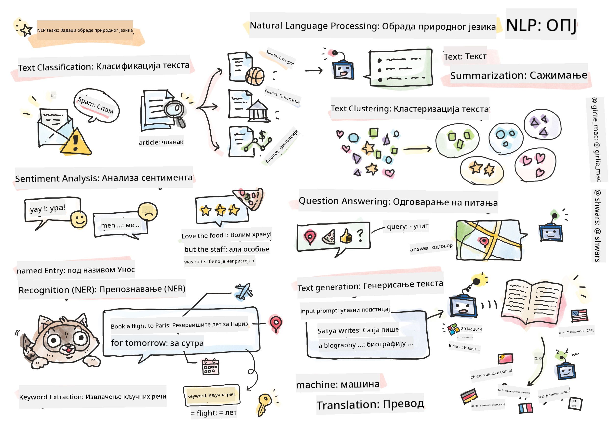

<!--
CO_OP_TRANSLATOR_METADATA:
{
  "original_hash": "8ef02a9318257ea140ed3ed74442096d",
  "translation_date": "2025-08-25T21:29:17+00:00",
  "source_file": "lessons/5-NLP/README.md",
  "language_code": "sr"
}
-->
# Обрада природног језика



У овом делу ћемо се фокусирати на коришћење неуронских мрежа за решавање задатака везаних за **обраду природног језика (NLP)**. Постоји много NLP проблема које желимо да рачунари могу да реше:

* **Класификација текста** је типичан проблем класификације који се односи на текстуалне секвенце. Примери укључују класификацију е-порука као спам или не-спам, или категоризацију чланака као спорт, бизнис, политика итд. Такође, приликом развоја чет-ботова, често је потребно разумети шта је корисник желео да каже — у том случају се бавимо **класификацијом намере**. Често, у класификацији намере, морамо се бавити великим бројем категорија.
* **Анализа сентимента** је типичан проблем регресије, где треба да доделимо број (сентимент) који одговара томе колико је значење реченице позитивно/негативно. Напреднија верзија анализе сентимента је **анализа сентимента по аспектима** (ABSA), где сентимент додељујемо не целој реченици, већ различитим деловима (аспектима), нпр. *У овом ресторану ми се свидела кухиња, али је атмосфера била ужасна*.
* **Препознавање именованих ентитета** (NER) односи се на проблем издвајања одређених ентитета из текста. На пример, потребно је разумети да у фрази *Морам да летим за Париз сутра* реч *сутра* означава ДАТУМ, а *Париз* је ЛОКАЦИЈА.  
* **Издвајање кључних речи** је слично NER-у, али овде треба аутоматски издвојити речи које су важне за значење реченице, без претходног тренирања за специфичне типове ентитета.
* **Кластерисање текста** може бити корисно када желимо да групишемо сличне реченице, на пример, сличне захтеве у техничкој подршци.
* **Одговарање на питања** односи се на способност модела да одговори на конкретно питање. Модел добија текстуални одломак и питање као улазе, а затим треба да пружи место у тексту где се налази одговор на питање (или, понекад, да генерише текст одговора).
* **Генерисање текста** је способност модела да генерише нови текст. Ово се може сматрати задатком класификације који предвиђа следеће слово/реч на основу неког *текстуалног подстицаја*. Напредни модели за генерисање текста, као што је GPT-3, могу решавати и друге NLP задатке, као што је класификација, користећи технику звану [програмисање подстицајима](https://towardsdatascience.com/software-3-0-how-prompting-will-change-the-rules-of-the-game-a982fbfe1e0) или [инжењеринг подстицајима](https://medium.com/swlh/openai-gpt-3-and-prompt-engineering-dcdc2c5fcd29).
* **Сажимање текста** је техника када желимо да рачунар "прочита" дугачак текст и сажме га у неколико реченица.
* **Машински превод** може се посматрати као комбинација разумевања текста на једном језику и генерисања текста на другом.

Првобитно су се већина NLP задатака решавала традиционалним методама као што су граматике. На пример, у машинском преводу коришћени су парсери за претварање почетне реченице у синтаксичко стабло, затим су се извлачиле семантичке структуре вишег нивоа како би се представило значење реченице, а на основу тог значења и граматике циљног језика генерисан је резултат. Данас се многи NLP задаци ефикасније решавају коришћењем неуронских мрежа.

> Многе класичне NLP методе имплементиране су у Python библиотеци [Natural Language Processing Toolkit (NLTK)](https://www.nltk.org). Доступна је одлична [NLTK књига](https://www.nltk.org/book/) која покрива како се различити NLP задаци могу решити коришћењем NLTK-а.

У нашем курсу, углавном ћемо се фокусирати на коришћење неуронских мрежа за NLP, а NLTK ћемо користити где је потребно.

Већ смо научили како да користимо неуронске мреже за рад са табеларним подацима и сликама. Главна разлика између тих типова података и текста је у томе што је текст секвенца променљиве дужине, док је величина улаза у случају слика унапред позната. Док конволуционе мреже могу да извуку обрасце из улазних података, обрасци у тексту су сложенији. На пример, негација може бити одвојена од субјекта произвољним бројем речи (нпр. *Не волим поморанџе* у односу на *Не волим оне велике шарене укусне поморанџе*), а то би и даље требало тумачити као један образац. Због тога, за обраду језика морамо увести нове типове неуронских мрежа, као што су *рекурентне мреже* и *трансформери*.

## Инсталирање библиотека

Ако користите локалну Python инсталацију за покретање овог курса, можда ћете морати да инсталирате све потребне библиотеке за NLP помоћу следећих команди:

**За PyTorch**
```bash
pip install -r requirements-torch.txt
```
**За TensorFlow**
```bash
pip install -r requirements-tf.txt
```

> NLP са TensorFlow-ом можете испробати на [Microsoft Learn](https://docs.microsoft.com/learn/modules/intro-natural-language-processing-tensorflow/?WT.mc_id=academic-77998-cacaste)

## Упозорење о GPU-у

У овом делу, у неким примерима ћемо тренирати прилично велике моделе.
* **Користите рачунар са GPU-ом**: Препоручује се да своје бележнице покрећете на рачунару са GPU-ом како бисте смањили време чекања приликом рада са великим моделима.
* **Ограничења GPU меморије**: Рад на GPU-у може довести до ситуација у којима остајете без GPU меморије, посебно приликом тренирања великих модела.
* **Потрошња GPU меморије**: Количина GPU меморије која се троши током тренирања зависи од различитих фактора, укључујући величину мини-бача.
* **Смањите величину мини-бача**: Ако наиђете на проблеме са GPU меморијом, размотрите смањење величине мини-бача у вашем коду као потенцијално решење.
* **Ослобађање GPU меморије у TensorFlow-у**: Старије верзије TensorFlow-а можда не ослобађају GPU меморију исправно приликом тренирања више модела унутар једног Python језгра. Да бисте ефикасно управљали коришћењем GPU меморије, можете конфигурисати TensorFlow да алоцира GPU меморију само по потреби.
* **Укључивање кода**: Да бисте подесили TensorFlow да расте алокацију GPU меморије само када је потребно, укључите следећи код у своје бележнице:

```python
physical_devices = tf.config.list_physical_devices('GPU') 
if len(physical_devices)>0:
    tf.config.experimental.set_memory_growth(physical_devices[0], True) 
```

Ако сте заинтересовани за учење о NLP-у из перспективе класичног машинског учења, посетите [овај сет лекција](https://github.com/microsoft/ML-For-Beginners/tree/main/6-NLP).

## У овом делу
У овом делу ћемо научити о:

* [Представљању текста као тензора](13-TextRep/README.md)
* [Ембедингима речи](14-Emdeddings/README.md)
* [Моделовању језика](15-LanguageModeling/README.md)
* [Рекурентним неуронским мрежама](16-RNN/README.md)
* [Генеративним мрежама](17-GenerativeNetworks/README.md)
* [Трансформерима](18-Transformers/README.md)

**Одрицање од одговорности**:  
Овај документ је преведен коришћењем услуге за превођење помоћу вештачке интелигенције [Co-op Translator](https://github.com/Azure/co-op-translator). Иако се трудимо да обезбедимо тачност, молимо вас да имате у виду да аутоматски преводи могу садржати грешке или нетачности. Оригинални документ на изворном језику треба сматрати меродавним извором. За критичне информације препоручује се професионални превод од стране људи. Не сносимо одговорност за било каква погрешна тумачења или неспоразуме који могу произаћи из коришћења овог превода.