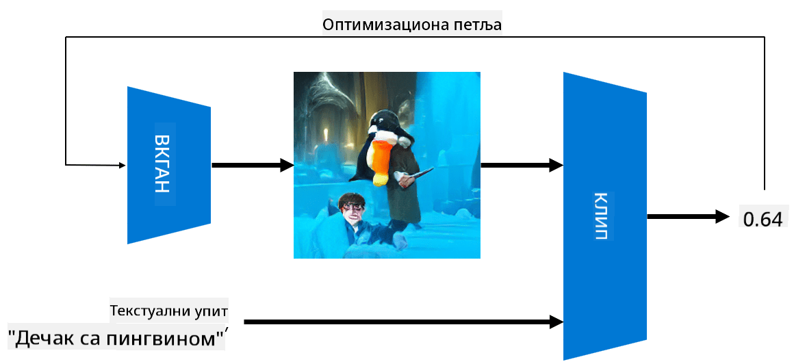

<!--
CO_OP_TRANSLATOR_METADATA:
{
  "original_hash": "9c592c26aca16ca085d268c732284187",
  "translation_date": "2025-08-25T23:38:50+00:00",
  "source_file": "lessons/X-Extras/X1-MultiModal/README.md",
  "language_code": "sr"
}
-->
# Мултимодалне мреже

Након успеха трансформер модела у решавању задатака обраде природног језика (NLP), исте или сличне архитектуре примењене су и на задатке рачунарског вида. Расте интересовање за изградњу модела који би *комбиновали* могућности визије и природног језика. Један од таквих покушаја је направио OpenAI, а назива се CLIP и DALL.E.

## Контрастивно претходно обучавање слика (CLIP)

Главна идеја CLIP-а је могућност поређења текстуалних упита са сликом и одређивање колико добро слика одговара упиту.

> *Слика из [овог блога](https://openai.com/blog/clip/)*

Модел је обучен на сликама преузетим са интернета и њиховим описима. За сваки пакет, узимамо N парова (слика, текст) и претварамо их у неке векторске репрезентације I, ..., T. Те репрезентације се затим упарују. Функција губитка је дефинисана тако да максимизује косинусну сличност између вектора који одговарају једном пару (нпр. I и T), а минимизује косинусну сличност између свих осталих парова. Због тога се овај приступ назива **контрастивним**.

CLIP модел/библиотека доступан је на [OpenAI GitHub](https://github.com/openai/CLIP). Приступ је описан у [овом блогу](https://openai.com/blog/clip/), а детаљније у [овом раду](https://arxiv.org/pdf/2103.00020.pdf).

Када је овај модел претходно обучен, можемо му дати пакет слика и пакет текстуалних упита, а он ће вратити тензор са вероватноћама. CLIP се може користити за неколико задатака:

**Класификација слика**

Претпоставимо да треба да класификујемо слике, рецимо, између мачака, паса и људи. У том случају, можемо моделу дати слику и низ текстуалних упита: "*слика мачке*", "*слика пса*", "*слика човека*". У резултујућем вектору од 3 вероватноће само треба изабрати индекс са највишом вредношћу.

> *Слика из [овог блога](https://openai.com/blog/clip/)*

**Претрага слика на основу текста**

Можемо урадити и супротно. Ако имамо колекцију слика, можемо ту колекцију проследити моделу, заједно са текстуалним упитом - ово ће нам дати слику која је најсличнија датом упиту.

## ✍️ Пример: [Коришћење CLIP-а за класификацију слика и претрагу слика](../../../../../lessons/X-Extras/X1-MultiModal/Clip.ipynb)

Отворите [Clip.ipynb](../../../../../lessons/X-Extras/X1-MultiModal/Clip.ipynb) бележницу да видите CLIP у акцији.

## Генерисање слика са VQGAN+CLIP

CLIP се такође може користити за **генерисање слика** на основу текстуалног упита. Да бисмо то урадили, потребан нам је **генеративни модел** који ће моћи да генерише слике на основу неког векторског уноса. Један од таквих модела назива се [VQGAN](https://compvis.github.io/taming-transformers/) (Vector-Quantized GAN).

Главне идеје VQGAN-а које га разликују од обичних [GAN](../../4-ComputerVision/10-GANs/README.md) су следеће:
* Коришћење ауторегресивне трансформер архитектуре за генерисање секвенце визуелних делова богатих контекстом који чине слику. Ти визуелни делови се уче помоћу [CNN](../../4-ComputerVision/07-ConvNets/README.md).
* Коришћење дискриминатора за подслике који открива да ли су делови слике "стварни" или "лажни" (за разлику од "све-или-ништа" приступа у традиционалним GAN-овима).

Сазнајте више о VQGAN-у на веб сајту [Taming Transformers](https://compvis.github.io/taming-transformers/).

Једна од важних разлика између VQGAN-а и традиционалног GAN-а је та што други може произвести пристојну слику из било ког улазног вектора, док VQGAN вероватно производи слику која није кохерентна. Због тога је потребно додатно усмеравати процес креирања слике, а то се може урадити помоћу CLIP-а.

Да бисмо генерисали слику која одговара текстуалном упиту, почињемо са неким насумичним вектором кодирања који се прослеђује кроз VQGAN да би се произвела слика. Затим се CLIP користи за креирање функције губитка која показује колико добро слика одговара текстуалном упиту. Циљ је затим минимизовати овај губитак, користећи уназадно ширење да би се прилагодили параметри улазног вектора.

Одлична библиотека која имплементира VQGAN+CLIP је [Pixray](http://github.com/pixray/pixray).

 |   | 
----|----|----
Слика генерисана на основу упита *акварелски портрет младог мушког професора књижевности са књигом* | Слика генерисана на основу упита *уљани портрет младе женске професорке рачунарских наука са рачунаром* | Слика генерисана на основу упита *уљани портрет старог мушког професора математике испред табле*

> Слике из колекције **Вештачки професори** аутора [Дмитрија Сошњикова](http://soshnikov.com)

## DALL-E
### [DALL-E 1](https://openai.com/research/dall-e)
DALL-E је верзија GPT-3 обучена за генерисање слика на основу упита. Обучен је са 12 милијарди параметара.

За разлику од CLIP-а, DALL-E прима и текст и слику као јединствен ток токена за обе врсте података. Стога, из више упита, можете генерисати слике на основу текста.

### [DALL-E 2](https://openai.com/dall-e-2)
Главна разлика између DALL-E 1 и 2 је у томе што други генерише реалистичније слике и уметничка дела.

Примери генерисања слика са DALL-E:
 |   | 
----|----|----
Слика генерисана на основу упита *акварелски портрет младог мушког професора књижевности са књигом* | Слика генерисана на основу упита *уљани портрет младе женске професорке рачунарских наука са рачунаром* | Слика генерисана на основу упита *уљани портрет старог мушког професора математике испред табле*

## Референце

* Рад о VQGAN-у: [Taming Transformers for High-Resolution Image Synthesis](https://compvis.github.io/taming-transformers/paper/paper.pdf)
* Рад о CLIP-у: [Learning Transferable Visual Models From Natural Language Supervision](https://arxiv.org/pdf/2103.00020.pdf)

**Одрицање од одговорности**:  
Овај документ је преведен коришћењем услуге за превођење помоћу вештачке интелигенције [Co-op Translator](https://github.com/Azure/co-op-translator). Иако се трудимо да обезбедимо тачност, молимо вас да имате у виду да аутоматски преводи могу садржати грешке или нетачности. Оригинални документ на његовом изворном језику треба сматрати меродавним извором. За критичне информације препоручује се професионални превод од стране људи. Не преузимамо одговорност за било каква погрешна тумачења или неспоразуме који могу настати услед коришћења овог превода.