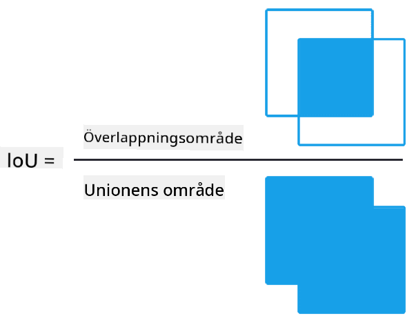
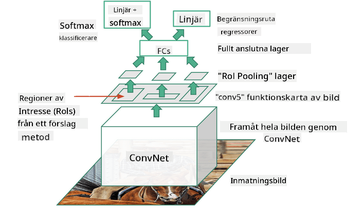
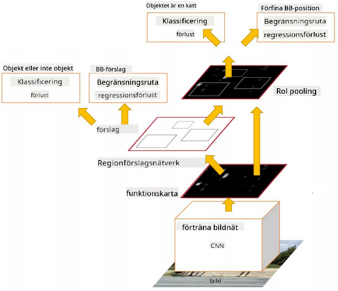

<!--
CO_OP_TRANSLATOR_METADATA:
{
  "original_hash": "d85c8b08f6d1b48fd7f35b99f93c1138",
  "translation_date": "2025-08-28T15:20:29+00:00",
  "source_file": "lessons/4-ComputerVision/11-ObjectDetection/README.md",
  "language_code": "sv"
}
-->
# Objektigenkänning

De bildklassificeringsmodeller vi har arbetat med hittills tog en bild och producerade ett kategoriskt resultat, som klassen 'nummer' i ett MNIST-problem. Men i många fall vill vi inte bara veta att en bild föreställer objekt – vi vill kunna bestämma deras exakta position. Det är precis detta som är syftet med **objektigenkänning**.

## [Förquiz före föreläsning](https://red-field-0a6ddfd03.1.azurestaticapps.net/quiz/111)

> Bild från [YOLO v2-webbplats](https://pjreddie.com/darknet/yolov2/)

## Ett naivt tillvägagångssätt för objektigenkänning

Anta att vi ville hitta en katt på en bild. Ett mycket naivt tillvägagångssätt för objektigenkänning skulle vara följande:

1. Dela upp bilden i ett antal rutor.
2. Kör bildklassificering på varje ruta.
3. De rutor som ger tillräckligt hög aktivering kan anses innehålla det aktuella objektet.

> *Bild från [övningsanteckningsboken](ObjectDetection-TF.ipynb)*

Detta tillvägagångssätt är dock långt ifrån idealiskt, eftersom det bara tillåter algoritmen att lokalisera objektets begränsningsruta mycket oprecist. För att få en mer exakt position behöver vi köra någon form av **regression** för att förutsäga koordinaterna för begränsningsrutorna – och för det behöver vi specifika dataset.

## Regression för objektigenkänning

[Detta blogginlägg](https://towardsdatascience.com/object-detection-with-neural-networks-a4e2c46b4491) ger en bra introduktion till att upptäcka former.

## Dataset för objektigenkänning

Du kan stöta på följande dataset för denna uppgift:

* [PASCAL VOC](http://host.robots.ox.ac.uk/pascal/VOC/) – 20 klasser
* [COCO](http://cocodataset.org/#home) – Common Objects in Context. 80 klasser, begränsningsrutor och segmenteringsmasker

## Mätvärden för objektigenkänning

### Intersection over Union

För bildklassificering är det enkelt att mäta hur väl algoritmen presterar, men för objektigenkänning måste vi mäta både korrektheten av klassen och precisionen i den förutsagda begränsningsrutans position. För det senare använder vi den så kallade **Intersection over Union** (IoU), som mäter hur väl två rutor (eller två godtyckliga områden) överlappar.

> *Figur 2 från [detta utmärkta blogginlägg om IoU](https://pyimagesearch.com/2016/11/07/intersection-over-union-iou-for-object-detection/)*

Idén är enkel – vi delar området för överlappningen mellan två figurer med området för deras union. För två identiska områden skulle IoU vara 1, medan för helt åtskilda områden blir det 0. Annars varierar det mellan 0 och 1. Vi betraktar vanligtvis endast de begränsningsrutor där IoU är över ett visst värde.

### Genomsnittlig precision

Anta att vi vill mäta hur väl en viss klass av objekt $C$ känns igen. För att mäta detta använder vi mätvärdet **Genomsnittlig precision** (Average Precision, AP), som beräknas enligt följande:

1. Betrakta Precision-Recall-kurvan som visar noggrannheten beroende på ett detektionströskelvärde (från 0 till 1).
2. Beroende på tröskeln kommer vi att få fler eller färre objekt upptäckta i bilden och olika värden för precision och recall.
3. Kurvan kommer att se ut så här:

> *Bild från [NeuroWorkshop](http://github.com/shwars/NeuroWorkshop)*

Den genomsnittliga precisionen för en given klass $C$ är arean under denna kurva. Mer exakt delas Recall-axeln vanligtvis in i 10 delar, och Precision medelvärdesbildas över alla dessa punkter:

$$
AP = {1\over11}\sum_{i=0}^{10}\mbox{Precision}(\mbox{Recall}={i\over10})
$$

### AP och IoU

Vi betraktar endast de detektioner där IoU är över ett visst värde. Till exempel antas vanligtvis $\mbox{IoU Threshold} = 0.5$ i PASCAL VOC-datasetet, medan AP i COCO mäts för olika värden av $\mbox{IoU Threshold}$.

> *Bild från [NeuroWorkshop](http://github.com/shwars/NeuroWorkshop)*

### Medelvärde av genomsnittlig precision – mAP

Det huvudsakliga mätvärdet för objektigenkänning kallas **Medelvärde av genomsnittlig precision**, eller **mAP**. Det är värdet av genomsnittlig precision, medelvärdesbildat över alla objektklasser och ibland även över $\mbox{IoU Threshold}$. Processen för att beräkna **mAP** beskrivs mer detaljerat
[i detta blogginlägg](https://medium.com/@timothycarlen/understanding-the-map-evaluation-metric-for-object-detection-a07fe6962cf3)) och även [här med kodexempel](https://gist.github.com/tarlen5/008809c3decf19313de216b9208f3734).

## Olika tillvägagångssätt för objektigenkänning

Det finns två breda klasser av algoritmer för objektigenkänning:

* **Region Proposal Networks** (R-CNN, Fast R-CNN, Faster R-CNN). Huvudidén är att generera **Regions of Interest** (ROI) och köra CNN över dem för att leta efter maximal aktivering. Det liknar det naiva tillvägagångssättet, med undantaget att ROI genereras på ett mer intelligent sätt. En av de stora nackdelarna med sådana metoder är att de är långsamma, eftersom vi behöver många passeringar av CNN-klassificeraren över bilden.
* **En-pass** (YOLO, SSD, RetinaNet) metoder. I dessa arkitekturer designar vi nätverket för att förutsäga både klasser och ROI i ett enda pass.

### R-CNN: Regionbaserad CNN

[R-CNN](http://islab.ulsan.ac.kr/files/announcement/513/rcnn_pami.pdf) använder [Selective Search](http://www.huppelen.nl/publications/selectiveSearchDraft.pdf) för att generera en hierarkisk struktur av ROI-regioner, som sedan skickas genom CNN-funktionsutdragare och SVM-klassificerare för att bestämma objektklassen, och linjär regression för att bestämma *begränsningsrutans* koordinater. [Officiell artikel](https://arxiv.org/pdf/1506.01497v1.pdf)

> *Bild från van de Sande et al. ICCV’11*

> *Bilder från [denna blogg](https://towardsdatascience.com/r-cnn-fast-r-cnn-faster-r-cnn-yolo-object-detection-algorithms-36d53571365e)*

### F-RCNN – Fast R-CNN

Detta tillvägagångssätt liknar R-CNN, men regioner definieras efter att konvolutionslager har applicerats.

> Bild från [den officiella artikeln](https://www.cv-foundation.org/openaccess/content_iccv_2015/papers/Girshick_Fast_R-CNN_ICCV_2015_paper.pdf), [arXiv](https://arxiv.org/pdf/1504.08083.pdf), 2015

### Faster R-CNN

Huvudidén med detta tillvägagångssätt är att använda ett neuralt nätverk för att förutsäga ROI – så kallat *Region Proposal Network*. [Artikel](https://arxiv.org/pdf/1506.01497.pdf), 2016

> Bild från [den officiella artikeln](https://arxiv.org/pdf/1506.01497.pdf)

### R-FCN: Regionbaserat fullt konvolutionellt nätverk

Denna algoritm är ännu snabbare än Faster R-CNN. Huvudidén är följande:

1. Vi extraherar funktioner med hjälp av ResNet-101.
2. Funktionerna bearbetas av **Position-Sensitive Score Map**. Varje objekt från $C$ klasser delas in i $k\times k$ regioner, och vi tränar för att förutsäga delar av objekt.
3. För varje del från $k\times k$ regioner röstar alla nätverk för objektklasser, och den objektklass med flest röster väljs.

> Bild från [officiell artikel](https://arxiv.org/abs/1605.06409)

### YOLO – You Only Look Once

YOLO är en realtidsalgoritm med ett enda pass. Huvudidén är följande:

 * Bilden delas in i $S\times S$ regioner.
 * För varje region förutsäger **CNN** $n$ möjliga objekt, *begränsningsrutans* koordinater och *confidence*=*sannolikhet* * IoU.

 

> Bild från [officiell artikel](https://arxiv.org/abs/1506.02640)

### Andra algoritmer

* RetinaNet: [officiell artikel](https://arxiv.org/abs/1708.02002)
   - [PyTorch-implementation i Torchvision](https://pytorch.org/vision/stable/_modules/torchvision/models/detection/retinanet.html)
   - [Keras-implementation](https://github.com/fizyr/keras-retinanet)
   - [Objektigenkänning med RetinaNet](https://keras.io/examples/vision/retinanet/) i Keras-exempel
* SSD (Single Shot Detector): [officiell artikel](https://arxiv.org/abs/1512.02325)

## ✍️ Övningar: Objektigenkänning

Fortsätt ditt lärande i följande anteckningsbok:

[ObjectDetection.ipynb](ObjectDetection.ipynb)

## Slutsats

I denna lektion fick du en snabb genomgång av alla olika sätt som objektigenkänning kan utföras på!

## 🚀 Utmaning

Läs igenom dessa artiklar och anteckningsböcker om YOLO och prova dem själv:

* [Bra blogginlägg](https://www.analyticsvidhya.com/blog/2018/12/practical-guide-object-detection-yolo-framewor-python/) som beskriver YOLO
 * [Officiell webbplats](https://pjreddie.com/darknet/yolo/)
 * Yolo: [Keras-implementation](https://github.com/experiencor/keras-yolo2), [steg-för-steg-anteckningsbok](https://github.com/experiencor/basic-yolo-keras/blob/master/Yolo%20Step-by-Step.ipynb)
 * Yolo v2: [Keras-implementation](https://github.com/experiencor/keras-yolo2), [steg-för-steg-anteckningsbok](https://github.com/experiencor/keras-yolo2/blob/master/Yolo%20Step-by-Step.ipynb)

## [Efterquiz efter föreläsning](https://red-field-0a6ddfd03.1.azurestaticapps.net/quiz/211)

## Granskning och självstudier

* [Objektigenkänning](https://tjmachinelearning.com/lectures/1718/obj/) av Nikhil Sardana
* [En bra jämförelse av algoritmer för objektigenkänning](https://lilianweng.github.io/lil-log/2018/12/27/object-detection-part-4.html)
* [Granskning av djupinlärningsalgoritmer för objektigenkänning](https://medium.com/comet-app/review-of-deep-learning-algorithms-for-object-detection-c1f3d437b852)
* [En steg-för-steg-introduktion till grundläggande algoritmer för objektigenkänning](https://www.analyticsvidhya.com/blog/2018/10/a-step-by-step-introduction-to-the-basic-object-detection-algorithms-part-1/)
* [Implementation av Faster R-CNN i Python för objektigenkänning](https://www.analyticsvidhya.com/blog/2018/11/implementation-faster-r-cnn-python-object-detection/)

## [Uppgift: Objektigenkänning](lab/README.md)

---

**Ansvarsfriskrivning**:  
Detta dokument har översatts med hjälp av AI-översättningstjänsten [Co-op Translator](https://github.com/Azure/co-op-translator). Även om vi strävar efter noggrannhet, bör det noteras att automatiserade översättningar kan innehålla fel eller brister. Det ursprungliga dokumentet på dess originalspråk bör betraktas som den auktoritativa källan. För kritisk information rekommenderas professionell mänsklig översättning. Vi ansvarar inte för eventuella missförstånd eller feltolkningar som uppstår vid användning av denna översättning.