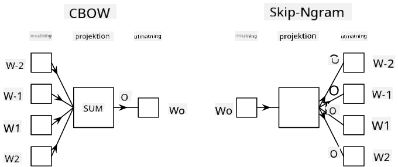

<!--
CO_OP_TRANSLATOR_METADATA:
{
  "original_hash": "31b46ba1f3aa78578134d4829f88be53",
  "translation_date": "2025-08-28T15:53:15+00:00",
  "source_file": "lessons/5-NLP/15-LanguageModeling/README.md",
  "language_code": "sv"
}
-->
# Språkmodellering

Semantiska inbäddningar, såsom Word2Vec och GloVe, är faktiskt ett första steg mot **språkmodellering** – att skapa modeller som på något sätt *förstår* (eller *representerar*) språkets natur.

## [Förtest-quiz](https://ff-quizzes.netlify.app/en/ai/quiz/29)

Huvudidén bakom språkmodellering är att träna modeller på oetiketterade dataset på ett oövervakat sätt. Detta är viktigt eftersom vi har enorma mängder oetiketterad text tillgänglig, medan mängden etiketterad text alltid skulle vara begränsad av den tid och ansträngning vi kan lägga på att skapa etiketter. Oftast kan vi bygga språkmodeller som kan **förutsäga saknade ord** i texten, eftersom det är enkelt att maskera ett slumpmässigt ord i texten och använda det som ett träningsprov.

## Träning av inbäddningar

I våra tidigare exempel använde vi förtränade semantiska inbäddningar, men det är intressant att se hur dessa inbäddningar kan tränas. Det finns flera möjliga idéer som kan användas:

* **N-Gram** språkmodellering, där vi förutsäger en token genom att titta på N föregående tokens (N-gram).
* **Continuous Bag-of-Words** (CBoW), där vi förutsäger den mittersta token $W_0$ i en sekvens av tokens $W_{-N}$, ..., $W_N$.
* **Skip-gram**, där vi förutsäger en uppsättning närliggande tokens {$W_{-N},\dots, W_{-1}, W_1,\dots, W_N$} från den mittersta token $W_0$.

> Bild från [denna artikel](https://arxiv.org/pdf/1301.3781.pdf)

## ✍️ Exempelnotebooks: Träning av CBoW-modell

Fortsätt ditt lärande i följande notebooks:

* [Träning av CBoW Word2Vec med TensorFlow](CBoW-TF.ipynb)
* [Träning av CBoW Word2Vec med PyTorch](CBoW-PyTorch.ipynb)

## Slutsats

I den föregående lektionen såg vi att ordbäddningar fungerar som magi! Nu vet vi att träning av ordbäddningar inte är en särskilt komplex uppgift, och vi bör kunna träna våra egna ordbäddningar för textsamlingar inom specifika domäner om det behövs.

## [Eftertest-quiz](https://ff-quizzes.netlify.app/en/ai/quiz/30)

## Granskning & Självstudier

* [Officiell PyTorch-handledning om språkmodellering](https://pytorch.org/tutorials/beginner/nlp/word_embeddings_tutorial.html).
* [Officiell TensorFlow-handledning om träning av Word2Vec-modell](https://www.TensorFlow.org/tutorials/text/word2vec).
* Användning av **gensim**-ramverket för att träna de mest använda inbäddningarna med några få kodrader beskrivs [i denna dokumentation](https://pytorch.org/tutorials/beginner/nlp/word_embeddings_tutorial.html).

## 🚀 [Uppgift: Träna Skip-Gram-modell](lab/README.md)

I labbet utmanar vi dig att modifiera koden från denna lektion för att träna en skip-gram-modell istället för CBoW. [Läs detaljerna](lab/README.md)

---

**Ansvarsfriskrivning**:  
Detta dokument har översatts med hjälp av AI-översättningstjänsten [Co-op Translator](https://github.com/Azure/co-op-translator). Även om vi strävar efter noggrannhet, bör det noteras att automatiserade översättningar kan innehålla fel eller brister. Det ursprungliga dokumentet på dess originalspråk bör betraktas som den auktoritativa källan. För kritisk information rekommenderas professionell mänsklig översättning. Vi ansvarar inte för eventuella missförstånd eller feltolkningar som kan uppstå vid användning av denna översättning.