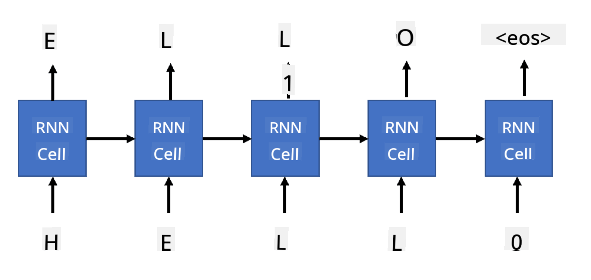

<!--
CO_OP_TRANSLATOR_METADATA:
{
  "original_hash": "d9de7847385eeeda67cfdcce1640ab72",
  "translation_date": "2025-08-28T15:51:51+00:00",
  "source_file": "lessons/5-NLP/17-GenerativeNetworks/README.md",
  "language_code": "sv"
}
-->
# Generativa nätverk

## [Quiz före föreläsningen](https://red-field-0a6ddfd03.1.azurestaticapps.net/quiz/117)

Recurrent Neural Networks (RNNs) och deras varianter med grindade celler, såsom Long Short Term Memory Cells (LSTMs) och Gated Recurrent Units (GRUs), erbjuder en mekanism för språkmodellering genom att de kan lära sig ordordning och ge förutsägelser för nästa ord i en sekvens. Detta gör det möjligt att använda RNNs för **generativa uppgifter**, såsom vanlig textgenerering, maskinöversättning och till och med bildbeskrivning.

> ✅ Tänk på alla gånger du har haft nytta av generativa uppgifter, som textkomplettering när du skriver. Gör lite research om dina favoritapplikationer för att se om de använder RNNs.

I RNN-arkitekturen som vi diskuterade i föregående enhet, producerade varje RNN-enhet nästa dolda tillstånd som en utgång. Men vi kan också lägga till en annan utgång till varje återkommande enhet, vilket gör det möjligt att generera en **sekvens** (som är lika lång som den ursprungliga sekvensen). Dessutom kan vi använda RNN-enheter som inte tar emot en inmatning vid varje steg, utan bara tar en initial tillståndsvektor och sedan producerar en sekvens av utgångar.

Detta möjliggör olika neurala arkitekturer som visas i bilden nedan:


> Bild från blogginlägget [Unreasonable Effectiveness of Recurrent Neural Networks](http://karpathy.github.io/2015/05/21/rnn-effectiveness/) av [Andrej Karpaty](http://karpathy.github.io/)

* **Ett-till-ett** är ett traditionellt neuralt nätverk med en inmatning och en utgång.
* **Ett-till-många** är en generativ arkitektur som tar emot ett inmatningsvärde och genererar en sekvens av utgångsvärden. Till exempel, om vi vill träna ett nätverk för **bildbeskrivning** som genererar en textuell beskrivning av en bild, kan vi ta en bild som inmatning, passera den genom en CNN för att få dess dolda tillstånd och sedan låta en återkommande kedja generera beskrivningen ord för ord.
* **Många-till-ett** motsvarar RNN-arkitekturerna vi beskrev i föregående enhet, såsom textklassificering.
* **Många-till-många**, eller **sekvens-till-sekvens**, motsvarar uppgifter som **maskinöversättning**, där vi först låter en RNN samla all information från inmatningssekvensen till det dolda tillståndet, och en annan RNN-kedja vecklar ut detta tillstånd till utgångssekvensen.

I denna enhet kommer vi att fokusera på enkla generativa modeller som hjälper oss att generera text. För enkelhetens skull kommer vi att använda tokenisering på teckennivå.

Vi kommer att träna denna RNN att generera text steg för steg. Vid varje steg tar vi en sekvens av tecken med längden `nchars` och ber nätverket att generera nästa utgångstecken för varje inmatningstecken:



När vi genererar text (under inferens) börjar vi med en **prompt**, som passeras genom RNN-celler för att generera dess mellanliggande tillstånd, och sedan börjar genereringen från detta tillstånd. Vi genererar ett tecken i taget och skickar tillståndet och det genererade tecknet till en annan RNN-cell för att generera nästa, tills vi har genererat tillräckligt många tecken.


> Bild av författaren

## ✍️ Övningar: Generativa nätverk

Fortsätt ditt lärande i följande notebooks:

* [Generativa nätverk med PyTorch](GenerativePyTorch.ipynb)
* [Generativa nätverk med TensorFlow](GenerativeTF.ipynb)

## Mjuk textgenerering och temperatur

Utgången från varje RNN-cell är en sannolikhetsfördelning av tecken. Om vi alltid väljer tecknet med högst sannolikhet som nästa tecken i den genererade texten, kan texten ofta bli "cyklisk" och upprepa samma teckensekvenser om och om igen, som i detta exempel:

```
today of the second the company and a second the company ...
```

Men om vi tittar på sannolikhetsfördelningen för nästa tecken, kan det vara så att skillnaden mellan några av de högsta sannolikheterna inte är stor, t.ex. ett tecken kan ha sannolikheten 0.2, ett annat 0.19, etc. Till exempel, när vi letar efter nästa tecken i sekvensen '*play*', kan nästa tecken lika gärna vara ett mellanslag eller **e** (som i ordet *player*).

Detta leder oss till slutsatsen att det inte alltid är "rättvist" att välja tecknet med högst sannolikhet, eftersom att välja det näst högsta fortfarande kan leda till meningsfull text. Det är klokare att **sampla** tecken från sannolikhetsfördelningen som nätverket ger. Vi kan också använda en parameter, **temperatur**, som jämnar ut sannolikhetsfördelningen om vi vill lägga till mer slumpmässighet, eller göra den brantare om vi vill hålla oss mer till tecken med högst sannolikhet.

Utforska hur denna mjuka textgenerering implementeras i notebooks som är länkade ovan.

## Slutsats

Även om textgenerering kan vara användbar i sig, kommer de största fördelarna från förmågan att generera text med RNNs från en initial funktionsvektor. Till exempel används textgenerering som en del av maskinöversättning (sekvens-till-sekvens, i detta fall används tillståndsvektorn från *encoder* för att generera eller *dekoda* det översatta meddelandet), eller för att generera textuell beskrivning av en bild (i vilket fall funktionsvektorn skulle komma från CNN-extraktorn).

## 🚀 Utmaning

Ta några lektioner på Microsoft Learn om detta ämne:

* Textgenerering med [PyTorch](https://docs.microsoft.com/learn/modules/intro-natural-language-processing-pytorch/6-generative-networks/?WT.mc_id=academic-77998-cacaste)/[TensorFlow](https://docs.microsoft.com/learn/modules/intro-natural-language-processing-tensorflow/5-generative-networks/?WT.mc_id=academic-77998-cacaste)

## [Quiz efter föreläsningen](https://red-field-0a6ddfd03.1.azurestaticapps.net/quiz/217)

## Granskning & Självstudier

Här är några artiklar för att utöka din kunskap:

* Olika metoder för textgenerering med Markov Chain, LSTM och GPT-2: [blogginlägg](https://towardsdatascience.com/text-generation-gpt-2-lstm-markov-chain-9ea371820e1e)
* Exempel på textgenerering i [Keras-dokumentation](https://keras.io/examples/generative/lstm_character_level_text_generation/)

## [Uppgift](lab/README.md)

Vi har sett hur man genererar text tecken för tecken. I labben kommer du att utforska textgenerering på ordnivå.

---

**Ansvarsfriskrivning**:  
Detta dokument har översatts med hjälp av AI-översättningstjänsten [Co-op Translator](https://github.com/Azure/co-op-translator). Även om vi strävar efter noggrannhet, bör det noteras att automatiska översättningar kan innehålla fel eller inexaktheter. Det ursprungliga dokumentet på dess originalspråk bör betraktas som den auktoritativa källan. För kritisk information rekommenderas professionell mänsklig översättning. Vi ansvarar inte för eventuella missförstånd eller feltolkningar som uppstår vid användning av denna översättning.