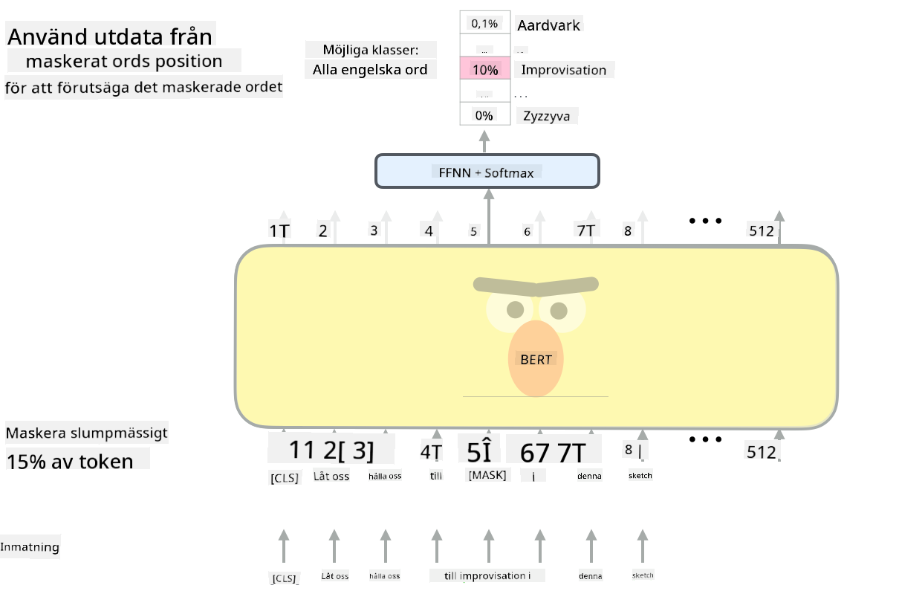

<!--
CO_OP_TRANSLATOR_METADATA:
{
  "original_hash": "f335dfcb4a993920504c387973a36957",
  "translation_date": "2025-09-23T09:23:48+00:00",
  "source_file": "lessons/5-NLP/18-Transformers/README.md",
  "language_code": "sv"
}
-->
# Uppmärksamhetsmekanismer och Transformatorer

## [Quiz före föreläsningen](https://ff-quizzes.netlify.app/en/ai/quiz/35)

Ett av de viktigaste problemen inom NLP-området är **maskinöversättning**, en grundläggande uppgift som ligger till grund för verktyg som Google Translate. I detta avsnitt kommer vi att fokusera på maskinöversättning, eller mer generellt, på alla *sekvens-till-sekvens*-uppgifter (som också kallas **meningstransduktion**).

Med RNNs implementeras sekvens-till-sekvens med två rekurrenta nätverk, där ett nätverk, **kodaren**, komprimerar en inmatningssekvens till ett dolt tillstånd, medan ett annat nätverk, **avkodaren**, vecklar ut detta dolda tillstånd till ett översatt resultat. Det finns ett par problem med detta tillvägagångssätt:

* Det slutliga tillståndet i kodarnätverket har svårt att komma ihåg början av en mening, vilket leder till dålig modellkvalitet för långa meningar.
* Alla ord i en sekvens har samma påverkan på resultatet. I verkligheten har dock specifika ord i inmatningssekvensen ofta större påverkan på sekventiella utgångar än andra.

**Uppmärksamhetsmekanismer** ger ett sätt att vikta den kontextuella påverkan av varje inmatningsvektor på varje utgångsprediktion av RNN. Detta implementeras genom att skapa genvägar mellan mellanliggande tillstånd i inmatnings-RNN och utgångs-RNN. På detta sätt, när vi genererar utgångssymbolen yt, tar vi hänsyn till alla dolda inmatningstillstånd hi, med olika viktkoefficienter &alpha;t,i.

> Kodare-avkodare-modellen med additiv uppmärksamhetsmekanism i [Bahdanau et al., 2015](https://arxiv.org/pdf/1409.0473.pdf), citerad från [denna bloggpost](https://lilianweng.github.io/lil-log/2018/06/24/attention-attention.html)

Uppmärksamhetsmatrisen {&alpha;i,j} representerar graden av påverkan som vissa inmatningsord har på genereringen av ett givet ord i utgångssekvensen. Nedan är ett exempel på en sådan matris:

> Figur från [Bahdanau et al., 2015](https://arxiv.org/pdf/1409.0473.pdf) (Fig.3)

Uppmärksamhetsmekanismer är ansvariga för mycket av den nuvarande eller nära nuvarande topprestandan inom NLP. Att lägga till uppmärksamhet ökar dock kraftigt antalet modellparametrar, vilket ledde till skalningsproblem med RNNs. En viktig begränsning för att skala RNNs är att modellernas rekurrenta natur gör det utmanande att batcha och parallellisera träning. I en RNN måste varje element i en sekvens bearbetas i sekventiell ordning, vilket innebär att det inte kan parallelliseras enkelt.

> Figur från [Googles Blogg](https://research.googleblog.com/2016/09/a-neural-network-for-machine.html)

Adoptionen av uppmärksamhetsmekanismer kombinerat med denna begränsning ledde till skapandet av de nuvarande toppmodellerna för transformatorer som vi känner till och använder idag, såsom BERT och Open-GPT3.

## Transformator-modeller

En av huvudidéerna bakom transformatorer är att undvika den sekventiella naturen hos RNNs och skapa en modell som kan parallelliseras under träning. Detta uppnås genom att implementera två idéer:

* positionskodning
* använda självuppmärksamhetsmekanism för att fånga mönster istället för RNNs (eller CNNs) (därav namnet på artikeln som introducerar transformatorer: *[Attention is all you need](https://arxiv.org/abs/1706.03762)*)

### Positionskodning/Positionsinbäddning

Idén med positionskodning är följande. 
1. När man använder RNNs representeras den relativa positionen för token av antalet steg och behöver därför inte representeras explicit. 
2. När vi däremot byter till uppmärksamhet måste vi veta de relativa positionerna för token inom en sekvens. 
3. För att få positionskodning förstärker vi vår sekvens av token med en sekvens av tokenpositioner i sekvensen (dvs. en sekvens av siffror 0,1, ...).
4. Vi blandar sedan tokenpositionen med en tokeninbäddningsvektor. För att transformera positionen (heltal) till en vektor kan vi använda olika tillvägagångssätt:

* Träningsbar inbäddning, liknande tokeninbäddning. Detta är tillvägagångssättet vi överväger här. Vi applicerar inbäddningslager ovanpå både token och deras positioner, vilket resulterar i inbäddningsvektorer med samma dimensioner, som vi sedan lägger ihop.
* Fast positionskodningsfunktion, som föreslogs i den ursprungliga artikeln.

> Bild av författaren

Resultatet vi får med positionsinbäddning inbäddar både den ursprungliga token och dess position inom en sekvens.

### Multi-Head Självuppmärksamhet

Nästa steg är att fånga vissa mönster inom vår sekvens. För att göra detta använder transformatorer en **självuppmärksamhetsmekanism**, som i grunden är uppmärksamhet applicerad på samma sekvens som inmatning och utgång. Att applicera självuppmärksamhet gör att vi kan ta hänsyn till **kontext** inom meningen och se vilka ord som är relaterade till varandra. Till exempel gör det att vi kan se vilka ord som refereras av korreferenser, såsom *det*, och också ta kontexten i beaktande:

> Bild från [Google Blog](https://research.googleblog.com/2017/08/transformer-novel-neural-network.html)

I transformatorer använder vi **Multi-Head Attention** för att ge nätverket kraften att fånga flera olika typer av beroenden, t.ex. långsiktiga kontra kortsiktiga ordrelationer, korreferens kontra något annat, etc.

[TensorFlow Notebook](TransformersTF.ipynb) innehåller fler detaljer om implementeringen av transformatorlager.

### Kodare-Avkodare Uppmärksamhet

I transformatorer används uppmärksamhet på två ställen:

* För att fånga mönster inom inmatningstexten med hjälp av självuppmärksamhet.
* För att utföra sekvensöversättning - det är uppmärksamhetslagret mellan kodaren och avkodaren.

Kodare-avkodare-uppmärksamhet är mycket lik den uppmärksamhetsmekanism som används i RNNs, som beskrivs i början av detta avsnitt. Denna animerade diagram förklarar rollen av kodare-avkodare-uppmärksamhet.

Eftersom varje inmatningsposition mappas oberoende till varje utgångsposition kan transformatorer parallellisera bättre än RNNs, vilket möjliggör mycket större och mer uttrycksfulla språkmodeller. Varje uppmärksamhetshuvud kan användas för att lära sig olika relationer mellan ord som förbättrar nedströmsuppgifter inom naturlig språkbehandling.

## BERT

**BERT** (Bidirectional Encoder Representations from Transformers) är ett mycket stort flerskikts transformatornätverk med 12 lager för *BERT-base* och 24 för *BERT-large*. Modellen förtränas först på en stor textkorpus (Wikipedia + böcker) med hjälp av oövervakad träning (förutsäga maskerade ord i en mening). Under förträningen absorberar modellen betydande nivåer av språkförståelse som sedan kan utnyttjas med andra dataset genom finjustering. Denna process kallas **transfer learning**.

> Bild [källa](http://jalammar.github.io/illustrated-bert/)

## ✍️ Övningar: Transformatorer

Fortsätt ditt lärande i följande notebooks:

* [Transformatorer i PyTorch](TransformersPyTorch.ipynb)
* [Transformatorer i TensorFlow](TransformersTF.ipynb)

## Slutsats

I denna lektion lärde du dig om transformatorer och uppmärksamhetsmekanismer, alla viktiga verktyg i NLP-verktygslådan. Det finns många variationer av transformatorarkitekturer, inklusive BERT, DistilBERT, BigBird, OpenGPT3 och fler som kan finjusteras. [HuggingFace-paketet](https://github.com/huggingface/) tillhandahåller ett arkiv för att träna många av dessa arkitekturer med både PyTorch och TensorFlow.

## 🚀 Utmaning

## [Quiz efter föreläsningen](https://ff-quizzes.netlify.app/en/ai/quiz/36)

## Granskning & Självstudier

* [Bloggpost](https://mchromiak.github.io/articles/2017/Sep/12/Transformer-Attention-is-all-you-need/), som förklarar den klassiska [Attention is all you need](https://arxiv.org/abs/1706.03762)-artikeln om transformatorer.
* [En serie bloggposter](https://towardsdatascience.com/transformers-explained-visually-part-1-overview-of-functionality-95a6dd460452) om transformatorer, som förklarar arkitekturen i detalj.

## [Uppgift](assignment.md)

---

