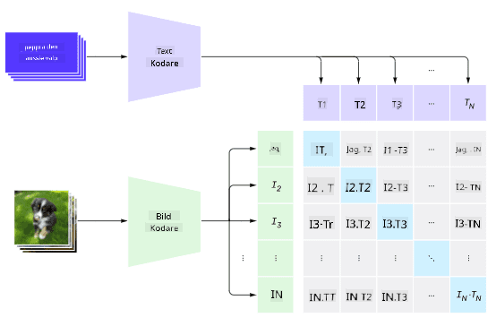
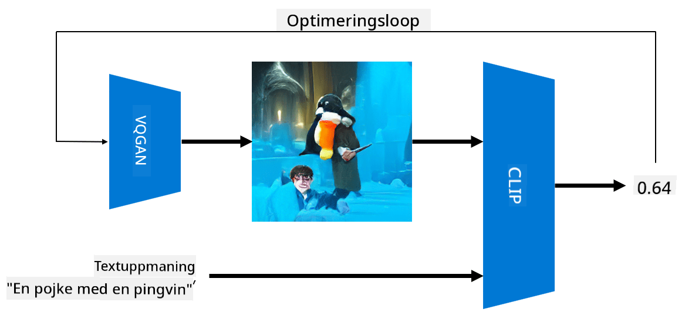

<!--
CO_OP_TRANSLATOR_METADATA:
{
  "original_hash": "9c592c26aca16ca085d268c732284187",
  "translation_date": "2025-08-28T15:10:16+00:00",
  "source_file": "lessons/X-Extras/X1-MultiModal/README.md",
  "language_code": "sv"
}
-->
# Multi-Modala Nätverk

Efter framgången med transformer-modeller för att lösa NLP-uppgifter har samma eller liknande arkitekturer tillämpats på datorseende-uppgifter. Det finns ett växande intresse för att bygga modeller som kan *kombinera* vision och naturligt språk. Ett av dessa försök gjordes av OpenAI och kallas CLIP och DALL.E.

## Contrastive Image Pre-Training (CLIP)

Huvudidén med CLIP är att kunna jämföra textprompter med en bild och avgöra hur väl bilden motsvarar prompten.

> *Bild från [detta blogginlägg](https://openai.com/blog/clip/)*

Modellen tränas på bilder hämtade från internet och deras bildtexter. För varje batch tar vi N par av (bild, text) och konverterar dem till vissa vektorrepresentationer I, ..., T. Dessa representationer matchas sedan ihop. Förlustfunktionen är definierad för att maximera cosinuslikheten mellan vektorer som motsvarar ett par (t.ex. I och T) och minimera cosinuslikheten mellan alla andra par. Det är därför denna metod kallas **kontrastiv**.

CLIP-modellen/biblioteket finns tillgängligt på [OpenAIs GitHub](https://github.com/openai/CLIP). Metoden beskrivs i [detta blogginlägg](https://openai.com/blog/clip/) och mer detaljerat i [denna artikel](https://arxiv.org/pdf/2103.00020.pdf).

När denna modell är förtränad kan vi ge den en batch av bilder och en batch av textprompter, och den kommer att returnera en tensor med sannolikheter. CLIP kan användas för flera uppgifter:

**Bildklassificering**

Anta att vi behöver klassificera bilder mellan exempelvis katter, hundar och människor. I detta fall kan vi ge modellen en bild och en serie textprompter: "*en bild av en katt*", "*en bild av en hund*", "*en bild av en människa*". I den resulterande vektorn med tre sannolikheter behöver vi bara välja indexet med högst värde.

> *Bild från [detta blogginlägg](https://openai.com/blog/clip/)*

**Textbaserad bildsökning**

Vi kan också göra det motsatta. Om vi har en samling bilder kan vi skicka denna samling till modellen och en textprompt – detta ger oss den bild som är mest lik en given prompt.

## ✍️ Exempel: [Använda CLIP för bildklassificering och bildsökning](Clip.ipynb)

Öppna [Clip.ipynb](Clip.ipynb)-notebooken för att se CLIP i praktiken.

## Bildgenerering med VQGAN+CLIP

CLIP kan också användas för **bildgenerering** från en textprompt. För att göra detta behöver vi en **generatormodell** som kan generera bilder baserat på någon vektorinput. En sådan modell kallas [VQGAN](https://compvis.github.io/taming-transformers/) (Vector-Quantized GAN).

Huvudidéerna med VQGAN som skiljer den från vanliga [GAN](../../4-ComputerVision/10-GANs/README.md) är följande:
* Användning av en autoregressiv transformerarkitektur för att generera en sekvens av kontext-rika visuella delar som utgör bilden. Dessa visuella delar lärs i sin tur av [CNN](../../4-ComputerVision/07-ConvNets/README.md).
* Användning av en subbild-diskriminator som avgör om delar av bilden är "äkta" eller "falska" (till skillnad från "allt-eller-inget"-metoden i traditionella GAN).

Lär dig mer om VQGAN på [Taming Transformers](https://compvis.github.io/taming-transformers/) webbplats.

En viktig skillnad mellan VQGAN och traditionella GAN är att den senare kan producera en hyfsad bild från vilken inputvektor som helst, medan VQGAN sannolikt kommer att producera en bild som inte är sammanhängande. Därför behöver vi ytterligare vägleda bildskapandeprocessen, och det kan göras med hjälp av CLIP.

För att generera en bild som motsvarar en textprompt börjar vi med någon slumpmässig kodningsvektor som skickas genom VQGAN för att producera en bild. Sedan används CLIP för att skapa en förlustfunktion som visar hur väl bilden motsvarar textprompten. Målet är sedan att minimera denna förlust genom att använda backpropagation för att justera parametrarna för inputvektorn.

Ett utmärkt bibliotek som implementerar VQGAN+CLIP är [Pixray](http://github.com/pixray/pixray).

 |   | 
----|----|----
Bild genererad från prompten *en närbild akvarellporträtt av en ung manlig litteraturlärare med en bok* | Bild genererad från prompten *en närbild oljeporträtt av en ung kvinnlig datavetenskapslärare med en dator* | Bild genererad från prompten *en närbild oljeporträtt av en äldre manlig matematiklärare framför en svart tavla*

> Bilder från **Artificial Teachers**-kollektionen av [Dmitry Soshnikov](http://soshnikov.com)

## DALL-E
### [DALL-E 1](https://openai.com/research/dall-e)
DALL-E är en version av GPT-3 som tränats för att generera bilder från prompter. Den har tränats med 12 miljarder parametrar.

Till skillnad från CLIP tar DALL-E emot både text och bild som en enda ström av tokens för både bilder och text. Därför kan du från flera prompter generera bilder baserat på texten.

### [DALL-E 2](https://openai.com/dall-e-2)
Den huvudsakliga skillnaden mellan DALL.E 1 och 2 är att den senare genererar mer realistiska bilder och konst.

Exempel på bildgenerering med DALL-E:
 |   | 
----|----|----
Bild genererad från prompten *en närbild akvarellporträtt av en ung manlig litteraturlärare med en bok* | Bild genererad från prompten *en närbild oljeporträtt av en ung kvinnlig datavetenskapslärare med en dator* | Bild genererad från prompten *en närbild oljeporträtt av en äldre manlig matematiklärare framför en svart tavla*

## Referenser

* VQGAN-artikel: [Taming Transformers for High-Resolution Image Synthesis](https://compvis.github.io/taming-transformers/paper/paper.pdf)
* CLIP-artikel: [Learning Transferable Visual Models From Natural Language Supervision](https://arxiv.org/pdf/2103.00020.pdf)

---

**Ansvarsfriskrivning**:  
Detta dokument har översatts med hjälp av AI-översättningstjänsten [Co-op Translator](https://github.com/Azure/co-op-translator). Även om vi strävar efter noggrannhet, bör du vara medveten om att automatiserade översättningar kan innehålla fel eller felaktigheter. Det ursprungliga dokumentet på dess ursprungliga språk bör betraktas som den auktoritativa källan. För kritisk information rekommenderas professionell mänsklig översättning. Vi ansvarar inte för eventuella missförstånd eller feltolkningar som uppstår vid användning av denna översättning.