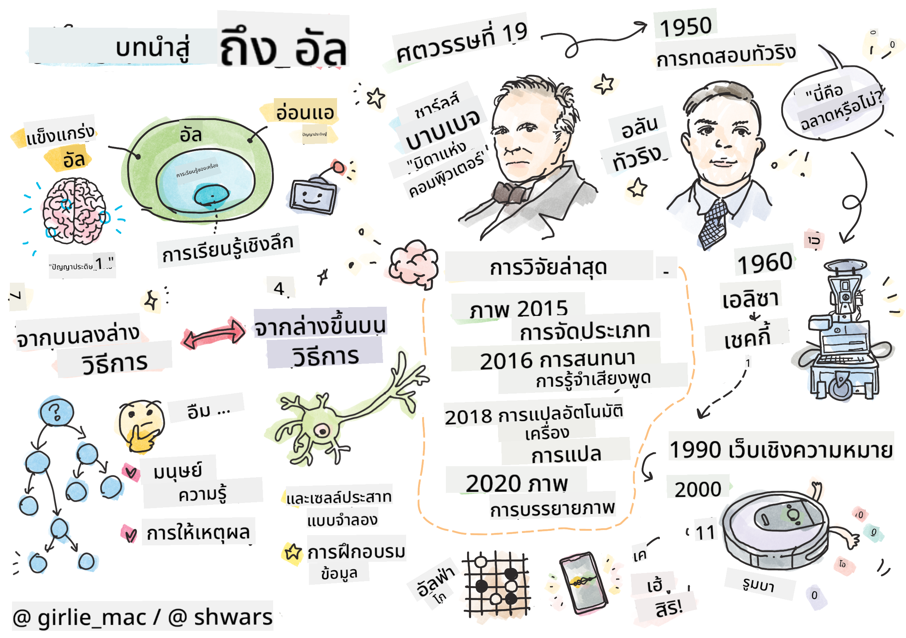
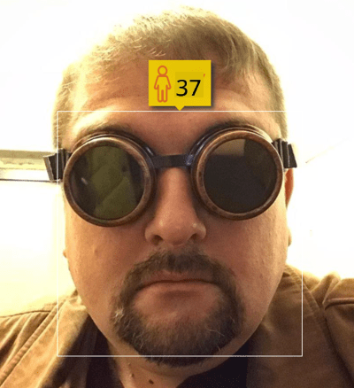
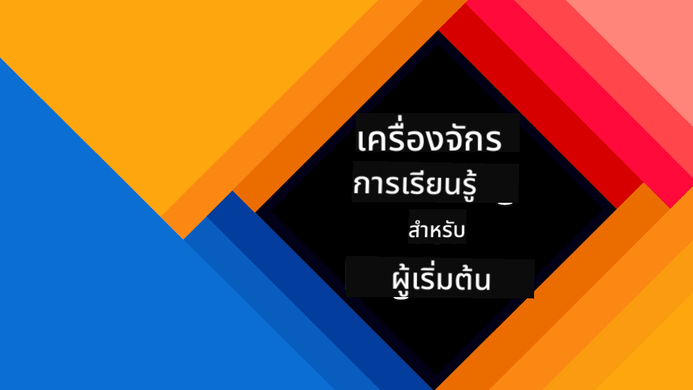

<!--
CO_OP_TRANSLATOR_METADATA:
{
  "original_hash": "06ca1b0138e65b964481ae83275b270e",
  "translation_date": "2025-10-03T08:17:36+00:00",
  "source_file": "lessons/1-Intro/README.md",
  "language_code": "th"
}
-->
# บทนำสู่ปัญญาประดิษฐ์

> ภาพวาดโดย [Tomomi Imura](https://twitter.com/girlie_mac)

## [แบบทดสอบก่อนเรียน](https://ff-quizzes.netlify.app/en/ai/quiz/1)

**ปัญญาประดิษฐ์** เป็นสาขาวิทยาศาสตร์ที่น่าตื่นเต้นที่ศึกษาว่าเราจะทำให้คอมพิวเตอร์แสดงพฤติกรรมที่ชาญฉลาดได้อย่างไร เช่น การทำสิ่งที่มนุษย์ถนัด

เดิมทีคอมพิวเตอร์ถูกคิดค้นโดย [Charles Babbage](https://en.wikipedia.org/wiki/Charles_Babbage) เพื่อทำงานกับตัวเลขตามขั้นตอนที่กำหนดไว้อย่างชัดเจน หรือที่เรียกว่าอัลกอริทึม แม้ว่าคอมพิวเตอร์สมัยใหม่จะก้าวหน้ากว่ารุ่นต้นแบบในศตวรรษที่ 19 อย่างมาก แต่ก็ยังคงยึดหลักการคำนวณที่ควบคุมได้เหมือนเดิม ดังนั้นจึงเป็นไปได้ที่จะเขียนโปรแกรมให้คอมพิวเตอร์ทำบางสิ่งได้ หากเรารู้ลำดับขั้นตอนที่แน่นอนที่ต้องทำเพื่อให้บรรลุเป้าหมาย

> ภาพถ่ายโดย [Vickie Soshnikova](http://twitter.com/vickievalerie)

> ✅ การกำหนดอายุของบุคคลจากภาพถ่ายเป็นงานที่ไม่สามารถเขียนโปรแกรมได้อย่างชัดเจน เพราะเราไม่รู้ว่าทำไมเราถึงคิดตัวเลขในหัวเมื่อเราทำสิ่งนี้

---

อย่างไรก็ตาม มีบางงานที่เราไม่รู้วิธีแก้ปัญหาอย่างชัดเจน ลองพิจารณาการกำหนดอายุของบุคคลจากภาพถ่าย เราเรียนรู้ที่จะทำสิ่งนี้ได้เพราะเราเคยเห็นตัวอย่างของคนในวัยต่าง ๆ มาก่อน แต่เราไม่สามารถอธิบายได้อย่างชัดเจนว่าเราทำได้อย่างไร และไม่สามารถเขียนโปรแกรมให้คอมพิวเตอร์ทำได้ นี่คืองานประเภทที่ **ปัญญาประดิษฐ์** (หรือเรียกสั้น ๆ ว่า AI) ให้ความสนใจ

✅ ลองคิดถึงงานบางอย่างที่คุณสามารถมอบหมายให้คอมพิวเตอร์ทำได้โดยใช้ AI พิจารณาด้านการเงิน การแพทย์ และศิลปะ - ปัจจุบัน AI ช่วยพัฒนาสาขาเหล่านี้อย่างไรบ้าง?

## AI แบบอ่อน (Weak AI) กับ AI แบบแข็ง (Strong AI)

Weak AI | Strong AI
---------------------------------------|-------------------------------------
AI แบบอ่อนหมายถึงระบบ AI ที่ถูกออกแบบและฝึกฝนมาเพื่อทำงานเฉพาะหรือชุดงานที่แคบ | AI แบบแข็ง หรือที่เรียกว่า Artificial General Intelligence (AGI) หมายถึงระบบ AI ที่มีความฉลาดและความเข้าใจในระดับมนุษย์
ระบบ AI เหล่านี้ไม่ได้มีความฉลาดทั่วไป แต่เก่งในงานที่กำหนดไว้ล่วงหน้าและขาดความเข้าใจหรือจิตสำนึกที่แท้จริง | ระบบ AI เหล่านี้สามารถทำงานทางปัญญาใด ๆ ที่มนุษย์สามารถทำได้ ปรับตัวในโดเมนต่าง ๆ และมีรูปแบบของจิตสำนึกหรือการตระหนักรู้ในตัวเอง
ตัวอย่างของ AI แบบอ่อน ได้แก่ ผู้ช่วยเสมือนอย่าง Siri หรือ Alexa อัลกอริทึมแนะนำที่ใช้ในบริการสตรีมมิ่ง และแชทบอทที่ออกแบบมาเพื่อการบริการลูกค้าเฉพาะทาง | การบรรลุ AI แบบแข็งเป็นเป้าหมายระยะยาวของการวิจัย AI และต้องการการพัฒนาระบบ AI ที่สามารถให้เหตุผล เรียนรู้ เข้าใจ และปรับตัวในงานและบริบทที่หลากหลาย
AI แบบอ่อนมีความเชี่ยวชาญสูงและไม่มีความสามารถทางปัญญาแบบมนุษย์หรือการแก้ปัญหาแบบทั่วไปนอกเหนือจากโดเมนที่แคบ | AI แบบแข็งในปัจจุบันยังเป็นแนวคิดเชิงทฤษฎี และยังไม่มีระบบ AI ใดที่บรรลุระดับความฉลาดทั่วไปนี้

สำหรับข้อมูลเพิ่มเติม โปรดดู **[Artificial General Intelligence](https://en.wikipedia.org/wiki/Artificial_general_intelligence)** (AGI)

## ความหมายของความฉลาดและการทดสอบทัวริง

หนึ่งในปัญหาเมื่อพูดถึงคำว่า **[ความฉลาด](https://en.wikipedia.org/wiki/Intelligence)** คือไม่มีคำจำกัดความที่ชัดเจนสำหรับคำนี้ บางคนอาจโต้แย้งว่าความฉลาดเชื่อมโยงกับ **การคิดเชิงนามธรรม** หรือ **การตระหนักรู้ในตัวเอง** แต่เราไม่สามารถกำหนดมันได้อย่างเหมาะสม

> [ภาพถ่าย](https://unsplash.com/photos/75715CVEJhI) โดย [Amber Kipp](https://unsplash.com/@sadmax) จาก Unsplash

เพื่อดูความคลุมเครือของคำว่า *ความฉลาด* ลองตอบคำถามนี้: "แมวฉลาดหรือไม่?" คนต่าง ๆ มักจะให้คำตอบที่แตกต่างกันสำหรับคำถามนี้ เพราะไม่มีการทดสอบที่ได้รับการยอมรับในระดับสากลเพื่อพิสูจน์ว่าคำกล่าวนี้เป็นจริงหรือไม่ และถ้าคุณคิดว่ามี - ลองให้แมวของคุณทำแบบทดสอบ IQ ดูสิ...

✅ ลองคิดสักนาทีว่าคุณนิยามความฉลาดอย่างไร อีกา ที่สามารถแก้ปริศนาเพื่อหาอาหารได้ ฉลาดหรือไม่? เด็กคนหนึ่งฉลาดหรือไม่?

---

เมื่อพูดถึง AGI เราจำเป็นต้องมีวิธีบางอย่างในการบอกว่าเราได้สร้างระบบที่ฉลาดจริง ๆ หรือไม่ [Alan Turing](https://en.wikipedia.org/wiki/Alan_Turing) เสนอวิธีที่เรียกว่า **[การทดสอบทัวริง](https://en.wikipedia.org/wiki/Turing_test)** ซึ่งยังทำหน้าที่เป็นคำจำกัดความของความฉลาดด้วย การทดสอบนี้เปรียบเทียบระบบที่กำหนดกับสิ่งที่ฉลาดโดยธรรมชาติ - มนุษย์จริง ๆ และเนื่องจากการเปรียบเทียบอัตโนมัติใด ๆ สามารถถูกหลีกเลี่ยงได้โดยโปรแกรมคอมพิวเตอร์ เราจึงใช้ผู้สอบสวนที่เป็นมนุษย์ ดังนั้น หากมนุษย์ไม่สามารถแยกแยะระหว่างบุคคลจริงและระบบคอมพิวเตอร์ในการสนทนาแบบข้อความได้ - ระบบนั้นถือว่าฉลาด

> แชทบอทที่ชื่อ [Eugene Goostman](https://en.wikipedia.org/wiki/Eugene_Goostman) ซึ่งพัฒนาขึ้นในเซนต์ปีเตอร์สเบิร์ก เกือบผ่านการทดสอบทัวริงในปี 2014 โดยใช้กลยุทธ์บุคลิกภาพที่ชาญฉลาด มันประกาศล่วงหน้าว่าตัวเองเป็นเด็กชายชาวยูเครนอายุ 13 ปี ซึ่งอธิบายถึงการขาดความรู้และความไม่สอดคล้องบางประการในข้อความ บอทนี้ทำให้ผู้ตัดสิน 30% เชื่อว่ามันเป็นมนุษย์หลังจากสนทนา 5 นาที ซึ่งเป็นตัวชี้วัดที่ทัวริงเชื่อว่าคอมพิวเตอร์จะสามารถผ่านได้ภายในปี 2000 อย่างไรก็ตาม ควรเข้าใจว่าสิ่งนี้ไม่ได้บ่งชี้ว่าเราได้สร้างระบบที่ฉลาด หรือว่าระบบคอมพิวเตอร์ได้หลอกผู้สอบสวนที่เป็นมนุษย์ - แต่เป็นผู้สร้างบอทที่หลอกมนุษย์ต่างหาก!

✅ คุณเคยถูกแชทบอทหลอกให้คิดว่าคุณกำลังพูดคุยกับมนุษย์หรือไม่? มันทำให้คุณเชื่อได้อย่างไร?

## แนวทางต่าง ๆ ในการพัฒนา AI

หากเราต้องการให้คอมพิวเตอร์ทำตัวเหมือนมนุษย์ เราจำเป็นต้องจำลองวิธีคิดของเราในคอมพิวเตอร์ ดังนั้นเราจำเป็นต้องพยายามเข้าใจว่าอะไรทำให้มนุษย์ฉลาด

> เพื่อที่จะเขียนโปรแกรมความฉลาดลงในเครื่องจักร เราจำเป็นต้องเข้าใจว่ากระบวนการตัดสินใจของเราเองทำงานอย่างไร หากคุณลองพิจารณาตัวเอง คุณจะตระหนักว่ามีกระบวนการบางอย่างที่เกิดขึ้นโดยไม่รู้ตัว เช่น เราสามารถแยกแยะระหว่างแมวกับสุนัขได้โดยไม่ต้องคิด ในขณะที่บางกระบวนการเกี่ยวข้องกับการให้เหตุผล

มีสองแนวทางที่เป็นไปได้สำหรับปัญหานี้:

แนวทางจากบนลงล่าง (Symbolic Reasoning) | แนวทางจากล่างขึ้นบน (Neural Networks)
---------------------------------------|-------------------------------------
แนวทางจากบนลงล่างจำลองวิธีที่มนุษย์ให้เหตุผลในการแก้ปัญหา มันเกี่ยวข้องกับการดึง **ความรู้** จากมนุษย์ และแสดงในรูปแบบที่คอมพิวเตอร์อ่านได้ นอกจากนี้เรายังต้องพัฒนาวิธีการจำลอง **การให้เหตุผล** ในคอมพิวเตอร์ | แนวทางจากล่างขึ้นบนจำลองโครงสร้างของสมองมนุษย์ ซึ่งประกอบด้วยหน่วยง่าย ๆ จำนวนมากที่เรียกว่า **นิวรอน** นิวรอนแต่ละตัวทำหน้าที่เหมือนค่าเฉลี่ยถ่วงน้ำหนักของอินพุต และเราสามารถฝึกเครือข่ายนิวรอนให้แก้ปัญหาที่มีประโยชน์ได้โดยการให้ **ข้อมูลการฝึกฝน**

ยังมีแนวทางอื่น ๆ ที่เป็นไปได้สำหรับความฉลาด:

* แนวทาง **Emergent**, **Synergetic** หรือ **multi-agent** อิงตามข้อเท็จจริงที่ว่าพฤติกรรมที่ชาญฉลาดซับซ้อนสามารถเกิดขึ้นได้จากปฏิสัมพันธ์ของตัวแทนง่าย ๆ จำนวนมาก ตาม [cybernetics วิวัฒนาการ](https://en.wikipedia.org/wiki/Global_brain#Evolutionary_cybernetics) ความฉลาดสามารถ *เกิดขึ้น* จากพฤติกรรมที่ตอบสนองง่าย ๆ ในกระบวนการ *metasystem transition*

* แนวทาง **วิวัฒนาการ** หรือ **อัลกอริทึมเชิงพันธุกรรม** เป็นกระบวนการเพิ่มประสิทธิภาพที่อิงตามหลักการของวิวัฒนาการ

เราจะพิจารณาแนวทางเหล่านี้ในภายหลังในหลักสูตร แต่ตอนนี้เราจะมุ่งเน้นไปที่สองทิศทางหลัก: จากบนลงล่างและจากล่างขึ้นบน

### แนวทางจากบนลงล่าง

ใน **แนวทางจากบนลงล่าง** เราพยายามจำลองการให้เหตุผลของเรา เนื่องจากเราสามารถติดตามความคิดของเราเมื่อเราให้เหตุผล เราจึงสามารถพยายามทำให้กระบวนการนี้เป็นทางการและเขียนโปรแกรมลงในคอมพิวเตอร์ได้ สิ่งนี้เรียกว่า **symbolic reasoning**

คนมักจะมีชุดกฎในหัวที่ชี้นำกระบวนการตัดสินใจของพวกเขา ตัวอย่างเช่น เมื่อแพทย์วินิจฉัยผู้ป่วย เขาหรือเธออาจตระหนักว่าบุคคลนั้นมีไข้ และดังนั้นอาจมีการอักเสบเกิดขึ้นในร่างกาย โดยการใช้ชุดกฎขนาดใหญ่กับปัญหาเฉพาะ แพทย์อาจสามารถหาข้อวินิจฉัยสุดท้ายได้

แนวทางนี้พึ่งพา **การแสดงความรู้** และ **การให้เหตุผล** เป็นอย่างมาก การดึงความรู้จากผู้เชี่ยวชาญอาจเป็นส่วนที่ยากที่สุด เพราะในหลายกรณีแพทย์อาจไม่รู้แน่ชัดว่าทำไมเขาหรือเธอถึงได้ข้อวินิจฉัยเฉพาะ บางครั้งคำตอบก็แค่ปรากฏขึ้นในหัวของเขาหรือเธอโดยไม่ต้องคิดอย่างชัดเจน บางงาน เช่น การกำหนดอายุของบุคคลจากภาพถ่าย ไม่สามารถลดลงเป็นการจัดการความรู้ได้เลย

### แนวทางจากล่างขึ้นบน

ในทางกลับกัน เราสามารถพยายามจำลององค์ประกอบที่ง่ายที่สุดในสมองของเรา – นิวรอน เราสามารถสร้างสิ่งที่เรียกว่า **เครือข่ายประสาทเทียม** ในคอมพิวเตอร์ และจากนั้นพยายามสอนมันให้แก้ปัญหาโดยการให้ตัวอย่าง กระบวนการนี้คล้ายกับวิธีที่เด็กแรกเกิดเรียนรู้เกี่ยวกับสิ่งรอบตัวโดยการสังเกต

✅ ลองค้นคว้าดูว่าเด็กทารกเรียนรู้ได้อย่างไร องค์ประกอบพื้นฐานของสมองเด็กคืออะไร?

> | แล้ว ML ล่ะ?         |      |
> |--------------|-----------|
> | ส่วนหนึ่งของปัญญาประดิษฐ์ที่อิงกับการที่คอมพิวเตอร์เรียนรู้ที่จะแก้ปัญหาจากข้อมูลบางอย่างเรียกว่า **Machine Learning** เราจะไม่พิจารณา Machine Learning แบบดั้งเดิมในหลักสูตรนี้ - เราขอแนะนำให้คุณดูหลักสูตร [Machine Learning for Beginners](http://aka.ms/ml-beginners) แยกต่างหาก |       |

## ประวัติย่อของ AI

ปัญญาประดิษฐ์เริ่มต้นเป็นสาขาวิชาในช่วงกลางศตวรรษที่ 20 ในช่วงแรก แนวทางการให้เหตุผลเชิงสัญลักษณ์เป็นแนวทางที่แพร่หลาย และนำไปสู่ความสำเร็จที่สำคัญหลายประการ เช่น ระบบผู้เชี่ยวชาญ – โปรแกรมคอมพิวเตอร์ที่สามารถทำหน้าที่เป็นผู้เชี่ยวชาญในโดเมนปัญหาที่จำกัด อย่างไรก็ตาม ไม่นานก็ชัดเจนว่าแนวทางดังกล่าวไม่สามารถขยายขอบเขตได้ดี การดึงความรู้จากผู้เชี่ยวชาญ การแสดงในคอมพิวเตอร์ และการรักษาฐานความรู้นั้นให้ถูกต้องกลายเป็นงานที่ซับซ้อนมาก และมีค่าใช้จ่ายสูงเกินกว่าจะนำไปใช้ได้จริงในหลายกรณี สิ่งนี้นำไปสู่สิ่งที่เรียกว่า [AI Winter](https://en.wikipedia.org/wiki/AI_winter) ในทศวรรษ 1970

> ภาพโดย [Dmitry Soshnikov](http://soshnikov.com)

เมื่อเวลาผ่านไป ทรัพยากรการคำนวณมีราคาถูกลง และมีข้อมูลมากขึ้น แนวทางเครือข่ายประสาทเริ่มแสดงประสิทธิภาพที่ยอดเยี่ยมในการแข่งขันกับมนุษย์ในหลาย ๆ ด้าน เช่น การมองเห็นด้วยคอมพิวเตอร์หรือการเข้าใจคำพูด ในทศวรรษที่ผ่านมา คำว่าปัญญาประดิษฐ์มักถูกใช้เป็นคำพ้องความหมายสำหรับเครือข่ายประสาท เพราะความสำเร็จของ AI ส่วนใหญ่ที่เราได้ยินมานั้นอิงกับเครือข่ายประสาท

เราสามารถสังเกตได้ว่าแนวทางเปลี่ยนไปอย่างไร ตัวอย่างเช่น ในการสร้างโปรแกรมคอมพิวเตอร์เล่นหมากรุก:

* โปรแกรมหมากรุกยุคแรกอิงกับการค้นหา – โปรแกรมพยายามประเมินการเคลื่อนไหวที่เป็นไปได้ของคู่ต่อสู้ในจำนวนการเคลื่อนไหวถัดไปที่กำหนด และเลือกการเคลื่อนไหวที่เหมาะสมที่สุดโดยอิงจากตำแหน่งที่เหมาะสมที่สุดที่สามารถทำได้ในไม่กี่การเคลื่อนไหว สิ่งนี้นำไปสู่การพัฒนาสิ่งที่เรียกว่า [อัลกอริทึมการตัดแต่งกิ่งแบบอัลฟ่า-เบต้า](https://en.wikipedia.org/wiki/Alpha%E2%80%93beta_pruning)
* กลยุทธ์การค้นหาทำงานได้ดีในช่วงท้ายเกม ซึ่งพื้นที่การค้นหาถูกจำกัดด้วยจำนวนการเคลื่อนไหวที่เป็นไปได้เพียงเล็กน้อย อย่างไรก็ตาม ในช่วงเริ่มต้นของเกม พื้นที่การค้นหามีขนาดใหญ่มาก และอัลกอริทึมสามารถปรับปรุงได้โดยการเรียนรู้จากการแข่งขันที่มีอยู่ระหว่างผู้เล่นมนุษย์ การทดลองในภายหลังใช้สิ่งที่เรียกว่า [การให้เหตุผลตามกรณี](https://en.wikipedia.org/wiki/Case-based_reasoning) ซึ่งโปรแกรมจะมองหากรณีในฐานความรู้ที่คล้ายกับตำแหน่งปัจจุบันในเกม
* โปรแกรมสมัยใหม่ที่ชนะผู้เล่นมนุษย์อิงกับเครือข่ายประสาทและ [การเรียนรู้แบบเสริมกำลัง](https://en.wikipedia.org/wiki/Reinforcement_learning) ซึ่งโปรแกรมเรียนรู้ที่จะเล่นโดยการเล่นกับตัวเองเป็นเวลานานและเรียนรู้จากความผิดพลาดของตัวเอง – คล้ายกับที่มนุษย์เรียนรู้การเล่นหมากรุก อย่างไรก็ตาม โปรแกรมคอมพิวเตอร์สามารถเล่นเกมได้มากกว่าในเวลาที่น้อยกว่า และดังนั้นจึงสามารถเรียนรู้ได้เร็วกว่า

✅ ลองค้นคว้าเกี่ยวกับเกมอื่น ๆ ที่ AI เคยเล่น

ในทำนองเดียวกัน เราสามารถเห็นว่าแนวทางในการ
> ภาพโดย Dmitry Soshnikov, [ภาพถ่าย](https://unsplash.com/photos/r8LmVbUKgns) โดย [Marina Abrosimova](https://unsplash.com/@abrosimova_marina_foto), Unsplash

## งานวิจัย AI ล่าสุด

การเติบโตอย่างมหาศาลในงานวิจัยเกี่ยวกับเครือข่ายประสาทเทียมเริ่มต้นขึ้นประมาณปี 2010 เมื่อชุดข้อมูลสาธารณะขนาดใหญ่เริ่มมีให้ใช้งาน คอลเลกชันภาพขนาดใหญ่ที่เรียกว่า [ImageNet](https://en.wikipedia.org/wiki/ImageNet) ซึ่งมีภาพที่มีคำอธิบายประมาณ 14 ล้านภาพ ได้ก่อให้เกิด [ImageNet Large Scale Visual Recognition Challenge](https://image-net.org/challenges/LSVRC/)

> ภาพโดย [Dmitry Soshnikov](http://soshnikov.com)

ในปี 2012 [Convolutional Neural Networks](../4-ComputerVision/07-ConvNets/README.md) ถูกนำมาใช้ครั้งแรกในงานการจำแนกภาพ ซึ่งนำไปสู่การลดข้อผิดพลาดในการจำแนกภาพอย่างมีนัยสำคัญ (จากเกือบ 30% เหลือ 16.4%) ในปี 2015 สถาปัตยกรรม ResNet จาก Microsoft Research [บรรลุความแม่นยำในระดับมนุษย์](https://doi.org/10.1109/ICCV.2015.123)

ตั้งแต่นั้นมา เครือข่ายประสาทเทียมได้แสดงพฤติกรรมที่ประสบความสำเร็จอย่างมากในหลายงาน:

---

ปี | บรรลุความเท่าเทียมกับมนุษย์
-----|--------
2015 | [การจำแนกภาพ](https://doi.org/10.1109/ICCV.2015.123)
2016 | [การรู้จำเสียงพูดแบบสนทนา](https://arxiv.org/abs/1610.05256)
2018 | [การแปลภาษาอัตโนมัติ](https://arxiv.org/abs/1803.05567) (จีนเป็นอังกฤษ)
2020 | [การสร้างคำบรรยายภาพ](https://arxiv.org/abs/2009.13682)

ในช่วงไม่กี่ปีที่ผ่านมา เราได้เห็นความสำเร็จอย่างมหาศาลของโมเดลภาษาขนาดใหญ่ เช่น BERT และ GPT-3 สิ่งนี้เกิดขึ้นส่วนใหญ่เนื่องจากมีข้อมูลข้อความทั่วไปจำนวนมากที่ช่วยให้เราสามารถฝึกโมเดลเพื่อจับโครงสร้างและความหมายของข้อความ ฝึกโมเดลล่วงหน้าด้วยชุดข้อความทั่วไป และจากนั้นจึงปรับแต่งโมเดลเหล่านั้นสำหรับงานเฉพาะ เราจะเรียนรู้เพิ่มเติมเกี่ยวกับ [การประมวลผลภาษาธรรมชาติ](../5-NLP/README.md) ในบทเรียนต่อไปของหลักสูตรนี้

## 🚀 ความท้าทาย

สำรวจอินเทอร์เน็ตเพื่อค้นหาว่าในความเห็นของคุณ AI ถูกใช้งานได้อย่างมีประสิทธิภาพที่สุดในที่ใด เช่น แอปแผนที่ บริการแปลงเสียงเป็นข้อความ หรือวิดีโอเกม? ศึกษาว่าระบบนั้นถูกสร้างขึ้นมาอย่างไร

## [แบบทดสอบหลังการบรรยาย](https://ff-quizzes.netlify.app/en/ai/quiz/2)

## ทบทวนและศึกษาด้วยตนเอง

ทบทวนประวัติศาสตร์ของ AI และ ML โดยอ่านผ่าน [บทเรียนนี้](https://github.com/microsoft/ML-For-Beginners/tree/main/1-Introduction/2-history-of-ML) เลือกองค์ประกอบหนึ่งจากภาพสเก็ตโน้ตที่อยู่ด้านบนของบทเรียนนี้หรือบทเรียนอื่น และศึกษามันในเชิงลึกเพื่อทำความเข้าใจบริบททางวัฒนธรรมที่มีผลต่อการพัฒนาของมัน

**งานที่ได้รับมอบหมาย**: [Game Jam](assignment.md)

---

**ข้อจำกัดความรับผิดชอบ**:  
เอกสารนี้ได้รับการแปลโดยใช้บริการแปลภาษา AI [Co-op Translator](https://github.com/Azure/co-op-translator) แม้ว่าเราจะพยายามให้การแปลมีความถูกต้อง แต่โปรดทราบว่าการแปลโดยอัตโนมัติอาจมีข้อผิดพลาดหรือความไม่ถูกต้อง เอกสารต้นฉบับในภาษาดั้งเดิมควรถือเป็นแหล่งข้อมูลที่เชื่อถือได้ สำหรับข้อมูลที่สำคัญ ขอแนะนำให้ใช้บริการแปลภาษามนุษย์ที่เป็นมืออาชีพ เราไม่รับผิดชอบต่อความเข้าใจผิดหรือการตีความผิดที่เกิดจากการใช้การแปลนี้