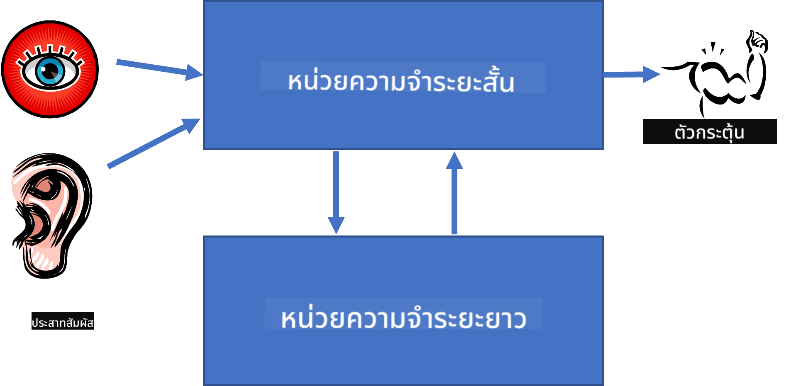
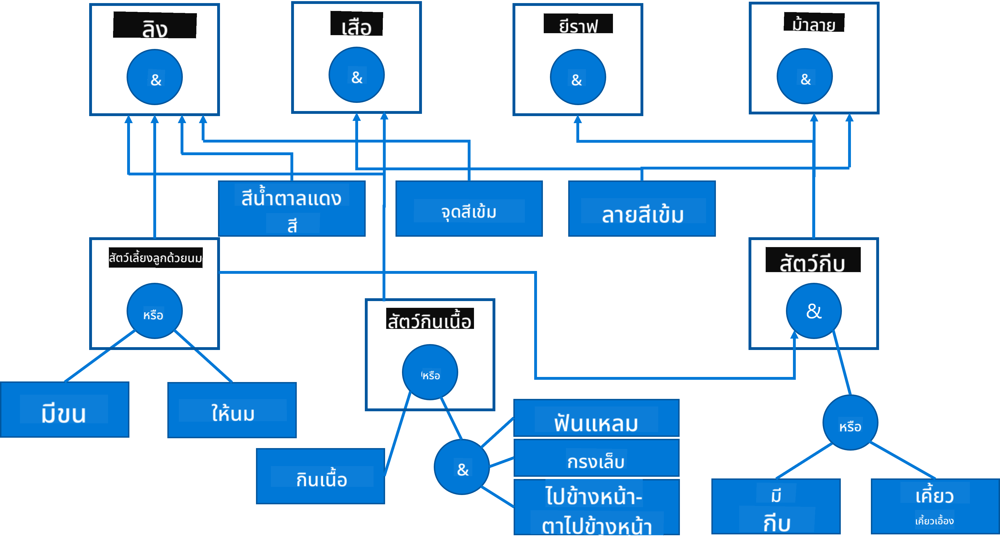

<!--
CO_OP_TRANSLATOR_METADATA:
{
  "original_hash": "98c5222ff9556b55223fed2337145e18",
  "translation_date": "2025-08-29T09:01:20+00:00",
  "source_file": "lessons/2-Symbolic/README.md",
  "language_code": "th"
}
-->
# การแสดงความรู้และระบบผู้เชี่ยวชาญ


> ภาพสเก็ตช์โดย [Tomomi Imura](https://twitter.com/girlie_mac)

การแสวงหาปัญญาประดิษฐ์นั้นตั้งอยู่บนพื้นฐานของการค้นหาความรู้ เพื่อทำความเข้าใจโลกในแบบที่มนุษย์ทำ แต่เราจะทำสิ่งนี้ได้อย่างไร?

## [แบบทดสอบก่อนการบรรยาย](https://ff-quizzes.netlify.app/en/ai/quiz/3)

ในยุคแรกของ AI แนวทางจากบนลงล่าง (top-down approach) ในการสร้างระบบอัจฉริยะ (ที่ได้กล่าวถึงในบทเรียนก่อนหน้า) เป็นที่นิยม แนวคิดคือการดึงความรู้จากมนุษย์ให้อยู่ในรูปแบบที่เครื่องจักรสามารถอ่านได้ และใช้มันในการแก้ปัญหาโดยอัตโนมัติ แนวทางนี้ตั้งอยู่บนสองแนวคิดใหญ่:

* การแสดงความรู้
* การให้เหตุผล

## การแสดงความรู้

หนึ่งในแนวคิดสำคัญใน AI เชิงสัญลักษณ์คือ **ความรู้** สิ่งสำคัญคือต้องแยกความรู้จาก *ข้อมูล* หรือ *สารสนเทศ* ตัวอย่างเช่น เราอาจกล่าวว่าหนังสือมีความรู้ เพราะเราสามารถศึกษาและกลายเป็นผู้เชี่ยวชาญได้ อย่างไรก็ตาม สิ่งที่หนังสือมีจริงๆ คือ *ข้อมูล* และเมื่อเราอ่านหนังสือและผนวกข้อมูลนี้เข้ากับแบบจำลองโลกของเรา เราจึงเปลี่ยนข้อมูลนี้เป็นความรู้

> ✅ **ความรู้** คือสิ่งที่อยู่ในหัวของเราและแสดงถึงความเข้าใจในโลก มันได้มาจากกระบวนการ **เรียนรู้** อย่างกระตือรือร้น ซึ่งผนวกชิ้นส่วนของข้อมูลที่เราได้รับเข้ากับแบบจำลองโลกของเรา

ส่วนใหญ่แล้ว เราไม่ได้กำหนดความรู้ไว้อย่างเข้มงวด แต่เราเชื่อมโยงมันกับแนวคิดที่เกี่ยวข้องอื่นๆ โดยใช้ [พีระมิด DIKW](https://en.wikipedia.org/wiki/DIKW_pyramid) ซึ่งประกอบด้วยแนวคิดดังนี้:

* **ข้อมูล (Data)** คือสิ่งที่แสดงอยู่ในสื่อทางกายภาพ เช่น ข้อความที่เขียนหรือคำพูด ข้อมูลมีอยู่โดยอิสระจากมนุษย์และสามารถส่งต่อระหว่างกันได้
* **สารสนเทศ (Information)** คือวิธีที่เราแปลความหมายข้อมูลในหัวของเรา ตัวอย่างเช่น เมื่อเราได้ยินคำว่า *คอมพิวเตอร์* เราจะมีความเข้าใจบางอย่างเกี่ยวกับมัน
* **ความรู้ (Knowledge)** คือสารสนเทศที่ถูกผนวกเข้ากับแบบจำลองโลกของเรา ตัวอย่างเช่น เมื่อเราเรียนรู้ว่าคอมพิวเตอร์คืออะไร เราจะเริ่มมีแนวคิดเกี่ยวกับวิธีการทำงาน ราคา และการใช้งานของมัน เครือข่ายของแนวคิดที่เชื่อมโยงกันนี้ก่อให้เกิดความรู้ของเรา
* **ปัญญา (Wisdom)** คือระดับความเข้าใจโลกที่สูงขึ้น และแสดงถึง *เมตาความรู้* เช่น แนวคิดเกี่ยวกับวิธีและเวลาที่ควรใช้ความรู้นั้น

*ภาพ [จาก Wikipedia](https://commons.wikimedia.org/w/index.php?curid=37705247), โดย Longlivetheux - งานต้นฉบับ, CC BY-SA 4.0*

ดังนั้น ปัญหาของ **การแสดงความรู้** คือการหาวิธีที่มีประสิทธิภาพในการแสดงความรู้ในคอมพิวเตอร์ในรูปแบบของข้อมูล เพื่อให้สามารถใช้งานได้โดยอัตโนมัติ สิ่งนี้สามารถมองได้ว่าเป็นสเปกตรัม:


> ภาพโดย [Dmitry Soshnikov](http://soshnikov.com)

* ทางด้านซ้าย มีรูปแบบการแสดงความรู้ที่เรียบง่ายมากซึ่งคอมพิวเตอร์สามารถใช้งานได้อย่างมีประสิทธิภาพ รูปแบบที่ง่ายที่สุดคือแบบอัลกอริธึม ซึ่งความรู้ถูกแสดงในรูปแบบของโปรแกรมคอมพิวเตอร์ อย่างไรก็ตาม นี่ไม่ใช่วิธีที่ดีที่สุดในการแสดงความรู้ เพราะมันไม่ยืดหยุ่น ความรู้ในหัวของเรามักไม่ใช่แบบอัลกอริธึม
* ทางด้านขวา มีรูปแบบการแสดงความรู้ เช่น ข้อความธรรมชาติ ซึ่งทรงพลังที่สุดแต่ไม่สามารถใช้สำหรับการให้เหตุผลโดยอัตโนมัติได้

> ✅ ลองคิดสักนาทีว่าคุณแสดงความรู้ในหัวของคุณและแปลงเป็นบันทึกอย่างไร มีรูปแบบใดที่ช่วยให้คุณจดจำได้ดีหรือไม่?

## การจัดประเภทการแสดงความรู้ในคอมพิวเตอร์

เราสามารถจัดประเภทวิธีการแสดงความรู้ในคอมพิวเตอร์ได้ดังนี้:

* **การแสดงแบบเครือข่าย** อิงจากข้อเท็จจริงที่ว่าเรามีเครือข่ายของแนวคิดที่เชื่อมโยงกันในหัวของเรา เราสามารถพยายามสร้างเครือข่ายเดียวกันนี้ในรูปแบบกราฟในคอมพิวเตอร์ - ซึ่งเรียกว่า **เครือข่ายเชิงความหมาย (semantic network)**

1. **ทริปเปิลวัตถุ-แอตทริบิวต์-ค่า** หรือ **คู่แอตทริบิวต์-ค่า** เนื่องจากกราฟสามารถแสดงในคอมพิวเตอร์เป็นรายการของโหนดและขอบ เราสามารถแสดงเครือข่ายเชิงความหมายเป็นรายการของทริปเปิลที่มีวัตถุ แอตทริบิวต์ และค่า ตัวอย่างเช่น เราสร้างทริปเปิลต่อไปนี้เกี่ยวกับภาษาโปรแกรม:

วัตถุ | แอตทริบิวต์ | ค่า
-------|-------------|-----
Python | คือ | ภาษาที่ไม่มีการกำหนดประเภท
Python | ถูกคิดค้นโดย | Guido van Rossum
Python | ไวยากรณ์บล็อก | การเยื้อง
ภาษาที่ไม่มีการกำหนดประเภท | ไม่มี | การกำหนดประเภท

> ✅ ลองคิดดูว่าทริปเปิลสามารถใช้แสดงความรู้ประเภทอื่นได้อย่างไร

2. **การแสดงแบบลำดับชั้น** เน้นข้อเท็จจริงที่ว่าเรามักสร้างลำดับชั้นของวัตถุในหัวของเรา ตัวอย่างเช่น เรารู้ว่าคีรีบูนเป็นนก และนกทุกตัวมีปีก เราก็ยังมีแนวคิดเกี่ยวกับสีของคีรีบูนและความเร็วในการบินของมัน

   - **การแสดงแบบเฟรม** อิงจากการแสดงวัตถุหรือคลาสของวัตถุแต่ละตัวเป็น **เฟรม** ซึ่งมี **ช่อง (slots)** ช่องเหล่านี้อาจมีค่าเริ่มต้น ข้อจำกัดของค่า หรือกระบวนการที่สามารถเรียกใช้เพื่อให้ได้ค่าของช่อง เฟรมทั้งหมดสร้างลำดับชั้นที่คล้ายกับลำดับชั้นของวัตถุในภาษาโปรแกรมเชิงวัตถุ
   - **สถานการณ์ (Scenarios)** เป็นเฟรมชนิดพิเศษที่แสดงถึงสถานการณ์ที่ซับซ้อนซึ่งสามารถเกิดขึ้นได้ตามเวลา

**Python**

ช่อง | ค่า | ค่าเริ่มต้น | ช่วง |
-----|-----|-------------|------
ชื่อ | Python | | |
เป็น | ภาษาที่ไม่มีการกำหนดประเภท | | |
รูปแบบตัวแปร | | CamelCase | |
ความยาวโปรแกรม | | | 5-5000 บรรทัด |
ไวยากรณ์บล็อก | การเยื้อง | | |

3. **การแสดงแบบกระบวนการ** อิงจากการแสดงความรู้เป็นรายการของการกระทำที่สามารถดำเนินการได้เมื่อเกิดเงื่อนไขบางอย่าง
   - กฎการผลิต (Production rules) คือคำสั่ง if-then ที่ช่วยให้เราสามารถสรุปผลได้ ตัวอย่างเช่น แพทย์อาจมีกฎที่กล่าวว่า **ถ้า** ผู้ป่วยมีไข้สูง **หรือ** ระดับโปรตีน C-reactive ในเลือดสูง **แสดงว่า** เขามีการอักเสบ เมื่อเราเจอเงื่อนไขใดเงื่อนไขหนึ่ง เราสามารถสรุปเกี่ยวกับการอักเสบและใช้มันในการให้เหตุผลต่อไป
   - อัลกอริธึมสามารถถือเป็นรูปแบบหนึ่งของการแสดงแบบกระบวนการ แม้ว่าจะไม่ค่อยถูกใช้โดยตรงในระบบที่ใช้ความรู้

4. **ตรรกะ (Logic)** ถูกเสนอครั้งแรกโดยอริสโตเติลเป็นวิธีการแสดงความรู้สากลของมนุษย์
   - ตรรกะเชิงภาวะ (Predicate Logic) ในฐานะทฤษฎีทางคณิตศาสตร์นั้นซับซ้อนเกินกว่าจะคำนวณได้ ดังนั้นจึงมักใช้เพียงบางส่วน เช่น ข้อความ Horn ที่ใช้ใน Prolog
   - ตรรกะเชิงพรรณนา (Descriptive Logic) เป็นกลุ่มของระบบตรรกะที่ใช้แสดงและให้เหตุผลเกี่ยวกับลำดับชั้นของวัตถุและการแสดงความรู้แบบกระจาย เช่น *เว็บเชิงความหมาย (semantic web)*

## ระบบผู้เชี่ยวชาญ

หนึ่งในความสำเร็จแรกๆ ของ AI เชิงสัญลักษณ์คือ **ระบบผู้เชี่ยวชาญ** - ระบบคอมพิวเตอร์ที่ถูกออกแบบให้ทำหน้าที่เป็นผู้เชี่ยวชาญในโดเมนปัญหาที่จำกัด ระบบเหล่านี้ตั้งอยู่บน **ฐานความรู้** ที่ดึงมาจากผู้เชี่ยวชาญมนุษย์หนึ่งคนหรือมากกว่า และมี **เครื่องมืออนุมาน (inference engine)** ที่ทำการให้เหตุผลบนฐานความรู้นั้น

 | 
---------------------------------------------|------------------------------------------------
โครงสร้างที่เรียบง่ายของระบบประสาทมนุษย์ | สถาปัตยกรรมของระบบที่ใช้ความรู้

ระบบผู้เชี่ยวชาญถูกสร้างขึ้นให้คล้ายกับระบบการให้เหตุผลของมนุษย์ ซึ่งมี **หน่วยความจำระยะสั้น** และ **หน่วยความจำระยะยาว** ในทำนองเดียวกัน ในระบบที่ใช้ความรู้ เราแยกส่วนประกอบดังนี้:

* **หน่วยความจำปัญหา**: มีความรู้เกี่ยวกับปัญหาที่กำลังแก้ไข เช่น อุณหภูมิหรือความดันโลหิตของผู้ป่วย ว่ามีการอักเสบหรือไม่ เป็นต้น ความรู้นี้เรียกว่า **ความรู้แบบคงที่ (static knowledge)** เพราะมันแสดงถึงภาพรวมของสิ่งที่เรารู้เกี่ยวกับปัญหาในขณะนั้น - หรือที่เรียกว่า *สถานะปัญหา*
* **ฐานความรู้**: แสดงถึงความรู้ระยะยาวเกี่ยวกับโดเมนปัญหา มันถูกดึงออกมาจากผู้เชี่ยวชาญมนุษย์และไม่เปลี่ยนแปลงจากการปรึกษาครั้งหนึ่งไปยังอีกครั้งหนึ่ง เพราะมันช่วยให้เรานำทางจากสถานะปัญหาหนึ่งไปยังอีกสถานะหนึ่ง มันจึงถูกเรียกว่า **ความรู้แบบพลวัต (dynamic knowledge)** ด้วย
* **เครื่องมืออนุมาน**: ทำหน้าที่ประสานกระบวนการค้นหาในพื้นที่สถานะปัญหา ถามคำถามจากผู้ใช้เมื่อจำเป็น และรับผิดชอบในการค้นหากฎที่เหมาะสมที่จะใช้ในแต่ละสถานะ

ตัวอย่างเช่น ลองพิจารณาระบบผู้เชี่ยวชาญที่ใช้ในการระบุสัตว์ตามลักษณะทางกายภาพ:



> ภาพโดย [Dmitry Soshnikov](http://soshnikov.com)

แผนภาพนี้เรียกว่า **ต้นไม้ AND-OR** และเป็นการแสดงกราฟิกของชุดกฎการผลิต การวาดต้นไม้มีประโยชน์ในช่วงเริ่มต้นของการดึงความรู้จากผู้เชี่ยวชาญ เพื่อแสดงความรู้ในคอมพิวเตอร์ จะสะดวกกว่าที่จะใช้กฎ:

```
IF the animal eats meat
OR (animal has sharp teeth
    AND animal has claws
    AND animal has forward-looking eyes
) 
THEN the animal is a carnivore
```

คุณจะสังเกตได้ว่าแต่ละเงื่อนไขในด้านซ้ายของกฎและการกระทำเป็นทริปเปิลวัตถุ-แอตทริบิวต์-ค่า (OAV) **หน่วยความจำการทำงาน** มีชุดของทริปเปิล OAV ที่สอดคล้องกับปัญหาที่กำลังแก้ไข **เครื่องมือกฎ (rules engine)** จะค้นหากฎที่เงื่อนไขตรงกับสถานะปัจจุบันและนำไปใช้ เพิ่มทริปเปิลใหม่ลงในหน่วยความจำการทำงาน

> ✅ ลองเขียนต้นไม้ AND-OR ของคุณเองในหัวข้อที่คุณสนใจ!

### การอนุมานแบบไปข้างหน้าและแบบย้อนกลับ

กระบวนการที่อธิบายข้างต้นเรียกว่า **การอนุมานแบบไปข้างหน้า (forward inference)** มันเริ่มต้นด้วยข้อมูลเริ่มต้นบางอย่างเกี่ยวกับปัญหาที่มีอยู่ในหน่วยความจำการทำงาน และดำเนินการวนลูปการให้เหตุผลดังนี้:

1. หากแอตทริบิวต์เป้าหมายมีอยู่ในหน่วยความจำการทำงาน - หยุดและให้ผลลัพธ์
2. ค้นหากฎทั้งหมดที่เงื่อนไขตรงกับสถานะปัจจุบัน - ได้ชุดความขัดแย้งของกฎ
3. ทำการ **แก้ไขความขัดแย้ง (conflict resolution)** - เลือกกฎหนึ่งที่จะดำเนินการในขั้นตอนนี้ อาจมีวิธีการแก้ไขความขัดแย้งที่แตกต่างกัน:
   - เลือกกฎแรกที่สามารถใช้ได้ในฐานความรู้
   - เลือกกฎแบบสุ่ม
   - เลือกกฎที่ *เฉพาะเจาะจงมากกว่า* เช่น กฎที่ตรงกับเงื่อนไขมากที่สุดในด้านซ้าย (LHS)
4. ใช้กฎที่เลือกและเพิ่มชิ้นส่วนความรู้ใหม่ลงในสถานะปัญหา
5. ทำซ้ำตั้งแต่ขั้นตอนที่ 1

อย่างไรก็ตาม ในบางกรณีเราอาจต้องการเริ่มต้นด้วยความรู้ที่ว่างเปล่าเกี่ยวกับปัญหา และถามคำถามที่จะช่วยให้เราไปถึงข้อสรุป ตัวอย่างเช่น เมื่อทำการวินิจฉัยทางการแพทย์ เรามักไม่ทำการวิเคราะห์ทางการแพทย์ทั้งหมดล่วงหน้าก่อนเริ่มวินิจฉัยผู้ป่วย เรามักต้องการทำการวิเคราะห์เมื่อจำเป็นต้องตัดสินใจ

กระบวนการนี้สามารถจำลองได้โดยใช้ **การอนุมานแบบย้อนกลับ (backward inference)** ซึ่งขับเคลื่อนโดย **เป้าหมาย** - ค่าของแอตทริบิวต์ที่เรากำลังพยายามค้นหา:

1. เลือกกฎทั้งหมดที่สามารถให้ค่าของเป้าหมายได้ (เช่น กฎที่มีเป้าหมายอยู่ในด้านขวา (RHS)) - ได้ชุดความขัดแย้ง
2. หากไม่มีกฎสำหรับแอตทริบิวต์นี้ หรือมีกฎที่บอกว่าเราควรถามค่าจากผู้ใช้ - ให้ถาม มิฉะนั้น:
3. ใช้กลยุทธ์การแก้ไขความขัดแย้งเพื่อเลือกกฎหนึ่งที่เราจะใช้เป็น *สมมติฐาน* - เราจะพยายามพิสูจน์มัน
4. ทำซ้ำกระบวนการนี้แบบเรียกซ้อนสำหรับแอตทริบิวต์ทั้งหมดในด้านซ้ายของกฎ พยายามพิสูจน์พวกมันเป็นเป้าหมาย
5. หากกระบวนการล้มเหลวในจุดใด - ใช้กฎอื่นในขั้นตอนที่ 3

> ✅ ในสถานการณ์ใดที่การอนุมานแบบไปข้างหน้าเหมาะสมกว่า? แล้วการอนุมานแบบย้อนกลับล่ะ?

### การพัฒนาระบบผู้เชี่ยวชาญ

ระบบผู้เชี่ยวชาญสามารถพัฒนาได้โดยใช้เครื่องมือที่แตกต่างกัน:

* การเขียนโปรแกรมโดยตรงในภาษาการเขียนโปรแกรมระดับสูง นี่ไม่ใช่แนวคิดที่ดีที่สุด เพราะข้อได้เปรียบหลักของระบบที่ใช้ความรู้คือการแยกความรู้ออกจากการอนุมาน และผู้เชี่ยวชาญในโดเมนปัญหาควรสามารถเขียนกฎได้โดยไม่ต้องเข้าใจรายละเอียดของกระบวนการอนุมาน
* การใช้ **เปลือกของระบบผู้เชี่ยวชาญ (expert systems shell)** ซึ่งเป็นระบบที่ออกแบบมาเฉพาะเพื่อให้สามารถเพิ่มความรู้ได้โดยใช้ภาษาการแสดงความรู้บางรูปแบบ

## ✍️ แบบฝึกหัด: การอนุมานสัตว์

ดู [Animals.ipynb](https://github.com/microsoft/AI-For-Beginners/blob/main/lessons/2-Symbolic/Animals.ipynb) สำหรับตัวอย่างการพัฒนาระบบผู้เชี่ยวชาญที่ใช้การอนุมานแบบไปข้างหน้าและแบบย้อนกลับ
> **หมายเหตุ**: ตัวอย่างนี้ค่อนข้างเรียบง่าย และแสดงให้เห็นเพียงแนวคิดของระบบผู้เชี่ยวชาญ เมื่อคุณเริ่มสร้างระบบลักษณะนี้ คุณจะเริ่มสังเกตเห็นพฤติกรรมที่ดู *ชาญฉลาด* จากระบบเมื่อคุณมีกฎถึงจำนวนหนึ่ง ประมาณ 200 กฎขึ้นไป ในบางจุด กฎจะซับซ้อนเกินกว่าที่จะจดจำทั้งหมดได้ และในจุดนี้คุณอาจเริ่มสงสัยว่าทำไมระบบถึงตัดสินใจบางอย่าง อย่างไรก็ตาม ลักษณะสำคัญของระบบที่ใช้ความรู้คือ คุณสามารถ *อธิบาย* ได้เสมอว่าการตัดสินใจใด ๆ ถูกทำขึ้นมาได้อย่างไร
## ออนโทโลยีและเว็บเชิงความหมาย

ในช่วงปลายศตวรรษที่ 20 มีความพยายามที่จะใช้การแทนความรู้เพื่อใส่คำอธิบายให้กับทรัพยากรบนอินเทอร์เน็ต เพื่อให้สามารถค้นหาทรัพยากรที่ตรงกับคำค้นหาเฉพาะเจาะจงได้ ความพยายามนี้เรียกว่า **เว็บเชิงความหมาย (Semantic Web)** ซึ่งอาศัยแนวคิดหลายประการดังนี้:

- การแทนความรู้แบบพิเศษที่อิงกับ **[ตรรกะเชิงพรรณนา (description logics)](https://en.wikipedia.org/wiki/Description_logic)** (DL) ซึ่งคล้ายกับการแทนความรู้แบบเฟรม เพราะสร้างลำดับชั้นของวัตถุพร้อมคุณสมบัติ แต่มีความหมายเชิงตรรกะและการอนุมานที่เป็นทางการ DL มีหลายรูปแบบที่สมดุลระหว่างความสามารถในการแสดงออกและความซับซ้อนเชิงอัลกอริทึมของการอนุมาน
- การแทนความรู้แบบกระจาย โดยที่ทุกแนวคิดจะถูกแทนด้วยตัวระบุ URI ระดับโลก ทำให้สามารถสร้างลำดับชั้นของความรู้ที่ครอบคลุมอินเทอร์เน็ตได้
- กลุ่มภาษาที่ใช้ XML สำหรับการอธิบายความรู้ เช่น RDF (Resource Description Framework), RDFS (RDF Schema), OWL (Ontology Web Language)

แนวคิดหลักในเว็บเชิงความหมายคือ **ออนโทโลยี (Ontology)** ซึ่งหมายถึงการระบุปัญหาในโดเมนอย่างชัดเจนโดยใช้การแทนความรู้ในรูปแบบทางการ ออนโทโลยีที่ง่ายที่สุดอาจเป็นเพียงลำดับชั้นของวัตถุในโดเมนปัญหา แต่ในกรณีที่ซับซ้อนขึ้น ออนโทโลยีจะรวมถึงกฎที่สามารถใช้สำหรับการอนุมานได้

ในเว็บเชิงความหมาย การแทนความรู้ทั้งหมดอิงกับสามส่วน (triplets) โดยที่วัตถุและความสัมพันธ์แต่ละอย่างจะถูกระบุด้วย URI ที่ไม่ซ้ำกัน ตัวอย่างเช่น หากเราต้องการระบุข้อเท็จจริงว่าหลักสูตร AI นี้ถูกพัฒนาโดย Dmitry Soshnikov เมื่อวันที่ 1 มกราคม 2022 เราสามารถใช้สามส่วนดังนี้:


```
http://github.com/microsoft/ai-for-beginners http://www.example.com/terms/creation-date “Jan 13, 2007”
http://github.com/microsoft/ai-for-beginners http://purl.org/dc/elements/1.1/creator http://soshnikov.com
```

> ✅ ที่นี่ `http://www.example.com/terms/creation-date` และ `http://purl.org/dc/elements/1.1/creator` เป็น URI ที่เป็นที่รู้จักและยอมรับในระดับสากลสำหรับแสดงแนวคิดเกี่ยวกับ *ผู้สร้าง* และ *วันที่สร้าง*

ในกรณีที่ซับซ้อนขึ้น หากเราต้องการกำหนดรายชื่อผู้สร้าง เราสามารถใช้โครงสร้างข้อมูลบางอย่างที่กำหนดใน RDF


> แผนภาพด้านบนโดย [Dmitry Soshnikov](http://soshnikov.com)

ความก้าวหน้าในการสร้างเว็บเชิงความหมายชะลอตัวลงเนื่องจากความสำเร็จของเครื่องมือค้นหาและเทคนิคการประมวลผลภาษาธรรมชาติ ซึ่งช่วยให้สามารถดึงข้อมูลเชิงโครงสร้างจากข้อความได้ อย่างไรก็ตาม ในบางพื้นที่ยังคงมีความพยายามอย่างมากในการดูแลออนโทโลยีและฐานความรู้ โครงการที่น่าสนใจบางโครงการ ได้แก่:

* [WikiData](https://wikidata.org/) เป็นชุดฐานความรู้ที่เครื่องสามารถอ่านได้ซึ่งเชื่อมโยงกับ Wikipedia ข้อมูลส่วนใหญ่มาจาก *InfoBoxes* ซึ่งเป็นเนื้อหาเชิงโครงสร้างในหน้า Wikipedia คุณสามารถ [query](https://query.wikidata.org/) WikiData ด้วย SPARQL ซึ่งเป็นภาษาค้นหาเฉพาะสำหรับเว็บเชิงความหมาย ตัวอย่างคำค้นหาที่แสดงสีตายอดนิยมของตามนุษย์:

```sparql
#defaultView:BubbleChart
SELECT ?eyeColorLabel (COUNT(?human) AS ?count)
WHERE
{
  ?human wdt:P31 wd:Q5.       # human instance-of homo sapiens
  ?human wdt:P1340 ?eyeColor. # human eye-color ?eyeColor
  SERVICE wikibase:label { bd:serviceParam wikibase:language "en". }
}
GROUP BY ?eyeColorLabel
```

* [DBpedia](https://www.dbpedia.org/) เป็นอีกความพยายามหนึ่งที่คล้ายกับ WikiData

> ✅ หากคุณต้องการทดลองสร้างออนโทโลยีของคุณเอง หรือเปิดออนโทโลยีที่มีอยู่ มีตัวแก้ไขออนโทโลยีแบบภาพที่ยอดเยี่ยมชื่อว่า [Protégé](https://protege.stanford.edu/) ดาวน์โหลดหรือใช้งานออนไลน์ได้


*Web Protégé editor เปิดด้วยออนโทโลยีของครอบครัว Romanov ภาพหน้าจอโดย Dmitry Soshnikov*

## ✍️ แบบฝึกหัด: ออนโทโลยีครอบครัว

ดู [FamilyOntology.ipynb](https://github.com/Ezana135/AI-For-Beginners/blob/main/lessons/2-Symbolic/FamilyOntology.ipynb) สำหรับตัวอย่างการใช้เทคนิคเว็บเชิงความหมายเพื่อวิเคราะห์ความสัมพันธ์ในครอบครัว เราจะใช้แผนผังครอบครัวที่แสดงในรูปแบบ GEDCOM และออนโทโลยีของความสัมพันธ์ในครอบครัวเพื่อสร้างกราฟของความสัมพันธ์ในครอบครัวสำหรับบุคคลที่กำหนด

## Microsoft Concept Graph

ในกรณีส่วนใหญ่ ออนโทโลยีถูกสร้างขึ้นอย่างพิถีพิถันด้วยมือ อย่างไรก็ตาม ยังสามารถ **ขุดค้น** ออนโทโลยีจากข้อมูลที่ไม่มีโครงสร้าง เช่น ข้อความภาษาธรรมชาติได้

หนึ่งในความพยายามดังกล่าวคือโครงการของ Microsoft Research ซึ่งนำไปสู่การสร้าง [Microsoft Concept Graph](https://blogs.microsoft.com/ai/microsoft-researchers-release-graph-that-helps-machines-conceptualize/?WT.mc_id=academic-77998-cacaste)

มันเป็นชุดข้อมูลขนาดใหญ่ของเอนทิตีที่ถูกจัดกลุ่มโดยใช้ความสัมพันธ์แบบ `is-a` ซึ่งช่วยตอบคำถามเช่น "Microsoft คืออะไร?" - คำตอบอาจเป็น "บริษัทที่มีความน่าจะเป็น 0.87 และแบรนด์ที่มีความน่าจะเป็น 0.75"

กราฟนี้สามารถใช้งานได้ทั้งในรูปแบบ REST API หรือไฟล์ข้อความขนาดใหญ่ที่แสดงรายการคู่เอนทิตีทั้งหมด

## ✍️ แบบฝึกหัด: กราฟแนวคิด

ลองใช้โน้ตบุ๊ก [MSConceptGraph.ipynb](https://github.com/microsoft/AI-For-Beginners/blob/main/lessons/2-Symbolic/MSConceptGraph.ipynb) เพื่อดูว่าเราสามารถใช้ Microsoft Concept Graph ในการจัดกลุ่มบทความข่าวออกเป็นหมวดหมู่ต่าง ๆ ได้อย่างไร

## สรุป

ในปัจจุบัน AI มักถูกมองว่าเป็นคำพ้องความหมายของ *Machine Learning* หรือ *Neural Networks* อย่างไรก็ตาม มนุษย์ยังแสดงความสามารถในการให้เหตุผลอย่างชัดเจน ซึ่งเป็นสิ่งที่เครือข่ายประสาทเทียมยังไม่สามารถจัดการได้ ในโครงการจริง การให้เหตุผลอย่างชัดเจนยังคงถูกใช้เพื่อทำงานที่ต้องการคำอธิบาย หรือการปรับเปลี่ยนพฤติกรรมของระบบในลักษณะที่ควบคุมได้

## 🚀 ความท้าทาย

ในโน้ตบุ๊ก Family Ontology ที่เกี่ยวข้องกับบทเรียนนี้ มีโอกาสให้ทดลองกับความสัมพันธ์ในครอบครัวอื่น ๆ ลองค้นหาความเชื่อมโยงใหม่ ๆ ระหว่างบุคคลในแผนผังครอบครัว

## [แบบทดสอบหลังการบรรยาย](https://ff-quizzes.netlify.app/en/ai/quiz/4)

## การทบทวนและการศึกษาด้วยตนเอง

ค้นคว้าบนอินเทอร์เน็ตเพื่อค้นหาพื้นที่ที่มนุษย์พยายามวัดและจัดระเบียบความรู้ ลองดูที่ Bloom's Taxonomy และย้อนกลับไปในประวัติศาสตร์เพื่อเรียนรู้ว่ามนุษย์พยายามทำความเข้าใจโลกของพวกเขาอย่างไร สำรวจผลงานของ Linnaeus ในการสร้างระบบการจัดหมวดหมู่ของสิ่งมีชีวิต และสังเกตวิธีที่ Dmitri Mendeleev สร้างวิธีการอธิบายและจัดกลุ่มธาตุเคมี คุณสามารถค้นหาตัวอย่างที่น่าสนใจอื่น ๆ ได้อีกหรือไม่?

**การบ้าน**: [สร้างออนโทโลยี](assignment.md)

---

**ข้อจำกัดความรับผิดชอบ**:  
เอกสารนี้ได้รับการแปลโดยใช้บริการแปลภาษา AI [Co-op Translator](https://github.com/Azure/co-op-translator) แม้ว่าเราจะพยายามให้การแปลมีความถูกต้อง แต่โปรดทราบว่าการแปลอัตโนมัติอาจมีข้อผิดพลาดหรือความไม่แม่นยำ เอกสารต้นฉบับในภาษาต้นทางควรถือเป็นแหล่งข้อมูลที่เชื่อถือได้ สำหรับข้อมูลที่สำคัญ ขอแนะนำให้ใช้บริการแปลภาษาจากผู้เชี่ยวชาญ เราจะไม่รับผิดชอบต่อความเข้าใจผิดหรือการตีความที่ผิดพลาดซึ่งเกิดจากการใช้การแปลนี้