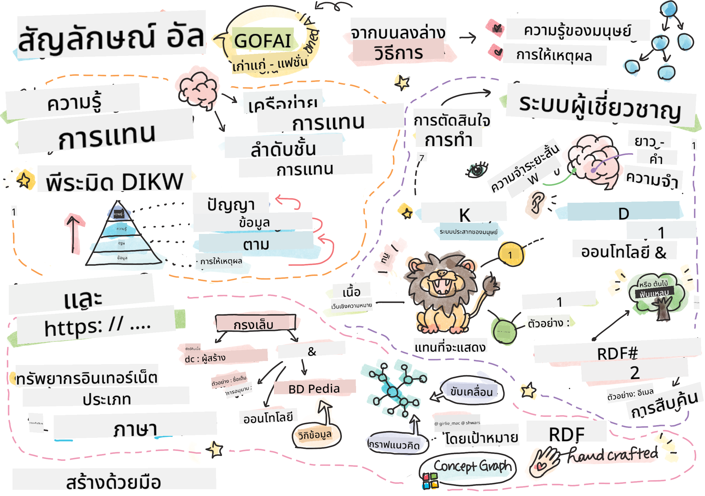
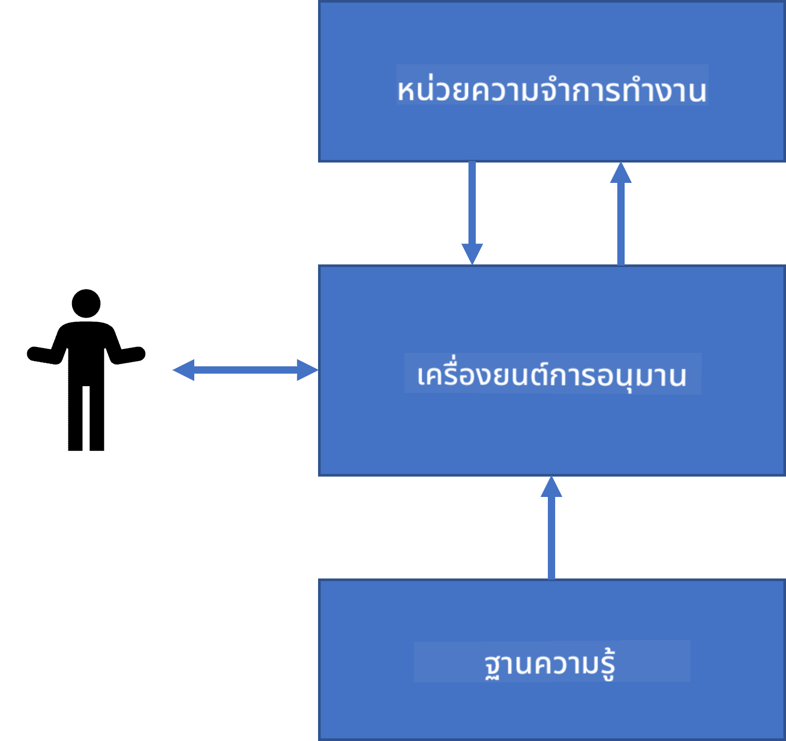

<!--
CO_OP_TRANSLATOR_METADATA:
{
  "original_hash": "7d097f7fda9166ead615e4c34552381b",
  "translation_date": "2025-09-23T09:08:16+00:00",
  "source_file": "lessons/2-Symbolic/README.md",
  "language_code": "th"
}
-->
# การแทนความรู้และระบบผู้เชี่ยวชาญ



> ภาพสเก็ตโน้ตโดย [Tomomi Imura](https://twitter.com/girlie_mac)

การแสวงหาปัญญาประดิษฐ์ (AI) มีพื้นฐานมาจากการค้นหาความรู้ เพื่อทำความเข้าใจโลกในแบบที่มนุษย์ทำได้ แต่เราจะทำสิ่งนี้ได้อย่างไร?

## [แบบทดสอบก่อนเรียน](https://ff-quizzes.netlify.app/en/ai/quiz/3)

ในยุคแรกของ AI วิธีการแบบบนลงล่าง (top-down approach) ในการสร้างระบบอัจฉริยะ (ที่ได้กล่าวถึงในบทเรียนก่อนหน้า) เป็นที่นิยม ความคิดคือการดึงความรู้จากมนุษย์ให้อยู่ในรูปแบบที่เครื่องจักรสามารถอ่านได้ และใช้มันในการแก้ปัญหาโดยอัตโนมัติ วิธีการนี้มีพื้นฐานมาจากสองแนวคิดใหญ่:

* การแทนความรู้ (Knowledge Representation)
* การให้เหตุผล (Reasoning)

## การแทนความรู้

หนึ่งในแนวคิดสำคัญใน Symbolic AI คือ **ความรู้** สิ่งสำคัญคือต้องแยกความรู้จาก *ข้อมูล* หรือ *สารสนเทศ* ตัวอย่างเช่น เราอาจพูดได้ว่าหนังสือมีความรู้ เพราะเราสามารถศึกษาและกลายเป็นผู้เชี่ยวชาญได้ อย่างไรก็ตาม สิ่งที่หนังสือมีจริงๆ คือ *ข้อมูล* และเมื่อเราอ่านหนังสือและผนวกข้อมูลนี้เข้ากับแบบจำลองโลกของเรา เราจึงเปลี่ยนข้อมูลนี้ให้กลายเป็นความรู้

> ✅ **ความรู้** คือสิ่งที่อยู่ในหัวของเราและแสดงถึงความเข้าใจในโลกของเรา มันได้มาจากกระบวนการ **เรียนรู้** อย่างกระตือรือร้น ซึ่งผนวกชิ้นส่วนของข้อมูลที่เราได้รับเข้ากับแบบจำลองโลกที่เรามีอยู่

โดยทั่วไป เราไม่ได้กำหนดความรู้ไว้อย่างเคร่งครัด แต่เราจัดแนวความรู้กับแนวคิดที่เกี่ยวข้องอื่นๆ โดยใช้ [พีระมิด DIKW](https://en.wikipedia.org/wiki/DIKW_pyramid) ซึ่งประกอบด้วยแนวคิดดังนี้:

* **ข้อมูล (Data)** คือสิ่งที่แสดงในสื่อทางกายภาพ เช่น ข้อความที่เขียนหรือคำพูด ข้อมูลมีอยู่โดยอิสระจากมนุษย์และสามารถถ่ายทอดระหว่างกันได้
* **สารสนเทศ (Information)** คือวิธีที่เราแปลความหมายข้อมูลในหัวของเรา ตัวอย่างเช่น เมื่อเราได้ยินคำว่า *คอมพิวเตอร์* เราจะมีความเข้าใจบางอย่างเกี่ยวกับมัน
* **ความรู้ (Knowledge)** คือสารสนเทศที่ถูกผนวกเข้ากับแบบจำลองโลกของเรา ตัวอย่างเช่น เมื่อเราเรียนรู้ว่าคอมพิวเตอร์คืออะไร เราจะเริ่มมีความคิดเกี่ยวกับวิธีการทำงาน ราคา และการใช้งานของมัน เครือข่ายของแนวคิดที่เชื่อมโยงกันนี้ก่อให้เกิดความรู้ของเรา
* **ปัญญา (Wisdom)** คือระดับความเข้าใจโลกที่สูงขึ้น และแสดงถึง *เมตาความรู้* เช่น ความเข้าใจว่าเมื่อใดและอย่างไรควรใช้ความรู้


*ภาพ [จาก Wikipedia](https://commons.wikimedia.org/w/index.php?curid=37705247), โดย Longlivetheux - งานต้นฉบับ, CC BY-SA 4.0*

ดังนั้น ปัญหาของ **การแทนความรู้** คือการหาวิธีที่มีประสิทธิภาพในการแทนความรู้ภายในคอมพิวเตอร์ในรูปแบบของข้อมูล เพื่อให้สามารถใช้งานได้โดยอัตโนมัติ สิ่งนี้สามารถมองได้ว่าเป็นสเปกตรัม:


> ภาพโดย [Dmitry Soshnikov](http://soshnikov.com)

* ทางด้านซ้าย มีรูปแบบการแทนความรู้ที่เรียบง่ายมากซึ่งคอมพิวเตอร์สามารถใช้งานได้อย่างมีประสิทธิภาพ รูปแบบที่ง่ายที่สุดคือแบบอัลกอริธึม ซึ่งความรู้ถูกแทนด้วยโปรแกรมคอมพิวเตอร์ อย่างไรก็ตาม นี่ไม่ใช่วิธีที่ดีที่สุดในการแทนความรู้ เพราะมันไม่ยืดหยุ่น ความรู้ในหัวของเรามักไม่ใช่แบบอัลกอริธึม
* ทางด้านขวา มีการแทนความรู้ในรูปแบบข้อความธรรมชาติ ซึ่งทรงพลังที่สุดแต่ไม่สามารถใช้สำหรับการให้เหตุผลโดยอัตโนมัติได้

> ✅ ลองคิดสักนาทีว่าคุณแทนความรู้ในหัวของคุณและเปลี่ยนมันเป็นบันทึกอย่างไร มีรูปแบบใดที่ช่วยให้คุณจดจำได้ดีหรือไม่?

## การจัดประเภทการแทนความรู้ในคอมพิวเตอร์

เราสามารถจัดประเภทวิธีการแทนความรู้ในคอมพิวเตอร์ได้ดังนี้:

* **การแทนแบบเครือข่าย (Network representations)** มีพื้นฐานมาจากข้อเท็จจริงที่ว่าเรามีเครือข่ายของแนวคิดที่เชื่อมโยงกันในหัวของเรา เราสามารถพยายามสร้างเครือข่ายเดียวกันนี้ในรูปแบบกราฟในคอมพิวเตอร์ ซึ่งเรียกว่า **เครือข่ายเชิงความหมาย (semantic network)**

1. **ทริปเปิลแบบวัตถุ-แอตทริบิวต์-ค่า (Object-Attribute-Value triplets)** หรือ **คู่แอตทริบิวต์-ค่า (attribute-value pairs)** เนื่องจากกราฟสามารถแทนในคอมพิวเตอร์ได้ในรูปแบบรายการของโหนดและขอบ เราสามารถแทนเครือข่ายเชิงความหมายด้วยรายการของทริปเปิลที่ประกอบด้วยวัตถุ แอตทริบิวต์ และค่า ตัวอย่างเช่น เราสร้างทริปเปิลต่อไปนี้เกี่ยวกับภาษาโปรแกรม:

Object | Attribute | Value
-------|-----------|------
Python | is | Untyped-Language
Python | invented-by | Guido van Rossum
Python | block-syntax | indentation
Untyped-Language | doesn't have | type definitions

> ✅ ลองคิดดูว่าทริปเปิลสามารถใช้แทนความรู้ประเภทอื่นได้อย่างไร

2. **การแทนแบบลำดับชั้น (Hierarchical representations)** เน้นข้อเท็จจริงที่ว่าเรามักสร้างลำดับชั้นของวัตถุในหัวของเรา ตัวอย่างเช่น เรารู้ว่าคานารีเป็นนก และนกทุกตัวมีปีก เราก็ยังมีความคิดเกี่ยวกับสีของคานารีและความเร็วในการบินของมัน

   - **การแทนแบบเฟรม (Frame representation)** มีพื้นฐานมาจากการแทนวัตถุหรือคลาสของวัตถุแต่ละตัวเป็น **เฟรม** ซึ่งมี **สล็อต** สล็อตอาจมีค่าดีฟอลต์ ข้อจำกัดของค่า หรือกระบวนการที่สามารถเรียกใช้เพื่อรับค่าของสล็อต เฟรมทั้งหมดสร้างลำดับชั้นที่คล้ายกับลำดับชั้นของวัตถุในภาษาโปรแกรมเชิงวัตถุ
   - **สถานการณ์ (Scenarios)** เป็นเฟรมชนิดพิเศษที่แทนสถานการณ์ที่ซับซ้อนซึ่งสามารถเกิดขึ้นในช่วงเวลา

**Python**

Slot | Value | Default value | Interval |
-----|-------|---------------|----------|
Name | Python | | |
Is-A | Untyped-Language | | |
Variable Case | | CamelCase | |
Program Length | | | 5-5000 lines |
Block Syntax | Indent | | |

3. **การแทนแบบกระบวนการ (Procedural representations)** มีพื้นฐานมาจากการแทนความรู้ด้วยรายการของการกระทำที่สามารถดำเนินการได้เมื่อเกิดเงื่อนไขบางอย่าง
   - กฎการผลิต (Production rules) คือคำสั่ง if-then ที่ช่วยให้เราสามารถสรุปผลได้ ตัวอย่างเช่น แพทย์อาจมีกฎที่กล่าวว่า **ถ้า** ผู้ป่วยมีไข้สูง **หรือ** ระดับโปรตีน C-reactive ในเลือดสูง **ดังนั้น** เขามีการอักเสบ เมื่อเราเจอเงื่อนไขใดเงื่อนไขหนึ่ง เราสามารถสรุปเกี่ยวกับการอักเสบและใช้มันในการให้เหตุผลต่อไป
   - อัลกอริธึมสามารถถือเป็นรูปแบบหนึ่งของการแทนแบบกระบวนการ แม้ว่าจะไม่ค่อยถูกใช้โดยตรงในระบบที่ใช้ความรู้

4. **ตรรกะ (Logic)** ถูกเสนอครั้งแรกโดยอริสโตเติลในฐานะวิธีการแทนความรู้สากลของมนุษย์
   - ตรรกะเชิงภาวะ (Predicate Logic) ในฐานะทฤษฎีทางคณิตศาสตร์นั้นมีความซับซ้อนเกินกว่าจะคำนวณได้ ดังนั้นจึงมักใช้เพียงบางส่วน เช่น Horn clauses ที่ใช้ใน Prolog
   - ตรรกะเชิงพรรณนา (Descriptive Logic) เป็นกลุ่มของระบบตรรกะที่ใช้แทนและให้เหตุผลเกี่ยวกับลำดับชั้นของวัตถุในระบบการแทนความรู้แบบกระจาย เช่น *เว็บเชิงความหมาย (semantic web)*

## ระบบผู้เชี่ยวชาญ

หนึ่งในความสำเร็จแรกๆ ของ Symbolic AI คือ **ระบบผู้เชี่ยวชาญ (Expert Systems)** - ระบบคอมพิวเตอร์ที่ถูกออกแบบมาให้ทำหน้าที่เป็นผู้เชี่ยวชาญในโดเมนปัญหาที่จำกัด ระบบเหล่านี้มีพื้นฐานมาจาก **ฐานความรู้ (Knowledge Base)** ที่ดึงมาจากผู้เชี่ยวชาญมนุษย์ และมี **เครื่องมืออนุมาน (Inference Engine)** ที่ทำการให้เหตุผลบนฐานความรู้นั้น

 | 
---------------------------------------------|------------------------------------------------
โครงสร้างระบบประสาทมนุษย์แบบง่าย | โครงสร้างของระบบที่ใช้ความรู้

ระบบผู้เชี่ยวชาญถูกสร้างขึ้นให้คล้ายกับระบบการให้เหตุผลของมนุษย์ ซึ่งมี **หน่วยความจำระยะสั้น** และ **หน่วยความจำระยะยาว** ในทำนองเดียวกัน ในระบบที่ใช้ความรู้ เราแยกส่วนประกอบดังนี้:

* **หน่วยความจำปัญหา (Problem Memory)**: มีความรู้เกี่ยวกับปัญหาที่กำลังแก้ไข เช่น อุณหภูมิหรือความดันโลหิตของผู้ป่วย ว่าผู้ป่วยมีการอักเสบหรือไม่ เป็นต้น ความรู้นี้เรียกว่า **ความรู้แบบคงที่ (Static Knowledge)** เพราะมันเป็นภาพรวมของสิ่งที่เรารู้เกี่ยวกับปัญหาในขณะนั้น - หรือที่เรียกว่า *สถานะปัญหา (Problem State)*
* **ฐานความรู้ (Knowledge Base)**: แทนความรู้ระยะยาวเกี่ยวกับโดเมนปัญหา ซึ่งถูกดึงมาจากผู้เชี่ยวชาญมนุษย์ และไม่เปลี่ยนแปลงจากการปรึกษาครั้งหนึ่งไปยังอีกครั้งหนึ่ง เนื่องจากมันช่วยให้เรานำทางจากสถานะปัญหาหนึ่งไปยังอีกสถานะหนึ่งได้ มันจึงถูกเรียกว่า **ความรู้แบบพลวัต (Dynamic Knowledge)** ด้วย
* **เครื่องมืออนุมาน (Inference Engine)**: ทำหน้าที่ประสานกระบวนการค้นหาในพื้นที่สถานะปัญหา ถามคำถามจากผู้ใช้เมื่อจำเป็น และรับผิดชอบในการค้นหากฎที่เหมาะสมที่จะนำไปใช้ในแต่ละสถานะ

ตัวอย่างเช่น ลองพิจารณาระบบผู้เชี่ยวชาญที่ใช้ในการระบุสัตว์ตามลักษณะทางกายภาพ:


> ภาพโดย [Dmitry Soshnikov](http://soshnikov.com)

แผนภาพนี้เรียกว่า **ต้นไม้ AND-OR (AND-OR Tree)** และเป็นการแสดงภาพเชิงกราฟของชุดกฎการผลิต การวาดต้นไม้มีประโยชน์ในช่วงเริ่มต้นของการดึงความรู้จากผู้เชี่ยวชาญ แต่ในการแทนความรู้ในคอมพิวเตอร์ การใช้กฎจะสะดวกกว่า:

```
IF the animal eats meat
OR (animal has sharp teeth
    AND animal has claws
    AND animal has forward-looking eyes
) 
THEN the animal is a carnivore
```

คุณจะสังเกตได้ว่าแต่ละเงื่อนไขในด้านซ้ายของกฎและการกระทำเป็นทริปเปิลแบบวัตถุ-แอตทริบิวต์-ค่า (OAV) **หน่วยความจำการทำงาน (Working Memory)** มีชุดของทริปเปิล OAV ที่สอดคล้องกับปัญหาที่กำลังแก้ไข **เครื่องมือกฎ (Rules Engine)** จะค้นหากฎที่เงื่อนไขตรงกับสถานะปัจจุบันและนำไปใช้ โดยเพิ่มทริปเปิลใหม่ลงในหน่วยความจำการทำงาน

> ✅ ลองเขียนต้นไม้ AND-OR ของคุณเองในหัวข้อที่คุณสนใจ!

### การอนุมานแบบเดินหน้าและถอยหลัง

กระบวนการที่อธิบายข้างต้นเรียกว่า **การอนุมานแบบเดินหน้า (Forward Inference)** ซึ่งเริ่มต้นด้วยข้อมูลเริ่มต้นเกี่ยวกับปัญหาในหน่วยความจำการทำงาน และดำเนินการวนลูปการให้เหตุผลดังนี้:

1. หากแอตทริบิวต์เป้าหมายมีอยู่ในหน่วยความจำการทำงาน - หยุดและให้ผลลัพธ์
2. ค้นหากฎทั้งหมดที่เงื่อนไขตรงกับสถานะปัจจุบัน - ได้ชุดความขัดแย้ง (Conflict Set) ของกฎ
3. ทำการแก้ไขความขัดแย้ง (Conflict Resolution) - เลือกกฎหนึ่งที่จะดำเนินการในขั้นตอนนี้ โดยอาจใช้กลยุทธ์ต่างๆ เช่น:
   - เลือกกฎแรกที่ใช้ได้ในฐานความรู้
   - เลือกกฎแบบสุ่ม
   - เลือกกฎที่ *เฉพาะเจาะจงมากกว่า* เช่น กฎที่ตรงกับเงื่อนไขมากที่สุดในด้านซ้าย (LHS)
4. ใช้กฎที่เลือกและเพิ่มชิ้นส่วนความรู้ใหม่ลงในสถานะปัญหา
5. ทำซ้ำจากขั้นตอนที่ 1

อย่างไรก็ตาม ในบางกรณีเราอาจต้องการเริ่มต้นด้วยความรู้ที่ว่างเปล่าเกี่ยวกับปัญหา และถามคำถามที่จะช่วยให้เราไปถึงข้อสรุป ตัวอย่างเช่น ในการวินิจฉัยทางการแพทย์ เรามักไม่ทำการวิเคราะห์ทางการแพทย์ทั้งหมดล่วงหน้าก่อนเริ่มวินิจฉัยผู้ป่วย แต่เราจะทำการวิเคราะห์เมื่อจำเป็นต้องตัดสินใจ

กระบวนการนี้สามารถจำลองได้โดยใช้ **การอนุมานแบบถอยหลัง (Backward Inference)** ซึ่งขับเคลื่อนโดย **เป้าหมาย** - ค่าของแอตทริบิวต์ที่เรากำลังพยายามค้นหา:

1. เลือกกฎทั้งหมดที่สามารถให้ค่าของเป้าหมายได้ (เช่น กฎที่มีเป้าหมายอยู่ในด้านขวา (RHS)) - ได้ชุดความขัดแย้ง
2. หากไม่มีกฎสำหรับแอตทริบิวต์นี้ หรือมีกฎที่บอกว่าเราควรถามค่าจากผู้ใช้ - ให้ถามค่า มิฉะนั้น:
3. ใช้กลยุทธ์การแก้ไขความขัดแย้งเพื่อเลือกกฎหนึ่งที่เราจะใช้เป็น *สมมติฐาน* - เราจะพยายามพิสูจน์มัน
4. ทำกระบวนการซ้ำสำหรับแอตทริบิวต์ทั้งหมดในด้านซ้ายของกฎ โดยพยายามพิสูจน์พวกมันเป็นเป้าหมาย
5. หากกระบวนการล้มเหลวในจุดใด - ใช้กฎอื่นในขั้นตอนที่ 3

> ✅ ในสถานการณ์ใดที่การอนุมานแบบเดินหน้ามีความเหมาะสมมากกว่า? แล้วการอนุมานแบบถอยหลังล่ะ?

### การพัฒนาระบบผู้เชี่ยวชาญ

ระบบผู้เชี่ยวชาญสามารถพัฒนาได้โดยใช้เครื่องมือที่หลากหลาย:

* การเขียนโปรแกรมโดยตรงในภาษาระดับสูงบางภาษา วิธีนี้ไม่ใช่แนวคิดที่ดีที่สุด เพราะข้อได้เปรียบหลักของระบบที่ใช้ความรู้คือการแยกความรู้ออกจากกระบวนการอนุมาน และผู้เชี่ยวชาญในโดเมนปัญหาควรสามารถเขียนกฎได้โดยไม่ต้องเข้าใจรายละเอียดของกระบวนการอนุมาน
* การใช้ **Expert Systems Shell** ซึ่งเป็นระบบที่ออกแบบมาเฉพาะเพื่อให้สามารถเพิ่มความรู้โดยใช้ภาษาการแทนความรู้บางภาษา

## ✍️ แบบฝึกหัด: การอนุมานสัตว์

ดูตัวอย่าง [Animals.ipynb](https://github.com/microsoft/AI-For-Beginners/blob/main/lessons/2-Symbolic/Animals.ipynb) สำหรับการพัฒนาระบบผู้เชี่ยวชาญที่ใช้การอนุมานแบบเดินหน้าและถอยหลัง

> **หมายเหตุ**: ตัวอย่างนี้ค่อนข้างเรียบง่าย และให้เพียงแนวคิดว่าระบบผู้เชี่ยวชาญมีลักษณะอย่างไร เมื่อคุณเริ่มสร้างระบบดังกล่าว คุณจะเริ่มสังเกตเห็นพฤติกรรมที่ *ชาญฉลาด* จากระบบเมื่อคุณมีกฎจำนวนหนึ่ง ประมาณ 200+ กฎ เมื่อถึงจุดหนึ่ง กฎจะซับซ้อนเกินกว่าที่จะจดจำทั้งหมดได้
- กลุ่มภาษาที่ใช้ XML สำหรับการอธิบายความรู้: RDF (Resource Description Framework), RDFS (RDF Schema), OWL (Ontology Web Language)

แนวคิดหลักใน Semantic Web คือแนวคิดเรื่อง **Ontology** ซึ่งหมายถึงการกำหนดปัญหาในโดเมนอย่างชัดเจนโดยใช้การแทนความรู้ในรูปแบบที่เป็นทางการ ออนโทโลยีที่ง่ายที่สุดอาจเป็นเพียงลำดับชั้นของวัตถุในโดเมนปัญหา แต่สำหรับออนโทโลยีที่ซับซ้อนมากขึ้นจะรวมถึงกฎที่สามารถใช้ในการอนุมานได้

ใน Semantic Web การแทนข้อมูลทั้งหมดจะอยู่ในรูปแบบของ triplets โดยวัตถุและความสัมพันธ์แต่ละอย่างจะถูกระบุด้วย URI ตัวอย่างเช่น หากเราต้องการระบุข้อเท็จจริงว่า AI Curriculum นี้ถูกพัฒนาโดย Dmitry Soshnikov เมื่อวันที่ 1 มกราคม 2022 นี่คือตัวอย่าง triplets ที่เราใช้ได้:


```
http://github.com/microsoft/ai-for-beginners http://www.example.com/terms/creation-date “Jan 13, 2007”
http://github.com/microsoft/ai-for-beginners http://purl.org/dc/elements/1.1/creator http://soshnikov.com
```

> ✅ ที่นี่ `http://www.example.com/terms/creation-date` และ `http://purl.org/dc/elements/1.1/creator` เป็น URI ที่เป็นที่รู้จักและยอมรับในระดับสากลสำหรับการแสดงแนวคิดเรื่อง *creator* และ *creation date*

ในกรณีที่ซับซ้อนมากขึ้น หากเราต้องการกำหนดรายชื่อผู้สร้าง เราสามารถใช้โครงสร้างข้อมูลที่กำหนดใน RDF


> แผนภาพด้านบนโดย [Dmitry Soshnikov](http://soshnikov.com)

ความก้าวหน้าในการสร้าง Semantic Web ถูกชะลอลงบางส่วนเนื่องจากความสำเร็จของเครื่องมือค้นหาและเทคนิคการประมวลผลภาษาธรรมชาติ ซึ่งช่วยให้สามารถดึงข้อมูลที่มีโครงสร้างจากข้อความได้ อย่างไรก็ตาม ในบางพื้นที่ยังคงมีความพยายามอย่างมากในการรักษาออนโทโลยีและฐานความรู้ โครงการที่น่าสนใจบางส่วน ได้แก่:

* [WikiData](https://wikidata.org/) เป็นชุดฐานความรู้ที่เครื่องสามารถอ่านได้ซึ่งเชื่อมโยงกับ Wikipedia ข้อมูลส่วนใหญ่ถูกดึงมาจาก *InfoBoxes* ในหน้า Wikipedia คุณสามารถ [query](https://query.wikidata.org/) WikiData ด้วย SPARQL ซึ่งเป็นภาษาคิวรีเฉพาะสำหรับ Semantic Web นี่คือตัวอย่างคิวรีที่แสดงสีตาที่ได้รับความนิยมมากที่สุดในมนุษย์:

```sparql
#defaultView:BubbleChart
SELECT ?eyeColorLabel (COUNT(?human) AS ?count)
WHERE
{
  ?human wdt:P31 wd:Q5.       # human instance-of homo sapiens
  ?human wdt:P1340 ?eyeColor. # human eye-color ?eyeColor
  SERVICE wikibase:label { bd:serviceParam wikibase:language "en". }
}
GROUP BY ?eyeColorLabel
```

* [DBpedia](https://www.dbpedia.org/) เป็นอีกหนึ่งความพยายามที่คล้ายกับ WikiData

> ✅ หากคุณต้องการทดลองสร้างออนโทโลยีของคุณเอง หรือเปิดออนโทโลยีที่มีอยู่แล้ว มีเครื่องมือแก้ไขออนโทโลยีแบบภาพที่ยอดเยี่ยมชื่อว่า [Protégé](https://protege.stanford.edu/) ดาวน์โหลดหรือใช้งานออนไลน์ได้


*Web Protégé editor เปิดใช้งานด้วย Romanov Family ontology ภาพหน้าจอโดย Dmitry Soshnikov*

## ✍️ แบบฝึกหัด: ออนโทโลยีครอบครัว

ดู [FamilyOntology.ipynb](https://github.com/Ezana135/AI-For-Beginners/blob/main/lessons/2-Symbolic/FamilyOntology.ipynb) สำหรับตัวอย่างการใช้เทคนิค Semantic Web เพื่อวิเคราะห์ความสัมพันธ์ในครอบครัว เราจะใช้แผนผังครอบครัวที่แสดงในรูปแบบ GEDCOM ทั่วไปและออนโทโลยีของความสัมพันธ์ในครอบครัวเพื่อสร้างกราฟของความสัมพันธ์ในครอบครัวทั้งหมดสำหรับกลุ่มบุคคลที่กำหนด

## Microsoft Concept Graph

ในกรณีส่วนใหญ่ ออนโทโลยีถูกสร้างขึ้นอย่างพิถีพิถันโดยมนุษย์ อย่างไรก็ตาม ยังสามารถ **ดึง** ออนโทโลยีจากข้อมูลที่ไม่มีโครงสร้างได้ เช่น จากข้อความภาษาธรรมชาติ

หนึ่งในความพยายามดังกล่าวคือโครงการของ Microsoft Research ซึ่งนำไปสู่ [Microsoft Concept Graph](https://blogs.microsoft.com/ai/microsoft-researchers-release-graph-that-helps-machines-conceptualize/?WT.mc_id=academic-77998-cacaste)

มันเป็นชุดข้อมูลขนาดใหญ่ของเอนทิตีที่ถูกจัดกลุ่มโดยใช้ความสัมพันธ์ `is-a` ซึ่งช่วยให้ตอบคำถามเช่น "Microsoft คืออะไร?" - คำตอบอาจเป็น "บริษัทที่มีความน่าจะเป็น 0.87 และแบรนด์ที่มีความน่าจะเป็น 0.75"

Graph นี้สามารถใช้งานได้ทั้งในรูปแบบ REST API หรือเป็นไฟล์ข้อความขนาดใหญ่ที่แสดงรายการคู่เอนทิตีทั้งหมด

## ✍️ แบบฝึกหัด: Concept Graph

ลองใช้โน้ตบุ๊ก [MSConceptGraph.ipynb](https://github.com/microsoft/AI-For-Beginners/blob/main/lessons/2-Symbolic/MSConceptGraph.ipynb) เพื่อดูว่าเราสามารถใช้ Microsoft Concept Graph ในการจัดกลุ่มบทความข่าวออกเป็นหมวดหมู่ต่าง ๆ ได้อย่างไร

## สรุป

ในปัจจุบัน AI มักถูกมองว่าเป็นคำพ้องความหมายของ *Machine Learning* หรือ *Neural Networks* อย่างไรก็ตาม มนุษย์ยังมีความสามารถในการใช้เหตุผลอย่างชัดเจน ซึ่งเป็นสิ่งที่เครือข่ายประสาทเทียมยังไม่สามารถจัดการได้ ในโครงการจริง การใช้เหตุผลอย่างชัดเจนยังคงถูกใช้เพื่อทำงานที่ต้องการคำอธิบาย หรือการปรับเปลี่ยนพฤติกรรมของระบบในลักษณะที่ควบคุมได้

## 🚀 ความท้าทาย

ในโน้ตบุ๊ก Family Ontology ที่เกี่ยวข้องกับบทเรียนนี้ มีโอกาสให้ทดลองกับความสัมพันธ์ในครอบครัวอื่น ๆ ลองค้นพบการเชื่อมโยงใหม่ ๆ ระหว่างบุคคลในแผนผังครอบครัว

## [แบบทดสอบหลังการบรรยาย](https://ff-quizzes.netlify.app/en/ai/quiz/4)

## การทบทวนและการศึกษาด้วยตนเอง

ค้นคว้าข้อมูลบนอินเทอร์เน็ตเพื่อค้นหาพื้นที่ที่มนุษย์พยายามวัดและจัดระเบียบความรู้ ลองดูที่ Bloom's Taxonomy และย้อนกลับไปในประวัติศาสตร์เพื่อเรียนรู้ว่ามนุษย์พยายามทำความเข้าใจโลกของพวกเขาอย่างไร สำรวจผลงานของ Linnaeus ในการสร้างระบบการจัดหมวดหมู่ของสิ่งมีชีวิต และสังเกตวิธีที่ Dmitri Mendeleev สร้างวิธีการอธิบายและจัดกลุ่มธาตุเคมี คุณสามารถค้นพบตัวอย่างที่น่าสนใจอื่น ๆ ได้อีกหรือไม่?

**งานที่ได้รับมอบหมาย**: [สร้างออนโทโลยี](assignment.md)

---

