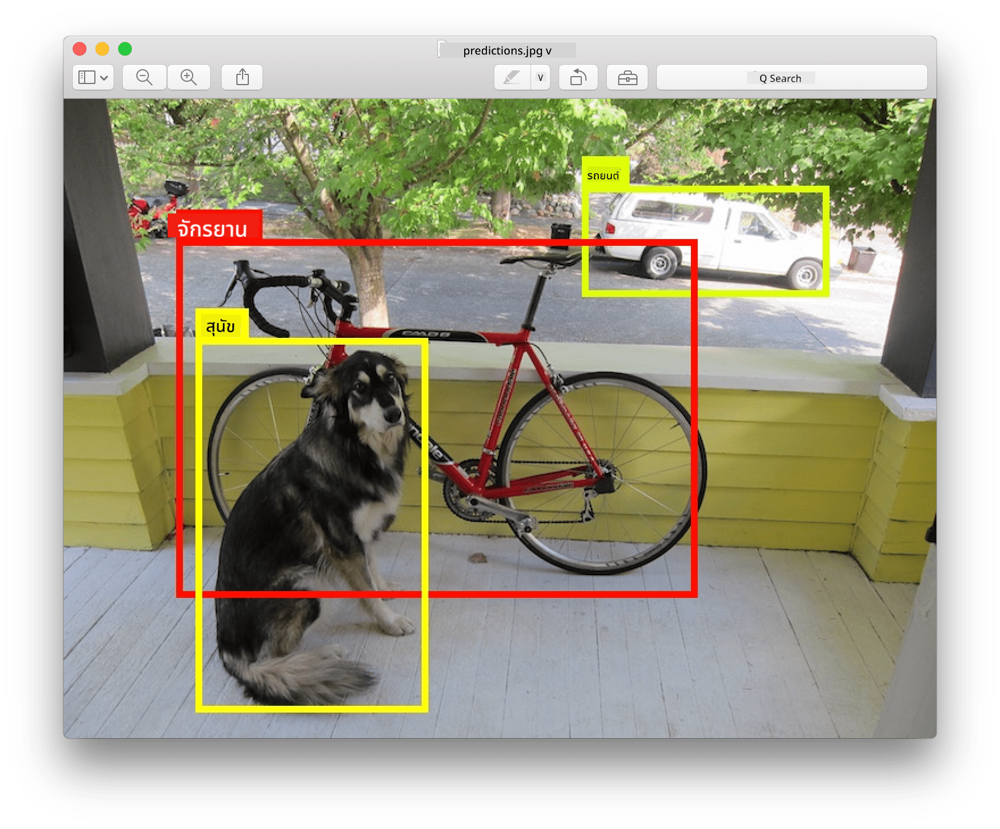
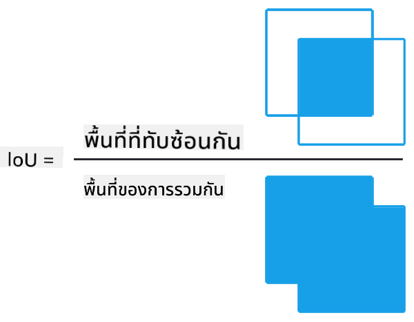

<!--
CO_OP_TRANSLATOR_METADATA:
{
  "original_hash": "d85c8b08f6d1b48fd7f35b99f93c1138",
  "translation_date": "2025-08-29T08:53:36+00:00",
  "source_file": "lessons/4-ComputerVision/11-ObjectDetection/README.md",
  "language_code": "th"
}
-->
# การตรวจจับวัตถุ

โมเดลการจำแนกภาพที่เราได้เรียนรู้มาก่อนหน้านี้จะรับภาพและให้ผลลัพธ์เป็นหมวดหมู่ เช่น คลาส 'ตัวเลข' ในปัญหา MNIST อย่างไรก็ตาม ในหลายกรณีเราไม่ได้ต้องการแค่รู้ว่าภาพนั้นมีวัตถุอยู่ แต่เราต้องการทราบตำแหน่งที่แน่นอนของวัตถุเหล่านั้น นี่คือจุดประสงค์ของ **การตรวจจับวัตถุ**

## [แบบทดสอบก่อนเรียน](https://ff-quizzes.netlify.app/en/ai/quiz/21)

> ภาพจาก [เว็บไซต์ YOLO v2](https://pjreddie.com/darknet/yolov2/)

## วิธีการตรวจจับวัตถุแบบง่าย

สมมติว่าเราต้องการค้นหาแมวในภาพ วิธีการตรวจจับวัตถุแบบง่ายมากจะเป็นดังนี้:

1. แบ่งภาพออกเป็นหลายส่วน
2. ใช้การจำแนกภาพในแต่ละส่วน
3. ส่วนที่มีการกระตุ้นสูงพอสามารถถือว่าเป็นส่วนที่มีวัตถุที่เราต้องการ

> *ภาพจาก [Exercise Notebook](ObjectDetection-TF.ipynb)*

อย่างไรก็ตาม วิธีนี้ยังไม่ดีนัก เพราะมันสามารถระบุตำแหน่งของกรอบวัตถุได้อย่างไม่แม่นยำ สำหรับตำแหน่งที่แม่นยำยิ่งขึ้น เราจำเป็นต้องใช้ **การถดถอย** เพื่อทำนายพิกัดของกรอบวัตถุ และสำหรับสิ่งนี้ เราต้องการชุดข้อมูลเฉพาะ

## การถดถอยสำหรับการตรวจจับวัตถุ

[บทความนี้](https://towardsdatascience.com/object-detection-with-neural-networks-a4e2c46b4491) มีการแนะนำที่ดีเกี่ยวกับการตรวจจับรูปร่าง

## ชุดข้อมูลสำหรับการตรวจจับวัตถุ

คุณอาจพบชุดข้อมูลต่อไปนี้สำหรับงานนี้:

* [PASCAL VOC](http://host.robots.ox.ac.uk/pascal/VOC/) - 20 คลาส
* [COCO](http://cocodataset.org/#home) - Common Objects in Context. 80 คลาส, กรอบวัตถุ และหน้ากากการแบ่งส่วน

## ตัวชี้วัดสำหรับการตรวจจับวัตถุ

### การตัดกันเหนือการรวม

สำหรับการจำแนกภาพนั้นง่ายที่จะวัดว่าอัลกอริทึมทำงานได้ดีแค่ไหน แต่สำหรับการตรวจจับวัตถุ เราต้องวัดทั้งความถูกต้องของคลาส และความแม่นยำของตำแหน่งกรอบวัตถุที่คาดการณ์ สำหรับกรอบวัตถุ เราใช้ตัวชี้วัดที่เรียกว่า **การตัดกันเหนือการรวม** (IoU) ซึ่งวัดว่ากรอบสองกรอบ (หรือพื้นที่สองพื้นที่) ทับซ้อนกันได้ดีแค่ไหน

> *ภาพที่ 2 จาก [บทความที่ยอดเยี่ยมเกี่ยวกับ IoU](https://pyimagesearch.com/2016/11/07/intersection-over-union-iou-for-object-detection/)*

แนวคิดง่าย ๆ คือ เราแบ่งพื้นที่ที่ตัดกันระหว่างสองรูปทรงด้วยพื้นที่รวมของพวกมัน สำหรับพื้นที่ที่เหมือนกัน IoU จะเท่ากับ 1 ในขณะที่สำหรับพื้นที่ที่ไม่ทับซ้อนกันเลย IoU จะเท่ากับ 0 ในกรณีอื่น ๆ ค่า IoU จะอยู่ระหว่าง 0 ถึง 1 โดยทั่วไปเราจะพิจารณาเฉพาะกรอบวัตถุที่มี IoU สูงกว่าค่าที่กำหนด

### ความแม่นยำเฉลี่ย

สมมติว่าเราต้องการวัดว่าคลาสวัตถุ $C$ ถูกตรวจจับได้ดีแค่ไหน ในการวัดนี้ เราใช้ตัวชี้วัด **ความแม่นยำเฉลี่ย** ซึ่งคำนวณดังนี้:

1. พิจารณา Precision-Recall curve ที่แสดงความแม่นยำขึ้นอยู่กับค่าการตรวจจับที่กำหนด (จาก 0 ถึง 1)
2. ขึ้นอยู่กับค่าการตรวจจับ เราจะได้วัตถุที่ตรวจจับได้มากหรือน้อยในภาพ และค่าความแม่นยำและการเรียกคืนที่แตกต่างกัน
3. กราฟจะมีลักษณะดังนี้:

> *ภาพจาก [NeuroWorkshop](http://github.com/shwars/NeuroWorkshop)*

ความแม่นยำเฉลี่ยสำหรับคลาส $C$ คือพื้นที่ใต้กราฟนี้ โดยเฉพาะแกน Recall มักถูกแบ่งออกเป็น 10 ส่วน และค่า Precision จะถูกเฉลี่ยในทุกจุดเหล่านั้น:

$$
AP = {1\over11}\sum_{i=0}^{10}\mbox{Precision}(\mbox{Recall}={i\over10})
$$

### AP และ IoU

เราจะพิจารณาเฉพาะการตรวจจับที่มี IoU สูงกว่าค่าที่กำหนด ตัวอย่างเช่น ในชุดข้อมูล PASCAL VOC โดยทั่วไป $\mbox{IoU Threshold} = 0.5$ ในขณะที่ใน COCO AP จะถูกวัดสำหรับค่าต่าง ๆ ของ $\mbox{IoU Threshold}$

> *ภาพจาก [NeuroWorkshop](http://github.com/shwars/NeuroWorkshop)*

### ความแม่นยำเฉลี่ยรวม - mAP

ตัวชี้วัดหลักสำหรับการตรวจจับวัตถุเรียกว่า **ความแม่นยำเฉลี่ยรวม** หรือ **mAP** ซึ่งเป็นค่าความแม่นยำเฉลี่ยที่เฉลี่ยในทุกคลาสของวัตถุ และบางครั้งยังเฉลี่ยใน $\mbox{IoU Threshold}$ รายละเอียดเพิ่มเติมเกี่ยวกับกระบวนการคำนวณ **mAP** สามารถดูได้ใน
[บทความนี้](https://medium.com/@timothycarlen/understanding-the-map-evaluation-metric-for-object-detection-a07fe6962cf3) และ [ตัวอย่างโค้ดที่นี่](https://gist.github.com/tarlen5/008809c3decf19313de216b9208f3734)

## วิธีการตรวจจับวัตถุที่แตกต่างกัน

มีสองประเภทใหญ่ของอัลกอริทึมการตรวจจับวัตถุ:

* **Region Proposal Networks** (R-CNN, Fast R-CNN, Faster R-CNN) แนวคิดหลักคือการสร้าง **Regions of Interests** (ROI) และใช้ CNN กับพวกมันเพื่อค้นหาการกระตุ้นสูงสุด วิธีนี้คล้ายกับวิธีง่าย ๆ แต่ ROI ถูกสร้างขึ้นอย่างชาญฉลาดมากขึ้น หนึ่งในข้อเสียใหญ่ของวิธีนี้คือมันช้า เพราะต้องใช้ CNN classifier หลายครั้งกับภาพ
* **One-pass** (YOLO, SSD, RetinaNet) วิธีการเหล่านี้ออกแบบเครือข่ายเพื่อทำนายทั้งคลาสและ ROI ในการผ่านครั้งเดียว

### R-CNN: Region-Based CNN

[R-CNN](http://islab.ulsan.ac.kr/files/announcement/513/rcnn_pami.pdf) ใช้ [Selective Search](http://www.huppelen.nl/publications/selectiveSearchDraft.pdf) เพื่อสร้างโครงสร้างลำดับชั้นของ ROI ซึ่งจะถูกส่งผ่านตัวดึงคุณลักษณะ CNN และ SVM-classifiers เพื่อกำหนดคลาสของวัตถุ และการถดถอยเชิงเส้นเพื่อกำหนดพิกัด *กรอบวัตถุ* [เอกสารอย่างเป็นทางการ](https://arxiv.org/pdf/1506.01497v1.pdf)

> *ภาพจาก van de Sande et al. ICCV’11*

> *ภาพจาก [บทความนี้](https://towardsdatascience.com/r-cnn-fast-r-cnn-faster-r-cnn-yolo-object-detection-algorithms-36d53571365e)*

### F-RCNN - Fast R-CNN

วิธีนี้คล้ายกับ R-CNN แต่ ROI ถูกกำหนดหลังจากที่เลเยอร์ convolution ถูกใช้แล้ว

> ภาพจาก [เอกสารอย่างเป็นทางการ](https://www.cv-foundation.org/openaccess/content_iccv_2015/papers/Girshick_Fast_R-CNN_ICCV_2015_paper.pdf), [arXiv](https://arxiv.org/pdf/1504.08083.pdf), 2015

### Faster R-CNN

แนวคิดหลักของวิธีนี้คือการใช้เครือข่ายประสาทเพื่อทำนาย ROI - ที่เรียกว่า *Region Proposal Network* [เอกสาร](https://arxiv.org/pdf/1506.01497.pdf), 2016

> ภาพจาก [เอกสารอย่างเป็นทางการ](https://arxiv.org/pdf/1506.01497.pdf)

### R-FCN: Region-Based Fully Convolutional Network

อัลกอริทึมนี้เร็วกว่าวิธี Faster R-CNN แนวคิดหลักคือ:

1. ดึงคุณลักษณะโดยใช้ ResNet-101
1. คุณลักษณะถูกประมวลผลโดย **Position-Sensitive Score Map** วัตถุแต่ละตัวจาก $C$ คลาสถูกแบ่งออกเป็น $k\times k$ พื้นที่ และเราฝึกเพื่อทำนายส่วนของวัตถุ
1. สำหรับแต่ละส่วนจาก $k\times k$ พื้นที่ เครือข่ายทั้งหมดลงคะแนนให้กับคลาสของวัตถุ และคลาสที่มีคะแนนสูงสุดจะถูกเลือก

> ภาพจาก [เอกสารอย่างเป็นทางการ](https://arxiv.org/abs/1605.06409)

### YOLO - You Only Look Once

YOLO เป็นอัลกอริทึมแบบเรียลไทม์ที่ผ่านครั้งเดียว แนวคิดหลักคือ:

 * ภาพถูกแบ่งออกเป็น $S\times S$ พื้นที่
 * สำหรับแต่ละพื้นที่ **CNN** ทำนาย $n$ วัตถุที่เป็นไปได้, พิกัด *กรอบวัตถุ* และ *ความมั่นใจ*=*ความน่าจะเป็น* * IoU.

 

> ภาพจาก [เอกสารอย่างเป็นทางการ](https://arxiv.org/abs/1506.02640)

### อัลกอริทึมอื่น ๆ

* RetinaNet: [เอกสารอย่างเป็นทางการ](https://arxiv.org/abs/1708.02002)
   - [การใช้งาน PyTorch ใน Torchvision](https://pytorch.org/vision/stable/_modules/torchvision/models/detection/retinanet.html)
   - [การใช้งาน Keras](https://github.com/fizyr/keras-retinanet)
   - [การตรวจจับวัตถุด้วย RetinaNet](https://keras.io/examples/vision/retinanet/) ในตัวอย่าง Keras
* SSD (Single Shot Detector): [เอกสารอย่างเป็นทางการ](https://arxiv.org/abs/1512.02325)

## ✍️ แบบฝึกหัด: การตรวจจับวัตถุ

เรียนรู้เพิ่มเติมในโน้ตบุ๊กต่อไปนี้:

[ObjectDetection.ipynb](ObjectDetection.ipynb)

## สรุป

ในบทเรียนนี้คุณได้สำรวจวิธีการต่าง ๆ ในการตรวจจับวัตถุ!

## 🚀 ความท้าทาย

อ่านบทความและโน้ตบุ๊กเกี่ยวกับ YOLO และลองใช้งานด้วยตัวคุณเอง

* [บทความที่ดี](https://www.analyticsvidhya.com/blog/2018/12/practical-guide-object-detection-yolo-framewor-python/) อธิบาย YOLO
 * [เว็บไซต์อย่างเป็นทางการ](https://pjreddie.com/darknet/yolo/)
 * Yolo: [การใช้งาน Keras](https://github.com/experiencor/keras-yolo2), [โน้ตบุ๊กแบบทีละขั้นตอน](https://github.com/experiencor/basic-yolo-keras/blob/master/Yolo%20Step-by-Step.ipynb)
 * Yolo v2: [การใช้งาน Keras](https://github.com/experiencor/keras-yolo2), [โน้ตบุ๊กแบบทีละขั้นตอน](https://github.com/experiencor/keras-yolo2/blob/master/Yolo%20Step-by-Step.ipynb)

## [แบบทดสอบหลังเรียน](https://ff-quizzes.netlify.app/en/ai/quiz/22)

## ทบทวนและศึกษาด้วยตนเอง

* [การตรวจจับวัตถุ](https://tjmachinelearning.com/lectures/1718/obj/) โดย Nikhil Sardana
* [การเปรียบเทียบอัลกอริทึมการตรวจจับวัตถุที่ดี](https://lilianweng.github.io/lil-log/2018/12/27/object-detection-part-4.html)
* [รีวิวอัลกอริทึม Deep Learning สำหรับการตรวจจับวัตถุ](https://medium.com/comet-app/review-of-deep-learning-algorithms-for-object-detection-c1f3d437b852)
* [การแนะนำทีละขั้นตอนเกี่ยวกับอัลกอริทึมการตรวจจับวัตถุพื้นฐาน](https://www.analyticsvidhya.com/blog/2018/10/a-step-by-step-introduction-to-the-basic-object-detection-algorithms-part-1/)
* [การใช้งาน Faster R-CNN ใน Python สำหรับการตรวจจับวัตถุ](https://www.analyticsvidhya.com/blog/2018/11/implementation-faster-r-cnn-python-object-detection/)

## [งาน: การตรวจจับวัตถุ](lab/README.md)

---

**ข้อจำกัดความรับผิดชอบ**:  
เอกสารนี้ได้รับการแปลโดยใช้บริการแปลภาษา AI [Co-op Translator](https://github.com/Azure/co-op-translator) แม้ว่าเราจะพยายามให้การแปลมีความถูกต้อง แต่โปรดทราบว่าการแปลอัตโนมัติอาจมีข้อผิดพลาดหรือความไม่ถูกต้อง เอกสารต้นฉบับในภาษาต้นทางควรถือเป็นแหล่งข้อมูลที่เชื่อถือได้ สำหรับข้อมูลที่สำคัญ แนะนำให้ใช้บริการแปลภาษาจากผู้เชี่ยวชาญ เราไม่รับผิดชอบต่อความเข้าใจผิดหรือการตีความที่ผิดพลาดซึ่งเกิดจากการใช้การแปลนี้