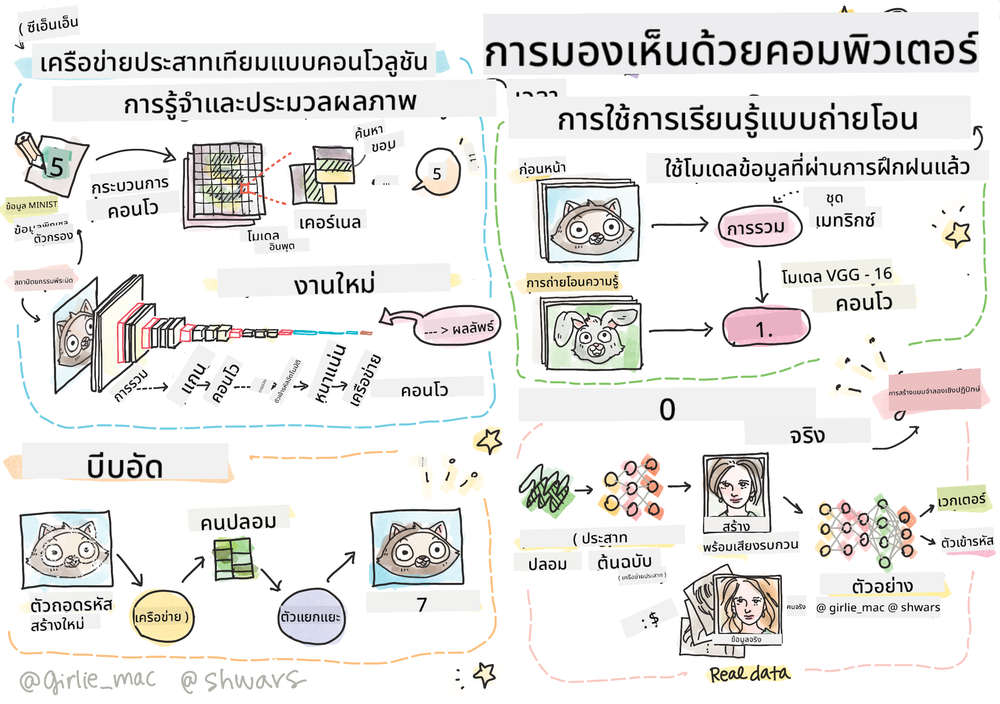

<!--
CO_OP_TRANSLATOR_METADATA:
{
  "original_hash": "58a52f000089c1d8906a4daa4ab1169b",
  "translation_date": "2025-08-29T08:45:21+00:00",
  "source_file": "lessons/4-ComputerVision/README.md",
  "language_code": "th"
}
-->
# การมองเห็นของคอมพิวเตอร์

ในส่วนนี้เราจะเรียนรู้เกี่ยวกับ:

* [แนะนำการมองเห็นของคอมพิวเตอร์และ OpenCV](06-IntroCV/README.md)
* [เครือข่ายประสาทเทียมแบบคอนโวลูชัน](07-ConvNets/README.md)
* [เครือข่ายที่ผ่านการฝึกมาแล้วและการเรียนรู้แบบถ่ายโอน](08-TransferLearning/README.md) 
* [ออโตเอนโคเดอร์](09-Autoencoders/README.md)
* [เครือข่ายปฏิปักษ์เชิงกำเนิด](10-GANs/README.md)
* [การตรวจจับวัตถุ](11-ObjectDetection/README.md)
* [การแบ่งส่วนเชิงความหมาย](12-Segmentation/README.md)

---

**ข้อจำกัดความรับผิดชอบ**:  
เอกสารนี้ได้รับการแปลโดยใช้บริการแปลภาษา AI [Co-op Translator](https://github.com/Azure/co-op-translator) แม้ว่าเราจะพยายามให้การแปลมีความถูกต้อง แต่โปรดทราบว่าการแปลอัตโนมัติอาจมีข้อผิดพลาดหรือความไม่แม่นยำ เอกสารต้นฉบับในภาษาต้นทางควรถือเป็นแหล่งข้อมูลที่เชื่อถือได้ สำหรับข้อมูลที่สำคัญ แนะนำให้ใช้บริการแปลภาษาจากผู้เชี่ยวชาญ เราไม่รับผิดชอบต่อความเข้าใจผิดหรือการตีความที่ผิดพลาดซึ่งเกิดจากการใช้การแปลนี้