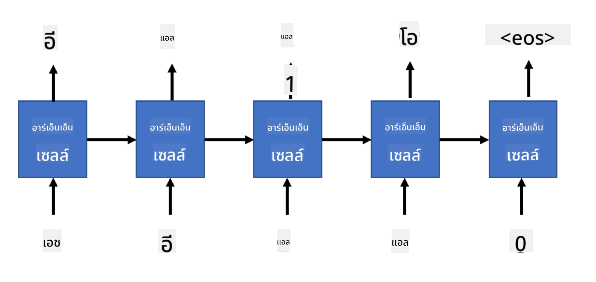

<!--
CO_OP_TRANSLATOR_METADATA:
{
  "original_hash": "51be6057374d01d70e07dd5ec88ebc0d",
  "translation_date": "2025-09-23T09:12:01+00:00",
  "source_file": "lessons/5-NLP/17-GenerativeNetworks/README.md",
  "language_code": "th"
}
-->
# เครือข่ายการสร้างสรรค์

## [แบบทดสอบก่อนเรียน](https://ff-quizzes.netlify.app/en/ai/quiz/33)

Recurrent Neural Networks (RNNs) และรูปแบบเซลล์ที่มีการควบคุม เช่น Long Short Term Memory Cells (LSTMs) และ Gated Recurrent Units (GRUs) ได้มอบกลไกสำหรับการสร้างแบบจำลองภาษา โดยสามารถเรียนรู้ลำดับคำและให้การคาดการณ์คำถัดไปในลำดับได้ สิ่งนี้ทำให้เราสามารถใช้ RNNs สำหรับ **งานสร้างสรรค์** เช่น การสร้างข้อความทั่วไป การแปลภาษา และแม้กระทั่งการสร้างคำบรรยายภาพ

> ✅ ลองคิดถึงช่วงเวลาที่คุณได้รับประโยชน์จากงานสร้างสรรค์ เช่น การเติมข้อความอัตโนมัติขณะพิมพ์ ค้นคว้าเกี่ยวกับแอปพลิเคชันที่คุณชื่นชอบเพื่อดูว่ามีการใช้ RNNs หรือไม่

ในสถาปัตยกรรม RNN ที่เราได้พูดถึงในหน่วยก่อนหน้า แต่ละหน่วย RNN จะสร้างสถานะซ่อนถัดไปเป็นผลลัพธ์ อย่างไรก็ตาม เราสามารถเพิ่มผลลัพธ์อีกตัวให้กับแต่ละหน่วย RNN ซึ่งจะช่วยให้เราสามารถสร้าง **ลำดับ** (ที่มีความยาวเท่ากับลำดับต้นฉบับ) นอกจากนี้ เรายังสามารถใช้หน่วย RNN ที่ไม่รับข้อมูลเข้าในแต่ละขั้นตอน โดยใช้เพียงเวกเตอร์สถานะเริ่มต้น และสร้างลำดับผลลัพธ์ออกมา

สิ่งนี้นำไปสู่สถาปัตยกรรมเครือข่ายประสาทที่แตกต่างกัน ซึ่งแสดงในภาพด้านล่าง:


> ภาพจากบล็อกโพสต์ [Unreasonable Effectiveness of Recurrent Neural Networks](http://karpathy.github.io/2015/05/21/rnn-effectiveness/) โดย [Andrej Karpaty](http://karpathy.github.io/)

* **One-to-one** เป็นเครือข่ายประสาทแบบดั้งเดิมที่มีข้อมูลเข้าและผลลัพธ์หนึ่งตัว
* **One-to-many** เป็นสถาปัตยกรรมการสร้างสรรค์ที่รับค่าข้อมูลเข้าเพียงหนึ่งค่า และสร้างลำดับผลลัพธ์ออกมา ตัวอย่างเช่น หากเราต้องการฝึกเครือข่าย **การสร้างคำบรรยายภาพ** ที่จะสร้างคำอธิบายข้อความของภาพ เราสามารถใช้ภาพเป็นข้อมูลเข้า ส่งผ่าน CNN เพื่อรับสถานะซ่อน และใช้เครือข่ายแบบวนซ้ำสร้างคำบรรยายทีละคำ
* **Many-to-one** สอดคล้องกับสถาปัตยกรรม RNN ที่เราได้อธิบายในหน่วยก่อนหน้า เช่น การจัดประเภทข้อความ
* **Many-to-many** หรือ **sequence-to-sequence** สอดคล้องกับงาน เช่น **การแปลภาษา** ซึ่งเรามี RNN ตัวแรกที่รวบรวมข้อมูลทั้งหมดจากลำดับข้อมูลเข้าเข้าสู่สถานะซ่อน และ RNN ตัวที่สองจะคลายสถานะนี้ออกมาเป็นลำดับผลลัพธ์

ในหน่วยนี้ เราจะมุ่งเน้นไปที่โมเดลการสร้างสรรค์แบบง่ายที่ช่วยให้เราสร้างข้อความได้ เพื่อความเรียบง่าย เราจะใช้การแบ่งคำในระดับตัวอักษร

เราจะฝึก RNN นี้เพื่อสร้างข้อความทีละขั้นตอน ในแต่ละขั้นตอน เราจะใช้ลำดับตัวอักษรที่มีความยาว `nchars` และให้เครือข่ายสร้างตัวอักษรถัดไปสำหรับแต่ละตัวอักษรในข้อมูลเข้า:



เมื่อสร้างข้อความ (ในระหว่างการอนุมาน) เราจะเริ่มต้นด้วย **คำเริ่มต้น** ซึ่งจะถูกส่งผ่านเซลล์ RNN เพื่อสร้างสถานะกลาง และจากสถานะนี้การสร้างข้อความจะเริ่มต้น เราจะสร้างตัวอักษรทีละตัว และส่งสถานะและตัวอักษรที่สร้างไปยังเซลล์ RNN ตัวถัดไปเพื่อสร้างตัวอักษรถัดไป จนกว่าจะสร้างข้อความครบตามที่ต้องการ


> ภาพโดยผู้เขียน

## ✍️ แบบฝึกหัด: เครือข่ายการสร้างสรรค์

เรียนรู้เพิ่มเติมในโน้ตบุ๊กต่อไปนี้:

* [Generative Networks with PyTorch](GenerativePyTorch.ipynb)
* [Generative Networks with TensorFlow](GenerativeTF.ipynb)

## การสร้างข้อความแบบนุ่มนวลและอุณหภูมิ

ผลลัพธ์ของแต่ละเซลล์ RNN คือการแจกแจงความน่าจะเป็นของตัวอักษร หากเราเลือกตัวอักษรที่มีความน่าจะเป็นสูงสุดเป็นตัวอักษรถัดไปในข้อความที่สร้างขึ้น ข้อความมักจะ "วนซ้ำ" ระหว่างลำดับตัวอักษรเดิมซ้ำไปซ้ำมา เช่นในตัวอย่างนี้:

```
today of the second the company and a second the company ...
```

อย่างไรก็ตาม หากเราดูการแจกแจงความน่าจะเป็นสำหรับตัวอักษรถัดไป อาจพบว่าความแตกต่างระหว่างความน่าจะเป็นสูงสุดสองสามตัวไม่ได้มากนัก เช่น ตัวอักษรหนึ่งอาจมีความน่าจะเป็น 0.2 และอีกตัวหนึ่ง 0.19 เป็นต้น ตัวอย่างเช่น เมื่อมองหาตัวอักษรถัดไปในลำดับ '*play*' ตัวอักษรถัดไปอาจเป็นช่องว่างหรือ **e** (เช่นในคำว่า *player*) ได้เท่าๆ กัน

สิ่งนี้นำไปสู่ข้อสรุปว่าไม่ใช่เรื่อง "ยุติธรรม" เสมอไปที่จะเลือกตัวอักษรที่มีความน่าจะเป็นสูงสุด เพราะการเลือกตัวอักษรที่มีความน่าจะเป็นรองลงมาอาจยังนำไปสู่ข้อความที่มีความหมายได้ การสุ่มตัวอักษรจากการแจกแจงความน่าจะเป็นที่เครือข่ายให้มาจึงเป็นวิธีที่ฉลาดกว่า นอกจากนี้ เรายังสามารถใช้พารามิเตอร์ **อุณหภูมิ** เพื่อปรับการแจกแจงความน่าจะเป็นให้เรียบขึ้น หากเราต้องการเพิ่มความสุ่ม หรือทำให้ชันขึ้น หากเราต้องการยึดติดกับตัวอักษรที่มีความน่าจะเป็นสูงสุดมากขึ้น

สำรวจวิธีการสร้างข้อความแบบนุ่มนวลในโน้ตบุ๊กที่ลิงก์ไว้ด้านบน

## สรุป

แม้ว่าการสร้างข้อความอาจมีประโยชน์ในตัวเอง แต่ประโยชน์สำคัญมาจากความสามารถในการสร้างข้อความโดยใช้ RNNs จากเวกเตอร์คุณลักษณะเริ่มต้น ตัวอย่างเช่น การสร้างข้อความถูกใช้เป็นส่วนหนึ่งของการแปลภาษา (sequence-to-sequence ในกรณีนี้สถานะจาก *encoder* ถูกใช้เพื่อสร้างหรือ *decode* ข้อความที่แปล) หรือการสร้างคำอธิบายข้อความของภาพ (ในกรณีนี้เวกเตอร์คุณลักษณะจะมาจากตัวดึงข้อมูล CNN)

## 🚀 ความท้าทาย

เรียนรู้เพิ่มเติมเกี่ยวกับหัวข้อนี้ใน Microsoft Learn

* การสร้างข้อความด้วย [PyTorch](https://docs.microsoft.com/learn/modules/intro-natural-language-processing-pytorch/6-generative-networks/?WT.mc_id=academic-77998-cacaste)/[TensorFlow](https://docs.microsoft.com/learn/modules/intro-natural-language-processing-tensorflow/5-generative-networks/?WT.mc_id=academic-77998-cacaste)

## [แบบทดสอบหลังเรียน](https://ff-quizzes.netlify.app/en/ai/quiz/34)

## ทบทวนและศึกษาด้วยตนเอง

นี่คือบทความบางส่วนเพื่อขยายความรู้ของคุณ

* วิธีการต่างๆ ในการสร้างข้อความด้วย Markov Chain, LSTM และ GPT-2: [บล็อกโพสต์](https://towardsdatascience.com/text-generation-gpt-2-lstm-markov-chain-9ea371820e1e)
* ตัวอย่างการสร้างข้อความใน [เอกสาร Keras](https://keras.io/examples/generative/lstm_character_level_text_generation/)

## [การบ้าน](lab/README.md)

เราได้เห็นวิธีการสร้างข้อความทีละตัวอักษร ในห้องปฏิบัติการ คุณจะสำรวจการสร้างข้อความในระดับคำ

---

