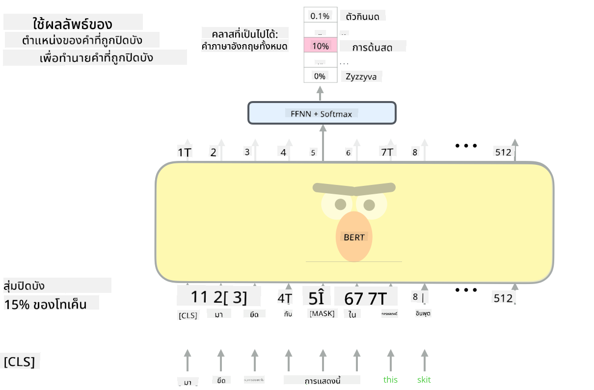

<!--
CO_OP_TRANSLATOR_METADATA:
{
  "original_hash": "7e617f0b8de85a43957a853aba09bfeb",
  "translation_date": "2025-08-29T09:20:25+00:00",
  "source_file": "lessons/5-NLP/18-Transformers/README.md",
  "language_code": "th"
}
-->
# กลไกความสนใจและทรานส์ฟอร์เมอร์

## [แบบทดสอบก่อนเรียน](https://ff-quizzes.netlify.app/en/ai/quiz/35)

หนึ่งในปัญหาที่สำคัญที่สุดในด้าน NLP คือ **การแปลภาษาโดยเครื่อง** ซึ่งเป็นงานสำคัญที่อยู่เบื้องหลังเครื่องมืออย่าง Google Translate ในส่วนนี้ เราจะมุ่งเน้นไปที่การแปลภาษาโดยเครื่อง หรือในเชิงทั่วไปมากขึ้นคือ งาน *sequence-to-sequence* (ซึ่งเรียกอีกอย่างว่า **sentence transduction**)

ด้วย RNNs งาน sequence-to-sequence ถูกดำเนินการโดยเครือข่าย recurrent สองตัว โดยเครือข่ายตัวหนึ่งคือ **encoder** ทำหน้าที่บีบอัดลำดับอินพุตให้เป็นสถานะซ่อน (hidden state) ในขณะที่อีกเครือข่ายหนึ่งคือ **decoder** ทำหน้าที่ขยายสถานะซ่อนนี้ให้เป็นผลลัพธ์ที่แปลแล้ว อย่างไรก็ตาม วิธีนี้มีปัญหาบางประการ:

* สถานะสุดท้ายของเครือข่าย encoder มีปัญหาในการจดจำจุดเริ่มต้นของประโยค ซึ่งส่งผลให้คุณภาพของโมเดลลดลงสำหรับประโยคที่ยาว
* คำทุกคำในลำดับมีผลกระทบต่อผลลัพธ์เท่ากัน แต่ในความเป็นจริง คำบางคำในลำดับอินพุตมักมีผลกระทบต่อผลลัพธ์มากกว่าคำอื่น

**กลไกความสนใจ (Attention Mechanisms)** ช่วยให้สามารถให้น้ำหนักกับผลกระทบเชิงบริบทของแต่ละเวกเตอร์อินพุตต่อการคาดการณ์ผลลัพธ์ของ RNN วิธีการนี้ทำได้โดยการสร้างทางลัดระหว่างสถานะกลางของ RNN อินพุตและ RNN เอาต์พุต ด้วยวิธีนี้ เมื่อสร้างสัญลักษณ์เอาต์พุต yt เราจะพิจารณาสถานะซ่อนของอินพุตทั้งหมด hi โดยมีค่าสัมประสิทธิ์น้ำหนักที่แตกต่างกัน αt,i

> โมเดล encoder-decoder พร้อมกลไกความสนใจแบบเพิ่มจาก [Bahdanau et al., 2015](https://arxiv.org/pdf/1409.0473.pdf) อ้างอิงจาก [บล็อกโพสต์นี้](https://lilianweng.github.io/lil-log/2018/06/24/attention-attention.html)

เมทริกซ์ความสนใจ {αi,j} แสดงถึงระดับที่คำอินพุตบางคำมีบทบาทในการสร้างคำที่กำหนดในลำดับเอาต์พุต ด้านล่างคือตัวอย่างของเมทริกซ์ดังกล่าว:

> ภาพจาก [Bahdanau et al., 2015](https://arxiv.org/pdf/1409.0473.pdf) (รูปที่ 3)

กลไกความสนใจมีบทบาทสำคัญในสถานะปัจจุบันหรือใกล้เคียงสถานะปัจจุบันของ NLP อย่างไรก็ตาม การเพิ่มกลไกความสนใจทำให้จำนวนพารามิเตอร์ของโมเดลเพิ่มขึ้นอย่างมาก ซึ่งนำไปสู่ปัญหาการขยายตัวของ RNNs ข้อจำกัดสำคัญของการขยาย RNNs คือธรรมชาติของโมเดลที่ต้องประมวลผลตามลำดับ ทำให้การฝึกอบรมแบบขนานทำได้ยาก ใน RNN แต่ละองค์ประกอบของลำดับต้องถูกประมวลผลตามลำดับ ซึ่งหมายความว่าไม่สามารถทำแบบขนานได้ง่าย

> ภาพจาก [Google's Blog](https://research.googleblog.com/2016/09/a-neural-network-for-machine.html)

การนำกลไกความสนใจมาใช้ร่วมกับข้อจำกัดนี้นำไปสู่การสร้างโมเดลทรานส์ฟอร์เมอร์ที่เป็นสถานะปัจจุบัน เช่น BERT และ Open-GPT3

## โมเดลทรานส์ฟอร์เมอร์

แนวคิดหลักอย่างหนึ่งของทรานส์ฟอร์เมอร์คือการหลีกเลี่ยงธรรมชาติที่ต้องประมวลผลตามลำดับของ RNNs และสร้างโมเดลที่สามารถประมวลผลแบบขนานได้ในระหว่างการฝึกอบรม สิ่งนี้ทำได้โดยการนำสองแนวคิดมาใช้:

* การเข้ารหัสตำแหน่ง (positional encoding)
* การใช้กลไก self-attention เพื่อจับรูปแบบแทนการใช้ RNNs (หรือ CNNs) (นี่คือเหตุผลที่บทความที่แนะนำทรานส์ฟอร์เมอร์มีชื่อว่า *[Attention is all you need](https://arxiv.org/abs/1706.03762)*)

### การเข้ารหัส/ฝังตำแหน่ง (Positional Encoding/Embedding)

แนวคิดของการเข้ารหัสตำแหน่งมีดังนี้:
1. เมื่อใช้ RNNs ตำแหน่งสัมพัทธ์ของโทเค็นจะแสดงด้วยจำนวนขั้นตอน ดังนั้นจึงไม่จำเป็นต้องแสดงอย่างชัดเจน
2. อย่างไรก็ตาม เมื่อเปลี่ยนมาใช้กลไกความสนใจ เราจำเป็นต้องทราบตำแหน่งสัมพัทธ์ของโทเค็นในลำดับ
3. เพื่อให้ได้การเข้ารหัสตำแหน่ง เราเพิ่มลำดับตำแหน่งโทเค็นในลำดับ (เช่น ลำดับตัวเลข 0, 1, ...)
4. จากนั้นเราผสมตำแหน่งโทเค็นกับเวกเตอร์ฝังโทเค็น โดยการแปลงตำแหน่ง (จำนวนเต็ม) เป็นเวกเตอร์ เราสามารถใช้วิธีการต่างๆ ได้:

* การฝึกฝังตำแหน่งแบบ trainable embedding คล้ายกับการฝังโทเค็น นี่คือวิธีที่เราพิจารณาในที่นี้ เราใช้เลเยอร์ embedding กับทั้งโทเค็นและตำแหน่งของพวกมัน ซึ่งส่งผลให้ได้เวกเตอร์ฝังที่มีมิติเท่ากัน จากนั้นเราจึงนำมาบวกกัน
* ฟังก์ชันการเข้ารหัสตำแหน่งแบบคงที่ ตามที่เสนอในบทความต้นฉบับ

> ภาพโดยผู้เขียน

ผลลัพธ์ที่ได้จากการฝังตำแหน่งจะรวมทั้งโทเค็นต้นฉบับและตำแหน่งของมันในลำดับ

### Self-Attention แบบหลายหัว (Multi-Head Self-Attention)

ต่อไป เราจำเป็นต้องจับรูปแบบบางอย่างในลำดับของเรา ทรานส์ฟอร์เมอร์ใช้กลไก **self-attention** ซึ่งเป็นการนำความสนใจไปใช้กับลำดับเดียวกันทั้งในอินพุตและเอาต์พุต การใช้ self-attention ช่วยให้เราพิจารณาบริบทในประโยค และดูว่าคำใดมีความสัมพันธ์กัน ตัวอย่างเช่น ช่วยให้เราเห็นว่าคำใดถูกอ้างถึงโดยคำสรรพนาม เช่น *it* และยังพิจารณาบริบท:

> ภาพจาก [Google Blog](https://research.googleblog.com/2017/08/transformer-novel-neural-network.html)

ในทรานส์ฟอร์เมอร์ เราใช้ **Multi-Head Attention** เพื่อให้เครือข่ายสามารถจับความสัมพันธ์หลายประเภท เช่น ความสัมพันธ์ระยะยาวกับระยะสั้น ความสัมพันธ์แบบอ้างอิงร่วมกับความสัมพันธ์อื่นๆ เป็นต้น

[สมุดโน้ต TensorFlow](TransformersTF.ipynb) มีรายละเอียดเพิ่มเติมเกี่ยวกับการนำเลเยอร์ทรานส์ฟอร์เมอร์ไปใช้

### ความสนใจระหว่าง Encoder-Decoder

ในทรานส์ฟอร์เมอร์ ความสนใจถูกใช้ในสองที่:

* เพื่อจับรูปแบบในข้อความอินพุตโดยใช้ self-attention
* เพื่อทำการแปลลำดับ - ซึ่งเป็นเลเยอร์ความสนใจระหว่าง encoder และ decoder

ความสนใจระหว่าง encoder-decoder คล้ายกับกลไกความสนใจที่ใช้ใน RNNs ตามที่อธิบายไว้ในตอนต้นของส่วนนี้ แผนภาพแบบเคลื่อนไหวนี้อธิบายบทบาทของความสนใจระหว่าง encoder-decoder

เนื่องจากแต่ละตำแหน่งอินพุตถูกแมปอย่างอิสระไปยังแต่ละตำแหน่งเอาต์พุต ทรานส์ฟอร์เมอร์จึงสามารถประมวลผลแบบขนานได้ดีกว่า RNNs ซึ่งช่วยให้สร้างโมเดลภาษาที่ใหญ่ขึ้นและแสดงออกได้มากขึ้น หัวความสนใจแต่ละหัวสามารถใช้เพื่อเรียนรู้ความสัมพันธ์ระหว่างคำที่แตกต่างกัน ซึ่งช่วยปรับปรุงงานประมวลผลภาษาธรรมชาติในขั้นตอนต่อไป

## BERT

**BERT** (Bidirectional Encoder Representations from Transformers) เป็นเครือข่ายทรานส์ฟอร์เมอร์ขนาดใหญ่มากที่มี 12 เลเยอร์สำหรับ *BERT-base* และ 24 เลเยอร์สำหรับ *BERT-large* โมเดลนี้ถูกฝึกอบรมล่วงหน้าด้วยชุดข้อมูลข้อความขนาดใหญ่ (WikiPedia + หนังสือ) โดยใช้การฝึกอบรมแบบไม่มีผู้ดูแล (การทำนายคำที่ถูกปิดบังในประโยค) ในระหว่างการฝึกอบรมล่วงหน้า โมเดลจะดูดซับความเข้าใจภาษาระดับสูง ซึ่งสามารถนำไปใช้กับชุดข้อมูลอื่นๆ ได้โดยการปรับแต่งเพิ่มเติม กระบวนการนี้เรียกว่า **การเรียนรู้แบบถ่ายโอน (transfer learning)**

> ภาพ [ที่มา](http://jalammar.github.io/illustrated-bert/)

## ✍️ แบบฝึกหัด: ทรานส์ฟอร์เมอร์

เรียนรู้เพิ่มเติมในสมุดโน้ตต่อไปนี้:

* [ทรานส์ฟอร์เมอร์ใน PyTorch](TransformersPyTorch.ipynb)
* [ทรานส์ฟอร์เมอร์ใน TensorFlow](TransformersTF.ipynb)

## สรุป

ในบทเรียนนี้ คุณได้เรียนรู้เกี่ยวกับทรานส์ฟอร์เมอร์และกลไกความสนใจ ซึ่งเป็นเครื่องมือสำคัญในกล่องเครื่องมือ NLP มีสถาปัตยกรรมทรานส์ฟอร์เมอร์หลากหลายรูปแบบ เช่น BERT, DistilBERT, BigBird, OpenGPT3 และอื่นๆ ที่สามารถปรับแต่งได้ [แพ็กเกจ HuggingFace](https://github.com/huggingface/) มีที่เก็บสำหรับการฝึกอบรมสถาปัตยกรรมเหล่านี้หลายแบบด้วย PyTorch และ TensorFlow

## 🚀 ความท้าทาย

## [แบบทดสอบหลังเรียน](https://ff-quizzes.netlify.app/en/ai/quiz/36)

## การทบทวนและการศึกษาด้วยตนเอง

* [บล็อกโพสต์](https://mchromiak.github.io/articles/2017/Sep/12/Transformer-Attention-is-all-you-need/) ที่อธิบายบทความคลาสสิก [Attention is all you need](https://arxiv.org/abs/1706.03762) เกี่ยวกับทรานส์ฟอร์เมอร์
* [ชุดบล็อกโพสต์](https://towardsdatascience.com/transformers-explained-visually-part-1-overview-of-functionality-95a6dd460452) เกี่ยวกับทรานส์ฟอร์เมอร์ที่อธิบายสถาปัตยกรรมอย่างละเอียด

## [งานที่ได้รับมอบหมาย](assignment.md)

---

**ข้อจำกัดความรับผิดชอบ**:  
เอกสารนี้ได้รับการแปลโดยใช้บริการแปลภาษา AI [Co-op Translator](https://github.com/Azure/co-op-translator) แม้ว่าเราจะพยายามให้การแปลมีความถูกต้อง แต่โปรดทราบว่าการแปลอัตโนมัติอาจมีข้อผิดพลาดหรือความไม่แม่นยำ เอกสารต้นฉบับในภาษาดั้งเดิมควรถือเป็นแหล่งข้อมูลที่เชื่อถือได้ สำหรับข้อมูลที่สำคัญ แนะนำให้ใช้บริการแปลภาษาจากผู้เชี่ยวชาญ เราไม่รับผิดชอบต่อความเข้าใจผิดหรือการตีความที่ผิดพลาดซึ่งเกิดจากการใช้การแปลนี้