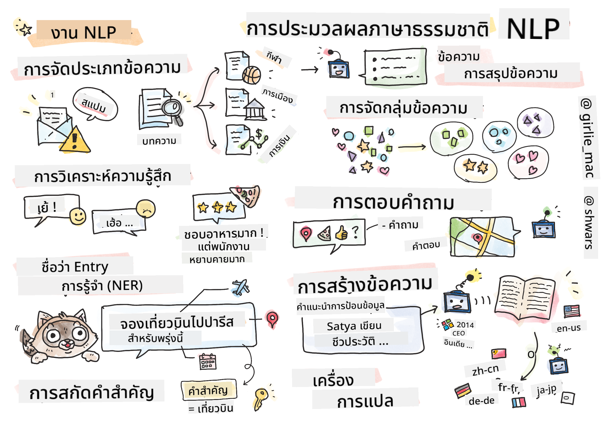

<!--
CO_OP_TRANSLATOR_METADATA:
{
  "original_hash": "8ef02a9318257ea140ed3ed74442096d",
  "translation_date": "2025-08-29T09:16:38+00:00",
  "source_file": "lessons/5-NLP/README.md",
  "language_code": "th"
}
-->
# การประมวลผลภาษาธรรมชาติ



ในส่วนนี้ เราจะมุ่งเน้นการใช้เครือข่ายประสาทเทียม (Neural Networks) เพื่อจัดการกับงานที่เกี่ยวข้องกับ **การประมวลผลภาษาธรรมชาติ (Natural Language Processing - NLP)** มีปัญหาหลายประเภทใน NLP ที่เราต้องการให้คอมพิวเตอร์สามารถแก้ไขได้:

* **การจัดประเภทข้อความ** เป็นปัญหาการจัดประเภททั่วไปที่เกี่ยวข้องกับลำดับข้อความ ตัวอย่างเช่น การจัดประเภทอีเมลว่าเป็นสแปมหรือไม่ใช่สแปม หรือการจัดหมวดหมู่บทความเป็นกีฬา ธุรกิจ การเมือง เป็นต้น นอกจากนี้ ในการพัฒนาช่องสนทนา (chat bots) เรามักต้องเข้าใจสิ่งที่ผู้ใช้ต้องการจะพูด -- ในกรณีนี้เรากำลังจัดการกับ **การจัดประเภทเจตนา (intent classification)** ซึ่งมักต้องจัดการกับหมวดหมู่จำนวนมาก
* **การวิเคราะห์ความรู้สึก (Sentiment analysis)** เป็นปัญหาการถดถอยทั่วไป ที่เราต้องกำหนดตัวเลข (ความรู้สึก) ที่สอดคล้องกับความหมายที่เป็นบวก/ลบของประโยค เวอร์ชันที่ซับซ้อนกว่าของการวิเคราะห์ความรู้สึกคือ **การวิเคราะห์ความรู้สึกตามแง่มุม (Aspect-Based Sentiment Analysis - ABSA)** ซึ่งเรากำหนดความรู้สึกไม่ใช่กับทั้งประโยค แต่กับส่วนต่าง ๆ ของมัน (แง่มุม) เช่น *ในร้านอาหารนี้ ฉันชอบอาหาร แต่บรรยากาศแย่มาก*
* **การจดจำชื่อหน่วยงาน (Named Entity Recognition - NER)** หมายถึงปัญหาในการดึงข้อมูลหน่วยงานบางอย่างจากข้อความ ตัวอย่างเช่น เราอาจต้องเข้าใจว่าในวลี *ฉันต้องบินไปปารีสพรุ่งนี้* คำว่า *พรุ่งนี้* หมายถึงวันที่ และ *ปารีส* เป็นสถานที่  
* **การดึงคำสำคัญ (Keyword extraction)** คล้ายกับ NER แต่เราต้องดึงคำที่สำคัญต่อความหมายของประโยคโดยอัตโนมัติ โดยไม่ต้องฝึกฝนล่วงหน้าสำหรับประเภทหน่วยงานเฉพาะ
* **การจัดกลุ่มข้อความ (Text clustering)** มีประโยชน์เมื่อเราต้องการจัดกลุ่มประโยคที่คล้ายกันเข้าด้วยกัน เช่น คำขอที่คล้ายกันในบทสนทนาการสนับสนุนทางเทคนิค
* **การตอบคำถาม (Question answering)** หมายถึงความสามารถของโมเดลในการตอบคำถามเฉพาะ โมเดลจะได้รับข้อความและคำถามเป็นข้อมูลนำเข้า และต้องระบุตำแหน่งในข้อความที่มีคำตอบของคำถาม (หรือบางครั้งสร้างข้อความคำตอบ)
* **การสร้างข้อความ (Text Generation)** คือความสามารถของโมเดลในการสร้างข้อความใหม่ สามารถพิจารณาเป็นงานการจัดประเภทที่ทำนายตัวอักษร/คำถัดไปตาม *ข้อความนำ* โมเดลการสร้างข้อความขั้นสูง เช่น GPT-3 สามารถแก้ไขงาน NLP อื่น ๆ เช่น การจัดประเภท โดยใช้เทคนิคที่เรียกว่า [การเขียนโปรแกรมด้วยคำสั่ง (prompt programming)](https://towardsdatascience.com/software-3-0-how-prompting-will-change-the-rules-of-the-game-a982fbfe1e0) หรือ [วิศวกรรมคำสั่ง (prompt engineering)](https://medium.com/swlh/openai-gpt-3-and-prompt-engineering-dcdc2c5fcd29)
* **การสรุปข้อความ (Text summarization)** เป็นเทคนิคที่เราต้องการให้คอมพิวเตอร์ "อ่าน" ข้อความยาว ๆ และสรุปในไม่กี่ประโยค
* **การแปลภาษา (Machine translation)** สามารถมองว่าเป็นการรวมกันของการเข้าใจข้อความในภาษาหนึ่ง และการสร้างข้อความในอีกภาษาหนึ่ง

ในช่วงแรก งาน NLP ส่วนใหญ่ถูกแก้ไขด้วยวิธีการแบบดั้งเดิม เช่น ไวยากรณ์ ตัวอย่างเช่น ในการแปลภาษา เครื่องมือวิเคราะห์ (parsers) ถูกใช้เพื่อแปลงประโยคเริ่มต้นเป็นต้นไม้ไวยากรณ์ จากนั้นโครงสร้างเชิงความหมายระดับสูงจะถูกดึงออกมาเพื่อแสดงความหมายของประโยค และจากความหมายนี้และไวยากรณ์ของภาษาปลายทาง ผลลัพธ์จะถูกสร้างขึ้น ปัจจุบัน งาน NLP หลายงานถูกแก้ไขได้อย่างมีประสิทธิภาพมากขึ้นด้วยเครือข่ายประสาทเทียม

> วิธีการ NLP แบบดั้งเดิมหลายวิธีถูกนำไปใช้ใน [Natural Language Processing Toolkit (NLTK)](https://www.nltk.org) ซึ่งเป็นไลบรารี Python มี [หนังสือ NLTK](https://www.nltk.org/book/) ที่ยอดเยี่ยมซึ่งครอบคลุมวิธีการแก้ไขงาน NLP ต่าง ๆ โดยใช้ NLTK

ในหลักสูตรของเรา เราจะมุ่งเน้นการใช้เครือข่ายประสาทเทียมสำหรับ NLP และจะใช้ NLTK เมื่อจำเป็น

เราได้เรียนรู้เกี่ยวกับการใช้เครือข่ายประสาทเทียมในการจัดการข้อมูลแบบตารางและภาพแล้ว ความแตกต่างหลักระหว่างประเภทข้อมูลเหล่านั้นกับข้อความคือ ข้อความเป็นลำดับที่มีความยาวแปรผัน ในขณะที่ขนาดข้อมูลนำเข้าในกรณีของภาพเป็นที่ทราบล่วงหน้า แม้ว่าเครือข่ายแบบคอนโวลูชันสามารถดึงรูปแบบจากข้อมูลนำเข้าได้ แต่รูปแบบในข้อความมีความซับซ้อนมากกว่า เช่น เราอาจมีการปฏิเสธที่แยกจากหัวเรื่องด้วยคำจำนวนมาก (เช่น *ฉันไม่ชอบส้ม* กับ *ฉันไม่ชอบส้มที่ใหญ่ สีสันสดใส และอร่อย*) และนั่นยังคงต้องตีความว่าเป็นรูปแบบเดียว ดังนั้น เพื่อจัดการกับภาษา เราจำเป็นต้องแนะนำประเภทเครือข่ายประสาทเทียมใหม่ เช่น *เครือข่ายแบบวนซ้ำ (recurrent networks)* และ *ตัวแปลง (transformers)*

## ติดตั้งไลบรารี

หากคุณใช้การติดตั้ง Python ในเครื่องเพื่อรันหลักสูตรนี้ คุณอาจต้องติดตั้งไลบรารีที่จำเป็นทั้งหมดสำหรับ NLP โดยใช้คำสั่งต่อไปนี้:

**สำหรับ PyTorch**
```bash
pip install -r requirements-torch.txt
```
**สำหรับ TensorFlow**
```bash
pip install -r requirements-tf.txt
```

> คุณสามารถลองใช้ NLP กับ TensorFlow ได้ที่ [Microsoft Learn](https://docs.microsoft.com/learn/modules/intro-natural-language-processing-tensorflow/?WT.mc_id=academic-77998-cacaste)

## คำเตือนเกี่ยวกับ GPU

ในส่วนนี้ ในตัวอย่างบางตัว เราจะฝึกโมเดลขนาดใหญ่
* **ใช้คอมพิวเตอร์ที่รองรับ GPU**: ขอแนะนำให้รันโน้ตบุ๊กของคุณบนคอมพิวเตอร์ที่รองรับ GPU เพื่อลดเวลารอเมื่อทำงานกับโมเดลขนาดใหญ่
* **ข้อจำกัดหน่วยความจำ GPU**: การรันบน GPU อาจนำไปสู่สถานการณ์ที่หน่วยความจำ GPU หมด โดยเฉพาะเมื่อฝึกโมเดลขนาดใหญ่
* **การใช้หน่วยความจำ GPU**: ปริมาณหน่วยความจำ GPU ที่ใช้ระหว่างการฝึกขึ้นอยู่กับหลายปัจจัย รวมถึงขนาดของ minibatch
* **ลดขนาด Minibatch**: หากคุณพบปัญหาหน่วยความจำ GPU ให้พิจารณาลดขนาด minibatch ในโค้ดของคุณเป็นวิธีแก้ไขปัญหา
* **การปล่อยหน่วยความจำ GPU ใน TensorFlow**: เวอร์ชันเก่าของ TensorFlow อาจไม่ปล่อยหน่วยความจำ GPU อย่างถูกต้องเมื่อฝึกโมเดลหลายตัวในหนึ่งเคอร์เนล Python เพื่อจัดการการใช้หน่วยความจำ GPU อย่างมีประสิทธิภาพ คุณสามารถกำหนดค่า TensorFlow ให้จัดสรรหน่วยความจำ GPU เฉพาะเมื่อจำเป็น
* **การเพิ่มโค้ด**: เพื่อกำหนดให้ TensorFlow เพิ่มการจัดสรรหน่วยความจำ GPU เฉพาะเมื่อจำเป็น ให้เพิ่มโค้ดต่อไปนี้ในโน้ตบุ๊กของคุณ:

```python
physical_devices = tf.config.list_physical_devices('GPU') 
if len(physical_devices)>0:
    tf.config.experimental.set_memory_growth(physical_devices[0], True) 
```

หากคุณสนใจเรียนรู้เกี่ยวกับ NLP จากมุมมองของ ML แบบดั้งเดิม เยี่ยมชม [ชุดบทเรียนนี้](https://github.com/microsoft/ML-For-Beginners/tree/main/6-NLP)

## ในส่วนนี้
ในส่วนนี้เราจะเรียนรู้เกี่ยวกับ:

* [การแทนข้อความเป็นเทนเซอร์](13-TextRep/README.md)
* [Word Embeddings](14-Emdeddings/README.md)
* [การสร้างแบบจำลองภาษา](15-LanguageModeling/README.md)
* [เครือข่ายประสาทเทียมแบบวนซ้ำ](16-RNN/README.md)
* [เครือข่ายการสร้าง](17-GenerativeNetworks/README.md)
* [Transformers](18-Transformers/README.md)

---

**ข้อจำกัดความรับผิดชอบ**:  
เอกสารนี้ได้รับการแปลโดยใช้บริการแปลภาษา AI [Co-op Translator](https://github.com/Azure/co-op-translator) แม้ว่าเราจะพยายามให้การแปลมีความถูกต้อง แต่โปรดทราบว่าการแปลอัตโนมัติอาจมีข้อผิดพลาดหรือความไม่แม่นยำ เอกสารต้นฉบับในภาษาต้นทางควรถือเป็นแหล่งข้อมูลที่เชื่อถือได้ สำหรับข้อมูลที่สำคัญ ขอแนะนำให้ใช้บริการแปลภาษาจากผู้เชี่ยวชาญที่เป็นมนุษย์ เราจะไม่รับผิดชอบต่อความเข้าใจผิดหรือการตีความที่ผิดพลาดซึ่งเกิดจากการใช้การแปลนี้