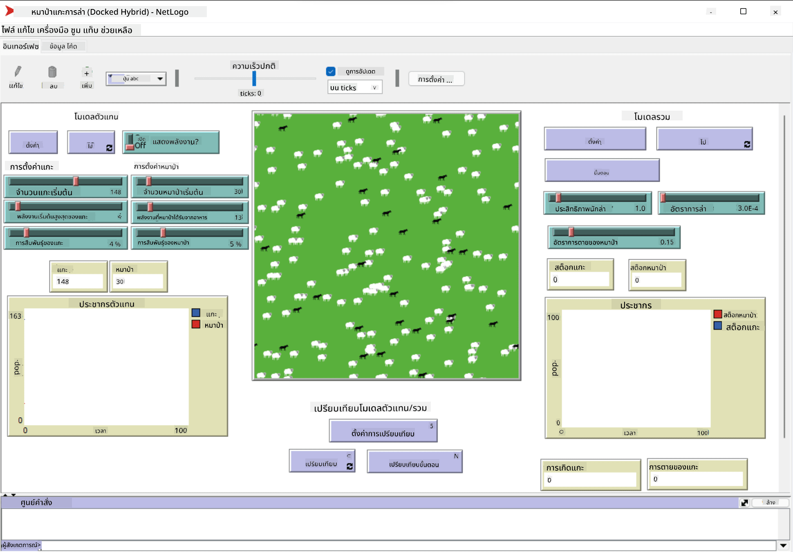

<!--
CO_OP_TRANSLATOR_METADATA:
{
  "original_hash": "1ddf651d7681b4449f9d09ea3b17911e",
  "translation_date": "2025-08-29T08:39:11+00:00",
  "source_file": "lessons/6-Other/23-MultiagentSystems/README.md",
  "language_code": "th"
}
-->
# ระบบหลายตัวแทน (Multi-Agent Systems)

หนึ่งในวิธีที่เป็นไปได้ในการสร้างความฉลาดคือแนวทางที่เรียกว่า **emergent** (หรือ **synergetic**) ซึ่งอิงจากข้อเท็จจริงที่ว่าพฤติกรรมรวมของตัวแทนที่ค่อนข้างเรียบง่ายจำนวนมากสามารถนำไปสู่พฤติกรรมที่ซับซ้อน (หรือฉลาด) ของระบบโดยรวมได้ ในเชิงทฤษฎี แนวคิดนี้อิงจากหลักการของ [Collective Intelligence](https://en.wikipedia.org/wiki/Collective_intelligence), [Emergentism](https://en.wikipedia.org/wiki/Global_brain) และ [Evolutionary Cybernetics](https://en.wikipedia.org/wiki/Global_brain) ซึ่งระบุว่าระบบในระดับที่สูงขึ้นจะได้รับคุณค่าเพิ่มเติมบางอย่างเมื่อถูกรวมกันอย่างเหมาะสมจากระบบในระดับที่ต่ำกว่า (เรียกว่า *หลักการของ metasystem transition*)

## [แบบทดสอบก่อนการบรรยาย](https://red-field-0a6ddfd03.1.azurestaticapps.net/quiz/123)

แนวทางของ **ระบบหลายตัวแทน** เริ่มปรากฏในสาขาปัญญาประดิษฐ์ (AI) ในช่วงปี 1990 เพื่อตอบสนองต่อการเติบโตของอินเทอร์เน็ตและระบบแบบกระจาย หนึ่งในตำราคลาสสิกของ AI อย่าง [Artificial Intelligence: A Modern Approach](https://en.wikipedia.org/wiki/Artificial_Intelligence:_A_Modern_Approach) มุ่งเน้นมุมมองของ AI แบบดั้งเดิมจากมุมมองของระบบหลายตัวแทน

หัวใจสำคัญของแนวทางระบบหลายตัวแทนคือแนวคิดของ **ตัวแทน (Agent)** - สิ่งที่มีอยู่ใน **สภาพแวดล้อม** ซึ่งมันสามารถรับรู้และกระทำต่อสิ่งนั้นได้ คำจำกัดความนี้กว้างมาก และตัวแทนสามารถถูกจัดประเภทได้หลากหลาย เช่น:

* ตามความสามารถในการใช้เหตุผล:
   - **Reactive** agents มักมีพฤติกรรมแบบตอบสนองง่าย ๆ
   - **Deliberative** agents ใช้เหตุผลเชิงตรรกะและ/หรือความสามารถในการวางแผน
* ตามสถานที่ที่ตัวแทนทำงาน:
   - **Static** agents ทำงานบนโหนดเครือข่ายที่กำหนดไว้
   - **Mobile** agents สามารถย้ายโค้ดระหว่างโหนดเครือข่ายได้
* ตามพฤติกรรม:
   - **Passive agents** ไม่มีเป้าหมายเฉพาะ สามารถตอบสนองต่อสิ่งกระตุ้นภายนอกได้ แต่จะไม่เริ่มต้นการกระทำเอง
   - **Active agents** มีเป้าหมายที่พวกเขาพยายามบรรลุ
   - **Cognitive agents** มีการวางแผนและใช้เหตุผลที่ซับซ้อน

ปัจจุบัน ระบบหลายตัวแทนถูกนำไปใช้ในหลายแอปพลิเคชัน เช่น:

* ในเกม ตัวละครที่ไม่ใช่ผู้เล่น (NPC) หลายตัวใช้ AI บางรูปแบบ และสามารถถือว่าเป็นตัวแทนที่ฉลาด
* ในการผลิตวิดีโอ การเรนเดอร์ฉาก 3D ที่ซับซ้อนซึ่งมีฝูงชนมักทำโดยใช้การจำลองระบบหลายตัวแทน
* ในการสร้างแบบจำลองระบบ แนวทางระบบหลายตัวแทนถูกใช้เพื่อจำลองพฤติกรรมของโมเดลที่ซับซ้อน ตัวอย่างเช่น แนวทางนี้ถูกใช้สำเร็จในการทำนายการแพร่กระจายของโรค COVID-19 ทั่วโลก แนวทางที่คล้ายกันสามารถใช้ในการจำลองการจราจรในเมือง และดูว่ามันตอบสนองต่อการเปลี่ยนแปลงกฎจราจรอย่างไร
* ในระบบอัตโนมัติที่ซับซ้อน อุปกรณ์แต่ละชิ้นสามารถทำหน้าที่เป็นตัวแทนอิสระ ซึ่งทำให้ระบบโดยรวมมีความเป็นโมดูลและมีความทนทานมากขึ้น

เราจะไม่ใช้เวลามากในการเจาะลึกระบบหลายตัวแทน แต่จะพิจารณาตัวอย่างหนึ่งของ **การสร้างแบบจำลองระบบหลายตัวแทน**

## NetLogo

[NetLogo](https://ccl.northwestern.edu/netlogo/) เป็นสภาพแวดล้อมสำหรับการสร้างแบบจำลองระบบหลายตัวแทนที่อิงจากเวอร์ชันที่ปรับปรุงของภาษาการเขียนโปรแกรม [Logo](https://en.wikipedia.org/wiki/Logo_(programming_language)) ภาษานี้ถูกพัฒนาขึ้นเพื่อสอนแนวคิดการเขียนโปรแกรมให้กับเด็ก ๆ และช่วยให้คุณควบคุมตัวแทนที่เรียกว่า **turtle** ซึ่งสามารถเคลื่อนที่และทิ้งร่องรอยไว้เบื้องหลัง สิ่งนี้ช่วยให้สร้างรูปทรงเรขาคณิตที่ซับซ้อน ซึ่งเป็นวิธีที่มองเห็นได้ชัดเจนในการทำความเข้าใจพฤติกรรมของตัวแทน

ใน NetLogo เราสามารถสร้างเต่าหลายตัวโดยใช้คำสั่ง `create-turtles` จากนั้นเราสามารถสั่งให้เต่าทั้งหมดทำบางอย่าง (ในตัวอย่างด้านล่าง - เคลื่อนที่ไปข้างหน้า 10 จุด):

```
create-turtles 10
ask turtles [
  forward 10
]
```

แน่นอนว่ามันจะไม่น่าสนใจหากเต่าทั้งหมดทำสิ่งเดียวกัน ดังนั้นเราสามารถใช้คำสั่ง `ask` กับกลุ่มของเต่า เช่น เต่าที่อยู่ใกล้จุดใดจุดหนึ่ง นอกจากนี้ เรายังสามารถสร้างเต่าที่มี *สายพันธุ์* ต่างกันได้โดยใช้คำสั่ง `breed [cats cat]` ที่นี่ `cat` คือชื่อของสายพันธุ์ และเราจำเป็นต้องระบุทั้งคำเอกพจน์และพหูพจน์ เพราะคำสั่งต่าง ๆ ใช้รูปแบบที่แตกต่างกันเพื่อความชัดเจน

> ✅ เราจะไม่ลงลึกในการเรียนรู้ภาษา NetLogo เอง - คุณสามารถเยี่ยมชมแหล่งข้อมูลที่ยอดเยี่ยมอย่าง [Beginner's Interactive NetLogo Dictionary](https://ccl.northwestern.edu/netlogo/bind/) หากคุณสนใจที่จะเรียนรู้เพิ่มเติม

คุณสามารถ [ดาวน์โหลด](https://ccl.northwestern.edu/netlogo/download.shtml) และติดตั้ง NetLogo เพื่อทดลองใช้งาน

### ไลบรารีโมเดล

สิ่งที่ยอดเยี่ยมเกี่ยวกับ NetLogo คือมันมีไลบรารีของโมเดลที่ใช้งานได้ซึ่งคุณสามารถลองใช้ได้ ไปที่ **File → Models Library** และคุณจะพบหมวดหมู่ของโมเดลมากมายให้เลือก


> ภาพหน้าจอของไลบรารีโมเดลโดย Dmitry Soshnikov

คุณสามารถเปิดหนึ่งในโมเดล เช่น **Biology → Flocking**

### หลักการสำคัญ

หลังจากเปิดโมเดล คุณจะถูกนำไปยังหน้าจอหลักของ NetLogo นี่คือตัวอย่างโมเดลที่อธิบายประชากรของหมาป่าและแกะ โดยมีทรัพยากรที่จำกัด (หญ้า)



> ภาพหน้าจอโดย Dmitry Soshnikov

บนหน้าจอนี้ คุณจะเห็น:

* ส่วน **Interface** ซึ่งประกอบด้วย:
  - สนามหลักที่ตัวแทนทั้งหมดอาศัยอยู่
  - ตัวควบคุมต่าง ๆ: ปุ่ม, สไลเดอร์ ฯลฯ
  - กราฟที่คุณสามารถใช้แสดงพารามิเตอร์ของการจำลอง
* แท็บ **Code** ซึ่งมีตัวแก้ไขที่คุณสามารถพิมพ์โปรแกรม NetLogo ได้

ในกรณีส่วนใหญ่ อินเทอร์เฟซจะมีปุ่ม **Setup** ซึ่งใช้เริ่มต้นสถานะการจำลอง และปุ่ม **Go** ที่เริ่มการทำงาน สิ่งเหล่านี้ถูกจัดการโดยตัวจัดการที่เกี่ยวข้องในโค้ดที่มีลักษณะดังนี้:

```
to go [
...
]
```

โลกของ NetLogo ประกอบด้วยวัตถุต่อไปนี้:

* **Agents** (เต่า) ที่สามารถเคลื่อนที่ไปทั่วสนามและทำบางสิ่ง คุณสามารถสั่งตัวแทนโดยใช้ไวยากรณ์ `ask turtles [...]` และโค้ดในวงเล็บจะถูกดำเนินการโดยตัวแทนทั้งหมดใน *โหมดเต่า*
* **Patches** คือพื้นที่สี่เหลี่ยมของสนามที่ตัวแทนอาศัยอยู่ คุณสามารถอ้างถึงตัวแทนทั้งหมดบนแพตช์เดียวกัน หรือเปลี่ยนสีของแพตช์และคุณสมบัติอื่น ๆ คุณยังสามารถ `ask patches` ให้ทำบางสิ่งได้
* **Observer** คือตัวแทนที่ไม่ซ้ำกันซึ่งควบคุมโลก ตัวจัดการปุ่มทั้งหมดจะถูกดำเนินการใน *โหมดผู้สังเกตการณ์*

> ✅ ความสวยงามของสภาพแวดล้อมหลายตัวแทนคือโค้ดที่ทำงานในโหมดเต่าหรือโหมดแพตช์จะถูกดำเนินการพร้อมกันโดยตัวแทนทั้งหมดในเวลาเดียวกัน ดังนั้น โดยการเขียนโค้ดเพียงเล็กน้อยและตั้งโปรแกรมพฤติกรรมของตัวแทนแต่ละตัว คุณสามารถสร้างพฤติกรรมที่ซับซ้อนของระบบจำลองโดยรวมได้

### การบินเป็นฝูง (Flocking)

ตัวอย่างหนึ่งของพฤติกรรมหลายตัวแทนคือ **[Flocking](https://en.wikipedia.org/wiki/Flocking_(behavior))** การบินเป็นฝูงเป็นรูปแบบที่ซับซ้อนซึ่งคล้ายกับวิธีที่ฝูงนกบิน เมื่อคุณดูพวกมันบิน คุณอาจคิดว่าพวกมันปฏิบัติตามอัลกอริทึมร่วมกันบางอย่าง หรือพวกมันมี *ปัญญาร่วมกัน* อย่างไรก็ตาม พฤติกรรมที่ซับซ้อนนี้เกิดขึ้นเมื่อแต่ละตัวแทน (ในกรณีนี้คือนก) สังเกตตัวแทนอื่น ๆ ในระยะใกล้ และปฏิบัติตามกฎง่าย ๆ สามข้อ:

* **Alignment** - มุ่งไปในทิศทางเฉลี่ยของตัวแทนใกล้เคียง
* **Cohesion** - พยายามมุ่งไปยังตำแหน่งเฉลี่ยของตัวแทนใกล้เคียง (*แรงดึงดูดระยะไกล*)
* **Separation** - เมื่อเข้าใกล้ตัวแทนอื่นมากเกินไป พยายามเคลื่อนที่ออกห่าง (*แรงผลักระยะสั้น*)

คุณสามารถรันตัวอย่างการบินเป็นฝูงและสังเกตพฤติกรรมได้ คุณยังสามารถปรับพารามิเตอร์ เช่น *ระดับการแยกตัว* หรือ *ระยะการมองเห็น* ซึ่งกำหนดว่านกแต่ละตัวสามารถมองเห็นได้ไกลแค่ไหน โปรดทราบว่าหากคุณลดระยะการมองเห็นเป็น 0 นกทั้งหมดจะมองไม่เห็น และการบินเป็นฝูงจะหยุดลง หากคุณลดการแยกตัวเป็น 0 นกทั้งหมดจะรวมตัวกันเป็นเส้นตรง

> ✅ สลับไปที่แท็บ **Code** และดูว่ากฎสามข้อของการบินเป็นฝูง (alignment, cohesion และ separation) ถูกนำไปใช้ในโค้ดอย่างไร โปรดสังเกตว่าเราอ้างถึงเฉพาะตัวแทนที่อยู่ในระยะการมองเห็นเท่านั้น

### โมเดลอื่น ๆ ที่ควรดู

มีโมเดลที่น่าสนใจอีกสองสามตัวที่คุณสามารถทดลองได้:

* **Art → Fireworks** แสดงให้เห็นว่าดอกไม้ไฟสามารถถือเป็นพฤติกรรมร่วมกันของกระแสไฟแต่ละสายได้อย่างไร
* **Social Science → Traffic Basic** และ **Social Science → Traffic Grid** แสดงโมเดลการจราจรในเมืองในรูปแบบ 1D และ 2D Grid โดยมีหรือไม่มีสัญญาณไฟจราจร รถแต่ละคันในจำลองปฏิบัติตามกฎดังนี้:
   - หากพื้นที่ด้านหน้าว่างเปล่า - เร่งความเร็ว (จนถึงความเร็วสูงสุดที่กำหนด)
   - หากเห็นสิ่งกีดขวางด้านหน้า - เบรก (และคุณสามารถปรับระยะการมองเห็นของคนขับได้)
* **Social Science → Party** แสดงให้เห็นว่าผู้คนรวมตัวกันในงานเลี้ยงค็อกเทลอย่างไร คุณสามารถหาชุดค่าพารามิเตอร์ที่นำไปสู่การเพิ่มความสุขของกลุ่มได้เร็วที่สุด

จากตัวอย่างเหล่านี้ คุณจะเห็นว่าการจำลองระบบหลายตัวแทนสามารถเป็นวิธีที่มีประโยชน์ในการทำความเข้าใจพฤติกรรมของระบบที่ซับซ้อนซึ่งประกอบด้วยบุคคลที่ปฏิบัติตามตรรกะเดียวกันหรือคล้ายกัน นอกจากนี้ยังสามารถใช้ควบคุมตัวแทนเสมือน เช่น [NPCs](https://en.wikipedia.org/wiki/NPC) ในเกมคอมพิวเตอร์ หรือตัวแทนในโลก 3D ที่สร้างขึ้น

## ตัวแทนแบบใช้เหตุผล (Deliberative Agents)

ตัวแทนที่อธิบายไว้ข้างต้นนั้นเรียบง่ายมาก โดยตอบสนองต่อการเปลี่ยนแปลงในสภาพแวดล้อมโดยใช้อัลกอริทึมบางอย่าง ดังนั้นพวกเขาจึงเป็น **reactive agents** อย่างไรก็ตาม บางครั้งตัวแทนสามารถใช้เหตุผลและวางแผนการกระทำของพวกเขาได้ ซึ่งในกรณีนี้พวกเขาจะถูกเรียกว่า **deliberative agents**

ตัวอย่างทั่วไปคือตัวแทนส่วนบุคคลที่ได้รับคำสั่งจากมนุษย์ให้จองทัวร์พักผ่อน ลองนึกภาพว่ามีตัวแทนจำนวนมากที่อาศัยอยู่บนอินเทอร์เน็ตซึ่งสามารถช่วยเหลือมันได้ ตัวแทนจะต้องติดต่อกับตัวแทนอื่น ๆ เพื่อดูว่ามีเที่ยวบินใดบ้าง ราคาโรงแรมสำหรับวันที่ต่าง ๆ เป็นอย่างไร และพยายามเจรจาราคาที่ดีที่สุด เมื่อแผนการพักผ่อนเสร็จสมบูรณ์และได้รับการยืนยันจากเจ้าของแล้ว ตัวแทนสามารถดำเนินการจองได้

เพื่อให้ทำเช่นนั้นได้ ตัวแทนจำเป็นต้อง **สื่อสาร** เพื่อการสื่อสารที่ประสบความสำเร็จ พวกเขาต้องการ:

* **ภาษามาตรฐานสำหรับแลกเปลี่ยนความรู้** เช่น [Knowledge Interchange Format](https://en.wikipedia.org/wiki/Knowledge_Interchange_Format) (KIF) และ [Knowledge Query and Manipulation Language](https://en.wikipedia.org/wiki/Knowledge_Query_and_Manipulation_Language) (KQML) ภาษาดังกล่าวได้รับการออกแบบตาม [ทฤษฎีการกระทำทางภาษา](https://en.wikipedia.org/wiki/Speech_act)
* ภาษาดังกล่าวควรรวมถึง **โปรโตคอลสำหรับการเจรจา** ซึ่งอิงตาม **ประเภทการประมูล** ต่าง ๆ
* **ออนโทโลยีร่วมกัน** เพื่อใช้งาน เพื่อให้พวกเขาอ้างถึงแนวคิดเดียวกันโดยเข้าใจความหมายของมัน
* วิธีการ **ค้นพบ** ว่าตัวแทนต่าง ๆ สามารถทำอะไรได้บ้าง โดยอิงจากออนโทโลยีบางรูปแบบ

ตัวแทนแบบใช้เหตุผลมีความซับซ้อนมากกว่าตัวแทนแบบตอบสนอง เพราะพวกเขาไม่ได้เพียงแค่ตอบสนองต่อการเปลี่ยนแปลงในสภาพแวดล้อม แต่ยังต้องสามารถ *เริ่มต้น* การกระทำได้ หนึ่งในสถาปัตยกรรมที่เสนอสำหรับตัวแทนแบบใช้เหตุผลคือ ตัวแทนแบบ Belief-Desire-Intention (BDI):

* **Beliefs** คือชุดความรู้เกี่ยวกับสภาพแวดล้อมของตัวแทน มันสามารถถูกจัดโครงสร้างเป็นฐานความรู้หรือชุดของกฎที่ตัวแทนสามารถนำไปใช้กับสถานการณ์เฉพาะในสภาพแวดล้อมได้
* **Desires** กำหนดสิ่งที่ตัวแทนต้องการทำ เช่น เป้าหมายของมัน ตัวอย่างเช่น เป้าหมายของตัวแทนผู้ช่วยส่วนตัวข้างต้นคือการจองทัวร์ และเป้าหมายของตัวแทนโรงแรมคือการเพิ่มผลกำไรสูงสุด
* **Intentions** คือการกระทำเฉพาะที่ตัวแทนวางแผนเพื่อบรรลุเป้าหมาย การกระทำมักเปลี่ยนแปลงสภาพแวดล้อมและทำให้เกิดการสื่อสารกับตัวแทนอื่น ๆ

มีแพลตฟอร์มบางตัวที่พร้อมใช้งานสำหรับการสร้างระบบหลายตัวแทน เช่น [JADE](https://jade.tilab.com/) [บทความนี้](https://arxiv.org/ftp/arxiv/papers/2007/2007.08961.pdf) มีการทบทวนแพลตฟอร์มหลายตัวแทน พร้อมกับประวัติย่อของระบบหลายตัวแทนและสถานการณ์การใช้งานที่แตกต่างกัน

## สรุป

ระบบหลายตัวแทนสามารถมีรูปแบบที่แตกต่างกันมากและถูกใช้ในแอปพลิเคชันที่หลากหลาย พวกมันมักมุ่งเน้นไปที่พฤติกรรมที่ง่ายกว่าของตัวแทนแต่ละตัว และบรรลุพฤติกรรมที่ซับซ้อนมากขึ้นของระบบโดยรวมเนื่องจาก **ผลกระทบเชิงพลังร่วมกัน (synergetic effect)**

## 🚀 ความท้าทาย

นำบทเรียนนี้ไปใช้ในโลกแห่งความจริงและลองคิดแนวคิดระบบหลายตัวแทนที่สามารถแก้ปัญหาได้ ตัวอย่างเช่น ระบบหลายตัวแทนจะต้องทำ

---

**ข้อจำกัดความรับผิดชอบ**:  
เอกสารนี้ได้รับการแปลโดยใช้บริการแปลภาษา AI [Co-op Translator](https://github.com/Azure/co-op-translator) แม้ว่าเราจะพยายามให้การแปลมีความถูกต้อง แต่โปรดทราบว่าการแปลอัตโนมัติอาจมีข้อผิดพลาดหรือความไม่แม่นยำ เอกสารต้นฉบับในภาษาต้นทางควรถือเป็นแหล่งข้อมูลที่เชื่อถือได้ สำหรับข้อมูลที่สำคัญ ขอแนะนำให้ใช้บริการแปลภาษามนุษย์ที่เป็นมืออาชีพ เราจะไม่รับผิดชอบต่อความเข้าใจผิดหรือการตีความที่ผิดพลาดซึ่งเกิดจากการใช้การแปลนี้