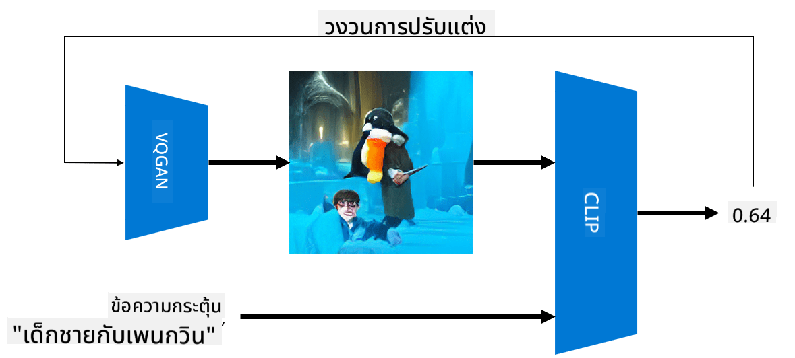

<!--
CO_OP_TRANSLATOR_METADATA:
{
  "original_hash": "9c592c26aca16ca085d268c732284187",
  "translation_date": "2025-08-29T08:44:41+00:00",
  "source_file": "lessons/X-Extras/X1-MultiModal/README.md",
  "language_code": "th"
}
-->
# เครือข่ายแบบหลายโมดอล

หลังจากความสำเร็จของโมเดล Transformer ในการแก้ปัญหางาน NLP สถาปัตยกรรมเดียวกันหรือคล้ายกันก็ถูกนำมาใช้กับงานด้านคอมพิวเตอร์วิทัศน์ (Computer Vision) มีความสนใจเพิ่มขึ้นในการสร้างโมเดลที่สามารถ *รวม* ความสามารถด้านภาพและภาษาธรรมชาติ หนึ่งในความพยายามดังกล่าวคือโมเดล CLIP และ DALL.E ที่พัฒนาโดย OpenAI

## การฝึกอบรมภาพแบบเปรียบเทียบ (CLIP)

แนวคิดหลักของ CLIP คือการเปรียบเทียบข้อความ (text prompts) กับภาพ และประเมินว่าภาพนั้นสอดคล้องกับข้อความมากน้อยเพียงใด

> *ภาพจาก [บทความนี้](https://openai.com/blog/clip/)*

โมเดลนี้ถูกฝึกด้วยภาพที่ได้จากอินเทอร์เน็ตและคำบรรยายภาพ สำหรับแต่ละชุดข้อมูล เราจะนำคู่ (ภาพ, ข้อความ) จำนวน N คู่ และแปลงเป็นเวกเตอร์ตัวแทน I และ T เวกเตอร์เหล่านี้จะถูกจับคู่กัน ฟังก์ชันการสูญเสีย (loss function) ถูกกำหนดให้เพิ่มความคล้ายคลึงของโคไซน์ (cosine similarity) ระหว่างเวกเตอร์ที่เป็นคู่เดียวกัน (เช่น I และ T) และลดความคล้ายคลึงของโคไซน์ระหว่างคู่ที่เหลือทั้งหมด นี่คือเหตุผลที่วิธีการนี้เรียกว่า **contrastive**

ไลบรารี CLIP สามารถใช้งานได้จาก [GitHub ของ OpenAI](https://github.com/openai/CLIP) วิธีการนี้อธิบายไว้ใน [บทความนี้](https://openai.com/blog/clip/) และในรายละเอียดเพิ่มเติมใน [เอกสารนี้](https://arxiv.org/pdf/2103.00020.pdf)

เมื่อโมเดลนี้ถูกฝึกเสร็จแล้ว เราสามารถให้ชุดภาพและข้อความแก่โมเดล และโมเดลจะคืนค่าเป็นเทนเซอร์ที่มีความน่าจะเป็น CLIP สามารถใช้ในหลายงาน เช่น:

**การจำแนกภาพ (Image Classification)**

สมมติว่าเราต้องการจำแนกภาพระหว่างแมว สุนัข และมนุษย์ ในกรณีนี้ เราสามารถให้โมเดลรับภาพและข้อความ เช่น "*ภาพของแมว*", "*ภาพของสุนัข*", "*ภาพของมนุษย์*" ในเวกเตอร์ผลลัพธ์ที่มีความน่าจะเป็น 3 ค่า เราเพียงแค่เลือกดัชนีที่มีค่ามากที่สุด

> *ภาพจาก [บทความนี้](https://openai.com/blog/clip/)*

**การค้นหาภาพด้วยข้อความ (Text-Based Image Search)**

เรายังสามารถทำในทางกลับกันได้ หากเรามีชุดภาพ เราสามารถส่งชุดภาพนี้ไปยังโมเดลพร้อมข้อความ และโมเดลจะคืนค่าภาพที่คล้ายกับข้อความมากที่สุด

## ✍️ ตัวอย่าง: [การใช้ CLIP สำหรับการจำแนกภาพและการค้นหาภาพ](Clip.ipynb)

เปิดโน้ตบุ๊ก [Clip.ipynb](Clip.ipynb) เพื่อดูการทำงานของ CLIP

## การสร้างภาพด้วย VQGAN+CLIP

CLIP ยังสามารถใช้สำหรับ **การสร้างภาพ** จากข้อความได้อีกด้วย ในการทำเช่นนี้ เราจำเป็นต้องมี **โมเดลตัวสร้าง (generator model)** ที่สามารถสร้างภาพจากเวกเตอร์อินพุตได้ หนึ่งในโมเดลดังกล่าวคือ [VQGAN](https://compvis.github.io/taming-transformers/) (Vector-Quantized GAN)

แนวคิดหลักของ VQGAN ที่แตกต่างจาก [GAN](../../4-ComputerVision/10-GANs/README.md) ทั่วไปคือ:
* ใช้สถาปัตยกรรม Transformer แบบ autoregressive เพื่อสร้างลำดับของส่วนภาพที่มีบริบทซึ่งประกอบกันเป็นภาพ ส่วนภาพเหล่านี้ถูกเรียนรู้โดย [CNN](../../4-ComputerVision/07-ConvNets/README.md)
* ใช้ตัวแยกแยะภาพย่อย (sub-image discriminator) เพื่อตรวจจับว่าส่วนของภาพเป็น "จริง" หรือ "ปลอม" (แทนที่จะใช้วิธี "ทั้งหมดหรือไม่มีเลย" ใน GAN ทั่วไป)

เรียนรู้เพิ่มเติมเกี่ยวกับ VQGAN ได้ที่เว็บไซต์ [Taming Transformers](https://compvis.github.io/taming-transformers/)

ความแตกต่างสำคัญระหว่าง VQGAN และ GAN ทั่วไปคือ GAN สามารถสร้างภาพที่ดีจากเวกเตอร์อินพุตใด ๆ ได้ แต่ VQGAN อาจสร้างภาพที่ไม่สอดคล้องกัน ดังนั้นเราจำเป็นต้องมีการชี้นำเพิ่มเติมในกระบวนการสร้างภาพ ซึ่งสามารถทำได้โดยใช้ CLIP

ในการสร้างภาพที่สอดคล้องกับข้อความ เราเริ่มต้นด้วยเวกเตอร์การเข้ารหัสแบบสุ่มที่ถูกส่งผ่าน VQGAN เพื่อสร้างภาพ จากนั้นใช้ CLIP เพื่อสร้างฟังก์ชันการสูญเสียที่แสดงว่าภาพสอดคล้องกับข้อความมากน้อยเพียงใด เป้าหมายคือการลดค่าฟังก์ชันการสูญเสียนี้โดยใช้การถ่ายทอดย้อนกลับ (back propagation) เพื่อปรับพารามิเตอร์ของเวกเตอร์อินพุต

ไลบรารีที่ยอดเยี่ยมที่นำ VQGAN+CLIP มาใช้งานคือ [Pixray](http://github.com/pixray/pixray)

 |   | 
----|----|----
ภาพที่สร้างจากข้อความ *ภาพเหมือนสีน้ำของครูหนุ่มสอนวรรณกรรมพร้อมหนังสือ* | ภาพที่สร้างจากข้อความ *ภาพเหมือนสีน้ำมันของครูสาวสอนวิทยาการคอมพิวเตอร์พร้อมคอมพิวเตอร์* | ภาพที่สร้างจากข้อความ *ภาพเหมือนสีน้ำมันของครูชายสูงวัยสอนคณิตศาสตร์หน้ากระดานดำ*

> ภาพจากคอลเลกชัน **Artificial Teachers** โดย [Dmitry Soshnikov](http://soshnikov.com)

## DALL-E
### [DALL-E 1](https://openai.com/research/dall-e)
DALL-E เป็นเวอร์ชันของ GPT-3 ที่ถูกฝึกให้สร้างภาพจากข้อความ มีพารามิเตอร์ 12 พันล้านตัว

แตกต่างจาก CLIP ตรงที่ DALL-E รับทั้งข้อความและภาพเป็นสตรีมเดียวของโทเค็นสำหรับทั้งภาพและข้อความ ดังนั้นจากข้อความหลาย ๆ ข้อความ คุณสามารถสร้างภาพตามข้อความได้

### [DALL-E 2](https://openai.com/dall-e-2)
ความแตกต่างหลักระหว่าง DALL-E 1 และ 2 คือ DALL-E 2 สามารถสร้างภาพและงานศิลปะที่สมจริงมากขึ้น

ตัวอย่างการสร้างภาพด้วย DALL-E:
 |   | 
----|----|----
ภาพที่สร้างจากข้อความ *ภาพเหมือนสีน้ำของครูหนุ่มสอนวรรณกรรมพร้อมหนังสือ* | ภาพที่สร้างจากข้อความ *ภาพเหมือนสีน้ำมันของครูสาวสอนวิทยาการคอมพิวเตอร์พร้อมคอมพิวเตอร์* | ภาพที่สร้างจากข้อความ *ภาพเหมือนสีน้ำมันของครูชายสูงวัยสอนคณิตศาสตร์หน้ากระดานดำ*

## แหล่งข้อมูลอ้างอิง

* เอกสาร VQGAN: [Taming Transformers for High-Resolution Image Synthesis](https://compvis.github.io/taming-transformers/paper/paper.pdf)
* เอกสาร CLIP: [Learning Transferable Visual Models From Natural Language Supervision](https://arxiv.org/pdf/2103.00020.pdf)

---

**ข้อจำกัดความรับผิดชอบ**:  
เอกสารนี้ได้รับการแปลโดยใช้บริการแปลภาษา AI [Co-op Translator](https://github.com/Azure/co-op-translator) แม้ว่าเราจะพยายามให้การแปลมีความถูกต้อง แต่โปรดทราบว่าการแปลอัตโนมัติอาจมีข้อผิดพลาดหรือความไม่แม่นยำ เอกสารต้นฉบับในภาษาดั้งเดิมควรถือเป็นแหล่งข้อมูลที่เชื่อถือได้ สำหรับข้อมูลที่สำคัญ แนะนำให้ใช้บริการแปลภาษาจากผู้เชี่ยวชาญ เราจะไม่รับผิดชอบต่อความเข้าใจผิดหรือการตีความที่ผิดพลาดซึ่งเกิดจากการใช้การแปลนี้