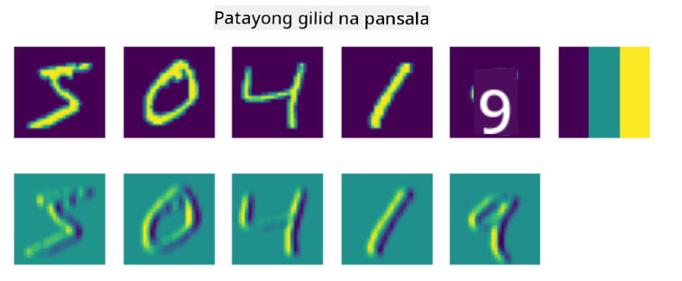
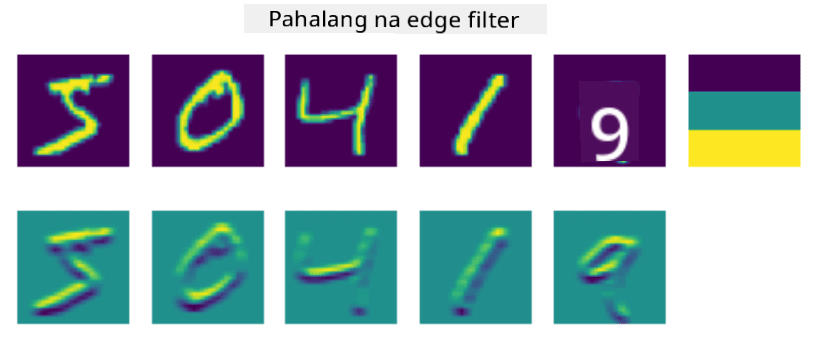
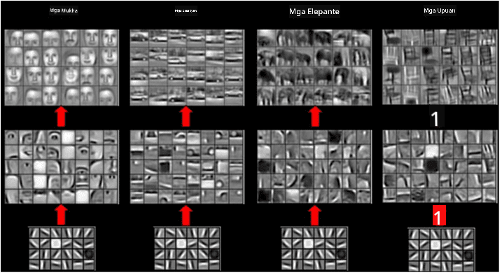

<!--
CO_OP_TRANSLATOR_METADATA:
{
  "original_hash": "088837b42b7d99198bf62db8a42411e0",
  "translation_date": "2025-08-28T02:29:36+00:00",
  "source_file": "lessons/4-ComputerVision/07-ConvNets/README.md",
  "language_code": "tl"
}
-->
# Convolutional Neural Networks

Nakita na natin dati na mahusay ang mga neural network sa pagproseso ng mga imahe, at kahit ang isang layer na perceptron ay kayang makilala ang mga nakasulat na numero mula sa MNIST dataset nang may sapat na katumpakan. Gayunpaman, ang MNIST dataset ay espesyal dahil lahat ng numero ay nakasentro sa loob ng imahe, na nagpapadali sa gawain.

## [Pre-lecture quiz](https://red-field-0a6ddfd03.1.azurestaticapps.net/quiz/107)

Sa totoong buhay, nais nating makilala ang mga bagay sa isang larawan kahit saan man ito eksaktong nakalagay sa imahe. Ang computer vision ay naiiba sa pangkalahatang klasipikasyon, dahil kapag sinusubukan nating hanapin ang isang partikular na bagay sa larawan, sinusuri natin ang imahe upang hanapin ang mga tiyak na **pattern** at ang kanilang mga kombinasyon. Halimbawa, kapag naghahanap ng pusa, maaaring una nating hanapin ang mga pahalang na linya na maaaring bumuo ng mga bigote, at pagkatapos ay ang tiyak na kombinasyon ng mga bigote ang magsasabi sa atin na ito ay larawan ng isang pusa. Ang relatibong posisyon at presensya ng mga tiyak na pattern ay mahalaga, at hindi ang eksaktong posisyon nito sa imahe.

Upang makuha ang mga pattern, gagamit tayo ng konsepto ng **convolutional filters**. Tulad ng alam mo, ang isang imahe ay kinakatawan ng isang 2D-matrix, o isang 3D-tensor na may lalim ng kulay. Ang paglalapat ng filter ay nangangahulugan na kukuha tayo ng isang maliit na **filter kernel** matrix, at para sa bawat pixel sa orihinal na imahe, kakalkulahin natin ang weighted average kasama ang mga kalapit na punto. Maaari nating tingnan ito bilang isang maliit na bintana na dumudulas sa buong imahe, at ina-average ang lahat ng mga pixel ayon sa mga timbang sa filter kernel matrix.

 | 
----|----

> Imahe ni Dmitry Soshnikov

Halimbawa, kung ilalapat natin ang 3x3 vertical edge at horizontal edge filters sa mga numero ng MNIST, makakakuha tayo ng mga highlight (hal. mataas na halaga) kung saan may mga vertical at horizontal edges sa ating orihinal na imahe. Kaya, ang dalawang filter na ito ay maaaring gamitin upang "hanapin" ang mga gilid. Sa parehong paraan, maaari tayong magdisenyo ng iba't ibang filter upang hanapin ang iba pang mga low-level na pattern:

> Imahe ng [Leung-Malik Filter Bank](https://www.robots.ox.ac.uk/~vgg/research/texclass/filters.html)

Gayunpaman, habang maaari nating idisenyo ang mga filter upang manu-manong makuha ang ilang mga pattern, maaari rin nating idisenyo ang network sa paraang matutunan nito ang mga pattern nang awtomatiko. Ito ang isa sa mga pangunahing ideya sa likod ng CNN.

## Pangunahing Ideya sa Likod ng CNN

Ang paraan ng paggana ng CNN ay batay sa mga sumusunod na mahalagang ideya:

* Ang convolutional filters ay maaaring kumuha ng mga pattern
* Maaari nating idisenyo ang network sa paraang ang mga filter ay awtomatikong natututo
* Maaari nating gamitin ang parehong paraan upang makahanap ng mga pattern sa high-level na mga tampok, hindi lamang sa orihinal na imahe. Kaya, ang feature extraction ng CNN ay gumagana sa isang hierarchy ng mga tampok, simula sa low-level na kombinasyon ng mga pixel, hanggang sa mas mataas na antas ng kombinasyon ng mga bahagi ng larawan.

> Imahe mula sa [isang papel ni Hislop-Lynch](https://www.semanticscholar.org/paper/Computer-vision-based-pedestrian-trajectory-Hislop-Lynch/26e6f74853fc9bbb7487b06dc2cf095d36c9021d), batay sa [kanilang pananaliksik](https://dl.acm.org/doi/abs/10.1145/1553374.1553453)

## ✍️ Mga Gawain: Convolutional Neural Networks

Ipagpatuloy natin ang paggalugad kung paano gumagana ang convolutional neural networks, at kung paano natin makakamit ang mga trainable filters, sa pamamagitan ng pagtatrabaho sa mga kaukulang notebook:

* [Convolutional Neural Networks - PyTorch](ConvNetsPyTorch.ipynb)
* [Convolutional Neural Networks - TensorFlow](ConvNetsTF.ipynb)

## Pyramid Architecture

Karamihan sa mga CNN na ginagamit para sa pagproseso ng imahe ay sumusunod sa tinatawag na pyramid architecture. Ang unang convolutional layer na inilalapat sa orihinal na mga imahe ay karaniwang may medyo mababang bilang ng mga filter (8-16), na tumutugma sa iba't ibang kombinasyon ng mga pixel, tulad ng mga pahalang/patayo na linya o stroke. Sa susunod na antas, binabawasan natin ang spatial na dimensyon ng network, at pinapataas ang bilang ng mga filter, na tumutugma sa mas maraming posibleng kombinasyon ng mga simpleng tampok. Sa bawat layer, habang papalapit tayo sa panghuling classifier, ang spatial na dimensyon ng imahe ay lumiit, at ang bilang ng mga filter ay lumalaki.

Bilang halimbawa, tingnan natin ang arkitektura ng VGG-16, isang network na nakamit ang 92.7% na katumpakan sa top-5 classification ng ImageNet noong 2014:

> Imahe mula sa [Researchgate](https://www.researchgate.net/figure/Vgg16-model-structure-To-get-the-VGG-NIN-model-we-replace-the-2-nd-4-th-6-th-7-th_fig2_335194493)

## Pinakakilalang CNN Architectures

[Ipagpatuloy ang iyong pag-aaral tungkol sa mga pinakakilalang CNN architectures](CNN_Architectures.md)

---

**Paunawa**:  
Ang dokumentong ito ay isinalin gamit ang AI translation service na [Co-op Translator](https://github.com/Azure/co-op-translator). Bagama't sinisikap naming maging tumpak, tandaan na ang mga awtomatikong pagsasalin ay maaaring maglaman ng mga pagkakamali o hindi pagkakatugma. Ang orihinal na dokumento sa kanyang katutubong wika ang dapat ituring na opisyal na sanggunian. Para sa mahalagang impormasyon, inirerekomenda ang propesyonal na pagsasalin ng tao. Hindi kami mananagot sa anumang hindi pagkakaunawaan o maling interpretasyon na dulot ng paggamit ng pagsasaling ito.