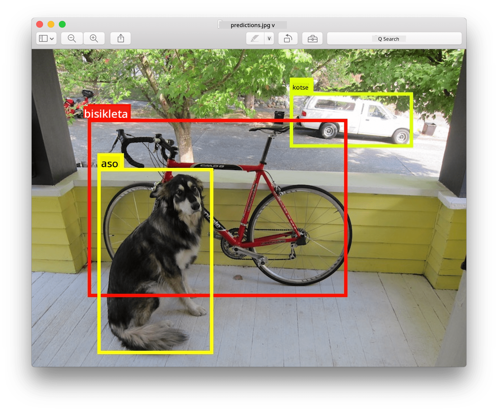
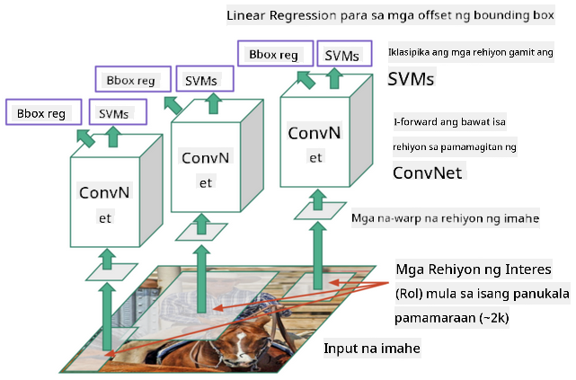
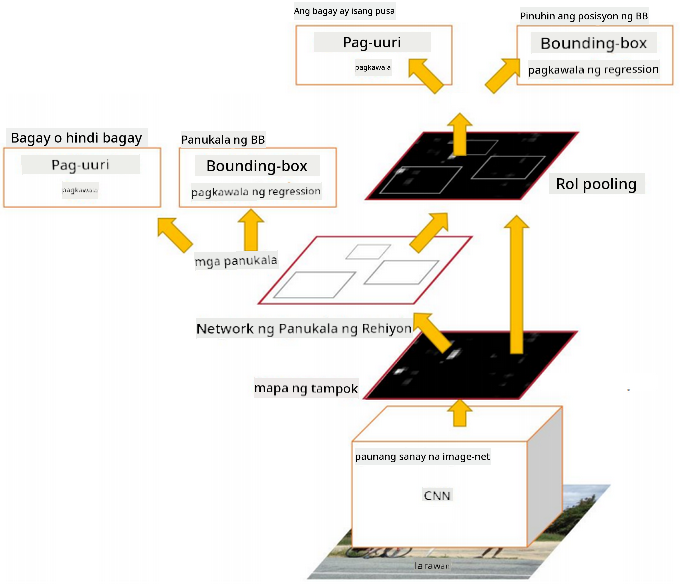
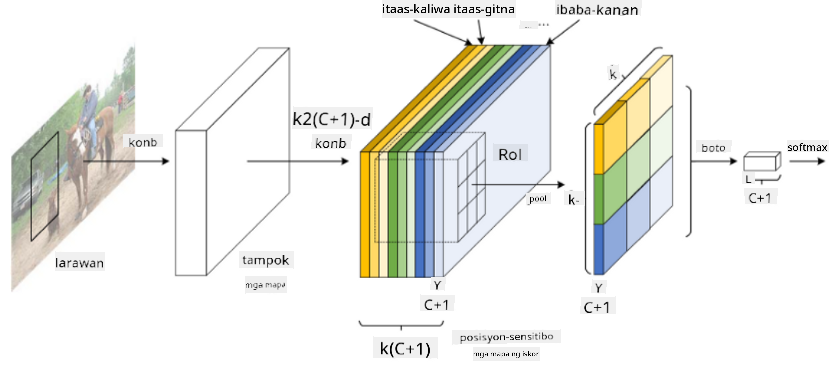

<!--
CO_OP_TRANSLATOR_METADATA:
{
  "original_hash": "d85c8b08f6d1b48fd7f35b99f93c1138",
  "translation_date": "2025-08-28T02:32:00+00:00",
  "source_file": "lessons/4-ComputerVision/11-ObjectDetection/README.md",
  "language_code": "tl"
}
-->
# Pagtuklas ng Objekto

Ang mga modelo ng image classification na tinalakay natin hanggang ngayon ay tumatanggap ng isang imahe at nagbibigay ng resulta sa anyo ng kategorya, tulad ng klase na 'number' sa problema ng MNIST. Gayunpaman, sa maraming pagkakataon, hindi lang natin nais malaman na ang isang larawan ay naglalaman ng mga bagay - nais din nating matukoy ang eksaktong lokasyon ng mga ito. Ito mismo ang layunin ng **pagtuklas ng objekto**.

## [Pre-lecture quiz](https://red-field-0a6ddfd03.1.azurestaticapps.net/quiz/111)

> Larawan mula sa [YOLO v2 web site](https://pjreddie.com/darknet/yolov2/)

## Isang Simpleng Paraan sa Pagtuklas ng Objekto

Kung nais nating hanapin ang isang pusa sa isang larawan, isang napaka-simpleng paraan ng pagtuklas ng objekto ay ang sumusunod:

1. Hatiin ang larawan sa maraming maliliit na bahagi.
2. Patakbuhin ang image classification sa bawat bahagi.
3. Ang mga bahagi na may sapat na mataas na activation ay maaaring ituring na naglalaman ng hinahanap na objekto.

> *Larawan mula sa [Exercise Notebook](ObjectDetection-TF.ipynb)*

Gayunpaman, ang paraang ito ay malayo sa pagiging perpekto, dahil hindi nito kayang tukuyin nang eksakto ang bounding box ng objekto. Para sa mas eksaktong lokasyon, kailangan nating gumamit ng **regression** upang mahulaan ang mga koordinado ng bounding boxes - at para dito, kailangan natin ng mga partikular na dataset.

## Regression para sa Pagtuklas ng Objekto

[Ang blog post na ito](https://towardsdatascience.com/object-detection-with-neural-networks-a4e2c46b4491) ay nagbibigay ng mahusay na pagpapakilala sa pagtuklas ng mga hugis.

## Mga Dataset para sa Pagtuklas ng Objekto

Maaaring makita mo ang mga sumusunod na dataset para sa gawaing ito:

* [PASCAL VOC](http://host.robots.ox.ac.uk/pascal/VOC/) - 20 klase
* [COCO](http://cocodataset.org/#home) - Common Objects in Context. 80 klase, mga bounding box at segmentation mask

## Mga Sukatan para sa Pagtuklas ng Objekto

### Intersection over Union

Habang madali lamang sukatin ang performance ng algorithm sa image classification, sa pagtuklas ng objekto kailangan nating sukatin ang parehong tamang klase at ang eksaktong lokasyon ng bounding box. Para sa huli, ginagamit natin ang tinatawag na **Intersection over Union** (IoU), na sumusukat kung gaano kahusay ang pag-overlap ng dalawang kahon (o dalawang arbitraryong lugar).

> *Figure 2 mula sa [napakahusay na blog post na ito tungkol sa IoU](https://pyimagesearch.com/2016/11/07/intersection-over-union-iou-for-object-detection/)*

Ang ideya ay simple - hinahati natin ang lugar ng intersection ng dalawang hugis sa lugar ng kanilang union. Para sa dalawang magkaparehong lugar, ang IoU ay magiging 1, habang para sa mga lugar na walang overlap, ito ay magiging 0. Sa ibang kaso, ito ay magbabago mula 0 hanggang 1. Karaniwan, tinitingnan lamang natin ang mga bounding box na may IoU na higit sa isang tiyak na halaga.

### Average Precision

Halimbawa, nais nating sukatin kung gaano kahusay natutukoy ang isang klase ng objekto $C$. Para sukatin ito, ginagamit natin ang **Average Precision** metrics, na kinakalkula sa ganitong paraan:

1. Isaalang-alang ang Precision-Recall curve na nagpapakita ng katumpakan depende sa detection threshold value (mula 0 hanggang 1).
2. Depende sa threshold, makakakita tayo ng mas marami o mas kaunting mga objekto sa larawan, at magkakaibang halaga ng precision at recall.
3. Ang curve ay magmumukhang ganito:

> *Larawan mula sa [NeuroWorkshop](http://github.com/shwars/NeuroWorkshop)*

Ang Average Precision para sa isang klase $C$ ay ang lugar sa ilalim ng curve na ito. Mas partikular, ang Recall axis ay karaniwang hinahati sa 10 bahagi, at ang Precision ay ina-average sa lahat ng mga puntong iyon:

$$
AP = {1\over11}\sum_{i=0}^{10}\mbox{Precision}(\mbox{Recall}={i\over10})
$$

### AP at IoU

Isasaalang-alang lamang natin ang mga detection na may IoU na higit sa isang tiyak na halaga. Halimbawa, sa PASCAL VOC dataset, karaniwang $\mbox{IoU Threshold} = 0.5$ ang ginagamit, habang sa COCO, ang AP ay sinusukat para sa iba't ibang halaga ng $\mbox{IoU Threshold}$.

> *Larawan mula sa [NeuroWorkshop](http://github.com/shwars/NeuroWorkshop)*

### Mean Average Precision - mAP

Ang pangunahing sukatan para sa Pagtuklas ng Objekto ay tinatawag na **Mean Average Precision**, o **mAP**. Ito ang halaga ng Average Precision, na ina-average sa lahat ng klase ng objekto, at kung minsan ay pati na rin sa $\mbox{IoU Threshold}$. Ang proseso ng pagkalkula ng **mAP** ay mas detalyadong ipinaliwanag
[sa blog post na ito](https://medium.com/@timothycarlen/understanding-the-map-evaluation-metric-for-object-detection-a07fe6962cf3)), at [dito na may mga halimbawa ng code](https://gist.github.com/tarlen5/008809c3decf19313de216b9208f3734).

## Iba't Ibang Paraan ng Pagtuklas ng Objekto

Mayroong dalawang pangunahing klase ng mga algorithm para sa pagtuklas ng objekto:

* **Region Proposal Networks** (R-CNN, Fast R-CNN, Faster R-CNN). Ang pangunahing ideya ay bumuo ng mga **Regions of Interests** (ROI) at patakbuhin ang CNN sa mga ito, hinahanap ang maximum activation. Medyo kahawig ito ng simpleng paraan, maliban na ang mga ROI ay nabubuo sa mas matalinong paraan. Isa sa mga pangunahing kahinaan ng mga ganitong pamamaraan ay mabagal ang mga ito, dahil kailangan ng maraming pass ng CNN classifier sa larawan.
* **One-pass** (YOLO, SSD, RetinaNet) methods. Sa mga arkitekturang ito, idinisenyo ang network upang mahulaan ang parehong klase at ROI sa isang pasada lamang.

### R-CNN: Region-Based CNN

Ang [R-CNN](http://islab.ulsan.ac.kr/files/announcement/513/rcnn_pami.pdf) ay gumagamit ng [Selective Search](http://www.huppelen.nl/publications/selectiveSearchDraft.pdf) upang bumuo ng hierarchical structure ng mga ROI region, na pagkatapos ay pinoproseso ng CNN feature extractors at SVM-classifiers upang matukoy ang klase ng objekto, at linear regression upang matukoy ang mga koordinado ng *bounding box*. [Opisyal na Papel](https://arxiv.org/pdf/1506.01497v1.pdf)

> *Larawan mula kay van de Sande et al. ICCV’11*

> *Mga larawan mula sa [blog na ito](https://towardsdatascience.com/r-cnn-fast-r-cnn-faster-r-cnn-yolo-object-detection-algorithms-36d53571365e)*

### F-RCNN - Fast R-CNN

Ang pamamaraang ito ay katulad ng R-CNN, ngunit ang mga rehiyon ay tinutukoy pagkatapos maiproseso ang mga convolution layers.

> Larawan mula sa [Opisyal na Papel](https://www.cv-foundation.org/openaccess/content_iccv_2015/papers/Girshick_Fast_R-CNN_ICCV_2015_paper.pdf), [arXiv](https://arxiv.org/pdf/1504.08083.pdf), 2015

### Faster R-CNN

Ang pangunahing ideya ng pamamaraang ito ay gumamit ng neural network upang mahulaan ang mga ROI - ang tinatawag na *Region Proposal Network*. [Papel](https://arxiv.org/pdf/1506.01497.pdf), 2016

> Larawan mula sa [Opisyal na Papel](https://arxiv.org/pdf/1506.01497.pdf)

### R-FCN: Region-Based Fully Convolutional Network

Mas mabilis pa ang algorithm na ito kaysa sa Faster R-CNN. Ang pangunahing ideya ay ang sumusunod:

1. Kumuha ng mga feature gamit ang ResNet-101
2. Ang mga feature ay pinoproseso ng **Position-Sensitive Score Map**. Ang bawat objekto mula sa $C$ klase ay hinahati sa $k\times k$ na mga rehiyon, at sinasanay natin ang network upang mahulaan ang mga bahagi ng mga objekto.
3. Para sa bawat bahagi mula sa $k\times k$ na mga rehiyon, lahat ng network ay bumoboto para sa klase ng objekto, at ang klase ng objekto na may pinakamaraming boto ang pinipili.

> Larawan mula sa [Opisyal na Papel](https://arxiv.org/abs/1605.06409)

### YOLO - You Only Look Once

Ang YOLO ay isang real-time na one-pass algorithm. Ang pangunahing ideya ay ang sumusunod:

 * Ang imahe ay hinahati sa $S\times S$ na mga rehiyon.
 * Para sa bawat rehiyon, ang **CNN** ay hinuhulaan ang $n$ posibleng mga objekto, *bounding box* coordinates, at *confidence*=*probability* * IoU.

 

> Larawan mula sa [Opisyal na Papel](https://arxiv.org/abs/1506.02640)

### Iba Pang Mga Algorithm

* RetinaNet: [Opisyal na Papel](https://arxiv.org/abs/1708.02002)
   - [PyTorch Implementation sa Torchvision](https://pytorch.org/vision/stable/_modules/torchvision/models/detection/retinanet.html)
   - [Keras Implementation](https://github.com/fizyr/keras-retinanet)
   - [Object Detection gamit ang RetinaNet](https://keras.io/examples/vision/retinanet/) sa Keras Samples
* SSD (Single Shot Detector): [Opisyal na Papel](https://arxiv.org/abs/1512.02325)

## ✍️ Mga Ehersisyo: Pagtuklas ng Objekto

Ipagpatuloy ang iyong pag-aaral sa sumusunod na notebook:

[ObjectDetection.ipynb](ObjectDetection.ipynb)

## Konklusyon

Sa araling ito, nagkaroon ka ng mabilisang pagtingin sa iba't ibang paraan kung paano maaaring maisagawa ang pagtuklas ng objekto!

## 🚀 Hamon

Basahin ang mga artikulo at notebook tungkol sa YOLO at subukan ang mga ito:

* [Magandang blog post](https://www.analyticsvidhya.com/blog/2018/12/practical-guide-object-detection-yolo-framewor-python/) na naglalarawan ng YOLO
 * [Opisyal na site](https://pjreddie.com/darknet/yolo/)
 * Yolo: [Keras implementation](https://github.com/experiencor/keras-yolo2), [step-by-step notebook](https://github.com/experiencor/basic-yolo-keras/blob/master/Yolo%20Step-by-Step.ipynb)
 * Yolo v2: [Keras implementation](https://github.com/experiencor/keras-yolo2), [step-by-step notebook](https://github.com/experiencor/keras-yolo2/blob/master/Yolo%20Step-by-Step.ipynb)

## [Post-lecture quiz](https://red-field-0a6ddfd03.1.azurestaticapps.net/quiz/211)

## Review at Pag-aaral sa Sarili

* [Pagtuklas ng Objekto](https://tjmachinelearning.com/lectures/1718/obj/) ni Nikhil Sardana
* [Isang magandang paghahambing ng mga algorithm sa pagtuklas ng objekto](https://lilianweng.github.io/lil-log/2018/12/27/object-detection-part-4.html)
* [Review ng Deep Learning Algorithms para sa Pagtuklas ng Objekto](https://medium.com/comet-app/review-of-deep-learning-algorithms-for-object-detection-c1f3d437b852)
* [Isang Step-by-Step na Pagsusuri sa Mga Pangunahing Algorithm ng Pagtuklas ng Objekto](https://www.analyticsvidhya.com/blog/2018/10/a-step-by-step-introduction-to-the-basic-object-detection-algorithms-part-1/)
* [Pagpapatupad ng Faster R-CNN sa Python para sa Pagtuklas ng Objekto](https://www.analyticsvidhya.com/blog/2018/11/implementation-faster-r-cnn-python-object-detection/)

## [Assignment: Pagtuklas ng Objekto](lab/README.md)

---

**Paunawa**:  
Ang dokumentong ito ay isinalin gamit ang AI translation service na [Co-op Translator](https://github.com/Azure/co-op-translator). Bagama't sinisikap naming maging tumpak, tandaan na ang mga awtomatikong pagsasalin ay maaaring maglaman ng mga pagkakamali o hindi pagkakatugma. Ang orihinal na dokumento sa kanyang katutubong wika ang dapat ituring na opisyal na sanggunian. Para sa mahalagang impormasyon, inirerekomenda ang propesyonal na pagsasalin ng tao. Hindi kami mananagot sa anumang hindi pagkakaunawaan o maling interpretasyon na dulot ng paggamit ng pagsasaling ito.