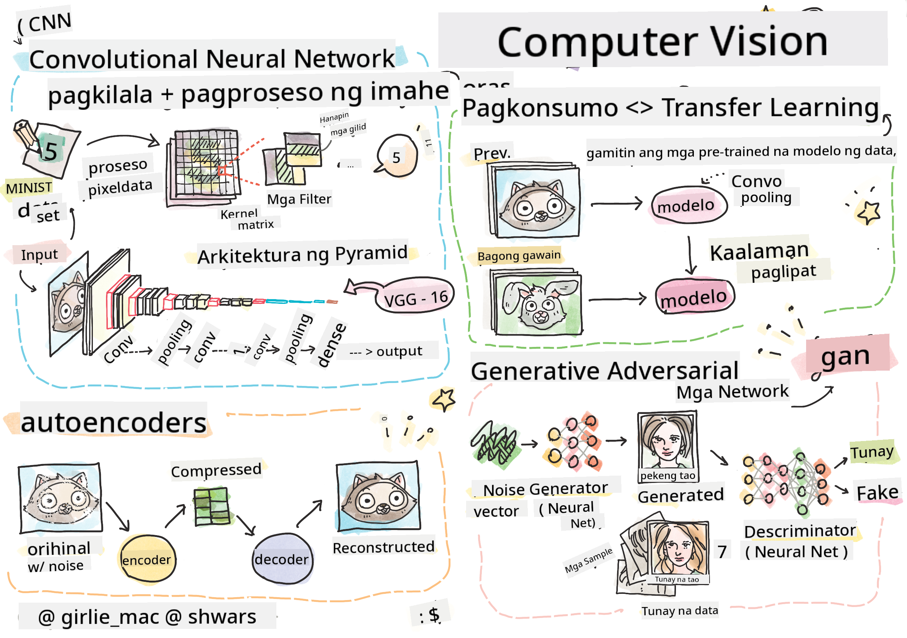

<!--
CO_OP_TRANSLATOR_METADATA:
{
  "original_hash": "58a52f000089c1d8906a4daa4ab1169b",
  "translation_date": "2025-08-28T02:29:29+00:00",
  "source_file": "lessons/4-ComputerVision/README.md",
  "language_code": "tl"
}
-->
# Computer Vision

Sa seksyong ito, matututo tayo tungkol sa:

* [Intro sa Computer Vision at OpenCV](06-IntroCV/README.md)
* [Convolutional Neural Networks](07-ConvNets/README.md)
* [Pre-trained Networks at Transfer Learning](08-TransferLearning/README.md) 
* [Autoencoders](09-Autoencoders/README.md)
* [Generative Adversarial Networks](10-GANs/README.md)
* [Object Detection](11-ObjectDetection/README.md)
* [Semantic Segmentation](12-Segmentation/README.md)

---

**Paunawa**:  
Ang dokumentong ito ay isinalin gamit ang AI translation service na [Co-op Translator](https://github.com/Azure/co-op-translator). Bagama't sinisikap naming maging tumpak, tandaan na ang mga awtomatikong pagsasalin ay maaaring maglaman ng mga pagkakamali o hindi pagkakatugma. Ang orihinal na dokumento sa kanyang katutubong wika ang dapat ituring na opisyal na sanggunian. Para sa mahalagang impormasyon, inirerekomenda ang propesyonal na pagsasalin ng tao. Hindi kami mananagot sa anumang hindi pagkakaunawaan o maling interpretasyon na maaaring magmula sa paggamit ng pagsasaling ito.