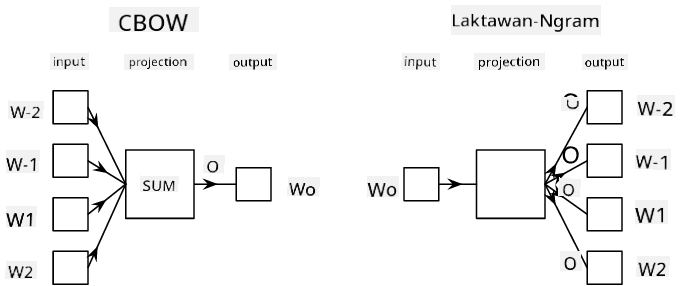

<!--
CO_OP_TRANSLATOR_METADATA:
{
  "original_hash": "31b46ba1f3aa78578134d4829f88be53",
  "translation_date": "2025-08-28T02:42:03+00:00",
  "source_file": "lessons/5-NLP/15-LanguageModeling/README.md",
  "language_code": "tl"
}
-->
# Pagmomodelo ng Wika

Ang semantic embeddings, tulad ng Word2Vec at GloVe, ay unang hakbang patungo sa **pagmomodelo ng wika** - paggawa ng mga modelo na sa isang paraan ay *nakakaunawa* (o *nagre-representa*) sa likas na katangian ng wika.

## [Pre-lecture quiz](https://red-field-0a6ddfd03.1.azurestaticapps.net/quiz/115)

Ang pangunahing ideya sa likod ng pagmomodelo ng wika ay ang pagsasanay sa mga ito gamit ang mga dataset na walang label sa isang unsupervised na paraan. Mahalaga ito dahil may napakaraming dami ng text na walang label na magagamit, habang ang dami ng text na may label ay palaging limitado sa dami ng pagsisikap na magagawa natin para maglagay ng label. Kadalasan, maaari tayong bumuo ng mga modelo ng wika na kayang **hulaan ang mga nawawalang salita** sa teksto, dahil madali lang takpan ang isang random na salita sa teksto at gamitin ito bilang sample para sa pagsasanay.

## Pagsasanay ng Embeddings

Sa ating mga nakaraang halimbawa, gumamit tayo ng mga pre-trained semantic embeddings, ngunit interesante ring makita kung paano maaaring sanayin ang mga embeddings na ito. May ilang posibleng ideya na maaaring gamitin:

* **N-Gram** na pagmomodelo ng wika, kung saan hinuhulaan natin ang isang token sa pamamagitan ng pagtingin sa N na naunang mga token (N-gram)
* **Continuous Bag-of-Words** (CBoW), kung saan hinuhulaan natin ang gitnang token $W_0$ sa isang sequence ng token $W_{-N}$, ..., $W_N$.
* **Skip-gram**, kung saan hinuhulaan natin ang isang set ng mga kalapit na token {$W_{-N},\dots, W_{-1}, W_1,\dots, W_N$} mula sa gitnang token $W_0$.

> Larawan mula sa [papel na ito](https://arxiv.org/pdf/1301.3781.pdf)

## ✍️ Mga Halimbawa ng Notebook: Pagsasanay ng CBoW Model

Ipagpatuloy ang iyong pag-aaral sa mga sumusunod na notebook:

* [Pagsasanay ng CBoW Word2Vec gamit ang TensorFlow](CBoW-TF.ipynb)
* [Pagsasanay ng CBoW Word2Vec gamit ang PyTorch](CBoW-PyTorch.ipynb)

## Konklusyon

Sa nakaraang aralin, nakita natin na ang word embeddings ay parang mahika! Ngayon alam natin na ang pagsasanay ng word embeddings ay hindi masyadong komplikadong gawain, at dapat nating magawa ang pagsasanay ng sarili nating word embeddings para sa domain-specific na teksto kung kinakailangan.

## [Post-lecture quiz](https://red-field-0a6ddfd03.1.azurestaticapps.net/quiz/215)

## Review at Pag-aaral sa Sarili

* [Opisyal na tutorial ng PyTorch tungkol sa Pagmomodelo ng Wika](https://pytorch.org/tutorials/beginner/nlp/word_embeddings_tutorial.html).
* [Opisyal na tutorial ng TensorFlow tungkol sa pagsasanay ng Word2Vec model](https://www.TensorFlow.org/tutorials/text/word2vec).
* Ang paggamit ng **gensim** framework para sanayin ang mga pinakakaraniwang ginagamit na embeddings sa ilang linya ng code ay nakalarawan [sa dokumentasyong ito](https://pytorch.org/tutorials/beginner/nlp/word_embeddings_tutorial.html).

## 🚀 [Gawain: Sanayin ang Skip-Gram Model](lab/README.md)

Sa lab, hinahamon ka naming baguhin ang code mula sa araling ito upang sanayin ang skip-gram model sa halip na CBoW. [Basahin ang mga detalye](lab/README.md)

---

**Paunawa**:  
Ang dokumentong ito ay isinalin gamit ang AI translation service na [Co-op Translator](https://github.com/Azure/co-op-translator). Bagama't sinisikap naming maging tumpak, tandaan na ang mga awtomatikong pagsasalin ay maaaring maglaman ng mga pagkakamali o hindi pagkakatugma. Ang orihinal na dokumento sa kanyang katutubong wika ang dapat ituring na opisyal na sanggunian. Para sa mahalagang impormasyon, inirerekomenda ang propesyonal na pagsasalin ng tao. Hindi kami mananagot sa anumang hindi pagkakaunawaan o maling interpretasyon na maaaring magmula sa paggamit ng pagsasaling ito.