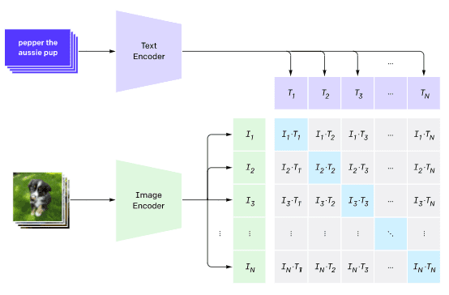
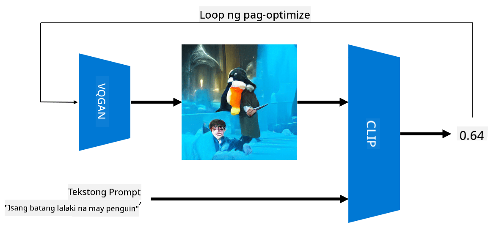

<!--
CO_OP_TRANSLATOR_METADATA:
{
  "original_hash": "9c592c26aca16ca085d268c732284187",
  "translation_date": "2025-08-28T02:29:00+00:00",
  "source_file": "lessons/X-Extras/X1-MultiModal/README.md",
  "language_code": "tl"
}
-->
# Multi-Modal Networks

Matapos ang tagumpay ng mga transformer model sa paglutas ng mga gawain sa NLP, ang parehong arkitektura o mga katulad nito ay inilapat sa mga gawain sa computer vision. Lumalago ang interes sa paggawa ng mga modelong *pinagsasama* ang kakayahan sa vision at natural language. Isa sa mga ganitong pagsubok ay ginawa ng OpenAI, na tinawag na CLIP at DALL.E.

## Contrastive Image Pre-Training (CLIP)

Ang pangunahing ideya ng CLIP ay ang kakayahang ihambing ang mga text prompt sa isang imahe at tukuyin kung gaano kahusay na tumutugma ang imahe sa prompt.

> *Larawan mula sa [blog post na ito](https://openai.com/blog/clip/)*

Ang modelo ay sinanay gamit ang mga imaheng nakuha mula sa Internet at ang kanilang mga caption. Para sa bawat batch, kumukuha tayo ng N pares ng (imahe, teksto), at kino-convert ang mga ito sa mga vector representation I, ..., T. Ang mga representasyong ito ay itinatapat sa isa't isa. Ang loss function ay idinisenyo upang i-maximize ang cosine similarity sa pagitan ng mga vector na tumutugma sa isang pares (hal. I at T), at i-minimize ang cosine similarity sa lahat ng iba pang pares. Ito ang dahilan kung bakit tinawag ang approach na ito na **contrastive**.

Ang CLIP model/library ay makukuha mula sa [OpenAI GitHub](https://github.com/openai/CLIP). Ang approach na ito ay ipinaliwanag sa [blog post na ito](https://openai.com/blog/clip/), at mas detalyado sa [papel na ito](https://arxiv.org/pdf/2103.00020.pdf).

Kapag ang modelong ito ay na-pretrain na, maaari nating bigyan ito ng batch ng mga imahe at batch ng mga text prompt, at ang ibabalik nito ay isang tensor na may mga probabilidad. Ang CLIP ay maaaring gamitin sa iba't ibang gawain:

**Image Classification**

Halimbawa, kailangan nating i-classify ang mga imahe sa pagitan ng, sabihin nating, pusa, aso, at tao. Sa kasong ito, maaari nating bigyan ang modelo ng isang imahe, at isang serye ng mga text prompt: "*isang larawan ng pusa*", "*isang larawan ng aso*", "*isang larawan ng tao*". Sa resultang vector ng 3 probabilidad, pipiliin lang natin ang index na may pinakamataas na halaga.

> *Larawan mula sa [blog post na ito](https://openai.com/blog/clip/)*

**Text-Based Image Search**

Maaari rin nating gawin ang kabaligtaran. Kung mayroon tayong koleksyon ng mga imahe, maaari nating ipasa ang koleksyong ito sa modelo, kasama ang isang text prompt - magbibigay ito ng imahe na pinaka-tugma sa ibinigay na prompt.

## ✍️ Halimbawa: [Paggamit ng CLIP para sa Image Classification at Image Search](Clip.ipynb)

Buksan ang [Clip.ipynb](Clip.ipynb) notebook upang makita ang CLIP sa aksyon.

## Image Generation gamit ang VQGAN+CLIP

Ang CLIP ay maaari ring gamitin para sa **image generation** mula sa isang text prompt. Upang magawa ito, kailangan natin ng isang **generator model** na kayang lumikha ng mga imahe batay sa isang vector input. Isa sa mga modelong ito ay tinatawag na [VQGAN](https://compvis.github.io/taming-transformers/) (Vector-Quantized GAN).

Ang mga pangunahing ideya ng VQGAN na nagtatangi dito mula sa karaniwang [GAN](../../4-ComputerVision/10-GANs/README.md) ay ang mga sumusunod:
* Paggamit ng autoregressive transformer architecture upang makabuo ng isang sequence ng mga context-rich visual parts na bumubuo sa imahe. Ang mga visual parts na ito ay natutunan naman ng [CNN](../../4-ComputerVision/07-ConvNets/README.md).
* Paggamit ng sub-image discriminator na tumutukoy kung ang mga bahagi ng imahe ay "totoo" o "peke" (hindi tulad ng "all-or-nothing" na approach sa tradisyunal na GAN).

Alamin ang higit pa tungkol sa VQGAN sa [Taming Transformers](https://compvis.github.io/taming-transformers/) web site.

Isa sa mga mahalagang pagkakaiba ng VQGAN sa tradisyunal na GAN ay ang huli ay kayang gumawa ng disenteng imahe mula sa anumang input vector, habang ang VQGAN ay malamang na makagawa ng imahe na hindi coherent. Kaya, kailangan nating gabayan pa ang proseso ng paggawa ng imahe, at magagawa ito gamit ang CLIP.

Upang makabuo ng isang imahe na tumutugma sa isang text prompt, nagsisimula tayo sa isang random encoding vector na ipinapasa sa VQGAN upang makabuo ng isang imahe. Pagkatapos, ginagamit ang CLIP upang makabuo ng isang loss function na nagpapakita kung gaano kahusay na tumutugma ang imahe sa text prompt. Ang layunin ay i-minimize ang loss na ito, gamit ang back propagation upang ayusin ang mga parameter ng input vector.

Isang mahusay na library na nagpapatupad ng VQGAN+CLIP ay ang [Pixray](http://github.com/pixray/pixray).

 |   | 
----|----|----
Larawang ginawa mula sa prompt *isang closeup watercolor portrait ng batang lalaking guro ng panitikan na may hawak na libro* | Larawang ginawa mula sa prompt *isang closeup oil portrait ng batang babaeng guro ng computer science na may hawak na computer* | Larawang ginawa mula sa prompt *isang closeup oil portrait ng matandang lalaking guro ng matematika sa harap ng blackboard*

> Mga larawan mula sa koleksyong **Artificial Teachers** ni [Dmitry Soshnikov](http://soshnikov.com)

## DALL-E
### [DALL-E 1](https://openai.com/research/dall-e)
Ang DALL-E ay isang bersyon ng GPT-3 na sinanay upang makabuo ng mga imahe mula sa mga prompt. Ito ay sinanay gamit ang 12-bilyong parameter.

Hindi tulad ng CLIP, ang DALL-E ay tumatanggap ng parehong teksto at imahe bilang isang solong stream ng mga token para sa parehong imahe at teksto. Kaya, mula sa maraming prompt, maaari kang makabuo ng mga imahe batay sa teksto.

### [DALL-E 2](https://openai.com/dall-e-2)
Ang pangunahing pagkakaiba ng DALL.E 1 at 2 ay ang kakayahan nitong makabuo ng mas makatotohanang mga imahe at sining.

Mga halimbawa ng image generation gamit ang DALL-E:
 |   | 
----|----|----
Larawang ginawa mula sa prompt *isang closeup watercolor portrait ng batang lalaking guro ng panitikan na may hawak na libro* | Larawang ginawa mula sa prompt *isang closeup oil portrait ng batang babaeng guro ng computer science na may hawak na computer* | Larawang ginawa mula sa prompt *isang closeup oil portrait ng matandang lalaking guro ng matematika sa harap ng blackboard*

## Mga Sanggunian

* VQGAN Paper: [Taming Transformers for High-Resolution Image Synthesis](https://compvis.github.io/taming-transformers/paper/paper.pdf)
* CLIP Paper: [Learning Transferable Visual Models From Natural Language Supervision](https://arxiv.org/pdf/2103.00020.pdf)

---

**Paunawa**:  
Ang dokumentong ito ay isinalin gamit ang AI translation service na [Co-op Translator](https://github.com/Azure/co-op-translator). Bagama't sinisikap naming maging tumpak, pakitandaan na ang mga awtomatikong pagsasalin ay maaaring maglaman ng mga pagkakamali o hindi pagkakatugma. Ang orihinal na dokumento sa kanyang katutubong wika ang dapat ituring na opisyal na sanggunian. Para sa mahalagang impormasyon, inirerekomenda ang propesyonal na pagsasalin ng tao. Hindi kami mananagot sa anumang hindi pagkakaunawaan o maling interpretasyon na maaaring magmula sa paggamit ng pagsasaling ito.