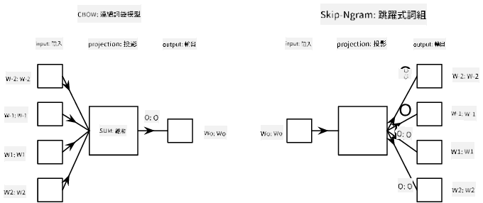

<!--
CO_OP_TRANSLATOR_METADATA:
{
  "original_hash": "31b46ba1f3aa78578134d4829f88be53",
  "translation_date": "2025-08-24T21:47:15+00:00",
  "source_file": "lessons/5-NLP/15-LanguageModeling/README.md",
  "language_code": "tw"
}
-->
# 語言建模

語意嵌入（例如 Word2Vec 和 GloVe）實際上是邁向**語言建模**的第一步——建立能夠以某種方式*理解*（或*表示*）語言特性的模型。

## [課前測驗](https://red-field-0a6ddfd03.1.azurestaticapps.net/quiz/115)

語言建模的核心理念是以無監督的方式在未標註的數據集上進行訓練。這很重要，因為我們擁有大量未標註的文本，而標註文本的數量則受限於我們能投入的標註工作量。通常，我們可以建立能夠**預測缺失詞**的語言模型，因為在文本中隨機遮蔽一個詞並將其作為訓練樣本是相對容易的。

## 嵌入訓練

在之前的例子中，我們使用了預訓練的語意嵌入，但了解這些嵌入是如何訓練的也非常有趣。有幾種可能的想法可以用於訓練：

* **N-Gram** 語言建模，通過查看前 N 個詞元（N-gram）來預測一個詞元。
* **連續詞袋模型** (CBoW)，在詞元序列 $W_{-N}$, ..., $W_N$ 中預測中間詞元 $W_0$。
* **Skip-gram**，從中間詞元 $W_0$ 預測一組相鄰詞元 {$W_{-N},\dots, W_{-1}, W_1,\dots, W_N$}。

> 圖片來源：[這篇論文](https://arxiv.org/pdf/1301.3781.pdf)

## ✍️ 範例筆記本：訓練 CBoW 模型

繼續學習以下筆記本：

* [使用 TensorFlow 訓練 CBoW Word2Vec](../../../../../lessons/5-NLP/15-LanguageModeling/CBoW-TF.ipynb)
* [使用 PyTorch 訓練 CBoW Word2Vec](../../../../../lessons/5-NLP/15-LanguageModeling/CBoW-PyTorch.ipynb)

## 結論

在上一課中，我們看到詞嵌入的效果就像魔法一樣！現在我們知道，訓練詞嵌入並不是一項非常複雜的任務，如果需要，我們應該能夠為特定領域的文本訓練自己的詞嵌入。

## [課後測驗](https://red-field-0a6ddfd03.1.azurestaticapps.net/quiz/215)

## 回顧與自學

* [PyTorch 官方語言建模教程](https://pytorch.org/tutorials/beginner/nlp/word_embeddings_tutorial.html)。
* [TensorFlow 官方訓練 Word2Vec 模型教程](https://www.TensorFlow.org/tutorials/text/word2vec)。
* 使用 **gensim** 框架訓練最常用的嵌入只需幾行代碼，詳情請參閱[此文檔](https://pytorch.org/tutorials/beginner/nlp/word_embeddings_tutorial.html)。

## 🚀 [作業：訓練 Skip-Gram 模型](lab/README.md)

在實驗中，我們挑戰你修改本課的代碼以訓練 Skip-Gram 模型，而非 CBoW。[閱讀詳情](lab/README.md)。

**免責聲明**：  
本文件使用 AI 翻譯服務 [Co-op Translator](https://github.com/Azure/co-op-translator) 進行翻譯。我們致力於提供準確的翻譯，但請注意，自動翻譯可能包含錯誤或不準確之處。應以原始語言的文件作為權威來源。對於關鍵資訊，建議尋求專業人工翻譯。我們對因使用此翻譯而引起的任何誤解或誤讀概不負責。