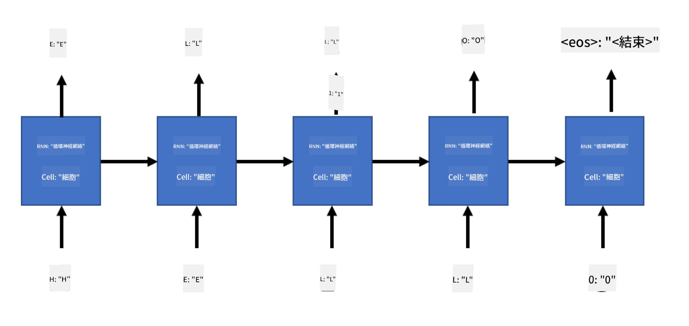

<!--
CO_OP_TRANSLATOR_METADATA:
{
  "original_hash": "d9de7847385eeeda67cfdcce1640ab72",
  "translation_date": "2025-08-24T21:45:28+00:00",
  "source_file": "lessons/5-NLP/17-GenerativeNetworks/README.md",
  "language_code": "tw"
}
-->
# 生成式網絡

## [課前測驗](https://ff-quizzes.netlify.app/en/ai/quiz/33)

循環神經網絡（RNN）及其門控單元變體，例如長短期記憶單元（LSTM）和門控循環單元（GRU），提供了一種語言建模的機制，因為它們可以學習單詞的排列順序，並對序列中的下一個單詞進行預測。這使得我們可以使用 RNN 進行**生成任務**，例如普通文本生成、機器翻譯，甚至圖像描述。

> ✅ 想一想你在輸入時受益於文本補全等生成任務的所有情況。研究一下你喜愛的應用程序，看看它們是否利用了 RNN。

在上一單元中討論的 RNN 架構中，每個 RNN 單元會生成下一個隱藏狀態作為輸出。然而，我們也可以為每個循環單元添加另一個輸出，這樣就可以輸出一個**序列**（其長度等於原始序列）。此外，我們可以使用不在每一步接受輸入的 RNN 單元，而僅接受一些初始狀態向量，然後生成一個輸出序列。

這使得可以構建不同的神經網絡架構，如下圖所示：


> 圖片來自 [Andrej Karpaty](http://karpathy.github.io/) 的博客文章 [Unreasonable Effectiveness of Recurrent Neural Networks](http://karpathy.github.io/2015/05/21/rnn-effectiveness/)

* **一對一** 是一個傳統的神經網絡，具有一個輸入和一個輸出
* **一對多** 是一種生成式架構，接受一個輸入值，並生成一個輸出值序列。例如，如果我們想訓練一個**圖像描述**網絡來生成圖片的文字描述，我們可以將圖片作為輸入，通過 CNN 獲取其隱藏狀態，然後使用一個循環鏈逐字生成描述。
* **多對一** 對應於我們在上一單元中描述的 RNN 架構，例如文本分類
* **多對多** 或 **序列對序列** 對應於例如**機器翻譯**的任務，其中第一個 RNN 將輸入序列中的所有信息收集到隱藏狀態中，然後另一個 RNN 鏈將該狀態展開為輸出序列。

在本單元中，我們將專注於幫助我們生成文本的簡單生成模型。為了簡化，我們將使用字符級標記化。

我們將訓練這個 RNN 逐步生成文本。在每一步中，我們將取一個長度為 `nchars` 的字符序列，並要求網絡為每個輸入字符生成下一個輸出字符：



在生成文本（推理過程中）時，我們從某個**提示**開始，將其傳遞給 RNN 單元以生成其中間狀態，然後從該狀態開始生成。我們一次生成一個字符，並將狀態和生成的字符傳遞給另一個 RNN 單元以生成下一個字符，直到生成足夠的字符。


> 圖片由作者提供

## ✍️ 練習：生成式網絡

在以下筆記本中繼續學習：

* [使用 PyTorch 的生成式網絡](../../../../../lessons/5-NLP/17-GenerativeNetworks/GenerativePyTorch.ipynb)
* [使用 TensorFlow 的生成式網絡](../../../../../lessons/5-NLP/17-GenerativeNetworks/GenerativeTF.ipynb)

## 軟文本生成與溫度

每個 RNN 單元的輸出是一個字符的概率分佈。如果我們總是選擇概率最高的字符作為生成文本中的下一個字符，文本往往會在相同的字符序列之間反覆循環，如以下示例所示：

```
today of the second the company and a second the company ...
```

然而，如果我們查看下一個字符的概率分佈，可能會發現幾個最高概率之間的差異並不大，例如一個字符的概率可能是 0.2，另一個是 0.19，等等。例如，在查找序列 '*play*' 的下一個字符時，下一個字符可能是空格，也可能是 **e**（如單詞 *player* 中）。

這讓我們得出結論，選擇概率最高的字符並不總是“公平”的，因為選擇第二高的字符仍然可能導致有意義的文本。更明智的做法是從網絡輸出的概率分佈中**抽樣**字符。我們還可以使用一個參數，**溫度**，來平滑概率分佈，如果我們想增加隨機性，或者使其更陡峭，如果我們想更傾向於最高概率的字符。

在上面鏈接的筆記本中探索這種軟文本生成的實現方式。

## 結論

雖然文本生成本身可能很有用，但主要的好處來自於能夠使用 RNN 從某些初始特徵向量生成文本。例如，文本生成被用作機器翻譯的一部分（序列對序列，在這種情況下，*編碼器* 的狀態向量被用來生成或*解碼*翻譯的消息），或者生成圖像的文字描述（在這種情況下，特徵向量來自 CNN 提取器）。

## 🚀 挑戰

在 Microsoft Learn 上學習一些相關課程

* 使用 [PyTorch](https://docs.microsoft.com/learn/modules/intro-natural-language-processing-pytorch/6-generative-networks/?WT.mc_id=academic-77998-cacaste)/[TensorFlow](https://docs.microsoft.com/learn/modules/intro-natural-language-processing-tensorflow/5-generative-networks/?WT.mc_id=academic-77998-cacaste) 進行文本生成

## [課後測驗](https://ff-quizzes.netlify.app/en/ai/quiz/34)

## 回顧與自學

以下是一些擴展知識的文章

* 使用馬爾可夫鏈、LSTM 和 GPT-2 進行文本生成的不同方法：[博客文章](https://towardsdatascience.com/text-generation-gpt-2-lstm-markov-chain-9ea371820e1e)
* [Keras 文檔](https://keras.io/examples/generative/lstm_character_level_text_generation/)中的文本生成示例

## [作業](lab/README.md)

我們已經了解了如何逐字符生成文本。在實驗中，您將探索基於單詞的文本生成。

**免責聲明**：  
本文件使用 AI 翻譯服務 [Co-op Translator](https://github.com/Azure/co-op-translator) 進行翻譯。儘管我們努力確保翻譯的準確性，但請注意，自動翻譯可能包含錯誤或不準確之處。原始文件的母語版本應被視為權威來源。對於關鍵資訊，建議使用專業人工翻譯。我們對因使用此翻譯而引起的任何誤解或錯誤解釋不承擔責任。