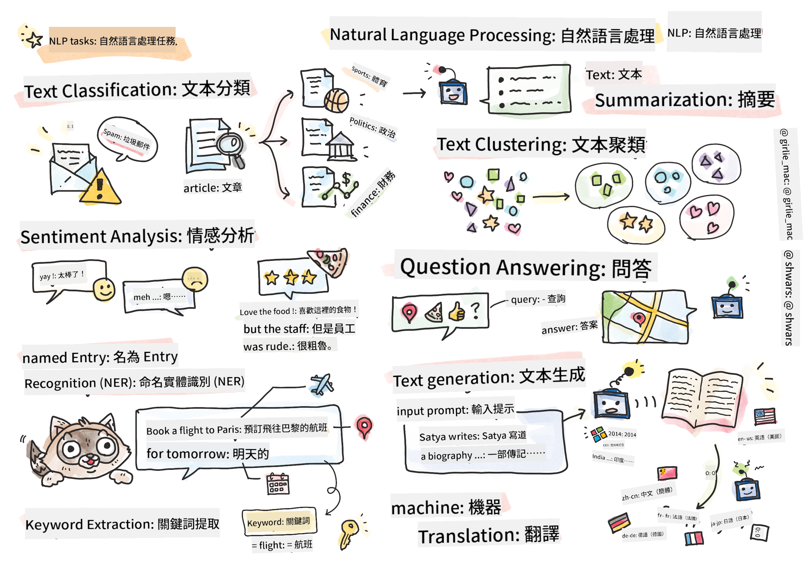

<!--
CO_OP_TRANSLATOR_METADATA:
{
  "original_hash": "8ef02a9318257ea140ed3ed74442096d",
  "translation_date": "2025-08-24T21:43:04+00:00",
  "source_file": "lessons/5-NLP/README.md",
  "language_code": "tw"
}
-->
# 自然語言處理



在本章節中，我們將專注於使用神經網絡來處理與**自然語言處理 (NLP)**相關的任務。我們希望電腦能夠解決許多NLP問題：

* **文本分類**是一種典型的分類問題，針對文本序列進行分類。例如，將電子郵件分類為垃圾郵件或非垃圾郵件，或者將文章分類為體育、商業、政治等。此外，在開發聊天機器人時，我們通常需要理解使用者的意圖——這就是所謂的**意圖分類**。意圖分類通常需要處理多個類別。
* **情感分析**是一種典型的回歸問題，我們需要為句子的正面/負面情感賦予一個數值。一種更高級的情感分析是**基於方面的情感分析** (ABSA)，它不是為整個句子賦予情感，而是為句子的不同部分（方面）賦予情感，例如：*在這家餐廳，我喜歡菜餚，但氛圍很糟糕*。
* **命名實體識別** (NER) 是指從文本中提取特定實體的問題。例如，我們需要理解在句子*我明天要飛往巴黎*中，*明天*指的是日期，*巴黎*是地點。
* **關鍵字提取**類似於NER，但我們需要自動提取對句子含義重要的詞語，而不需要針對特定實體類型進行預訓練。
* **文本聚類**在需要將相似的句子分組時非常有用，例如技術支持對話中的相似請求。
* **問答**是指模型回答特定問題的能力。模型接收一段文本和一個問題作為輸入，並需要提供文本中包含答案的位置（有時需要生成答案文本）。
* **文本生成**是指模型生成新文本的能力。它可以被視為一種分類任務，根據某些*文本提示*預測下一個字母/單詞。高級文本生成模型，例如GPT-3，能夠通過使用[提示編程](https://towardsdatascience.com/software-3-0-how-prompting-will-change-the-rules-of-the-game-a982fbfe1e0)或[提示工程](https://medium.com/swlh/openai-gpt-3-and-prompt-engineering-dcdc2c5fcd29)技術來解決其他NLP任務，例如分類。
* **文本摘要**是一種技術，當我們希望電腦“閱讀”長文本並用幾句話進行摘要時使用。
* **機器翻譯**可以被視為一種結合一種語言的文本理解和另一種語言的文本生成的技術。

最初，大多數NLP任務是使用傳統方法（例如語法）來解決的。例如，在機器翻譯中，解析器被用來將初始句子轉換為語法樹，然後提取高層語義結構以表示句子的含義，基於這些含義和目標語言的語法生成結果。如今，許多NLP任務使用神經網絡更有效地解決。

> 許多經典的NLP方法已在[自然語言處理工具包 (NLTK)](https://www.nltk.org) Python庫中實現。線上有一本很棒的[NLTK書籍](https://www.nltk.org/book/)，涵蓋了如何使用NLTK解決不同的NLP任務。

在我們的課程中，我們將主要專注於使用神經網絡進行NLP，並在需要時使用NLTK。

我們已經學習了如何使用神經網絡處理表格數據和圖像。這些數據類型與文本的主要區別在於，文本是一種可變長度的序列，而圖像的輸入大小是事先已知的。雖然卷積網絡可以從輸入數據中提取模式，但文本中的模式更為複雜。例如，否定可能與主語分隔許多詞語（例如：*我不喜歡橙子*，與*我不喜歡那些又大又多彩又美味的橙子*），但仍應被解釋為一個模式。因此，為了處理語言，我們需要引入新的神經網絡類型，例如*循環網絡*和*Transformer*。

## 安裝庫

如果您使用本地Python環境運行本課程，可能需要使用以下命令安裝所有NLP所需的庫：

**PyTorch**
```bash
pip install -r requirements-torch.txt
```
**TensorFlow**
```bash
pip install -r requirements-tf.txt
```

> 您可以在[Microsoft Learn](https://docs.microsoft.com/learn/modules/intro-natural-language-processing-tensorflow/?WT.mc_id=academic-77998-cacaste)上嘗試使用TensorFlow進行NLP。

## GPU警告

在本章節中，我們的一些範例將訓練相當大的模型。
* **使用支持GPU的電腦**：建議在支持GPU的電腦上運行您的筆記本，以減少處理大型模型時的等待時間。
* **GPU記憶體限制**：使用GPU可能會導致GPU記憶體不足的情況，特別是在訓練大型模型時。
* **GPU記憶體消耗**：訓練過程中GPU記憶體的消耗取決於多種因素，包括小批量大小。
* **減少小批量大小**：如果遇到GPU記憶體問題，可以考慮減少代碼中的小批量大小作為解決方案。
* **TensorFlow GPU記憶體釋放**：舊版本的TensorFlow可能無法正確釋放GPU記憶體，特別是在一個Python內核中訓練多個模型時。為了有效管理GPU記憶體使用，您可以配置TensorFlow僅在需要時分配GPU記憶體。
* **代碼包含**：要設置TensorFlow僅在需要時增長GPU記憶體分配，請在您的筆記本中包含以下代碼：

```python
physical_devices = tf.config.list_physical_devices('GPU') 
if len(physical_devices)>0:
    tf.config.experimental.set_memory_growth(physical_devices[0], True) 
```

如果您對從經典機器學習角度學習NLP感興趣，請訪問[這套課程](https://github.com/microsoft/ML-For-Beginners/tree/main/6-NLP)。

## 本章節內容
在本章節中，我們將學習：

* [將文本表示為張量](13-TextRep/README.md)
* [詞嵌入](14-Emdeddings/README.md)
* [語言建模](15-LanguageModeling/README.md)
* [循環神經網絡](16-RNN/README.md)
* [生成式網絡](17-GenerativeNetworks/README.md)
* [Transformer](18-Transformers/README.md)

**免責聲明**：  
本文件使用 AI 翻譯服務 [Co-op Translator](https://github.com/Azure/co-op-translator) 進行翻譯。我們致力於提供準確的翻譯，但請注意，自動翻譯可能包含錯誤或不準確之處。應以原文文件作為權威來源。對於關鍵資訊，建議尋求專業人工翻譯。我們對因使用此翻譯而引起的任何誤解或錯誤解釋概不負責。