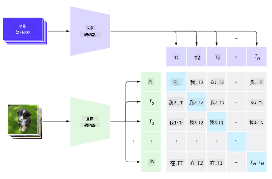
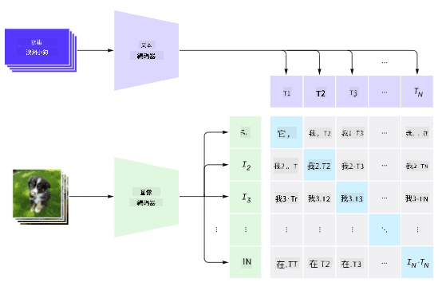
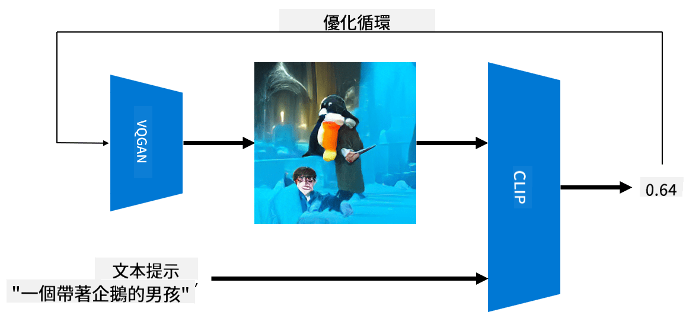

<!--
CO_OP_TRANSLATOR_METADATA:
{
  "original_hash": "9c592c26aca16ca085d268c732284187",
  "translation_date": "2025-08-24T22:06:50+00:00",
  "source_file": "lessons/X-Extras/X1-MultiModal/README.md",
  "language_code": "tw"
}
-->
# 多模態網絡

在變壓器模型成功解決 NLP 任務後，相同或類似的架構也被應用於計算機視覺任務。現在越來越多的人對於構建能夠*結合*視覺和自然語言能力的模型產生了興趣。其中一個嘗試是由 OpenAI 完成的，稱為 CLIP 和 DALL.E。

## 對比圖像預訓練（CLIP）

CLIP 的主要理念是能夠比較文本提示與圖像，並確定圖像與提示的匹配程度。

> *圖片來自[這篇博客文章](https://openai.com/blog/clip/)*

該模型是基於從互聯網獲取的圖像及其標題進行訓練的。對於每個批次，我們取 N 對（圖像，文本），並將它們轉換為某些向量表示 I 和 T。這些表示隨後會進行匹配。損失函數被定義為最大化一對（例如 I 和 T）之間向量的餘弦相似度，並最小化所有其他對之間的餘弦相似度。這就是為什麼這種方法被稱為**對比學習**。

CLIP 模型/庫可以從 [OpenAI GitHub](https://github.com/openai/CLIP) 獲取。該方法在[這篇博客文章](https://openai.com/blog/clip/)中有描述，並在[這篇論文](https://arxiv.org/pdf/2103.00020.pdf)中有更詳細的說明。

一旦該模型完成預訓練，我們可以給它一批圖像和一批文本提示，它將返回一個概率張量。CLIP 可以用於多種任務：

**圖像分類**

假設我們需要將圖像分類為貓、狗和人類。在這種情況下，我們可以給模型一張圖像，以及一系列文本提示：“*一張貓的圖片*”、“*一張狗的圖片*”、“*一張人類的圖片*”。在結果的 3 個概率向量中，我們只需選擇值最高的索引。

> *圖片來自[這篇博客文章](https://openai.com/blog/clip/)*

**基於文本的圖像搜索**

我們也可以反過來操作。如果我們有一組圖像，我們可以將這組圖像傳遞給模型，並提供一個文本提示——這將返回與給定提示最相似的圖像。

## ✍️ 範例：[使用 CLIP 進行圖像分類和圖像搜索](../../../../../lessons/X-Extras/X1-MultiModal/Clip.ipynb)

打開 [Clip.ipynb](../../../../../lessons/X-Extras/X1-MultiModal/Clip.ipynb) 筆記本，查看 CLIP 的實際應用。

## 使用 VQGAN+CLIP 進行圖像生成

CLIP 還可以用於從文本提示生成**圖像**。為了實現這一點，我們需要一個**生成器模型**，該模型能夠基於某些向量輸入生成圖像。其中一個這樣的模型稱為 [VQGAN](https://compvis.github.io/taming-transformers/)（向量量化生成對抗網絡）。

VQGAN 與普通 [GAN](../../4-ComputerVision/10-GANs/README.md) 的主要區別在於以下幾點：
* 使用自回歸變壓器架構生成一系列上下文豐富的視覺部分，這些部分構成了圖像。而這些視覺部分則由 [CNN](../../4-ComputerVision/07-ConvNets/README.md) 學習。
* 使用子圖像鑑別器來檢測圖像的部分是“真實”還是“偽造”（與傳統 GAN 的“全有或全無”方法不同）。

可以在 [Taming Transformers](https://compvis.github.io/taming-transformers/) 網站上了解更多關於 VQGAN 的信息。

VQGAN 與傳統 GAN 的一個重要區別在於，後者可以從任何輸入向量生成一張像樣的圖像，而 VQGAN 可能生成一張不連貫的圖像。因此，我們需要進一步引導圖像創建過程，而這可以通過 CLIP 完成。

為了生成與文本提示相對應的圖像，我們從一些隨機編碼向量開始，將其傳遞給 VQGAN 以生成圖像。然後使用 CLIP 生成一個損失函數，該函數顯示圖像與文本提示的匹配程度。目標是最小化這個損失，通過反向傳播調整輸入向量參數。

一個實現 VQGAN+CLIP 的優秀庫是 [Pixray](http://github.com/pixray/pixray)

 |   | 
----|----|----
由提示 *一幅年輕男性文學教師手持書本的水彩特寫肖像* 生成的圖片 | 由提示 *一幅年輕女性計算機科學教師手持電腦的油畫特寫肖像* 生成的圖片 | 由提示 *一幅年長男性數學教師站在黑板前的油畫特寫肖像* 生成的圖片

> 圖片來自 [Dmitry Soshnikov](http://soshnikov.com) 的 **人工教師** 系列

## DALL-E
### [DALL-E 1](https://openai.com/research/dall-e)
DALL-E 是一個基於 GPT-3 的版本，專門用於從提示生成圖像。它擁有 120 億個參數。

與 CLIP 不同，DALL-E 將文本和圖像作為單一的令牌流進行處理。因此，從多個提示中可以基於文本生成圖像。

### [DALL-E 2](https://openai.com/dall-e-2)
DALL-E 1 和 2 的主要區別在於，DALL-E 2 能夠生成更真實的圖像和藝術作品。

使用 DALL-E 生成圖像的範例：
 |   | 
----|----|----
由提示 *一幅年輕男性文學教師手持書本的水彩特寫肖像* 生成的圖片 | 由提示 *一幅年輕女性計算機科學教師手持電腦的油畫特寫肖像* 生成的圖片 | 由提示 *一幅年長男性數學教師站在黑板前的油畫特寫肖像* 生成的圖片

## 參考資料

* VQGAN 論文：[Taming Transformers for High-Resolution Image Synthesis](https://compvis.github.io/taming-transformers/paper/paper.pdf)
* CLIP 論文：[Learning Transferable Visual Models From Natural Language Supervision](https://arxiv.org/pdf/2103.00020.pdf)

**免責聲明**：  
本文件使用 AI 翻譯服務 [Co-op Translator](https://github.com/Azure/co-op-translator) 進行翻譯。雖然我們致力於提供準確的翻譯，但請注意，自動翻譯可能包含錯誤或不準確之處。原始文件的母語版本應被視為權威來源。對於關鍵資訊，建議使用專業人工翻譯。我們對因使用此翻譯而引起的任何誤解或錯誤解釋不承擔責任。