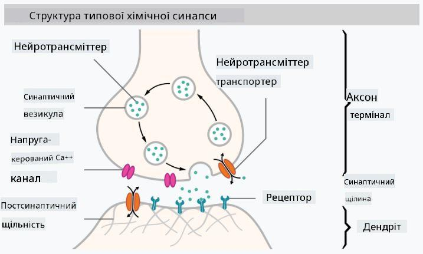
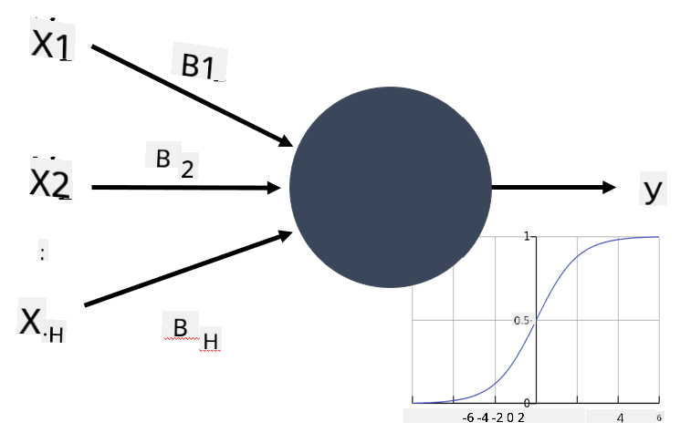

<!--
CO_OP_TRANSLATOR_METADATA:
{
  "original_hash": "5abc5f7978919be90cd313f0c20e8228",
  "translation_date": "2025-09-07T14:37:56+00:00",
  "source_file": "lessons/3-NeuralNetworks/README.md",
  "language_code": "uk"
}
-->
# Вступ до нейронних мереж

Як ми обговорювали у вступі, одним із способів досягнення інтелекту є навчання **комп'ютерної моделі** або **штучного мозку**. З середини 20-го століття дослідники пробували різні математичні моделі, і лише в останні роки цей напрямок став надзвичайно успішним. Такі математичні моделі мозку називаються **нейронними мережами**.

> Іноді нейронні мережі називають *штучними нейронними мережами* (Artificial Neural Networks, ANNs), щоб підкреслити, що йдеться про моделі, а не про реальні мережі нейронів.

## Машинне навчання

Нейронні мережі є частиною більшої дисципліни, яка називається **машинним навчанням**, метою якої є використання даних для навчання комп'ютерних моделей, здатних вирішувати задачі. Машинне навчання становить значну частину штучного інтелекту, однак у цій програмі ми не розглядаємо класичне машинне навчання.

> Відвідайте нашу окрему програму **[Машинне навчання для початківців](http://github.com/microsoft/ml-for-beginners)**, щоб дізнатися більше про класичне машинне навчання.

У машинному навчанні ми припускаємо, що маємо певний набір даних прикладів **X** і відповідні вихідні значення **Y**. Приклади часто є N-вимірними векторами, які складаються з **ознак**, а вихідні значення називаються **мітками**.

Ми розглянемо дві найпоширеніші задачі машинного навчання:

* **Класифікація**, де потрібно класифікувати вхідний об'єкт у дві або більше категорії.
* **Регресія**, де потрібно передбачити числове значення для кожного з вхідних зразків.

> При представленні входів і виходів у вигляді тензорів, вхідний набір даних є матрицею розміру M×N, де M — кількість зразків, а N — кількість ознак. Вихідні мітки Y — це вектор розміру M.

У цій програмі ми зосередимося лише на моделях нейронних мереж.

## Модель нейрона

З біології ми знаємо, що наш мозок складається з нейронних клітин, кожна з яких має кілька "входів" (аксони) і один вихід (дендрит). Аксони і дендрити можуть проводити електричні сигнали, а зв’язки між аксонами і дендритами можуть мати різний ступінь провідності (який контролюється нейромедіаторами).

 | 
----|----
Реальний нейрон *([Зображення](https://en.wikipedia.org/wiki/Synapse#/media/File:SynapseSchematic_lines.svg) з Вікіпедії)* | Штучний нейрон *(Зображення автора)*

Таким чином, найпростіша математична модель нейрона містить кілька входів X1, ..., XN і один вихід Y, а також набір ваг W1, ..., WN. Вихід обчислюється як:

де f — це деяка нелінійна **функція активації**.

> Ранні моделі нейрона були описані в класичній статті [Логічне числення ідей, притаманних нервовій діяльності](https://www.cs.cmu.edu/~./epxing/Class/10715/reading/McCulloch.and.Pitts.pdf) Воррена МакКалока і Волтера Піттса у 1943 році. Дональд Хебб у своїй книзі "[Організація поведінки: нейропсихологічна теорія](https://books.google.com/books?id=VNetYrB8EBoC)" запропонував спосіб навчання таких мереж.

## У цьому розділі

У цьому розділі ми дізнаємося про:
* [Перцептрон](03-Perceptron/README.md), одну з найперших моделей нейронних мереж для класифікації на два класи
* [Багатошарові мережі](04-OwnFramework/README.md) з відповідним ноутбуком [як створити власний фреймворк](04-OwnFramework/OwnFramework.ipynb)
* [Фреймворки нейронних мереж](05-Frameworks/README.md), з такими ноутбуками: [PyTorch](05-Frameworks/IntroPyTorch.ipynb) і [Keras/Tensorflow](05-Frameworks/IntroKerasTF.ipynb)
* [Перенавчання](../../../../lessons/3-NeuralNetworks/05-Frameworks)

---

**Відмова від відповідальності**:  
Цей документ був перекладений за допомогою сервісу автоматичного перекладу [Co-op Translator](https://github.com/Azure/co-op-translator). Хоча ми прагнемо до точності, будь ласка, майте на увазі, що автоматичні переклади можуть містити помилки або неточності. Оригінальний документ на його рідній мові слід вважати авторитетним джерелом. Для критичної інформації рекомендується професійний людський переклад. Ми не несемо відповідальності за будь-які непорозуміння або неправильні інтерпретації, що виникають внаслідок використання цього перекладу.