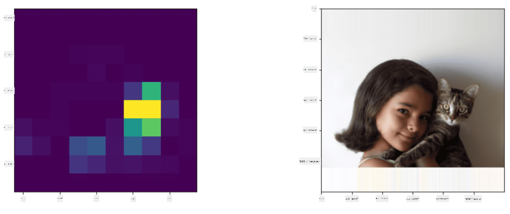
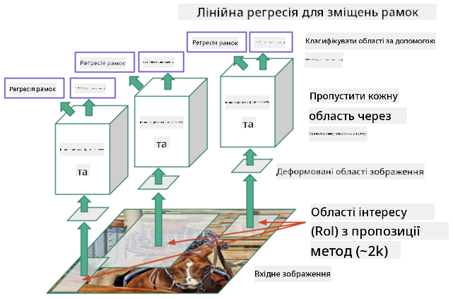
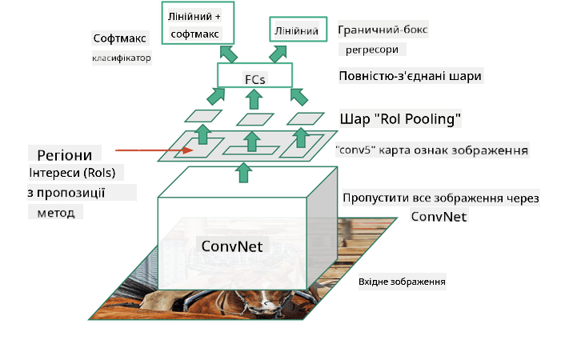
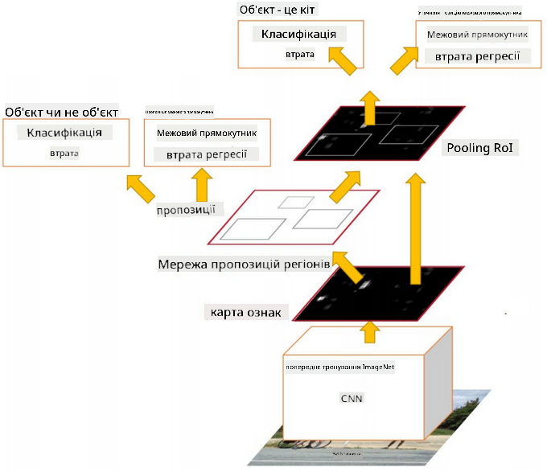
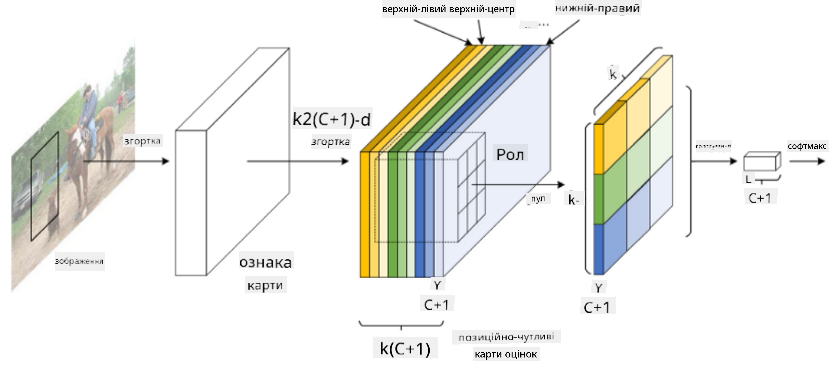
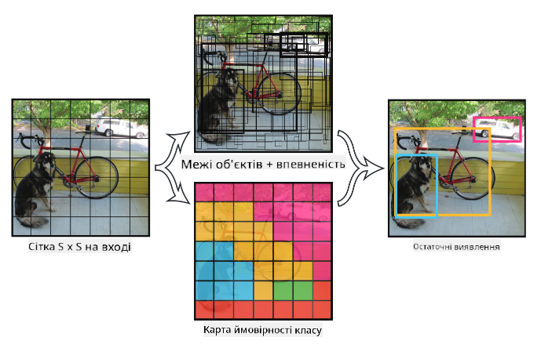

<!--
CO_OP_TRANSLATOR_METADATA:
{
  "original_hash": "d85c8b08f6d1b48fd7f35b99f93c1138",
  "translation_date": "2025-08-25T22:47:49+00:00",
  "source_file": "lessons/4-ComputerVision/11-ObjectDetection/README.md",
  "language_code": "uk"
}
-->
# Виявлення об'єктів

Моделі класифікації зображень, які ми розглядали раніше, брали зображення і видавали категоріальний результат, наприклад, клас "число" у задачі MNIST. Однак у багатьох випадках нам недостатньо просто знати, що на зображенні є об'єкти — ми хочемо визначити їх точне місцезнаходження. Саме це є метою **виявлення об'єктів**.

## [Тест перед лекцією](https://red-field-0a6ddfd03.1.azurestaticapps.net/quiz/111)

> Зображення з [вебсайту YOLO v2](https://pjreddie.com/darknet/yolov2/)

## Наївний підхід до виявлення об'єктів

Припустимо, ми хочемо знайти кота на зображенні. Дуже наївний підхід до виявлення об'єктів може виглядати так:

1. Розбити зображення на кілька плиток.
2. Запустити класифікацію зображень для кожної плитки.
3. Ті плитки, які дають достатньо високу активацію, можна вважати такими, що містять потрібний об'єкт.

> *Зображення з [робочого зошита](../../../../../lessons/4-ComputerVision/11-ObjectDetection/ObjectDetection-TF.ipynb)*

Однак цей підхід далекий від ідеального, оскільки він дозволяє алгоритму дуже неточно визначати межі об'єкта. Для більш точного визначення місцезнаходження нам потрібно виконати певну **регресію**, щоб передбачити координати межових рамок — і для цього потрібні спеціальні набори даних.

## Регресія для виявлення об'єктів

[Ця стаття в блозі](https://towardsdatascience.com/object-detection-with-neural-networks-a4e2c46b4491) пропонує чудове введення у виявлення форм.

## Набори даних для виявлення об'єктів

Ви можете зустріти такі набори даних для цієї задачі:

* [PASCAL VOC](http://host.robots.ox.ac.uk/pascal/VOC/) — 20 класів
* [COCO](http://cocodataset.org/#home) — Загальні об'єкти в контексті. 80 класів, межові рамки та маски сегментації

## Метрики для виявлення об'єктів

### Перетин над об'єднанням

Для класифікації зображень легко виміряти, наскільки добре працює алгоритм, але для виявлення об'єктів потрібно оцінити як правильність класу, так і точність визначення місцезнаходження межової рамки. Для останнього ми використовуємо так званий **Перетин над об'єднанням** (IoU), який вимірює, наскільки добре дві рамки (або дві довільні області) перекриваються.

> *Рисунок 2 з [цієї чудової статті про IoU](https://pyimagesearch.com/2016/11/07/intersection-over-union-iou-for-object-detection/)*

Ідея проста — ми ділимо площу перетину між двома фігурами на площу їх об'єднання. Для двох ідентичних областей IoU буде дорівнювати 1, а для повністю розділених областей — 0. В інших випадках значення буде варіюватися від 0 до 1. Зазвичай ми враховуємо лише ті межові рамки, для яких IoU перевищує певне значення.

### Середня точність

Припустимо, ми хочемо оцінити, наскільки добре розпізнається певний клас об'єктів $C$. Для цього використовуються метрики **Середньої точності**, які обчислюються наступним чином:

1. Розглядається крива Точність-Відклик, яка показує точність залежно від порогового значення виявлення (від 0 до 1).
2. Залежно від порогу, ми отримаємо більше або менше об'єктів, виявлених на зображенні, і різні значення точності та відклику.
3. Крива виглядатиме так:

> *Зображення з [NeuroWorkshop](http://github.com/shwars/NeuroWorkshop)*

Середня точність для даного класу $C$ — це площа під цією кривою. Точніше, вісь відклику зазвичай ділиться на 10 частин, і точність усереднюється за всіма цими точками:

$$
AP = {1\over11}\sum_{i=0}^{10}\mbox{Precision}(\mbox{Recall}={i\over10})
$$

### AP та IoU

Ми враховуємо лише ті виявлення, для яких IoU перевищує певне значення. Наприклад, у наборі даних PASCAL VOC зазвичай $\mbox{IoU Threshold} = 0.5$, тоді як у COCO AP вимірюється для різних значень $\mbox{IoU Threshold}$.

> *Зображення з [NeuroWorkshop](http://github.com/shwars/NeuroWorkshop)*

### Середня середня точність — mAP

Основною метрикою для виявлення об'єктів є **Середня середня точність**, або **mAP**. Це значення середньої точності, усереднене за всіма класами об'єктів, а іноді також за $\mbox{IoU Threshold}$. Детальніше процес обчислення **mAP** описаний
[у цій статті](https://medium.com/@timothycarlen/understanding-the-map-evaluation-metric-for-object-detection-a07fe6962cf3)), а також [тут із прикладами коду](https://gist.github.com/tarlen5/008809c3decf19313de216b9208f3734).

## Різні підходи до виявлення об'єктів

Існує дві основні категорії алгоритмів виявлення об'єктів:

* **Мережі пропозицій регіонів** (R-CNN, Fast R-CNN, Faster R-CNN). Основна ідея полягає у створенні **Регіонів інтересу** (ROI) і запуску CNN для них, шукаючи максимальну активацію. Це трохи схоже на наївний підхід, за винятком того, що ROI створюються більш розумним способом. Одним із головних недоліків таких методів є їх повільність, оскільки потрібно багато проходів класифікатора CNN через зображення.
* **Однопрохідні** (YOLO, SSD, RetinaNet) методи. У цих архітектурах мережа спроектована так, щоб передбачати як класи, так і ROI за один прохід.

### R-CNN: CNN на основі регіонів

[R-CNN](http://islab.ulsan.ac.kr/files/announcement/513/rcnn_pami.pdf) використовує [Selective Search](http://www.huppelen.nl/publications/selectiveSearchDraft.pdf) для створення ієрархічної структури регіонів ROI, які потім проходять через CNN для вилучення ознак і SVM-класифікатори для визначення класу об'єкта, а також лінійну регресію для визначення координат *межової рамки*. [Офіційна стаття](https://arxiv.org/pdf/1506.01497v1.pdf)

> *Зображення з van de Sande et al. ICCV’11*

> *Зображення з [цієї статті](https://towardsdatascience.com/r-cnn-fast-r-cnn-faster-r-cnn-yolo-object-detection-algorithms-36d53571365e)*

### F-RCNN - Швидкий R-CNN

Цей підхід схожий на R-CNN, але регіони визначаються після застосування шарів згортки.

> Зображення з [офіційної статті](https://www.cv-foundation.org/openaccess/content_iccv_2015/papers/Girshick_Fast_R-CNN_ICCV_2015_paper.pdf), [arXiv](https://arxiv.org/pdf/1504.08083.pdf), 2015

### Faster R-CNN

Основна ідея цього підходу полягає у використанні нейронної мережі для прогнозування ROI — так званої *Мережі пропозицій регіонів*. [Стаття](https://arxiv.org/pdf/1506.01497.pdf), 2016

> Зображення з [офіційної статті](https://arxiv.org/pdf/1506.01497.pdf)

### R-FCN: Повністю згорткова мережа на основі регіонів

Цей алгоритм ще швидший, ніж Faster R-CNN. Основна ідея полягає у наступному:

1. Ми вилучаємо ознаки за допомогою ResNet-101.
2. Ознаки обробляються **Картами оцінок, чутливими до позиції**. Кожен об'єкт із $C$ класів ділиться на $k\times k$ регіонів, і ми навчаємося прогнозувати частини об'єктів.
3. Для кожної частини з $k\times k$ регіонів усі мережі голосують за класи об'єктів, і вибирається клас об'єкта з максимальним голосом.

> Зображення з [офіційної статті](https://arxiv.org/abs/1605.06409)

### YOLO - You Only Look Once

YOLO — це алгоритм реального часу з одним проходом. Основна ідея полягає у наступному:

 * Зображення ділиться на $S\times S$ регіонів.
 * Для кожного регіону **CNN** прогнозує $n$ можливих об'єктів, координати *межової рамки* та *довіру*=*ймовірність* * IoU.

 

> Зображення з [офіційної статті](https://arxiv.org/abs/1506.02640)

### Інші алгоритми

* RetinaNet: [офіційна стаття](https://arxiv.org/abs/1708.02002)
   - [Реалізація PyTorch у Torchvision](https://pytorch.org/vision/stable/_modules/torchvision/models/detection/retinanet.html)
   - [Реалізація Keras](https://github.com/fizyr/keras-retinanet)
   - [Виявлення об'єктів за допомогою RetinaNet](https://keras.io/examples/vision/retinanet/) у прикладах Keras
* SSD (Single Shot Detector): [офіційна стаття](https://arxiv.org/abs/1512.02325)

## ✍️ Вправи: Виявлення об'єктів

Продовжуйте навчання у наступному зошиті:

[ObjectDetection.ipynb](../../../../../lessons/4-ComputerVision/11-ObjectDetection/ObjectDetection.ipynb)

## Висновок

У цьому уроці ви здійснили швидкий огляд різних способів, якими можна виконувати виявлення об'єктів!

## 🚀 Виклик

Прочитайте ці статті та зошити про YOLO і спробуйте їх самостійно:

* [Хороша стаття](https://www.analyticsvidhya.com/blog/2018/12/practical-guide-object-detection-yolo-framewor-python/) про YOLO
 * [Офіційний сайт](https://pjreddie.com/darknet/yolo/)
 * Yolo: [Реалізація Keras](https://github.com/experiencor/keras-yolo2), [покроковий зошит](https://github.com/experiencor/basic-yolo-keras/blob/master/Yolo%20Step-by-Step.ipynb)
 * Yolo v2: [Реалізація Keras](https://github.com/experiencor/keras-yolo2), [покроковий зошит](https://github.com/experiencor/keras-yolo2/blob/master/Yolo%20Step-by-Step.ipynb)

## [Тест після лекції](https://red-field-0a6ddfd03.1.azurestaticapps.net/quiz/211)

## Огляд та самостійне навчання

* [Виявлення об'єктів](https://tjmachinelearning.com/lectures/1718/obj/) від Ніхіла Сардани
* [Хороше порівняння алгоритмів виявлення об'єктів](https://lilianweng.github.io/lil-log/2018/12/27/object-detection-part-4.html)
* [Огляд алгоритмів глибокого навчання для виявлення об'єктів](https://medium.com/comet-app/review-of-deep-learning-algorithms-for-object-detection-c1f3d437b852)
* [Покрокове введення до основних алгоритмів виявлення об'єктів](https://www.analyticsvidhya.com/blog/2018/10/a-step-by-step-introduction-to-the-basic-object-detection-algorithms-part-1/)
* [Реалізація Faster R-CNN у Python для виявлення об'єктів](https://www.analyticsvidhya.com/blog/2018/11/implementation-faster-r-cnn-python-object-detection/)

## [Завдання: Виявлення об'єктів](lab/README.md)

**Відмова від відповідальності**:  
Цей документ було перекладено за допомогою сервісу автоматичного перекладу [Co-op Translator](https://github.com/Azure/co-op-translator). Хоча ми прагнемо до точності, звертаємо вашу увагу, що автоматичні переклади можуть містити помилки або неточності. Оригінальний документ на його рідній мові слід вважати авторитетним джерелом. Для критично важливої інформації рекомендується професійний людський переклад. Ми не несемо відповідальності за будь-які непорозуміння або неправильні тлумачення, що виникли внаслідок використання цього перекладу.