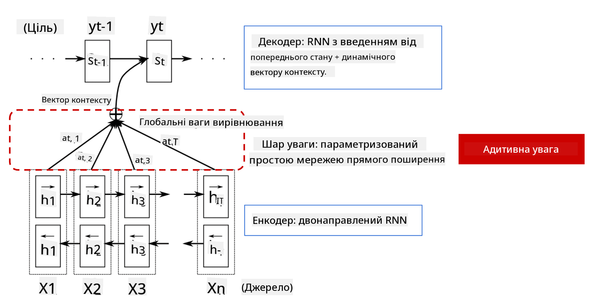
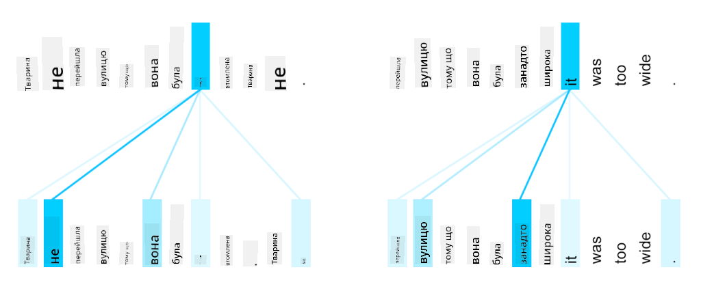

<!--
CO_OP_TRANSLATOR_METADATA:
{
  "original_hash": "7e617f0b8de85a43957a853aba09bfeb",
  "translation_date": "2025-08-25T22:03:59+00:00",
  "source_file": "lessons/5-NLP/18-Transformers/README.md",
  "language_code": "uk"
}
-->
# Механізми уваги та трансформери

## [Тест перед лекцією](https://red-field-0a6ddfd03.1.azurestaticapps.net/quiz/118)

Однією з найважливіших задач у сфері обробки природної мови (NLP) є **машинний переклад**, ключове завдання, яке лежить в основі таких інструментів, як Google Translate. У цьому розділі ми зосередимося на машинному перекладі, або, більш загально, на будь-якому завданні *послідовність до послідовності* (яке також називається **трансдукцією речень**).

У випадку з RNN, завдання "послідовність до послідовності" реалізується за допомогою двох рекурентних мереж, де одна мережа, **кодер**, стискає вхідну послідовність у прихований стан, а інша мережа, **декодер**, розгортає цей прихований стан у перекладений результат. Однак цей підхід має кілька проблем:

* Кінцевий стан мережі-кодера погано запам'ятовує початок речення, що призводить до низької якості моделі для довгих речень.
* Усі слова в послідовності мають однаковий вплив на результат. Насправді ж, певні слова у вхідній послідовності часто мають більший вплив на вихідні послідовності, ніж інші.

**Механізми уваги** забезпечують спосіб зважування контекстуального впливу кожного вхідного вектора на кожне передбачення виходу RNN. Це реалізується шляхом створення "коротких шляхів" між проміжними станами вхідної RNN та вихідної RNN. Таким чином, при генерації вихідного символу yt, ми враховуємо всі приховані стани hi вхідної послідовності з різними ваговими коефіцієнтами αt,i.

> Модель кодер-декодер з механізмом додаткової уваги у [Bahdanau et al., 2015](https://arxiv.org/pdf/1409.0473.pdf), цитовано з [цього блогу](https://lilianweng.github.io/lil-log/2018/06/24/attention-attention.html)

Матриця уваги {αi,j} представляє ступінь, до якого певні слова у вхідній послідовності впливають на генерацію конкретного слова у вихідній послідовності. Нижче наведено приклад такої матриці:

> Рисунок з [Bahdanau et al., 2015](https://arxiv.org/pdf/1409.0473.pdf) (Рис.3)

Механізми уваги є основою багатьох сучасних або майже сучасних досягнень у NLP. Однак додавання уваги значно збільшує кількість параметрів моделі, що призводить до проблем масштабування з RNN. Основним обмеженням масштабування RNN є те, що рекурентна природа моделей ускладнює пакетну обробку та паралелізацію навчання. У RNN кожен елемент послідовності потрібно обробляти в послідовному порядку, що ускладнює паралелізацію.

> Рисунок з [блогу Google](https://research.googleblog.com/2016/09/a-neural-network-for-machine.html)

Впровадження механізмів уваги у поєднанні з цим обмеженням призвело до створення сучасних моделей трансформерів, таких як BERT та Open-GPT3, які ми знаємо і використовуємо сьогодні.

## Моделі трансформерів

Однією з основних ідей трансформерів є уникнення послідовної природи RNN та створення моделі, яка може бути паралелізована під час навчання. Це досягається шляхом реалізації двох ідей:

* позиційне кодування
* використання механізму самоуваги для захоплення шаблонів замість RNN (або CNN) (саме тому стаття, яка представляє трансформери, називається *[Attention is all you need](https://arxiv.org/abs/1706.03762)*).

### Позиційне кодування/вбудовування

Ідея позиційного кодування полягає в наступному. 
1. При використанні RNN відносна позиція токенів представлена кількістю кроків, і тому не потребує явного представлення. 
2. Однак, коли ми переходимо до уваги, нам потрібно знати відносні позиції токенів у послідовності. 
3. Для отримання позиційного кодування ми доповнюємо нашу послідовність токенів послідовністю позицій токенів у послідовності (тобто послідовністю чисел 0,1, ...).
4. Потім ми змішуємо позицію токена з вектором вбудовування токена. Для перетворення позиції (цілого числа) у вектор можна використовувати різні підходи:

* Навчуване вбудовування, схоже на вбудовування токенів. Це підхід, який ми розглядаємо тут. Ми застосовуємо шари вбудовування як до токенів, так і до їх позицій, отримуючи вектори вбудовування однакових розмірів, які потім додаємо.
* Фіксована функція позиційного кодування, як запропоновано в оригінальній статті.

> Зображення автора

Результат, який ми отримуємо з позиційним вбудовуванням, включає як оригінальний токен, так і його позицію в послідовності.

### Багатоголовкова самоувага

Далі нам потрібно захопити деякі шаблони в нашій послідовності. Для цього трансформери використовують механізм **самоуваги**, який, по суті, є увагою, застосованою до тієї ж послідовності як до входу, так і до виходу. Застосування самоуваги дозволяє враховувати **контекст** у реченні та бачити, які слова взаємопов'язані. Наприклад, це дозволяє бачити, до яких слів відносяться кореференції, такі як *воно*, а також враховувати контекст:

> Зображення з [блогу Google](https://research.googleblog.com/2017/08/transformer-novel-neural-network.html)

У трансформерах ми використовуємо **багатоголовкову увагу**, щоб надати мережі можливість захоплювати кілька різних типів залежностей, наприклад, довгострокові та короткострокові відносини між словами, кореференції тощо.

[Ноутбук TensorFlow](../../../../../lessons/5-NLP/18-Transformers/TransformersTF.ipynb) містить більше деталей щодо реалізації шарів трансформера.

### Увага кодера-декодера

У трансформерах увага використовується у двох місцях:

* Для захоплення шаблонів у вхідному тексті за допомогою самоуваги.
* Для виконання перекладу послідовності - це шар уваги між кодером і декодером.

Увага кодера-декодера дуже схожа на механізм уваги, який використовується в RNN, як описано на початку цього розділу. Ця анімована діаграма пояснює роль уваги кодера-декодера.

Оскільки кожна позиція входу незалежно відображається на кожну позицію виходу, трансформери можуть краще паралелізуватися, ніж RNN, що дозволяє створювати набагато більші та більш виразні мовні моделі. Кожна голова уваги може використовуватися для навчання різних відносин між словами, що покращує завдання обробки природної мови.

## BERT

**BERT** (Bidirectional Encoder Representations from Transformers) — це дуже велика багатошарова мережа трансформерів з 12 шарами для *BERT-base* і 24 для *BERT-large*. Модель спочатку проходить попереднє навчання на великому корпусі текстових даних (WikiPedia + книги) за допомогою ненаглядного навчання (передбачення замаскованих слів у реченні). Під час попереднього навчання модель поглинає значний рівень розуміння мови, який потім можна використовувати з іншими наборами даних за допомогою тонкого налаштування. Цей процес називається **трансферним навчанням**.

> Зображення [джерело](http://jalammar.github.io/illustrated-bert/)

## ✍️ Вправи: Трансформери

Продовжуйте навчання у наступних ноутбуках:

* [Трансформери у PyTorch](../../../../../lessons/5-NLP/18-Transformers/TransformersPyTorch.ipynb)
* [Трансформери у TensorFlow](../../../../../lessons/5-NLP/18-Transformers/TransformersTF.ipynb)

## Висновок

У цьому уроці ви дізналися про трансформери та механізми уваги, всі необхідні інструменти в арсеналі NLP. Існує багато варіацій архітектур трансформерів, включаючи BERT, DistilBERT, BigBird, OpenGPT3 та інші, які можна тонко налаштовувати. Пакет [HuggingFace](https://github.com/huggingface/) надає репозиторій для навчання багатьох з цих архітектур як з PyTorch, так і з TensorFlow.

## 🚀 Виклик

## [Тест після лекції](https://red-field-0a6ddfd03.1.azurestaticapps.net/quiz/218)

## Огляд та самостійне навчання

* [Блог](https://mchromiak.github.io/articles/2017/Sep/12/Transformer-Attention-is-all-you-need/), що пояснює класичну статтю [Attention is all you need](https://arxiv.org/abs/1706.03762) про трансформери.
* [Серія блогів](https://towardsdatascience.com/transformers-explained-visually-part-1-overview-of-functionality-95a6dd460452) про трансформери, що детально пояснює архітектуру.

## [Завдання](assignment.md)

**Відмова від відповідальності**:  
Цей документ було перекладено за допомогою сервісу автоматичного перекладу [Co-op Translator](https://github.com/Azure/co-op-translator). Хоча ми прагнемо до точності, будь ласка, майте на увазі, що автоматичні переклади можуть містити помилки або неточності. Оригінальний документ на його рідній мові слід вважати авторитетним джерелом. Для критичної інформації рекомендується професійний людський переклад. Ми не несемо відповідальності за будь-які непорозуміння або неправильні тлумачення, що виникають внаслідок використання цього перекладу.