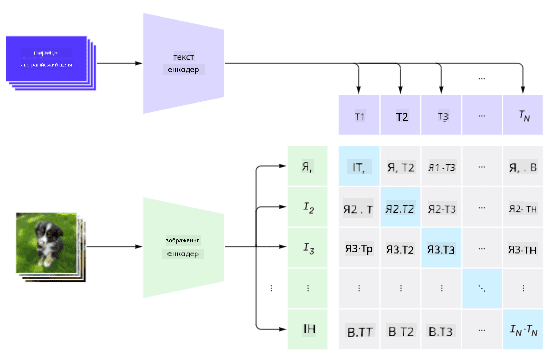
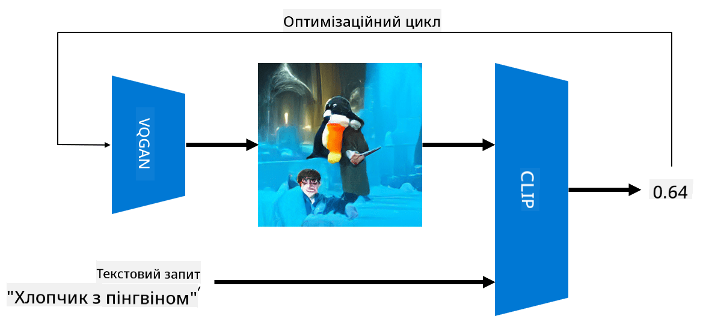

<!--
CO_OP_TRANSLATOR_METADATA:
{
  "original_hash": "9c592c26aca16ca085d268c732284187",
  "translation_date": "2025-08-25T23:40:38+00:00",
  "source_file": "lessons/X-Extras/X1-MultiModal/README.md",
  "language_code": "uk"
}
-->
# Мультимодальні мережі

Після успіху моделей трансформерів у вирішенні завдань обробки природної мови (NLP), ті ж або схожі архітектури були застосовані до завдань комп'ютерного зору. Зростає інтерес до створення моделей, які б *поєднували* можливості зору та природної мови. Одним із таких підходів є моделі CLIP та DALL.E, розроблені OpenAI.

## Контрастне попереднє навчання зображень (CLIP)

Основна ідея CLIP полягає в тому, щоб порівнювати текстові запити із зображеннями та визначати, наскільки добре зображення відповідає запиту.

> *Зображення з [цього блогу](https://openai.com/blog/clip/)*

Модель тренується на зображеннях, отриманих з Інтернету, та їх підписах. Для кожного батчу ми беремо N пар (зображення, текст) і перетворюємо їх у векторні представлення I, ..., I / T, ..., T. Ці представлення потім зіставляються між собою. Функція втрат визначається таким чином, щоб максимізувати косинусну схожість між векторами, що відповідають одній парі (наприклад, I і T), і мінімізувати косинусну схожість між усіма іншими парами. Саме тому цей підхід називається **контрастним**.

Модель/бібліотека CLIP доступна на [GitHub OpenAI](https://github.com/openai/CLIP). Підхід описаний у [цьому блозі](https://openai.com/blog/clip/) і детальніше в [цій статті](https://arxiv.org/pdf/2103.00020.pdf).

Після попереднього навчання моделі ми можемо надати їй батч зображень і текстових запитів, і вона поверне тензор із ймовірностями. CLIP можна використовувати для кількох завдань:

**Класифікація зображень**

Припустимо, нам потрібно класифікувати зображення, наприклад, між котами, собаками та людьми. У цьому випадку ми можемо надати моделі зображення та серію текстових запитів: "*зображення кота*", "*зображення собаки*", "*зображення людини*". У результатуючому векторі з 3 ймовірностей нам потрібно вибрати індекс із найвищим значенням.

> *Зображення з [цього блогу](https://openai.com/blog/clip/)*

**Пошук зображень на основі тексту**

Ми також можемо зробити навпаки. Якщо у нас є колекція зображень, ми можемо передати цю колекцію моделі та текстовий запит — це дасть нам зображення, яке найбільше відповідає заданому запиту.

## ✍️ Приклад: [Використання CLIP для класифікації зображень і пошуку зображень](../../../../../lessons/X-Extras/X1-MultiModal/Clip.ipynb)

Відкрийте [Clip.ipynb](../../../../../lessons/X-Extras/X1-MultiModal/Clip.ipynb), щоб побачити CLIP у дії.

## Генерація зображень за допомогою VQGAN+CLIP

CLIP також можна використовувати для **генерації зображень** на основі текстового запиту. Для цього нам потрібна **модель-генератор**, яка зможе створювати зображення на основі деякого вхідного вектора. Однією з таких моделей є [VQGAN](https://compvis.github.io/taming-transformers/) (Vector-Quantized GAN).

Основні ідеї VQGAN, які відрізняють її від звичайного [GAN](../../4-ComputerVision/10-GANs/README.md), такі:
* Використання авторегресивної архітектури трансформера для створення послідовності контекстно-збагачених візуальних частин, які складають зображення. Ці візуальні частини, у свою чергу, вивчаються за допомогою [CNN](../../4-ComputerVision/07-ConvNets/README.md).
* Використання дискримінатора підзображень, який визначає, чи є частини зображення "реальними" чи "фейковими" (на відміну від підходу "все або нічого" у традиційних GAN).

Дізнайтеся більше про VQGAN на веб-сайті [Taming Transformers](https://compvis.github.io/taming-transformers/).

Однією з важливих відмінностей між VQGAN і традиційним GAN є те, що останній може створити пристойне зображення з будь-якого вхідного вектора, тоді як VQGAN, ймовірно, створить зображення, яке не буде узгодженим. Тому нам потрібно додатково керувати процесом створення зображення, і це можна зробити за допомогою CLIP.

Щоб створити зображення, яке відповідає текстовому запиту, ми починаємо з випадкового вектора кодування, який передається через VQGAN для створення зображення. Потім CLIP використовується для створення функції втрат, яка показує, наскільки добре зображення відповідає текстовому запиту. Мета полягає в тому, щоб мінімізувати цю втрату, використовуючи зворотне поширення для коригування параметрів вхідного вектора.

Чудова бібліотека, яка реалізує VQGAN+CLIP, — це [Pixray](http://github.com/pixray/pixray).

 |   | 
----|----|----
Зображення, створене за запитом *акварельний портрет молодого чоловіка-вчителя літератури з книгою* | Зображення, створене за запитом *масляний портрет молодої жінки-вчителя інформатики з комп'ютером* | Зображення, створене за запитом *масляний портрет старого чоловіка-вчителя математики перед дошкою*

> Зображення з колекції **Штучні вчителі** від [Дмитра Сошникова](http://soshnikov.com)

## DALL-E
### [DALL-E 1](https://openai.com/research/dall-e)
DALL-E — це версія GPT-3, навчена створювати зображення на основі запитів. Вона була навчена на 12 мільярдах параметрів.

На відміну від CLIP, DALL-E отримує текст і зображення як єдиний потік токенів для обох типів даних. Таким чином, з кількох запитів можна створювати зображення на основі тексту.

### [DALL-E 2](https://openai.com/dall-e-2)
Основна відмінність між DALL-E 1 і 2 полягає в тому, що друга версія генерує більш реалістичні зображення та мистецтво.

Приклади генерації зображень за допомогою DALL-E:
 |   | 
----|----|----
Зображення, створене за запитом *акварельний портрет молодого чоловіка-вчителя літератури з книгою* | Зображення, створене за запитом *масляний портрет молодої жінки-вчителя інформатики з комп'ютером* | Зображення, створене за запитом *масляний портрет старого чоловіка-вчителя математики перед дошкою*

## Джерела

* Стаття про VQGAN: [Taming Transformers for High-Resolution Image Synthesis](https://compvis.github.io/taming-transformers/paper/paper.pdf)
* Стаття про CLIP: [Learning Transferable Visual Models From Natural Language Supervision](https://arxiv.org/pdf/2103.00020.pdf)

**Відмова від відповідальності**:  
Цей документ був перекладений за допомогою сервісу автоматичного перекладу [Co-op Translator](https://github.com/Azure/co-op-translator). Хоча ми прагнемо до точності, будь ласка, майте на увазі, що автоматичні переклади можуть містити помилки або неточності. Оригінальний документ на його рідній мові слід вважати авторитетним джерелом. Для критичної інформації рекомендується професійний людський переклад. Ми не несемо відповідальності за будь-які непорозуміння або неправильні тлумачення, що виникають внаслідок використання цього перекладу.