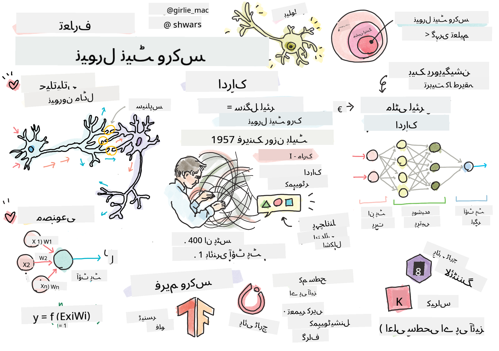

<!--
CO_OP_TRANSLATOR_METADATA:
{
  "original_hash": "1c6b8c7c1778a35fc1139b7f2aecb7b3",
  "translation_date": "2025-08-26T10:21:51+00:00",
  "source_file": "lessons/3-NeuralNetworks/README.md",
  "language_code": "ur"
}
-->
# نیورل نیٹ ورکس کا تعارف

جیسا کہ ہم نے تعارف میں بات کی، ذہانت حاصل کرنے کے طریقوں میں سے ایک یہ ہے کہ ایک **کمپیوٹر ماڈل** یا ایک **مصنوعی دماغ** کو تربیت دی جائے۔ بیسویں صدی کے وسط سے، محققین نے مختلف ریاضیاتی ماڈلز آزمائے، یہاں تک کہ حالیہ برسوں میں یہ سمت بے حد کامیاب ثابت ہوئی۔ دماغ کے ان ریاضیاتی ماڈلز کو **نیورل نیٹ ورکس** کہا جاتا ہے۔

> کبھی کبھار نیورل نیٹ ورکس کو *مصنوعی نیورل نیٹ ورکس* یا ANNs کہا جاتا ہے تاکہ یہ واضح کیا جا سکے کہ ہم ماڈلز کی بات کر رہے ہیں، نہ کہ حقیقی نیورونز کے نیٹ ورکس کی۔

## مشین لرننگ

نیورل نیٹ ورکس ایک بڑے شعبے کا حصہ ہیں جسے **مشین لرننگ** کہا جاتا ہے، جس کا مقصد ڈیٹا کا استعمال کرتے ہوئے کمپیوٹر ماڈلز کو تربیت دینا ہے تاکہ وہ مسائل حل کر سکیں۔ مشین لرننگ مصنوعی ذہانت کا ایک بڑا حصہ ہے، تاہم، ہم اس نصاب میں کلاسیکل مشین لرننگ کا احاطہ نہیں کریں گے۔

> کلاسیکل مشین لرننگ کے بارے میں مزید جاننے کے لیے ہمارے علیحدہ **[مشین لرننگ فار بیگنرز](http://github.com/microsoft/ml-for-beginners)** نصاب کا دورہ کریں۔

مشین لرننگ میں، ہم فرض کرتے ہیں کہ ہمارے پاس کچھ مثالوں کا ڈیٹاسیٹ **X** اور اس کے مطابق آؤٹ پٹ ویلیوز **Y** موجود ہیں۔ مثالیں اکثر N-ڈائمینشنل ویکٹرز پر مشتمل ہوتی ہیں جن میں **فیچرز** شامل ہوتے ہیں، اور آؤٹ پٹس کو **لیبلز** کہا جاتا ہے۔

ہم مشین لرننگ کے دو سب سے عام مسائل پر غور کریں گے:

* **کلاسیفکیشن**، جہاں ہمیں ایک ان پٹ آبجیکٹ کو دو یا زیادہ کلاسز میں تقسیم کرنا ہوتا ہے۔
* **ریگریشن**، جہاں ہمیں ہر ان پٹ سیمپل کے لیے ایک عددی نمبر کی پیش گوئی کرنی ہوتی ہے۔

> جب ان پٹس اور آؤٹ پٹس کو ٹینسرز کے طور پر ظاہر کیا جاتا ہے، تو ان پٹ ڈیٹاسیٹ M×N کے سائز کی میٹرکس ہوتی ہے، جہاں M سیمپلز کی تعداد ہے اور N فیچرز کی تعداد ہے۔ آؤٹ پٹ لیبلز **Y** سائز M کا ویکٹر ہوتا ہے۔

اس نصاب میں، ہم صرف نیورل نیٹ ورک ماڈلز پر توجہ مرکوز کریں گے۔

## نیورون کا ماڈل

حیاتیات سے ہمیں معلوم ہوتا ہے کہ ہمارا دماغ نیورل سیلز پر مشتمل ہوتا ہے، جن میں سے ہر ایک کے پاس متعدد "ان پٹس" (ایکسونز) اور ایک آؤٹ پٹ (ڈینڈرائٹ) ہوتا ہے۔ ایکسونز اور ڈینڈرائٹس برقی سگنلز منتقل کر سکتے ہیں، اور ایکسونز اور ڈینڈرائٹس کے درمیان کنکشن مختلف ڈگری کی کنڈکٹویٹی ظاہر کر سکتے ہیں (جو نیورو میڈی ایٹرز کے ذریعے کنٹرول ہوتی ہے)۔

 | 
----|----
حقیقی نیورون *([تصویر](https://en.wikipedia.org/wiki/Synapse#/media/File:SynapseSchematic_lines.svg) ویکیپیڈیا سے)* | مصنوعی نیورون *(تصویر مصنف کی جانب سے)*

لہٰذا، نیورون کا سب سے سادہ ریاضیاتی ماڈل کئی ان پٹس X1, ..., XN اور ایک آؤٹ پٹ Y پر مشتمل ہوتا ہے، اور ایک سلسلہ وزن W1, ..., WN۔ آؤٹ پٹ اس طرح سے حساب کیا جاتا ہے:

جہاں f ایک غیر خطی **ایکٹیویشن فنکشن** ہے۔

> نیورون کے ابتدائی ماڈلز کو 1943 میں وارن میک کلک اور والٹر پٹس کے کلاسیکل مقالے [A logical calculus of the ideas immanent in nervous activity](https://www.cs.cmu.edu/~./epxing/Class/10715/reading/McCulloch.and.Pitts.pdf) میں بیان کیا گیا تھا۔ ڈونلڈ ہیب نے اپنی کتاب "[The Organization of Behavior: A Neuropsychological Theory](https://books.google.com/books?id=VNetYrB8EBoC)" میں ان نیٹ ورکس کو تربیت دینے کا طریقہ تجویز کیا۔

## اس سیکشن میں

اس سیکشن میں ہم سیکھیں گے:
* [پرسپٹرون](03-Perceptron/README.md)، دو کلاسز کی کلاسیفکیشن کے لیے سب سے ابتدائی نیورل نیٹ ورک ماڈلز میں سے ایک
* [ملٹی لیئرڈ نیٹ ورکس](04-OwnFramework/README.md) اور اس کے ساتھ ایک نوٹ بک [اپنا فریم ورک کیسے بنائیں](../../../../lessons/3-NeuralNetworks/04-OwnFramework/OwnFramework.ipynb)
* [نیورل نیٹ ورک فریم ورکس](05-Frameworks/README.md)، ان نوٹ بکس کے ساتھ: [پائی ٹورچ](../../../../lessons/3-NeuralNetworks/05-Frameworks/IntroPyTorch.ipynb) اور [کیراس/ٹینسر فلو](../../../../lessons/3-NeuralNetworks/05-Frameworks/IntroKerasTF.ipynb)
* [اوورفٹنگ](../../../../lessons/3-NeuralNetworks/05-Frameworks)

**ڈسکلیمر**:  
یہ دستاویز AI ترجمہ سروس [Co-op Translator](https://github.com/Azure/co-op-translator) کا استعمال کرتے ہوئے ترجمہ کی گئی ہے۔ ہم درستگی کے لیے پوری کوشش کرتے ہیں، لیکن براہ کرم آگاہ رہیں کہ خودکار ترجمے میں غلطیاں یا عدم درستگی ہو سکتی ہیں۔ اصل دستاویز کو اس کی اصل زبان میں مستند ذریعہ سمجھا جانا چاہیے۔ اہم معلومات کے لیے، پیشہ ور انسانی ترجمہ کی سفارش کی جاتی ہے۔ اس ترجمے کے استعمال سے پیدا ہونے والی کسی بھی غلط فہمی یا غلط تشریح کے لیے ہم ذمہ دار نہیں ہیں۔