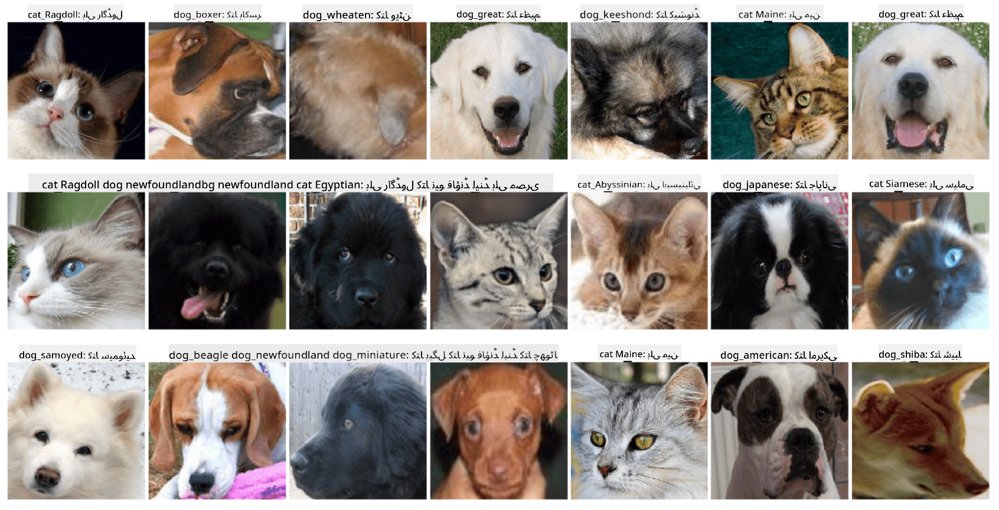

<!--
CO_OP_TRANSLATOR_METADATA:
{
  "original_hash": "b70fcf7fcee862990f848c679090943f",
  "translation_date": "2025-10-03T14:52:35+00:00",
  "source_file": "lessons/4-ComputerVision/07-ConvNets/lab/README.md",
  "language_code": "ur"
}
-->
# پالتو جانوروں کے چہروں کی درجہ بندی

[AI for Beginners Curriculum](https://github.com/microsoft/ai-for-beginners) سے لیب اسائنمنٹ۔

## کام

تصور کریں کہ آپ کو ایک ایپلیکیشن تیار کرنی ہے جو پالتو جانوروں کی نرسری کے لیے تمام جانوروں کو کیٹلاگ کرے۔ ایسی ایپلیکیشن کی ایک بہترین خصوصیت یہ ہوگی کہ تصویر سے خود بخود نسل کا پتہ لگایا جا سکے۔ یہ کام نیورل نیٹ ورکس کے ذریعے کامیابی سے کیا جا سکتا ہے۔

آپ کو **Pet Faces** ڈیٹا سیٹ کا استعمال کرتے ہوئے مختلف نسلوں کے بلیوں اور کتوں کی درجہ بندی کے لیے ایک convolutional neural network کو تربیت دینا ہوگا۔

## ڈیٹا سیٹ

ہم [Oxford-IIIT Pet Dataset](https://www.robots.ox.ac.uk/~vgg/data/pets/) استعمال کریں گے، جس میں کتوں اور بلیوں کی 37 مختلف نسلوں کی تصاویر شامل ہیں۔



ڈیٹا سیٹ ڈاؤن لوڈ کرنے کے لیے، یہ کوڈ استعمال کریں:

```python
!wget https://thor.robots.ox.ac.uk/~vgg/data/pets/images.tar.gz
!tar xfz images.tar.gz
!rm images.tar.gz
```

**نوٹ:** Oxford-IIIT Pet Dataset کی تصاویر فائل نام کے ذریعے منظم ہیں (جیسے `Abyssinian_1.jpg`, `Bengal_2.jpg`)۔ نوٹ بک میں کوڈ شامل ہے جو ان تصاویر کو نسل کے لحاظ سے مخصوص سب ڈائریکٹریز میں منظم کرتا ہے تاکہ درجہ بندی آسان ہو۔

## نوٹ بک شروع کرنا

لیب شروع کرنے کے لیے [PetFaces.ipynb](PetFaces.ipynb) کھولیں۔

## نتیجہ

آپ نے تصویر کی درجہ بندی کا ایک نسبتاً پیچیدہ مسئلہ شروع سے حل کر لیا ہے! کلاسز کی تعداد کافی زیادہ تھی، اور پھر بھی آپ نے معقول درستگی حاصل کی! یہ بھی سمجھ میں آتا ہے کہ top-k درستگی کو ماپیں، کیونکہ کچھ کلاسز کو الجھانا آسان ہے جو انسانوں کے لیے بھی واضح طور پر مختلف نہیں ہیں۔

---

**ڈسکلیمر**:  
یہ دستاویز AI ترجمہ سروس [Co-op Translator](https://github.com/Azure/co-op-translator) کا استعمال کرتے ہوئے ترجمہ کی گئی ہے۔ ہم درستگی کے لیے کوشش کرتے ہیں، لیکن براہ کرم آگاہ رہیں کہ خودکار ترجمے میں غلطیاں یا غیر درستیاں ہو سکتی ہیں۔ اصل دستاویز کو اس کی اصل زبان میں مستند ذریعہ سمجھا جانا چاہیے۔ اہم معلومات کے لیے، پیشہ ور انسانی ترجمہ کی سفارش کی جاتی ہے۔ ہم اس ترجمے کے استعمال سے پیدا ہونے والی کسی بھی غلط فہمی یا غلط تشریح کے ذمہ دار نہیں ہیں۔