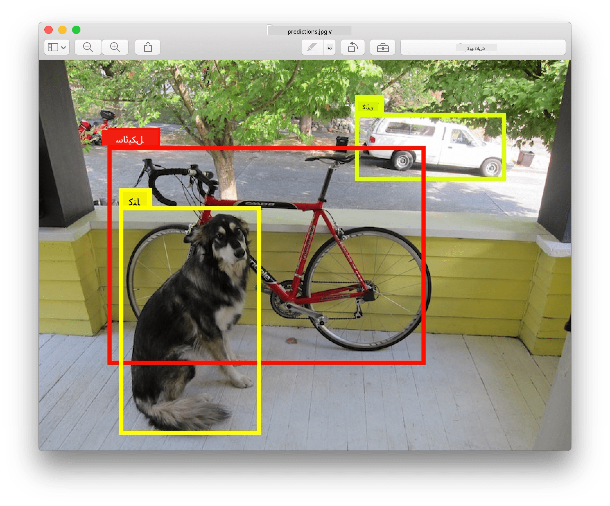
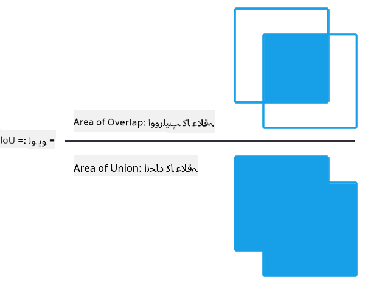
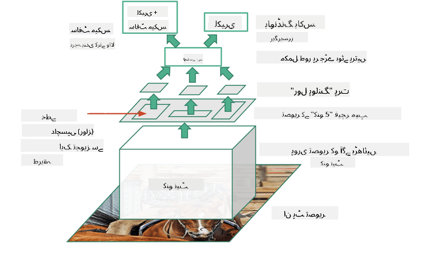
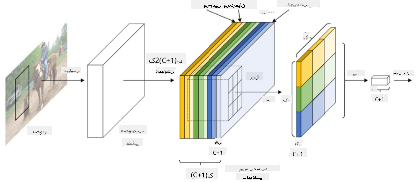
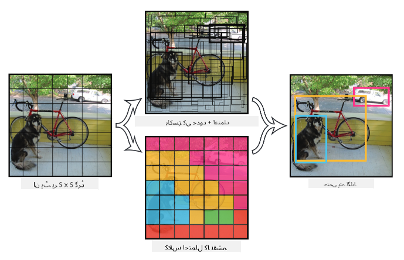

<!--
CO_OP_TRANSLATOR_METADATA:
{
  "original_hash": "d85c8b08f6d1b48fd7f35b99f93c1138",
  "translation_date": "2025-08-26T09:19:01+00:00",
  "source_file": "lessons/4-ComputerVision/11-ObjectDetection/README.md",
  "language_code": "ur"
}
-->
# آبجیکٹ ڈیٹیکشن

اب تک ہم نے جو امیج کلاسیفیکیشن ماڈلز دیکھے ہیں، وہ ایک تصویر لیتے ہیں اور ایک کیٹیگری کا نتیجہ دیتے ہیں، جیسے MNIST مسئلے میں کلاس 'نمبر'۔ لیکن اکثر ہمیں صرف یہ جاننا نہیں ہوتا کہ تصویر میں اشیاء موجود ہیں - بلکہ ہم ان کی صحیح جگہ کا تعین کرنا چاہتے ہیں۔ یہی **آبجیکٹ ڈیٹیکشن** کا مقصد ہے۔

## [پری لیکچر کوئز](https://red-field-0a6ddfd03.1.azurestaticapps.net/quiz/111)

> تصویر [YOLO v2 ویب سائٹ](https://pjreddie.com/darknet/yolov2/) سے لی گئی ہے۔

## آبجیکٹ ڈیٹیکشن کے لیے ایک سادہ طریقہ

فرض کریں کہ ہم تصویر میں ایک بلی کو تلاش کرنا چاہتے ہیں، تو آبجیکٹ ڈیٹیکشن کے لیے ایک بہت سادہ طریقہ یہ ہوگا:

1. تصویر کو کئی چھوٹے حصوں میں تقسیم کریں۔
2. ہر حصے پر امیج کلاسیفیکیشن چلائیں۔
3. وہ حصے جن میں کافی زیادہ ایکٹیویشن ہو، انہیں مطلوبہ آبجیکٹ کے حامل سمجھا جا سکتا ہے۔

> *تصویر [ایکسسرس نوٹ بک](../../../../../lessons/4-ComputerVision/11-ObjectDetection/ObjectDetection-TF.ipynb) سے لی گئی ہے۔*

لیکن یہ طریقہ مثالی نہیں ہے، کیونکہ یہ الگورتھم کو آبجیکٹ کے باؤنڈنگ باکس کو بہت غیر واضح طریقے سے تلاش کرنے کی اجازت دیتا ہے۔ زیادہ درست مقام کے لیے ہمیں **ریگریشن** کا استعمال کرنا ہوگا تاکہ باؤنڈنگ باکس کے کوآرڈینیٹس کی پیش گوئی کی جا سکے - اور اس کے لیے مخصوص ڈیٹاسیٹس کی ضرورت ہوتی ہے۔

## آبجیکٹ ڈیٹیکشن کے لیے ریگریشن

[یہ بلاگ پوسٹ](https://towardsdatascience.com/object-detection-with-neural-networks-a4e2c46b4491) شکلوں کی شناخت کے لیے ایک بہترین تعارف فراہم کرتی ہے۔

## آبجیکٹ ڈیٹیکشن کے لیے ڈیٹاسیٹس

آپ اس کام کے لیے درج ذیل ڈیٹاسیٹس دیکھ سکتے ہیں:

* [PASCAL VOC](http://host.robots.ox.ac.uk/pascal/VOC/) - 20 کلاسز
* [COCO](http://cocodataset.org/#home) - عام اشیاء کے سیاق و سباق میں۔ 80 کلاسز، باؤنڈنگ باکسز اور سیگمنٹیشن ماسکس

## آبجیکٹ ڈیٹیکشن میٹرکس

### انٹرسیکشن اوور یونین

امیج کلاسیفیکیشن کے لیے الگورتھم کی کارکردگی کو جانچنا آسان ہے، لیکن آبجیکٹ ڈیٹیکشن کے لیے ہمیں کلاس کی درستگی کے ساتھ ساتھ باؤنڈنگ باکس کے مقام کی درستگی کو بھی جانچنا ہوتا ہے۔ اس کے لیے ہم **انٹرسیکشن اوور یونین** (IoU) استعمال کرتے ہیں، جو دو باکسز (یا دو کسی بھی علاقے) کے اوورلیپ کو ماپتا ہے۔

> *تصویر 2 [اس بہترین بلاگ پوسٹ](https://pyimagesearch.com/2016/11/07/intersection-over-union-iou-for-object-detection/) سے لی گئی ہے۔*

خیال سادہ ہے - ہم دو شکلوں کے درمیان انٹرسیکشن کے علاقے کو ان کے یونین کے علاقے سے تقسیم کرتے ہیں۔ دو ایک جیسے علاقوں کے لیے IoU 1 ہوگا، جبکہ مکمل طور پر الگ علاقوں کے لیے یہ 0 ہوگا۔ ورنہ یہ 0 سے 1 کے درمیان ہوگا۔ ہم عام طور پر صرف ان باؤنڈنگ باکسز کو دیکھتے ہیں جن کے IoU ایک خاص قدر سے زیادہ ہو۔

### ایوریج پریسیژن

فرض کریں کہ ہم کسی دی گئی کلاس $C$ کی اشیاء کو پہچاننے کی کارکردگی کو ماپنا چاہتے ہیں۔ اس کے لیے ہم **ایوریج پریسیژن** میٹرکس استعمال کرتے ہیں، جو اس طرح سے حساب کی جاتی ہے:

1. پریسیژن-ریکال گراف دکھاتا ہے کہ ڈیٹیکشن تھریشولڈ ویلیو (0 سے 1 تک) کے مطابق درستگی کیسے تبدیل ہوتی ہے۔
2. تھریشولڈ کے مطابق، ہمیں تصویر میں زیادہ یا کم اشیاء ملیں گی، اور پریسیژن اور ریکال کی مختلف قدریں۔
3. گراف کچھ اس طرح نظر آئے گا:

> *تصویر [NeuroWorkshop](http://github.com/shwars/NeuroWorkshop) سے لی گئی ہے۔*

دی گئی کلاس $C$ کے لیے ایوریج پریسیژن اس گراف کے نیچے کے علاقے کے برابر ہے۔ زیادہ تفصیل سے، ریکال محور کو عام طور پر 10 حصوں میں تقسیم کیا جاتا ہے، اور پریسیژن ان تمام پوائنٹس پر اوسط کی جاتی ہے:

$$
AP = {1\over11}\sum_{i=0}^{10}\mbox{Precision}(\mbox{Recall}={i\over10})
$$

### AP اور IoU

ہم صرف ان ڈیٹیکشنز کو دیکھیں گے جن کے IoU ایک خاص قدر سے زیادہ ہو۔ مثال کے طور پر، PASCAL VOC ڈیٹاسیٹ میں عام طور پر $\mbox{IoU Threshold} = 0.5$ فرض کیا جاتا ہے، جبکہ COCO میں AP مختلف $\mbox{IoU Threshold}$ قدروں کے لیے ماپا جاتا ہے۔

> *تصویر [NeuroWorkshop](http://github.com/shwars/NeuroWorkshop) سے لی گئی ہے۔*

### مین ایوریج پریسیژن - mAP

آبجیکٹ ڈیٹیکشن کے لیے اہم میٹرک **مین ایوریج پریسیژن** یا **mAP** کہلاتا ہے۔ یہ ایوریج پریسیژن کی قدر ہے، جو تمام آبجیکٹ کلاسز پر اوسط کی جاتی ہے، اور کبھی کبھار $\mbox{IoU Threshold}$ پر بھی۔ زیادہ تفصیل سے، **mAP** کا حساب لگانے کا عمل
[اس بلاگ پوسٹ](https://medium.com/@timothycarlen/understanding-the-map-evaluation-metric-for-object-detection-a07fe6962cf3) میں بیان کیا گیا ہے، اور [یہاں کوڈ کے نمونوں کے ساتھ](https://gist.github.com/tarlen5/008809c3decf19313de216b9208f3734) بھی۔

## مختلف آبجیکٹ ڈیٹیکشن کے طریقے

آبجیکٹ ڈیٹیکشن الگورتھمز کی دو بڑی اقسام ہیں:

* **ریجن پروپوزل نیٹ ورکس** (R-CNN، فاسٹ R-CNN، فاسٹر R-CNN)۔ بنیادی خیال یہ ہے کہ **ریجنز آف انٹرسٹ** (ROI) بنائیں اور ان پر CNN چلائیں، زیادہ سے زیادہ ایکٹیویشن تلاش کرنے کے لیے۔ یہ سادہ طریقے سے ملتا جلتا ہے، سوائے اس کے کہ ROI زیادہ ذہین طریقے سے بنائے جاتے ہیں۔ ایسے طریقوں کا ایک بڑا نقصان یہ ہے کہ یہ سست ہوتے ہیں، کیونکہ ہمیں تصویر پر CNN کلاسیفائر کے کئی پاسز کی ضرورت ہوتی ہے۔
* **ون پاس** (YOLO، SSD، RetinaNet) طریقے۔ ان آرکیٹیکچرز میں ہم نیٹ ورک کو ایک ہی پاس میں کلاسز اور ROI کی پیش گوئی کے لیے ڈیزائن کرتے ہیں۔

### R-CNN: ریجن بیسڈ CNN

[R-CNN](http://islab.ulsan.ac.kr/files/announcement/513/rcnn_pami.pdf) [سیلیکٹیو سرچ](http://www.huppelen.nl/publications/selectiveSearchDraft.pdf) استعمال کرتا ہے تاکہ ROI ریجنز کی ہائیرارکل ساخت بنائی جا سکے، جنہیں پھر CNN فیچر ایکسٹریکٹرز اور SVM کلاسیفائرز کے ذریعے آبجیکٹ کلاس کا تعین کرنے کے لیے پاس کیا جاتا ہے، اور *باؤنڈنگ باکس* کے کوآرڈینیٹس کا تعین کرنے کے لیے لینیئر ریگریشن۔ [آفیشل پیپر](https://arxiv.org/pdf/1506.01497v1.pdf)

> *تصویر van de Sande et al. ICCV’11 سے لی گئی ہے۔*

> *تصاویر [اس بلاگ](https://towardsdatascience.com/r-cnn-fast-r-cnn-faster-r-cnn-yolo-object-detection-algorithms-36d53571365e) سے لی گئی ہیں۔*

### F-RCNN - فاسٹ R-CNN

یہ طریقہ R-CNN سے ملتا جلتا ہے، لیکن ریجنز کنوولوشن لیئرز کے بعد ڈیفائن کیے جاتے ہیں۔

> تصویر [آفیشل پیپر](https://www.cv-foundation.org/openaccess/content_iccv_2015/papers/Girshick_Fast_R-CNN_ICCV_2015_paper.pdf)، [arXiv](https://arxiv.org/pdf/1504.08083.pdf)، 2015 سے لی گئی ہے۔

### فاسٹر R-CNN

اس طریقے کا بنیادی خیال یہ ہے کہ ریجنز کی پیش گوئی کے لیے نیورل نیٹ ورک استعمال کیا جائے - جسے *ریجن پروپوزل نیٹ ورک* کہا جاتا ہے۔ [پیپر](https://arxiv.org/pdf/1506.01497.pdf)، 2016

> تصویر [آفیشل پیپر](https://arxiv.org/pdf/1506.01497.pdf) سے لی گئی ہے۔

### R-FCN: ریجن بیسڈ فل کنوولوشنل نیٹ ورک

یہ الگورتھم فاسٹر R-CNN سے بھی زیادہ تیز ہے۔ بنیادی خیال یہ ہے:

1. ہم ResNet-101 استعمال کرتے ہوئے فیچرز نکالتے ہیں۔
1. فیچرز **پوزیشن سینسیٹو اسکور میپ** کے ذریعے پروسیس کیے جاتے ہیں۔ $C$ کلاسز کی ہر آبجیکٹ کو $k\times k$ ریجنز میں تقسیم کیا جاتا ہے، اور ہم آبجیکٹس کے حصے کی پیش گوئی کرنے کی تربیت دیتے ہیں۔
1. $k\times k$ ریجنز کے ہر حصے کے لیے تمام نیٹ ورکس آبجیکٹ کلاسز کے لیے ووٹ دیتے ہیں، اور زیادہ سے زیادہ ووٹ کے ساتھ آبجیکٹ کلاس منتخب کی جاتی ہے۔

> تصویر [آفیشل پیپر](https://arxiv.org/abs/1605.06409) سے لی گئی ہے۔

### YOLO - یو اونلی لک ونس

YOLO ایک ریئل ٹائم ون پاس الگورتھم ہے۔ بنیادی خیال یہ ہے:

 * تصویر کو $S\times S$ ریجنز میں تقسیم کیا جاتا ہے۔
 * ہر ریجن کے لیے، **CNN** $n$ ممکنہ آبجیکٹس، *باؤنڈنگ باکس* کے کوآرڈینیٹس اور *کانفیڈنس*=*پروببلیٹی* * IoU کی پیش گوئی کرتا ہے۔

 

> تصویر [آفیشل پیپر](https://arxiv.org/abs/1506.02640) سے لی گئی ہے۔

### دیگر الگورتھمز

* RetinaNet: [آفیشل پیپر](https://arxiv.org/abs/1708.02002)
   - [Torchvision میں PyTorch امپلیمنٹیشن](https://pytorch.org/vision/stable/_modules/torchvision/models/detection/retinanet.html)
   - [Keras امپلیمنٹیشن](https://github.com/fizyr/keras-retinanet)
   - [RetinaNet کے ساتھ آبجیکٹ ڈیٹیکشن](https://keras.io/examples/vision/retinanet/) Keras Samples میں
* SSD (سنگل شاٹ ڈیٹیکٹر): [آفیشل پیپر](https://arxiv.org/abs/1512.02325)

## ✍️ مشقیں: آبجیکٹ ڈیٹیکشن

اپنی تعلیم کو درج ذیل نوٹ بک میں جاری رکھیں:

[ObjectDetection.ipynb](../../../../../lessons/4-ComputerVision/11-ObjectDetection/ObjectDetection.ipynb)

## نتیجہ

اس سبق میں آپ نے آبجیکٹ ڈیٹیکشن کے مختلف طریقوں کا ایک مختصر جائزہ لیا!

## 🚀 چیلنج

ان مضامین اور نوٹ بکس کو پڑھیں جو YOLO کے بارے میں ہیں اور انہیں خود آزمائیں:

* [اچھا بلاگ پوسٹ](https://www.analyticsvidhya.com/blog/2018/12/practical-guide-object-detection-yolo-framewor-python/) جو YOLO کو بیان کرتا ہے۔
 * [آفیشل سائٹ](https://pjreddie.com/darknet/yolo/)
 * YOLO: [Keras امپلیمنٹیشن](https://github.com/experiencor/keras-yolo2)، [اسٹیپ بائی اسٹیپ نوٹ بک](https://github.com/experiencor/basic-yolo-keras/blob/master/Yolo%20Step-by-Step.ipynb)
 * YOLO v2: [Keras امپلیمنٹیشن](https://github.com/experiencor/keras-yolo2)، [اسٹیپ بائی اسٹیپ نوٹ بک](https://github.com/experiencor/keras-yolo2/blob/master/Yolo%20Step-by-Step.ipynb)

## [پوسٹ لیکچر کوئز](https://red-field-0a6ddfd03.1.azurestaticapps.net/quiz/211)

## جائزہ اور خود مطالعہ

* [آبجیکٹ ڈیٹیکشن](https://tjmachinelearning.com/lectures/1718/obj/) نکھل سردانا کے ذریعے
* [آبجیکٹ ڈیٹیکشن الگورتھمز کا ایک اچھا موازنہ](https://lilianweng.github.io/lil-log/2018/12/27/object-detection-part-4.html)
* [آبجیکٹ ڈیٹیکشن کے لیے ڈیپ لرننگ الگورتھمز کا جائزہ](https://medium.com/comet-app/review-of-deep-learning-algorithms-for-object-detection-c1f3d437b852)
* [آبجیکٹ ڈیٹیکشن الگورتھمز کا ایک مرحلہ وار تعارف](https://www.analyticsvidhya.com/blog/2018/10/a-step-by-step-introduction-to-the-basic-object-detection-algorithms-part-1/)
* [Python میں فاسٹر R-CNN کے ساتھ آبجیکٹ ڈیٹیکشن کا امپلیمنٹیشن](https://www.analyticsvidhya.com/blog/2018/11/implementation-faster-r-cnn-python-object-detection/)

## [اسائنمنٹ: آبجیکٹ ڈیٹیکشن](lab/README.md)

**ڈسکلیمر**:  
یہ دستاویز AI ترجمہ سروس [Co-op Translator](https://github.com/Azure/co-op-translator) کا استعمال کرتے ہوئے ترجمہ کی گئی ہے۔ ہم درستگی کے لیے کوشش کرتے ہیں، لیکن براہ کرم آگاہ رہیں کہ خودکار ترجمے میں غلطیاں یا عدم درستگی ہو سکتی ہیں۔ اصل دستاویز، جو اس کی مقامی زبان میں ہے، کو مستند ذریعہ سمجھا جانا چاہیے۔ اہم معلومات کے لیے، پیشہ ور انسانی ترجمہ کی سفارش کی جاتی ہے۔ اس ترجمے کے استعمال سے پیدا ہونے والی کسی بھی غلط فہمی یا غلط تشریح کے لیے ہم ذمہ دار نہیں ہیں۔