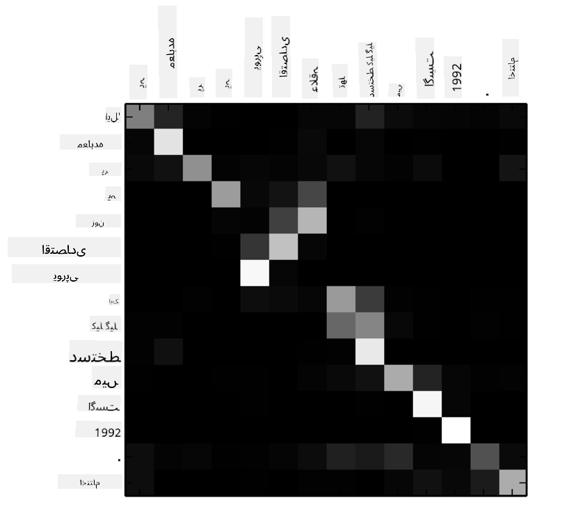
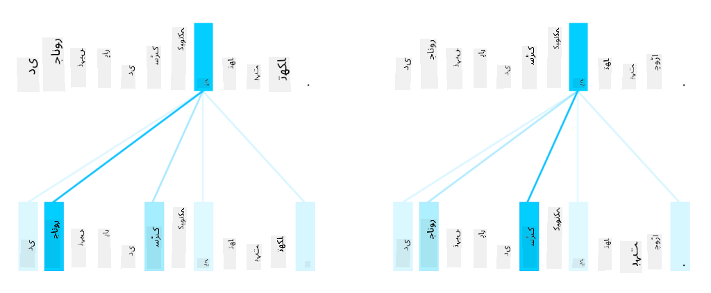

<!--
CO_OP_TRANSLATOR_METADATA:
{
  "original_hash": "f335dfcb4a993920504c387973a36957",
  "translation_date": "2025-09-23T06:48:34+00:00",
  "source_file": "lessons/5-NLP/18-Transformers/README.md",
  "language_code": "ur"
}
-->
# توجہ کے طریقہ کار اور ٹرانسفارمرز

## [لیکچر سے پہلے کا کوئز](https://ff-quizzes.netlify.app/en/ai/quiz/35)

NLP کے شعبے میں سب سے اہم مسائل میں سے ایک **مشین ترجمہ** ہے، جو کہ ایک بنیادی کام ہے جو گوگل ٹرانسلیٹ جیسے ٹولز کی بنیاد ہے۔ اس سیکشن میں، ہم مشین ترجمہ پر توجہ مرکوز کریں گے، یا زیادہ عمومی طور پر، کسی بھی *sequence-to-sequence* کام پر (جسے **sentence transduction** بھی کہا جاتا ہے)۔

RNNs کے ساتھ، sequence-to-sequence دو recurrent نیٹ ورکس کے ذریعے نافذ کیا جاتا ہے، جہاں ایک نیٹ ورک، **encoder**، ان پٹ سیکوئنس کو ایک hidden state میں تبدیل کرتا ہے، جبکہ دوسرا نیٹ ورک، **decoder**، اس hidden state کو ایک ترجمہ شدہ نتیجے میں تبدیل کرتا ہے۔ اس طریقہ کار کے ساتھ کچھ مسائل ہیں:

* encoder نیٹ ورک کی آخری حالت جملے کے آغاز کو یاد رکھنے میں مشکل محسوس کرتی ہے، جس کی وجہ سے لمبے جملوں کے لیے ماڈل کا معیار خراب ہو جاتا ہے۔
* سیکوئنس میں موجود تمام الفاظ کا نتیجے پر یکساں اثر ہوتا ہے۔ حقیقت میں، تاہم، ان پٹ سیکوئنس میں موجود مخصوص الفاظ کا sequential outputs پر دوسروں کے مقابلے میں زیادہ اثر ہوتا ہے۔

**توجہ کے طریقہ کار** RNN کے ہر آؤٹ پٹ پیش گوئی پر ہر ان پٹ ویکٹر کے سیاق و سباق کے اثر کو وزن دینے کا ایک ذریعہ فراہم کرتے ہیں۔ اس کو نافذ کرنے کا طریقہ یہ ہے کہ ان پٹ RNN کی درمیانی حالتوں اور آؤٹ پٹ RNN کے درمیان شارٹ کٹس بنائے جائیں۔ اس طرح، جب آؤٹ پٹ علامت yt پیدا کی جا رہی ہو، ہم تمام ان پٹ hidden states hi کو مختلف وزن کے coefficients &alpha;t,i کے ساتھ مدنظر رکھیں گے۔

> [Bahdanau et al., 2015](https://arxiv.org/pdf/1409.0473.pdf) میں additive attention mechanism کے ساتھ encoder-decoder ماڈل، [اس بلاگ پوسٹ](https://lilianweng.github.io/lil-log/2018/06/24/attention-attention.html) سے لیا گیا۔

توجہ میٹرکس {&alpha;i,j} اس حد کو ظاہر کرے گی کہ ان پٹ سیکوئنس میں موجود مخصوص الفاظ آؤٹ پٹ سیکوئنس میں دیے گئے لفظ کی تخلیق میں کتنا کردار ادا کرتے ہیں۔ نیچے ایک مثال دی گئی ہے:

> [Bahdanau et al., 2015](https://arxiv.org/pdf/1409.0473.pdf) سے تصویر (Fig.3)

توجہ کے طریقہ کار NLP میں موجودہ یا قریب موجودہ state of the art کے لیے بہت حد تک ذمہ دار ہیں۔ تاہم، توجہ شامل کرنے سے ماڈل کے پیرامیٹرز کی تعداد میں بہت زیادہ اضافہ ہوتا ہے، جس کی وجہ سے RNNs کے ساتھ scaling کے مسائل پیدا ہوئے۔ RNNs کو scale کرنے کی ایک اہم رکاوٹ یہ ہے کہ ماڈلز کی recurrent نوعیت تربیت کو batch اور parallelize کرنا مشکل بنا دیتی ہے۔ RNN میں سیکوئنس کے ہر عنصر کو ترتیب وار پروسیس کرنا ضروری ہوتا ہے، جس کا مطلب ہے کہ اسے آسانی سے parallelize نہیں کیا جا سکتا۔

> [گوگل کے بلاگ](https://research.googleblog.com/2016/09/a-neural-network-for-machine.html) سے تصویر

توجہ کے طریقہ کار کو اپنانے اور اس رکاوٹ کے امتزاج نے آج کے state of the art Transformer Models کی تخلیق کی راہ ہموار کی، جیسے BERT اور Open-GPT3۔

## ٹرانسفارمر ماڈلز

ٹرانسفارمرز کے پیچھے ایک اہم خیال یہ ہے کہ RNNs کی ترتیب وار نوعیت سے بچا جائے اور ایک ایسا ماڈل بنایا جائے جو تربیت کے دوران parallelizable ہو۔ یہ دو خیالات کو نافذ کر کے حاصل کیا جاتا ہے:

* positional encoding
* RNNs (یا CNNs) کے بجائے patterns کو capture کرنے کے لیے self-attention mechanism کا استعمال (اسی لیے وہ مقالہ جس نے ٹرانسفارمرز کو متعارف کرایا اسے *[Attention is all you need](https://arxiv.org/abs/1706.03762)* کہا جاتا ہے)

### Positional Encoding/Embedding

positional encoding کا خیال درج ذیل ہے:
1. RNNs کا استعمال کرتے وقت، tokens کی relative position steps کی تعداد سے ظاہر ہوتی ہے، اور اس لیے اسے واضح طور پر ظاہر کرنے کی ضرورت نہیں ہوتی۔
2. تاہم، جب ہم توجہ پر سوئچ کرتے ہیں، تو ہمیں سیکوئنس کے اندر tokens کی relative positions معلوم ہونی چاہیے۔
3. positional encoding حاصل کرنے کے لیے، ہم اپنے tokens کے سیکوئنس کو سیکوئنس میں token positions کے سیکوئنس کے ساتھ بڑھاتے ہیں (یعنی، 0,1, ... کی تعداد کا ایک سیکوئنس)۔
4. پھر ہم token position کو token embedding vector کے ساتھ mix کرتے ہیں۔ position (integer) کو vector میں تبدیل کرنے کے لیے، ہم مختلف طریقے استعمال کر سکتے ہیں:

* Trainable embedding، token embedding کی طرح۔ یہ وہ طریقہ ہے جس پر ہم یہاں غور کرتے ہیں۔ ہم tokens اور ان کی positions دونوں پر embedding layers لگاتے ہیں، جس کے نتیجے میں ایک ہی dimensions کے embedding vectors حاصل ہوتے ہیں، جنہیں ہم پھر ایک ساتھ جوڑتے ہیں۔
* Fixed position encoding function، جیسا کہ اصل مقالے میں تجویز کیا گیا ہے۔

> تصویر مصنف کی طرف سے

جو نتیجہ ہمیں positional embedding کے ساتھ ملتا ہے وہ اصل token اور اس کی سیکوئنس کے اندر position دونوں کو embed کرتا ہے۔

### Multi-Head Self-Attention

اگلا، ہمیں اپنی سیکوئنس کے اندر کچھ patterns کو capture کرنے کی ضرورت ہے۔ ایسا کرنے کے لیے، ٹرانسفارمرز **self-attention** mechanism استعمال کرتے ہیں، جو بنیادی طور پر وہی توجہ ہے جو ان پٹ اور آؤٹ پٹ کے طور پر ایک ہی سیکوئنس پر لاگو ہوتی ہے۔ self-attention کو لاگو کرنے سے ہمیں جملے کے اندر **context** کو مدنظر رکھنے کی اجازت ملتی ہے، اور یہ دیکھنے کی اجازت ملتی ہے کہ کون سے الفاظ آپس میں جڑے ہوئے ہیں۔ مثال کے طور پر، یہ ہمیں یہ دیکھنے کی اجازت دیتا ہے کہ کون سے الفاظ coreferences جیسے *it* کے ذریعے حوالہ دیے گئے ہیں، اور سیاق و سباق کو بھی مدنظر رکھتا ہے:

> [گوگل بلاگ](https://research.googleblog.com/2017/08/transformer-novel-neural-network.html) سے تصویر

ٹرانسفارمرز میں، ہم **Multi-Head Attention** استعمال کرتے ہیں تاکہ نیٹ ورک کو مختلف قسم کے dependencies کو capture کرنے کی طاقت دی جا سکے، جیسے کہ long-term بمقابلہ short-term word relations، co-reference بمقابلہ کچھ اور، وغیرہ۔

[TensorFlow Notebook](TransformersTF.ipynb) ٹرانسفارمر layers کے نفاذ پر مزید تفصیلات فراہم کرتا ہے۔

### Encoder-Decoder Attention

ٹرانسفارمرز میں، توجہ دو جگہوں پر استعمال ہوتی ہے:

* ان پٹ متن کے اندر patterns کو self-attention کے ذریعے capture کرنے کے لیے
* سیکوئنس ترجمہ کرنے کے لیے - یہ encoder اور decoder کے درمیان توجہ کی layer ہے۔

Encoder-decoder attention RNNs میں استعمال ہونے والے توجہ کے طریقہ کار سے بہت ملتی جلتی ہے، جیسا کہ اس سیکشن کے آغاز میں بیان کیا گیا ہے۔ یہ متحرک خاکہ encoder-decoder attention کے کردار کو واضح کرتا ہے۔

چونکہ ہر ان پٹ position کو آزادانہ طور پر ہر آؤٹ پٹ position پر map کیا جاتا ہے، ٹرانسفارمرز RNNs کے مقابلے میں بہتر parallelize کر سکتے ہیں، جو کہ بہت بڑے اور زیادہ expressive language models کو قابل بناتا ہے۔ ہر attention head کو الفاظ کے درمیان مختلف تعلقات سیکھنے کے لیے استعمال کیا جا سکتا ہے جو نیچے دیے گئے Natural Language Processing کاموں کو بہتر بناتا ہے۔

## BERT

**BERT** (Bidirectional Encoder Representations from Transformers) ایک بہت بڑا multi-layer transformer نیٹ ورک ہے جس میں *BERT-base* کے لیے 12 layers ہیں، اور *BERT-large* کے لیے 24 layers ہیں۔ ماڈل کو پہلے ایک بڑے text data corpus (WikiPedia + books) پر unsupervised training (جملے میں masked words کی پیش گوئی) کا استعمال کرتے ہوئے pre-train کیا جاتا ہے۔ pre-training کے دوران ماڈل زبان کی سمجھ کے اہم سطحوں کو جذب کرتا ہے، جنہیں پھر دیگر datasets کے ساتھ fine tuning کے ذریعے استعمال کیا جا سکتا ہے۔ اس عمل کو **transfer learning** کہا جاتا ہے۔

> تصویر [ماخذ](http://jalammar.github.io/illustrated-bert/)

## ✍️ مشقیں: ٹرانسفارمرز

اپنی تعلیم کو درج ذیل نوٹ بکس میں جاری رکھیں:

* [PyTorch میں ٹرانسفارمرز](TransformersPyTorch.ipynb)
* [TensorFlow میں ٹرانسفارمرز](TransformersTF.ipynb)

## نتیجہ

اس سبق میں آپ نے ٹرانسفارمرز اور توجہ کے طریقہ کار کے بارے میں سیکھا، جو NLP کے ٹول باکس میں ضروری آلات ہیں۔ ٹرانسفارمر آرکیٹیکچرز کی بہت سی مختلف حالتیں ہیں، جن میں BERT، DistilBERT، BigBird، OpenGPT3 اور مزید شامل ہیں، جنہیں fine tune کیا جا سکتا ہے۔ [HuggingFace پیکیج](https://github.com/huggingface/) PyTorch اور TensorFlow دونوں کے ساتھ ان آرکیٹیکچرز میں سے بہت سے کو تربیت دینے کے لیے repository فراہم کرتا ہے۔

## 🚀 چیلنج

## [لیکچر کے بعد کا کوئز](https://ff-quizzes.netlify.app/en/ai/quiz/36)

## جائزہ اور خود مطالعہ

* [بلاگ پوسٹ](https://mchromiak.github.io/articles/2017/Sep/12/Transformer-Attention-is-all-you-need/)، جو کلاسیکل [Attention is all you need](https://arxiv.org/abs/1706.03762) مقالے کو ٹرانسفارمرز پر وضاحت کرتی ہے۔
* [بلاگ پوسٹس کی ایک سیریز](https://towardsdatascience.com/transformers-explained-visually-part-1-overview-of-functionality-95a6dd460452) ٹرانسفارمرز پر، جو آرکیٹیکچر کو تفصیل سے وضاحت کرتی ہے۔

## [Assignment](assignment.md)

---

